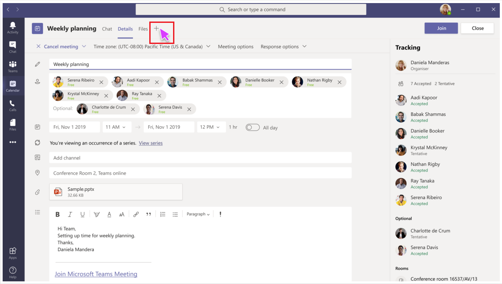

# Create apps for Teams meetings

## Prerequisites and considerations

Before you create apps for Teams meetings, you must have an understanding of the following:

* You must have knowledge of how to develop Teams apps. For more information, see [Teams app development](../overview.md).

* You must update the Teams app manifest to indicate that the app is available for meetings. For more information, see [app manifest](#update-your-app-manifest).

* For your app to function in the meeting lifecycle as a tab, it must support configurable tabs in the groupchat scope. For more information, see [groupchat scope](../resources/schema/manifest-schema.md#configurabletabs) and [build a group tab](../build-your-first-app/build-channel-tab.md).

* You must adhere to general Teams tab design guidelines for pre- and post-meeting scenarios. For experiences during meetings, refer to the in-meeting tab and in-meeting dialog design guidelines. For more information, see [Teams tab design guidelines](../tabs/design/tabs.md), [in-meeting tab design guidelines](../apps-in-teams-meetings/design/designing-apps-in-meetings.md#use-an-in-meeting-tab) and [in-meeting dialog design guidelines](../apps-in-teams-meetings/design/designing-apps-in-meetings.md#use-an-in-meeting-dialog).

* You must support the `groupchat` scope to enable your app in pre-meeting and post-meeting chats. With the pre-meeting app experience, you can find and add meeting apps and perform pre-meeting tasks. With post-meeting app experience, you can view the results of the meeting, such as poll survey results or feedback.

* Meeting API URL parameters must have `meetingId`, `userId`, and `tenantId`. These are available as part of the Teams client SDK and bot activity. In addition, reliable information for user ID and tenant ID can be retrieved using [Tab SSO authentication](../tabs/how-to/authentication/auth-aad-sso.md).

* The `GetParticipant` API must have a bot registration and ID to generate auth tokens. For more information, see [bot registration and ID](../build-your-first-app/build-bot.md).

* For your app to update in real time, it must be up-to-date based on event activities in the meeting. These events can be within the in-meeting dialog box and other stages across the meeting lifecycle. For the in-meeting dialog box, see completion `bot Id` parameter in `Notification Signal API`.

## Meeting apps API reference

|API|Description|Request|Source|
|---|---|----|---|
|**GetUserContext**| This API enables you to get contextual information to display relevant content in a Teams tab. |_**microsoftTeams.getContext( ( ) => {  /*...*/ } )**_|Microsoft Teams client SDK|
|**GetParticipant**| This API allows a bot to fetch participant information by meeting ID and participant ID. |**GET** _**/v1/meetings/{meetingId}/participants/{participantId}?tenantId={tenantId}**_ |Microsoft Bot Framework SDK|
|**NotificationSignal** | This API enables you to provide meeting signals that are delivered using the existing conversation notification API for user-bot chat. It allows you to signal based on user action that shows an in-meeting dialog box. |**POST** _**/v3/conversations/{conversationId}/activities**_|Microsoft Bot Framework SDK|

### GetUserContext

To identify and retrieve contextual information for your tab content, see [get context for your Teams tab](../tabs/how-to/access-teams-context.md#getting-context-by-using-the-microsoft-teams-javascript-library). `meetingId` is used by a tab when running in the meeting context and is added for the response payload.

### GetParticipant API

> [!NOTE]
> * Do not cache participant roles since the meeting organizer can change a role any time.
> * Teams does not currently support large distribution lists or roster sizes of more than 350 participants for the `GetParticipant` API.

#### Query parameters

|Value|Type|Required|Description|
|---|---|----|---|
|**meetingId**| string | Yes | The meeting identifier is available through Bot Invoke and Teams Client SDK.|
|**participantId**| string | Yes | The participant ID is the user ID. It is available in Tab SSO, Bot Invoke, and Teams Client SDK. It is recommended to get a participant ID from the Tab SSO. |
|**tenantId**| string | Yes | The tenant ID is required for the tenant users. It is available in Tab SSO, Bot Invoke, and Teams Client SDK. It is recommended to get a tenant ID from the Tab SSO. |

#### Example

# [C#](#tab/dotnet)

```csharp
protected override async Task OnMessageActivityAsync(ITurnContext<IMessageActivity> turnContext, CancellationToken cancellationToken)
{
  TeamsMeetingParticipant participant = GetMeetingParticipantAsync(turnContext, "yourMeetingId", "yourParticipantId", "yourTenantId");
  TeamsChannelAccount member = participant.User;
  MeetingParticipantInfo meetingInfo = participant.Meeting;
  ConversationAccount conversation = participant.Conversation;

  await turnContext.SendActivityAsync(MessageFactory.Text($"The participant role is: {meetingInfo.Role}"), cancellationToken);
}

```

# [JavaScript](#tab/javascript)

```typescript

export class MyBot extends TeamsActivityHandler {
    constructor() {
        super();
        this.onMessage(async (context, next) => {
            TeamsMeetingParticipant participant = getMeetingParticipant(turnContext, "yourMeetingId", "yourParticipantId", "yourTenantId");
            let member = participant.user;
            let meetingInfo = participant.meeting;
            let conversation = participant.conversation;
            
            await context.sendActivity(`The participant role is: '${meetingInfo.role}'`);
            await next();
        });
    }
}

```

# [JSON](#tab/json)

```http
GET /v1/meetings/{meetingId}/participants/{participantId}?tenantId={tenantId}
```

* * *

The JSON response body for `GetParticipant` API is:

```json
{
   "user":{
      "id":"29:1JKiJGPAX9TTxtGxhVo0wLx_zwzo-gG8Z-X03306vBwi9p-xMTEbDXsT6KH7-0kkTS8cD-2zkrsoV6f5WJ6_aYw",
      "aadObjectId":"e236c4bf-88b1-4f3a-b1d7-8891dfc332b5",
      "name":"Bob Young",
      "givenName":"Bob",
      "surname":"Young",
      "email":"Bob.young@microsoft.com",
      "userPrincipalName":"Bob.young@microsoft.com",
      "tenantId":"2fe477ab-0efc-4dfd-bde2-484374e2c373",
      "userRole":"user"
   },
   "meeting":{
      "role ":"Presenter",
      "inMeeting":true
   },
   "conversation":{
      "id":"<conversation id>",
      "isGroup":true
   }
}
```

#### Response codes

|Response code|Description|
|---|---|
| **403** | The app is not allowed to get participant information. This is the most common error response and is triggered if the app is not installed in the meeting. For example, if the app is disabled by tenant admin or blocked during live site migration.|
| **200** | The participant information is successfully retrieved.|
| **401** | The app responds with an invalid token.|
| **404** | The meeting has either expired or participant cannot be found.|
| **500** | The meeting has either expired more than 60 days since the meeting ended or the participant does not have permissions based on their role.|

### NotificationSignal API

All users in a meeting receive the notifications sent through the `NotificationSignal` API.

> [!NOTE]
> * When an in-meeting dialog box is invoked, the content is presented as a chat message.
> * Currently, sending targeted notifications is not supported.

#### Query parameters

|Value|Type|Required|Description|
|---|---|----|---|
|**conversationId**| string | Yes | The conversation identifier is available as part of bot invoke |

#### Example

The `Bot ID` is declared in the manifest and the bot receives a result object.

> [!NOTE]
> * The `completionBotId` parameter of the `externalResourceUrl` is optional in the requested payload example. `Bot ID` is declared in the manifest and the bot receives a result object.
> * The `externalResourceUrl` width and height parameters must be in pixels. To ensure the dimensions are within the allowed limits, see [design guidelines](design/designing-apps-in-meetings.md).
> * The URL is the page loaded as an `<iframe>` in the in-meeting dialog box. The domain must be in the app's `validDomains` array in your app manifest.

# [C#](#tab/dotnet)

```csharp
Activity activity = MessageFactory.Text("This is a meeting signal test");

activity.ChannelData = new TeamsChannelData
  {
    Notification = new NotificationInfo()
                    {
                        AlertInMeeting = true,
                        ExternalResourceUrl = "https://teams.microsoft.com/l/bubble/APP_ID?url=<url>&height=<height>&width=<width>&title=<title>&completionBotId=BOT_APP_ID"
                    }
  };
await turnContext.SendActivityAsync(activity).ConfigureAwait(false);
```

# [JavaScript](#tab/javascript)

```javascript

const replyActivity = MessageFactory.text('Hi'); // this could be an adaptive card instead
replyActivity.channelData = {
    notification: {
        alertInMeeting: true,
        externalResourceUrl: 'https://teams.microsoft.com/l/bubble/APP_ID?url=<url>&height=<height>&width=<width>&title=<title>&completionBotId=BOT_APP_ID’
    }
};
await context.sendActivity(replyActivity);
```

# [JSON](#tab/json)

```http
POST /v3/conversations/{conversationId}/activities

{
    "type": "message",
    "text": "John Phillips assigned you a weekly todo",
    "summary": "Don't forget to meet with Marketing next week",
    "channelData": {
        "notification": {
            "alertInMeeting": true,
            "externalResourceUrl": "https://teams.microsoft.com/l/bubble/APP_ID?url=<url>&height=<height>&width=<width>&title=<title>&completionBotId=BOT_APP_ID"
        }
    },
    "replyToId": "1493070356924"
}
```

* * *

#### Response codes

|Response code|Description|
|---|---|
| **201** | The activity with signal is successfully sent |
| **401** | The app responds with an invalid token. |
| **403** | The app is unable to send the signal. This can happen due to various reasons such as the tenant admin disables the app, the app is blocked during live site migration, and so on. In this case, the payload contains a detailed error message. |
| **404** | The meeting chat does not exist. |

## Enable your app for Teams meetings

### Update your app manifest

The meetings app capabilities are declared in your app manifest using the `configurableTabs`, `scopes`, and `context` arrays. Scope defines to whom and context defines where your app is available.

> [!NOTE]
> Try updating your app manifest with the [manifest schema](../resources/schema/manifest-schema-dev-preview.md).

```json

"configurableTabs": [
    {
      "configurationUrl": "https://contoso.com/teamstab/configure",
      "canUpdateConfiguration": true,
      "scopes": [
        "team",
        "groupchat"
      ],
      "context":[
        "channelTab",
        "privateChatTab",
        "meetingChatTab",
        "meetingDetailsTab",
        "meetingSidePanel"
     ]
    }
  ]
```

### Context property

The tab `context` and `scopes` properties enable you to determine where your app must appear. Tabs in the `team` or `groupchat` scope can have more than one context. Following are the values for the `context` property from which you can use all or some of the values:

|Value|Description|
|---|---|
| **channelTab** | A tab in the header of a team channel. |
| **privateChatTab** | A tab in the header of a group chat between a set of users not in the context of a team or meeting. |
| **meetingChatTab** | A tab in the header of a group chat between a set of users in the context of a scheduled meeting. |
| **meetingDetailsTab** | A tab in the header of the meeting details view of the calendar. |
| **meetingSidePanel** | An in-meeting panel opened via the unified bar (U-bar). |

> [!NOTE]
> `Context` property is currently not supported on mobile clients.

## Configure your app for meeting scenarios

> [!NOTE]
> * For your app to be visible in the tab gallery it must support configurable tabs and the group chat scope.
> * Mobile clients support tabs only in pre and post meeting stages.
> * The in-meeting experiences that is in-meeting dialog box and tab is currently not supported on mobile clients. For more information, see [guidance for tabs on mobile](../tabs/design/tabs-mobile.md) when creating your tabs for mobile.

### Before a meeting

Before a meeting, users can add tabs, bots and messaging extensions to a meeting. Users with organizer and presenter roles can add tabs to a meeting.

**To add a tab to a meeting**

1. In your calendar, select a meeting to which you want to add a tab.
1. Select the **Details** tab and select plus . The tab gallery appears.

    

1. In the tab gallery, select the app that you want to add and follow the steps as required. The app is installed as a tab.

**To add a messaging extension to a meeting**

1. Select the ellipses or overflow menu &#x25CF;&#x25CF;&#x25CF; located in the compose message area in the chat.
1. Select the app that you want to add and follow the steps as required. The app is installed as a messaging extension.

**To add a bot to a meeting**

In a meeting chat enter the **@** key and select **Get bots**.

> [!NOTE]
> * The user identity must be confirmed using [Tabs SSO](../tabs/how-to/authentication/auth-aad-sso.md). After authentication, the app can retrieve the user role using the `GetParticipant` API.
> * Based on the user role, the app has the capability to provide role specific experiences. For example, a polling app allows only organizers and presenters to create a new poll.
> * Role assignments can be changed while a meeting is in progress. For more information, see [roles in a Teams meeting](https://support.microsoft.com/office/roles-in-a-teams-meeting-c16fa7d0-1666-4dde-8686-0a0bfe16e019).

### During a meeting

#### sidePanel

With the sidePanel, you can customize experiences in a meeting that enable organizers and presenters to have different set of views and actions. In your app manifest, you must add sidePanel to the context array. In the meeting and in all scenarios, the app is rendered in an in-meeting tab that is 320 pixels in width. For more information, see [FrameContext interface](https://docs.microsoft.com/javascript/api/@microsoft/teams-js/framecontext?view=msteams-client-js-latest&preserve-view=true
).

To use the `userContext` API to route requests accordingly, see [Teams SDK](../tabs/how-to/access-teams-context.md#user-context). See [Teams authentication flow for tabs](../tabs/how-to/authentication/auth-flow-tab.md). Authentication flow for tabs is very similar to the auth flow for websites. So tabs can use OAuth 2.0 directly. See, [Microsoft identity platform and OAuth 2.0 authorization code flow](/azure/active-directory/develop/v2-oauth2-auth-code-flow).

Messaging extension works as expected when a user is in an in-meeting view and the user can post compose message extension cards. AppName in-meeting is a tooltip that states the app name in-meeting U-bar.

#### In-meeting dialog

The in-meeting dialog box can be used to engage participants during the meeting and collect information or feedback during the meeting. Use the [`NotificationSignal`](/graph/api/resources/notifications-api-overview?view=graph-rest-beta&preserve-view=true) API to signal that a bubble notification must be triggered. As part of the notification request payload, include the URL where the content to be shown is hosted.

In-meeting dialog must not use task module. Task module is not invoked in a meeting chat. An external resource URL is used to display content bubble in a meeting. You can use the `submitTask` method to submit data in a meeting chat.

> [!NOTE]
> * You must invoke the [submitTask()](../task-modules-and-cards/task-modules/task-modules-bots.md#submitting-the-result-of-a-task-module) function to dismiss automatically after a user takes an action in the web-view. This is a requirement for app submission. For more information, see [Teams SDK task module](/javascript/api/@microsoft/teams-js/microsoftteams.tasks?view=msteams-client-js-latest#submittask-string---object--string---string---&preserve-view=true).
> * If you want your app to support anonymous users, your initial invoke request payload must rely on the `from.id` request metadata in the `from` object, not the `from.aadObjectId` request metadata. `from.id` is the user ID and `from.aadObjectId` is the Azure Active Directory (AAD) ID of the user. For more information, see [using task modules in tabs](../task-modules-and-cards/task-modules/task-modules-tabs.md) and [create and send the task module](../messaging-extensions/how-to/action-commands/create-task-module.md?tabs=dotnet#the-initial-invoke-request).

### After a meeting

The post-meeting and pre-meeting configurations are equivalent.

## Code sample

|Sample name | Description | C# |
|----------------|-----------------|--------------|
| Meetings extensibility | Microsoft Teams meeting extensibility sample for passing tokens. | [View](https://github.com/OfficeDev/Microsoft-Teams-Samples/tree/main/samples/meetings-token-app/csharp) |
| Meeting content bubble bot | Microsoft Teams meeting extensibility sample for interacting with content bubble bot in a meeting. | [View](https://github.com/OfficeDev/Microsoft-Teams-Samples/tree/main/samples/meetings-content-bubble/csharp) |

## See also

> [!div class="nextstepaction"]
> [In-meeting dialog design guidelines](design/designing-apps-in-meetings.md#use-an-in-meeting-dialog)
> [!div class="nextstepaction"]
> [Teams authentication flow for tabs](../tabs/how-to/authentication/auth-flow-tab.md)
