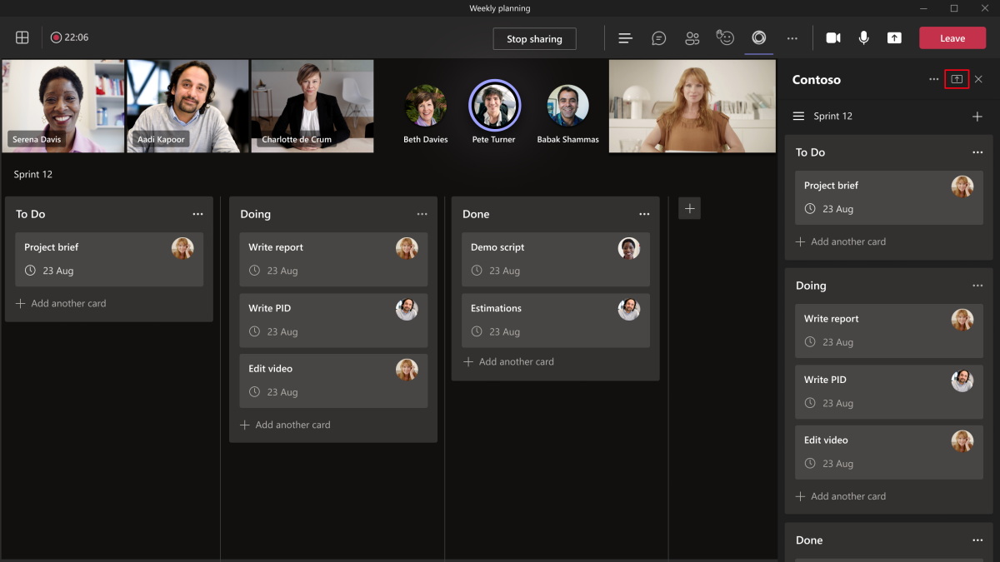
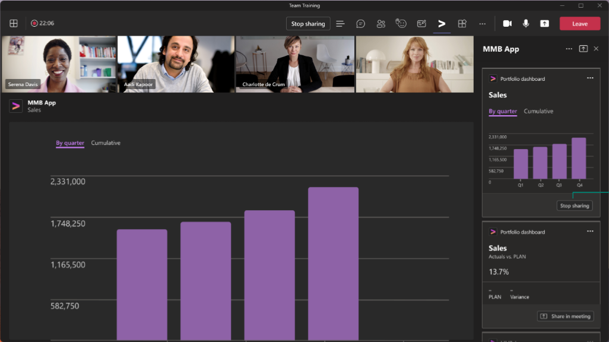

# Enable and configure apps for meetings

Every team has a different way of communicating and collaborating tasks. To achieve these different tasks, customize Teams with apps for meetings. Enable your apps for Teams meetings and configure the apps to be available in meeting scope within their app manifest.

## Prerequisites

With apps for Teams meetings, you can expand the capabilities of your apps across the meeting lifecycle. Before you work with apps for Teams meetings, you must fulfill the following prerequisites:

* Know how to develop Teams apps. For more information on how to develop Teams app, see [Teams app development](../overview.md).

* Use your app that supports configurable tabs in the groupchat scope. For more information, see [group chat scope](../resources/schema/manifest-schema.md#configurabletabs) and [build a group tab](../build-your-first-app/build-channel-tab.md).

* Adhere to general [Teams tab design guidelines](../tabs/design/tabs.md) for pre- and post-meeting scenarios. For experiences during meetings, refer to the [in-meeting tab design guidelines](../apps-in-teams-meetings/design/designing-apps-in-meetings.md#use-an-in-meeting-tab) and [in-meeting dialog design guidelines](../apps-in-teams-meetings/design/designing-apps-in-meetings.md#use-an-in-meeting-dialog).

* For your app to update in real time, it must be up-to-date based on event activities in the meeting. These events can be within the in-meeting dialog and other stages across the meeting lifecycle. For the in-meeting dialog, see `completionBotId` parameter in [in-meeting notification payload](API-references.md#send-an-in-meeting-notification).

## Enable your app for Teams meetings

To enable your app for Teams meetings, update your app manifest and use the context properties to determine where your app must appear.

### Update your app manifest

The meetings app capabilities are declared in your app manifest using the `configurableTabs`, `scopes`, and `context` arrays. The scope defines who can access and the context defines where your app is available.

> [!NOTE]
>
> * Apps in meetings require `groupchat` scope. The `team` scope works for tabs in channels only.
> * Apps in meetings can use the following contexts: `meetingChatTab`, `meetingDetailsTab`, `meetingSidePanel` and `meetingStage`.

The following code snippet is an example of a configurable tab used in an app for Teams meetings:

```json

"configurableTabs": [
    {
      "configurationUrl": "https://contoso.com/teamstab/configure",
      "canUpdateConfiguration": true,
      "scopes": [
        "team",
        "groupchat"
      ],
      "context":[
        "channelTab",
        "privateChatTab",
        "meetingChatTab",
        "meetingDetailsTab",
        "meetingSidePanel",
        "meetingStage"
     ]
    }
  ]
```

### Context property

The `context` property determines what must be shown when a user invokes an app in a meeting depending on where the user invokes the app. The tab `context` and `scopes` properties enable you to determine where your app must appear. The tabs in the `team` or `groupchat` scope can have more than one context.

Support the `groupchat` scope to enable your app in pre-meeting and post-meeting chats. With the pre-meeting app experience, you can find and add meeting apps and do the pre-meeting tasks. With the post-meeting app experience, you can view the results of the meeting, such as poll survey results or fee.

 Following are the values for the `context` property from which you can use all or some of the values:

|Value|Description|
|---|---|
| **channelTab** | A tab in the header of a team channel. |
| **privateChatTab** | A tab in the header of a group chat between a set of users, not in the context of a team or meeting. |
| **meetingChatTab** | A tab in the header of a group chat between a set of users for a scheduled meeting. You can specify either **meetingChatTab** or **meetingDetailsTab** to ensure the apps work in mobile. |
| **meetingDetailsTab** | A tab in the header of the meeting details view of the calendar. You can specify either **meetingChatTab** or **meetingDetailsTab** to ensure the apps work in mobile. |
| **meetingSidePanel** | An in-meeting panel opened through the unified bar (U-bar). |
| **meetingStage** | An app from the `meetingSidePanel` can be shared to the meeting stage. You can't use this app either on mobile or Teams room clients. |

After you enable your app for Teams meetings, you must configure your app before a meeting, during a meeting, and after a meeting.

## Configure your app for meeting scenarios

Teams meetings provide a collaborative experience for your organization. Configure your app for different meeting scenarios and to enhance the meeting experience. Now you can identify what actions can be taken in the following meeting scenarios:

* [Before a meeting](#before-a-meeting)
* [During a meeting](#during-a-meeting)
* [After a meeting](#after-a-meeting)

### Before a meeting

Before a meeting, users can add tabs, bots, and message extensions. Users with organizer and presenter roles can add tabs to a meeting.

To add a tab to a meeting:

1. In your calendar, select a meeting to which you want to add a tab.
1. Select the **Details** tab and select .

    

1. In the tab gallery that appears, select the app that you want to add and follow the steps as required. The app is installed as a tab.

To add a message extension to a meeting:

1. Select the ellipses &#x25CF;&#x25CF;&#x25CF; located in the compose message area in the chat.
1. Select the app that you want to add and follow the steps as required. The app is installed as a message extension.

To add a bot to a meeting:

In a meeting chat, enter the **@** key and select **Get bots**.

> [!NOTE]
>
> * The in-meeting dialog displays a dialog in a meeting and simultaneously posts an Adaptive Card in the meeting chat that users can access. The Adaptive Card in the meeting chat helps users while attending the meeting or if the Teams app is minimized.
> * The user identity must be confirmed using [Tabs SSO](../tabs/how-to/authentication/tab-sso-overview.md). After authentication, the app can retrieve the user role using the `GetParticipant` API.
> * Based on the user role, the app has the capability to provide role specific experiences. For example, a polling app allows only organizers and presenters to create a new poll.
> * Role assignments can be changed while a meeting is in progress. For more information, see [roles in a Teams meeting](https://support.microsoft.com/office/roles-in-a-teams-meeting-c16fa7d0-1666-4dde-8686-0a0bfe16e019).

### During a meeting

During a meeting, you can use the `meetingSidePanel` or in-meeting notification to build unique experiences for your apps.

#### Meeting SidePanel

The `meetingSidePanel` enables you to customize experiences in a meeting that allow organizers and presenters to have different set of views and actions. In your app manifest, you must add `meetingSidePanel` to the context array. In the meeting and in all scenarios, the app is rendered in an in-meeting tab that is 320 pixels in width. For more information, see [FrameContext interface](/javascript/api/@microsoft/teams-js/microsoftteams.framecontext?view=msteams-client-js-latest&preserve-view=true).

To use the `userContext` API to route requests, see [Teams SDK](../tabs/how-to/access-teams-context.md#user-context). For more information, see [Teams authentication flow for tabs](../tabs/how-to/authentication/auth-flow-tab.md). Authentication flow for tabs is similar to the authentication flow for websites. So tabs can use OAuth 2.0 directly. For more information, see [Microsoft identity platform and OAuth 2.0 authorization code flow](/azure/active-directory/develop/v2-oauth2-auth-code-flow).

Message extension works as expected when a user is in an in-meeting view. The user can post compose message extension cards. AppName in-meeting is a tooltip that states the app name in-meeting U-bar.

> [!NOTE]
> Use version 1.7.0 or higher of [Teams SDK](/javascript/api/overview/msteams-client?view=msteams-client-js-latest&preserve-view=true), as versions prior to it do not support the side panel.

#### In-meeting notification

The in-meeting notification is used to engage participants during the meeting and collect information or feedback during the meeting. Use an [in-meeting notification payload](API-references.md#send-an-in-meeting-notification) to trigger an in-meeting notification. As part of the notification request payload, include the URL where the content to be shown is hosted.

In-meeting notification must not use task module. Task module isn't invoked in a meeting chat. An external resource URL is used to display in-meeting notification. You can use the `submitTask` method to submit data in a meeting chat.

:::image type="content" source="../assets/images/apps-in-meetings/in-meeting-dialogbox.png" alt-text="Example shows how you can use an in-meeting dialog." border="true":::

#### Shared meeting stage

Shared meeting stage allows meeting participants to interact with and collaborate on app content in real time. You can share your apps to the collaborative meeting stage in the following ways:

* [Share entire app to stage](#share-entire-app-to-stage) using the share to stage button in Teams client.
* [Share specific parts of the app to stage](#share-specific-parts-of-the-app-to-stage) using APIs in the Teams client SDK.

##### Share entire app to stage

Participants can share the entire app to the collaborative meeting stage using the share to stage button from the app side panel.



To share the entire app to stage, in the app manifest you must configure `meetingStage` and `meetingSidePanel` as frame contexts. For example:

```json
"configurableTabs": [
    {
      "configurationUrl": "https://contoso.com/teamstab/configure",
      "canUpdateConfiguration": true,
      "scopes": [
        "groupchat"
      ],
      "context":[
        "meetingSidePanel",
        "meetingStage"
     ]
    }
  ]
```

For more information, see [app manifest](../resources/schema/manifest-schema-dev-preview.md#configurabletabs).

##### Share specific parts of the app to stage

Participants can share specific parts of the app to the collaborative meeting stage by using the share to stage APIs. The APIs are available within the Teams client SDK and are invoked from the app side panel.



To share specific parts of the app to stage, you must invoke the related APIs in the Teams client SDK library. For more information, see [API reference](API-references.md).

> [!NOTE]
>
> * To share specific parts of the app to stage, use Teams manifest version 1.12 or later.
> * Share specific parts of the app to stage is supported for Teams desktop clients only.

### After a meeting

The configurations of after and [before meetings](#before-a-meeting) are the same.

## Code sample

|Sample name | Description | C# | Node.js |
|----------------|-----------------|--------------|----------------|
| Meeting app | Demonstrates how to use the Meeting Token Generator app to request a token. The token is generated sequentially so that each participant has a fair opportunity to contribute in a meeting. The token is useful in situations like scrum meetings and Q&A sessions. | [View](https://github.com/OfficeDev/Microsoft-Teams-Samples/tree/main/samples/meetings-token-app/csharp) | [View](https://github.com/OfficeDev/Microsoft-Teams-Samples/tree/main/samples/meetings-token-app/nodejs) |
|Meeting stage sample | Sample app to show a tab in meeting stage for collaboration | [View](https://github.com/OfficeDev/Microsoft-Teams-Samples/tree/main/samples/meetings-stage-view/csharp) | [View](https://github.com/OfficeDev/Microsoft-Teams-Samples/tree/main/samples/meetings-stage-view/nodejs) |
|Meeting side panel | Sample app to show how to add agenda in a meeting side panel | [View](https://github.com/OfficeDev/Microsoft-Teams-Samples/tree/main/samples/meetings-sidepanel/csharp) |-|

## Step-by-step guides

* Follow the [step-by-step guide](../sbs-meeting-token-generator.yml) to generate meeting token in your Teams meeting.
* Follow the [step-by-step guide](../sbs-meetings-sidepanel.yml) to generate meeting sidepanel in your Teams meeting.
* Follow the [step-by-step guide](../sbs-meetings-stage-view.yml) to share meeting stage view in your Teams meeting.
* Follow the [step-by-step guide](../sbs-meeting-content-bubble.yml) to generate meeting content bubble in your Teams meeting.

## Next step

> [!div class="nextstepaction"]
> [Meeting apps API references](API-references.md)

## See also

* [In-meeting dialog design guidelines](design/designing-apps-in-meetings.md#use-an-in-meeting-dialog)
* [Teams authentication flow for tabs](../tabs/how-to/authentication/auth-flow-tab.md)
* [Shared meeting stage experience design guidelines](~/apps-in-teams-meetings/design/designing-apps-in-meetings.md)
* [Add apps to meetings via Microsoft Graph](/graph/api/chat-post-installedapps?view=graph-rest-1.0&tabs=http&preserve-view=true)
