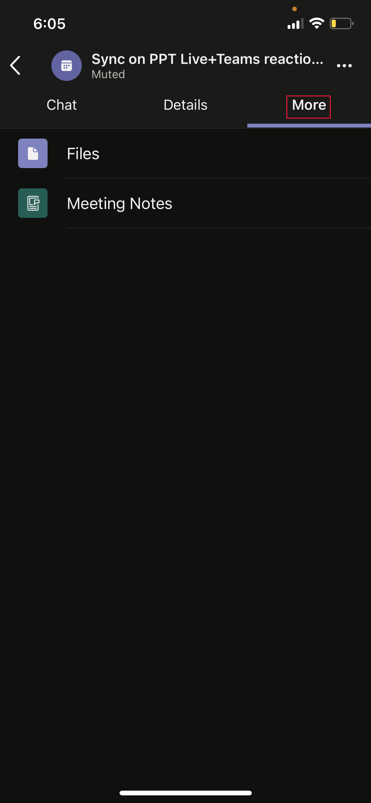
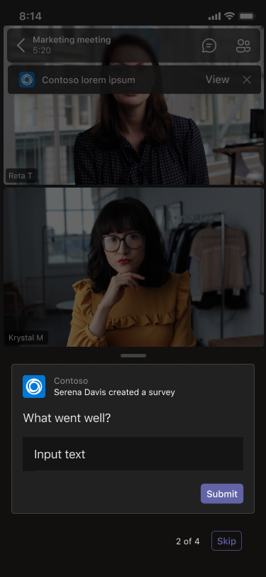
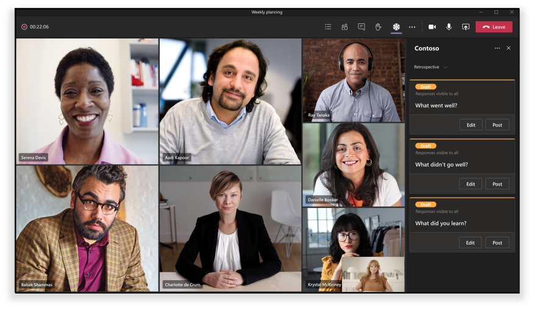
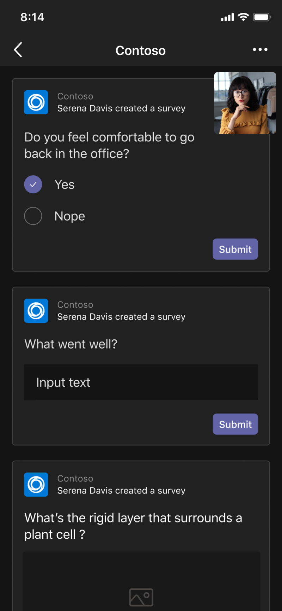

# Unified meetings apps

Teams unified meetings apps are based on the following concepts:

* Meeting lifecycle has different stages: pre-meeting, in-meeting, and post-meeting.  
* There are three distinct participant roles in a meeting: organizer, presenter, and attendee. For more information, see [roles in a Teams meeting](https://support.microsoft.com/office/roles-in-a-teams-meeting-c16fa7d0-1666-4dde-8686-0a0bfe16e019).  
* There are various [user types](/microsoftteams/non-standard-users#:~:text=An%20anonymous%20user%20is%20a,their%20Microsoft%20or%20organization's%20account.) in a meeting: in-tenant, [guest](/microsoftteams/guest-access), [federated](/microsoftteams/manage-external-access), and anonymous users.

This article covers the information about meeting lifecycle and how to integrate tabs, bots, and message extensions. It identifies different participant roles and user types.

## Meeting lifecycle

A meeting lifecycle consists of pre-meeting, in-meeting, and post-meeting app experience. You can integrate tabs, bots, and message extensions in each stage of the meeting lifecycle.

> [!NOTE]
> Meeting extensions such as bots, cards, message extensions, and message actions are supported in the web client. However, hosted experiences such as tabs, content bubbles, and share to stage are not currently fully supported.

### Integrate tabs into the meeting lifecycle

Tabs allow the team members to access services and content in a specific space within a meeting. The team works directly with tabs and has conversations about the tools and data available within tabs. In Teams meeting, you can add a tab by selecting , and select the app that you want to install.

> [!IMPORTANT]
> If you have integrated a tab with your meeting, then your app must follow the Teams [single sign-on (SSO) authentication flow for tabs](../tabs/how-to/authentication/tab-sso-overview.md).

> [!NOTE]
>
> * The private scheduled meetings only support apps.
> * Add app option for Teams meeting extension tab app is not supported in Teams web client.

#### Pre-meeting app experience

With the pre-meeting app experience, you can find and add meeting apps. You can also do pre-meeting tasks, such as developing a poll to survey the meeting participants.

To add tabs to an existing meeting:

1. In your calendar, select a meeting to which you want to add a tab.
1. Select the **Details** tab and select . The tab gallery appears.

    :::image type="content" source="~/assets/images/apps-in-meetings/Pre-Meeting-002.png" alt-text="Pre-meeting app experience":::

1. In the tab gallery, select the app that you want to add and follow the steps as required. The app is installed as a tab.

   > [!NOTE]
   >
   > * You can also add a tab to an existing meeting using the meeting **Chat** tab.
   > * Tab layout must be in an organized state, if there are more than 10 polls or surveys.

# [Desktop](#tab/desktop)

:::image type="content" source="~/assets/images/apps-in-meetings/PreMeetingTab.png" alt-text="Tabs during a meeting":::

# [Mobile](#tab/mobile)

After adding the tabs to an existing meeting on mobile, you can see the same apps in pre-meeting experience under **More** section of the meeting details.

  

---

#### In-meeting app experience

With the in-meeting app experience, you can engage participants during the meeting by using apps and the in-meeting dialog box. Meeting apps are hosted on the toolbar of the meeting window as an in-meeting tab. Use the in-meeting dialog box to showcase actionable content for meeting participants. For more information, see [Enable and configure your apps for Teams meetings](enable-and-configure-your-app-for-teams-meetings.md).

For mobile, meeting apps are available from **Apps** > ellipses &#x25CF;&#x25CF;&#x25CF; in the meeting. Select **Apps** to view all the apps available in the meeting.

To use tabs during a meeting:

1. Go to Teams.
1. In your calendar, select a meeting in which you want to use a tab.
1. After entering the meeting, from the toolbar of the chat window, select the required app.
    An app is visible in a Teams meeting in the side panel or the in-meeting dialog box.
1. In the in-meeting dialog box, enter your response as feedback.

# [Desktop](#tab/desktop)

:::image type="content" source="~/assets/images/apps-in-meetings/desktop-in-meeting-dialog-view.png" alt-text="Desktop view":::

# [Mobile](#tab/mobile)

After entering the meeting and adding the app from desktop or web, the app is visible in mobile Teams meeting under the **Apps** section. Select **Apps** to show the list of apps. User can launch any of the apps as an in-meeting side panel of the app.

The in-meeting dialog box is displayed where you can enter your response as feedback.

> [!NOTE]
> You need not change the app manifest for the apps to work on mobile.

---

> [!NOTE]
>
> * Apps can leverage the Teams Client SDK to access the `meetingId`, `userMri`, and `frameContext` to render the experience appropriately.
> * If the in-meeting dialog box is rendered successfully, it sends a notification that the results are successfully downloaded.
> * Your app manifest specifies the places in which you want the apps to appear. This can be done by specifying context field in manifest. It is also the part of a share meeting stage experience, subject to specified [design guidelines](~\apps-in-teams-meetings\design\designing-apps-in-meetings.md).
> * Meeting stage is not supported for Anonymous users and Teams web client.

The following image illustrates the in-meeting side panel:

# [Desktop](#tab/desktop)

# [Mobile](#tab/mobile)

---

The following table describes the behavior of app when it's validated and not validated:

|App capability | App is validated | App isn't validated |
|---|---|---|
| Meeting extensibility | The app will appear in meetings. | The app won't appear in meetings for the mobile clients. |

For more information, see [store validation guidelines](../concepts/deploy-and-publish/appsource/prepare/teams-store-validation-guidelines.md).

#### Post-meeting app experience

With post-meeting app experience, you can view the results of the meeting, such as poll survey results or feedback. Select  to add a tab, get meeting notes, and see the results on which organizers and attendees must take action.

The following image displays the **Contoso** tab with results of poll and feedback received from meeting attendees:

# [Desktop](#tab/desktop)

:::image type="content" source="~/assets/images/apps-in-meetings/post.png" alt-text="Contoso tab with results":::

# [Mobile](#tab/mobile)

:::image type="content" source="~/assets/images/apps-in-meetings/mobilepremeeting.png" alt-text="Post meeting app experience":::

---

> [!NOTE]
> Tab layout must be organized when there are more than 10 polls or surveys.

### Integrate bots into the meeting lifecycle

Bots that are enabled in group chat scope start functioning in meetings. To implement bots, start with [build a bot](../build-your-first-app/build-bot.md) and then continue with [create apps for Teams meetings](../apps-in-teams-meetings/API-references.md#meeting-apps-api-references).

### Integrate message extensions into the meeting lifecycle

To implement message extension, start with [build a message extension](../messaging-extensions/how-to/create-messaging-extension.md) and then continue with [create apps for Teams meetings](../apps-in-teams-meetings/API-references.md#meeting-apps-api-references).

The Teams unified meetings apps allow you to design your app based on participant roles in a meeting.

## Participant roles in a meeting

:::image type="content" source="~/assets/images/apps-in-meetings/participant-roles.png" alt-text="Participant roles in a meeting":::

The default participant settings are determined by an organization's IT administrator. The following are the participant roles in a meeting:

* **Organizer**: The organizer schedules a meeting, sets the meeting options, assigns meeting roles, and starts the meeting. The users with Microsoft 365 account and Teams license can only be the organizers, and control attendee permissions. A meeting organizer can change the settings for a specific meeting. Organizers can make these changes on the **Meeting options** web page.

* **Presenter**: The presenters have same capabilities of the organizers with exclusions. A presenter can't remove an organizer from the session or modify meeting options for the session. By default, participants joining a meeting have the presenter role.

* **Attendee**: An attendee is a user who is invited to attend the meeting. Attendees have limited capabilities during the meeting, such as:
  * They can interact with other meeting members but can't manage any of the meeting settings or share the content.  
  * They can view or interact with the tab app on the meeting stage in Teams desktop client without installing the app or without any app entitlements. They can’t view or interact with the app on the meeting stage in a Teams web client.
  * They can’t view or interact with the app in the side panel without any app entitlements.
  * They aren't authorized to act as a presenter.
  * If the attendee joins as an anonymous user, they can’t view or interact with the tab app on the meeting stage in both Teams web and desktop clients.

> [!NOTE]
> Only an organizer or presenter can add, remove, or uninstall apps.

For more information, see [roles in a Teams meeting](https://support.microsoft.com/office/roles-in-a-teams-meeting-c16fa7d0-1666-4dde-8686-0a0bfe16e019).

After you design your app based on participant roles in a meeting, you can identify each user type for meetings and select what they can access.

## User types in a meeting

User types, such as organizer, presenter, or attendee in a meeting can do one of the [participant roles in a meeting](#participant-roles-in-a-meeting).

> [!NOTE]
> The user type is not included in the **getParticipantRole** API.

The following list details the various user types along with their accessibility and performance:

* **In-tenant**: In-tenant users belong to the organization and have credentials in Microsoft Azure Active Directory (Azure AD) for the tenant. They're full-time, onsite, or remote employees. An in-tenant user can be an organizer, presenter, or attendee.
* **Guest**: A guest is a participant from another organization invited to access Teams or other resources in the organization's tenant. Guests are added to the organization’s Azure AD and have same Teams capabilities as a native team member. They have access to team chats, meetings, and files. A guest can be an organizer, presenter, or attendee. For more information, see [guest access in Teams](/microsoftteams/guest-access).
* **Federated or external**: A federated user is an external Teams user in another organization who has been invited to join a meeting. Federated users have valid credentials with federated partners and are authorized by Teams. They don't have access to your teams or other shared resources from your organization. Guest access is a better option for external users to have access to teams and channels. For more information, see [manage external access in Teams](/microsoftteams/manage-external-access).

    > [!NOTE]
    > Your Teams users can add apps when they host meetings or chats with other organizations. The users can use apps shared by external users when your users join meetings or chats hosted by other organizations. The data policies of the hosting user's organization, as well as the data sharing practices of the third-party apps shared by that user's organization, will be in effect.

    > [!IMPORTANT]
    > Currently, third-party apps are available in Government Community Cloud (GCC) but are not available for GCC-High and Department of Defense (DOD). Third-party apps are turned off by default for GCC. To turn on third-party apps for GCC, see [manage app permission policies](/microsoftteams/teams-app-permission-policies) and [manage apps](/microsoftteams/manage-apps).

* **Anonymous**: Anonymous users don't have an Azure AD identity and aren't federated with a tenant. The anonymous participants are like external users, but their identity isn't shown in the meeting. Anonymous users can't access apps in a meeting window and meeting stage. An anonymous user can't be an organizer but can be a presenter or attendee.

    > [!NOTE]
    > Anonymous users inherit the global default user-level app permission policy. For more information, see [manage Apps](/microsoftteams/non-standard-users#anonymous-user-in-meetings-access).

A guest or anonymous user can't add, remove, or uninstall apps.

The following table provides the user types and lists the features that each user can access:

| User type | Tabs | Bots | Message extensions | Adaptive Cards | Task modules | In-meeting dialog | Meeting stage |
| :-- | :-- | :-- | :-- | :-- | :-- | :-- | :-- |
| Anonymous user | Not available | Not available | Not available | Interactions in the meeting chat are allowed. | Interactions in the meeting chat from Adaptive Card are allowed. | Not available | Not available |
| Guest, part of the tenant Azure AD | Interaction is allowed. Create, update, and delete aren't allowed. | Not available | Not available | Interactions in the meeting chat are allowed. | Interactions in the meeting chat from Adaptive Card are allowed. | Available | Can start, view, and interact with app on the meeting stage only on Teams desktop client |
| Federated users, for more information, see [non-standard users](/microsoftteams/non-standard-users). | Interaction is allowed. Create, update, and delete aren't allowed. | Interaction is allowed. Acquire, update, and delete aren't allowed. | Not available | Interactions in the meeting chat are allowed. | Interactions in the meeting chat from Adaptive Card are allowed. | Not available | Can start, view, and interact with app on the meeting stage only on Teams desktop client. |

## Next step

> [!div class="nextstepaction"]
> [Enable and configure your apps for Teams meetings](enable-and-configure-your-app-for-teams-meetings.md)

## See also

* [Tab](../tabs/what-are-tabs.md#understand-how-tabs-work)
* [Bot](../bots/what-are-bots.md)
* [Message extension](../messaging-extensions/what-are-messaging-extensions.md)
* [Design your app](../apps-in-teams-meetings/design/designing-apps-in-meetings.md)
