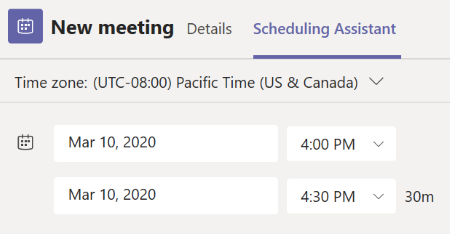
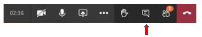

# Add apps to Teams meetings

Meetings are key to productivity in Teams. They enable collaboration, partnership, informed communication, and shared feedback in an inclusive and active forum. As a developer, you can create [configurable tab](../tabs/what-are-tabs.md#how-do-tabs-work), [bot](../bots/what-are-bots.md), and [message extension](../messaging-extensions/what-are-messaging-extensions.md) applications to enhance and enrich a Teams meeting experience. Meeting users can access apps, via the tab gallery, to enable relevant scenarios such as pre-staging a Kanban board, launching an in-meeting actionable notification, or creating a post-meeting poll. Your meeting app can deliver a user experience for each stage of the meeting lifecycle based upon attendee status.

Teams’ meeting app extensibility centers on three concepts:

✔ **Meeting lifecycle** — before, during, and after meeting time frame.  
✔ **Participant role** — meeting organizer, presenter, or attendee.  
✔ **User type** — in-tenant, guest, federated, or anonymous Teams user.

## Meeting lifecycle scenarios

### Tabs

> [!IMPORTANT]
> As with all tab applications, Your app will need to follow the Teams [SSO authentication flow](../tabs/how-to/authentication/auth-aad-sso.md) for tabs.

### **Pre-meeting**

| Meeting app experience |Scope|
| -------| ----------------------------|
|Permissioned users can add apps a meeting via the tab gallery in two ways: |For your configurable tab app to be available as part of the meeting chat/pre-meeting experience it must be scoped to the group-chat level.|
|&#9679; Via the **Details** tab on the Teams scheduling form:     &#9679;  Via the meeting **Chat** tab in an existing meeting:     &#8199;  Tab apps will be accessible in meetings **Details** and **Chats** pages using a plus icon (➕) button.|

### **In meeting**

| Meeting app experience |Scope|
| -------| ----------------------------|
|Meeting apps will be hosted in the top upper bar of the chat window and as in-meeting tab experience via the right pane.| When users add a tab to a meeting through the tab gallery, apps that are **during meeting** experiences will be surfaced.|
|Permissioned users can add apps while in the meeting.||
|For an app to be visible in a meeting, Teams will expose two new surfaces:  &#9679; **Side panel** : If the app specifies in the manifest that it’s tab is optimized for side pane and it should be shown there.   &#9679; **Stage** (whiteboard): In Microsoft Teams, coworkers can use the Whiteboard app to collaborate in real time in a Teams meeting.  &emsp;To share the Whiteboard during the meeting: &emsp;**1.** During the meeting, go to the meeting controls, select Share, and then select Microsoft Whiteboard under the Whiteboard category. The board will open directly in Teams, and any content you configured before the meeting will load. &emsp;**2.** If need to use advanced Whiteboard tools, select Open in app.  &#9679; An in-meeting app can also be part of a Share Tray experience subject to specified design guidelines:    

When loaded in the context of a meeting, apps will be able to leverage the Teams Client SDK to access the meetingId, userMri, and frameContext so they can appropriately render the experience. 

The figure below depicts an in-meeting actionable notification for users.  

### **Post meeting**

| Meeting app experience |Scope|
| -------| ----------------------------|
| As with the pre-meeting scenario, your app must be available in the group-chat scope to be available within the post-meeting surface.| This post-meeting app scenario is similar to the current post-meeting experience with the added benefit of having tabs exist within the surface. Additionally, the meeting **Details* page provides a central place for continued access to apps and other related materials after the meeting has ended. |
||As with the pre-meeting scenario, permissioned users can add apps via the tab gallery to a meeting: &#9679; Via the **Details** tab on the Teams scheduling form: &#9679;  Via the meeting **Chat** tab in an existing meeting.

### Bots

For bot scenario's please see **Bots in meetings** in our Teams bot documentation.

### Message Extensions

For message extension scenario's please see **Message extensions in meetings** in our Teams message extension documentation.

## Participant roles and user types in a meeting

### Participant roles

You can design your app with participant specific authorization. For example, only an organizer can create a poll. Although default participant settings are determined by an organization's IT administrator, a meeting organizer may want to change them for a specific meeting. Organizers can make these changes on the Meeting options web page.

1. **Organizer**. The organizer schedules a meeting, sets the meeting options, assigns meeting roles, and starts the meeting. Only users with a M365 account (possessing a Teams license) can be organizers and control attendee permissions.
1. **Presenter**. Presenters have nearly the same capabilities as organizer; however, a presenter cannot remove an organizer from the session or modify meeting options for the session. By default, participants joining a meeting have the presenter role.
1. **Attendee**. An attendee is a user who has been invited to attend a meeting but who is not authorized to act as a presenter. Attendees can interact with other meeting members but cannot manage any of the meeting settings or share content.

_See_ [**Roles in a Teams meeting**](https://support.microsoft.com/office/roles-in-a-teams-meeting-c16fa7d0-1666-4dde-8686-0a0bfe16e019)

You can access the  **Meeting options** page as follows:

&#11200; In Teams, go to **Calendar** , select a meeting, and then **Meeting options**.

&#11200; In a meeting invitation, select **Meeting options**.

&#11200; During a meeting, select Show participants  in the meeting controls. Then, above the list of participants, choose **Manage permissions** .

### User types

> [!NOTE]
> User types can join meetings and assume one of the participant roles described above.

1. **In-tenant**. These users belong to the organization and have credentials in Azure Active Directory for the tenant. They are usually full-time, onsite or remote employees.
1. **Guest**. A guest is a participant from another organization who has been invited to access Teams or other resources in your organization's tenant. Guests are added to your organization’s Active Directory and can be given nearly all the same Teams capabilities as a native team member with full access to team chats, meetings, and files. _See_ [Guess access in Microsoft Teams](/microsoftteams/guest-access)
1. **Federated/External**. A federated user is an external Teams user in another organization who has been invited to join a meeting. Since these users have valid credentials with federated partners, they are treated as authenticated by Teams but do not have access to your teams or other shared resources from your organization. If you want external users to have access to teams and channels, guest access might be a better option. _See_ [Manage external access in Microsoft Teams](/microsoftteams/manage-external-access)
1. **Anonymous**. Anonymous users do not have an Active Directory identity and are not federated with a tenant. The anonymous participant is like an external user, but their identity is not projected into the meeting. Anonymous users will not be able to access apps in a meeting window.

## Next Steps

> [!div class="nextstepaction"]
> [Enable apps in Teams meetings](apps-in-teams-meetings/enable-apps-in-meetings.md
