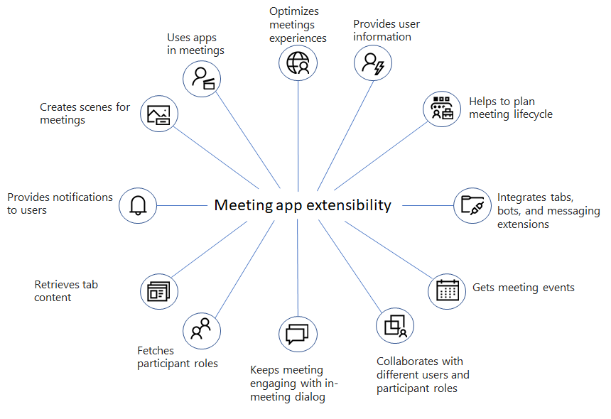

# Apps for Teams meetings and calls

Meetings enable collaboration, partnership, informed communication, and shared feedback. The meeting app can deliver a user experience for each stage of the meeting lifecycle. Meeting lifecycle includes pre-meeting, in-meeting, and post-meeting app experience, depending on the attendee's status.

> [!Note]
>
> Apps for instant meetings, one-on-one and group calls are currently available only in [public developer preview](~/resources/dev-preview/developer-preview-intro.md).

Teams supports access to apps during meeting for the following meeting types:

* [**Scheduled meetings**](https://support.microsoft.com/office/schedule-a-meeting-in-teams-943507a9-8583-4c58-b5d2-8ec8265e04e5#ID0EFBD=Desktop): Meetings scheduled through Teams calendar.
* [**One-on-one calls**](https://support.microsoft.com/office/start-a-call-from-a-chat-in-teams-f5138c9d-df4c-43d8-9cf6-53400c1a7798): Calls initiated in one-on-one chat.
* [**Group calls**](https://support.microsoft.com/office/start-a-call-from-a-chat-in-teams-f5138c9d-df4c-43d8-9cf6-53400c1a7798): Calls initiated in group chat.
* [**Instant meetings**](https://support.microsoft.com/office/start-an-instant-meeting-in-teams-ff95e53f-8231-4739-87fa-00b9723f4ef5): Meetings initiated through **Meet now** button in Teams calendar.

Users can add apps to the meeting using the **+** option from their Teams meeting window.

:::image type="content" source="../assets/images/apps-in-meetings/add-app.png" alt-text="Add an app in meeting" border="true":::

Visit the [Teams store](https://go.microsoft.com/fwlink/p/?LinkID=2183121&clcid=0x4009) and explore apps designed specifically for meetings.

> [!Note]
>
> * Currently, adding an app is not supported in mobile. However, a user can view the app and share the app to stage from mobile.
>
> * Currently when a third person is added to a one-on-one call, the call is elevated to a group call that means a new session starts. Apps added to the one-on-one call are not available in the group call. However, they can be added again.
>
> * Currently app experiences are not supported in Teams channel meetings (both scheduled meetings and instant meetings).

The following illustration gives you an idea of the meeting app extensibility features:

This article provides an overview of meeting app extensibility, API references, enable and configure apps for meetings, and custom Together Mode scenes in Teams.

Enhance your meeting experience by using the meeting extensibility feature. This feature enables you to integrate your apps within meetings. It also includes different stages of a meeting lifecycle, where you can integrate tabs, bots, and message extensions. You can identify various participant roles and user types, get meeting events, and generate in-meeting dialogs.

To customize Teams with apps for meetings, enable your apps for Teams meetings by updating the app manifest and also configure the apps for meeting scenarios.

The new custom Together Mode scenes feature enables users to collaborate in a meeting with their team in one place.

## Next step

> [!div class="nextstepaction"]
> [Unified meetings apps](meeting-app-extensibility.md)

## See also

* [Designing your Microsoft Teams meeting extension](~/apps-in-teams-meetings/design/designing-apps-in-meetings.md)
* [Meeting apps API references - Teams](~/apps-in-teams-meetings/api-references.md)
* [Custom Together Mode scenes](~/apps-in-teams-meetings/teams-together-mode.md)
* [Enable and configure your apps for Teams meetings](~/apps-in-teams-meetings/enable-and-configure-your-app-for-teams-meetings.md)
* [Meeting lifecycle](meeting-app-extensibility.md#meeting-lifecycle)
* [Enhanced collaboration with Live Share SDK](teams-live-share-overview.md)
