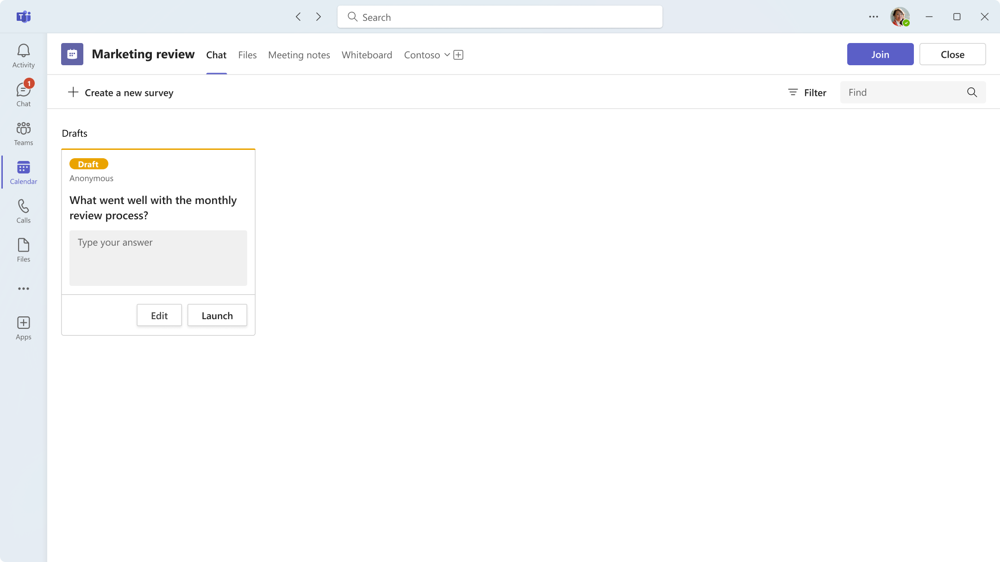
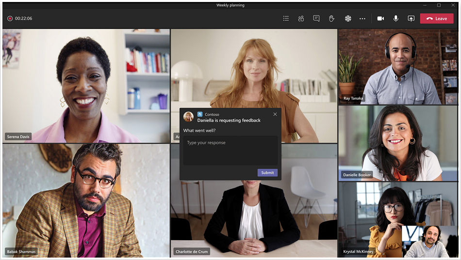
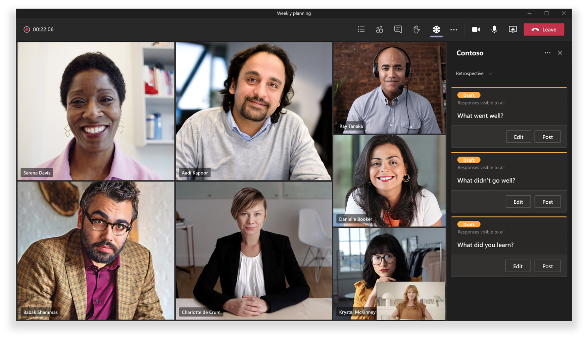
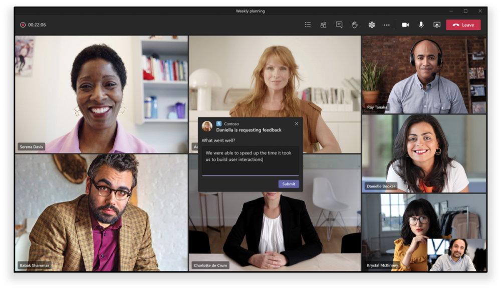
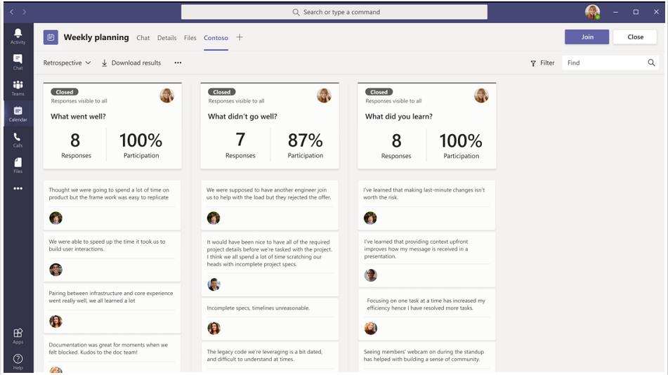
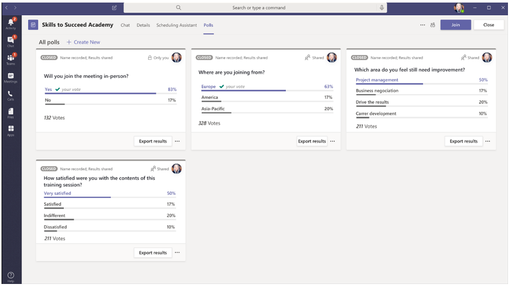

# Apps in Teams meetings

Meetings are key to productivity in Teams. They enable collaboration, partnership, informed communication, and shared feedback in an inclusive and active forum. As a developer, you can create [configurable tab](../tabs/what-are-tabs.md#how-do-tabs-work), [bot](../bots/what-are-bots.md), and [message extension](../messaging-extensions/what-are-messaging-extensions.md) applications to enhance and enrich a Teams meeting experience. Meeting users can access apps, via the tab gallery, to enable relevant scenarios such as pre-staging a Kanban board, launching an in-meeting actionable dialog, or creating a post-meeting poll. Your meeting app can deliver a user experience for each stage of the meeting lifecycle based upon attendee status.

Teams’ meeting app extensibility centers on three concepts:

✔ **Meeting lifecycle** — before, during, and after meeting time frame.  
✔ **Participant role** — meeting organizer, presenter, or attendee.  
✔ **User type** — in-tenant, guest, federated, or anonymous Teams user.

<!-- markdownlint-disable MD001 -->
### Meeting lifecycle scenarios

## Tabs

> [!IMPORTANT]
> As with all tab applications, Your app will need to follow the Teams [SSO authentication flow](../tabs/how-to/authentication/auth-aad-sso.md) for tabs.

> [!NOTE]
> * Mobile clients support tabs only in pre-meeting and post-meeting surfaces. The in-meeting experiences, such as in-meeting dialog and panel on mobile will be available soon.
> * Apps are supported only in private scheduled meetings.

### Pre-meeting app experience

**Pre-meeting experience:**

**Pre-meeting tab:**

✔ Permissioned users can add apps to a meeting via the tab gallery in two ways:

&emsp;&emsp;&#9679; Via the **Details** tab on the Teams scheduling form.

&emsp;&emsp;&#9679;  Via the meeting **Chat** tab in an existing meeting.   

✔ Tab apps are accessible in meetings **Details** and **Chats** pages using a plus icon (➕) button.|

✔  Tab layout should be in an organized state if there are more than ten polls or surveys.

### In-meeting app experience

✔ Meeting apps will be hosted in the top upper bar of the chat window and as in-meeting tab experience via the in-meeting tab. When users add a tab to a meeting through the tab gallery, apps that are **during meeting** experiences will be surfaced.

✔ Permissioned users can add apps while in the meeting.

✔ When loaded in the context of a meeting, apps will be able to leverage the Teams Client SDK to access the `meetingId`, `userMri`, and `frameContext` to appropriately render the experience.

✔ Exporting a result of a survey or polls should notify the users stating, ‘results successfully downloaded’.

✔ For an app to be visible in a Teams meeting in two areas:

&emsp;&emsp;&#9679; **Side panel**.  

> [!NOTE]
> If your _app manifest_ specifies that your tab is [optimized for side panel](create-apps-for-teams-meetings.md#during-a-meeting), that is where it will be displayed. It can also be part of a share-tray experience, subject to specified design guidelines.

&emsp;&emsp;&#9679; **In-meeting dialog**. Use the in-meeting dialog to showcase actionable content for meeting participants. *See* [Create Apps for Teams meetings](create-apps-for-teams-meetings.md).

**In-meeting experience:**

**In-meeting actionable dialog for users:**

### Post-meeting app experience

**Post-meeting experience:**

✔ The post-meeting app scenario is similar to the current post-meeting experience with the added benefit of having tabs that exist within the surface. 

✔ Permissioned users can add apps from the tab gallery to a meeting via the **Details** tab on the Teams scheduling form and the meeting **Chat** tab in an existing meeting.

✔  Tab layout should be in an organized state if there are more than ten polls or surveys.

### Bots

For bot implementation, please see our [Bots in Teams meetings](../bots/how-to/create-a-bot-for-teams.md#bots-in-teams-meetings) documentation.

### Messaging Extensions

For messaging extension implementation, please see our [Messaging extensions in Teams meetings](../messaging-extensions/how-to/create-messaging-extension.md#messaging-extensions-in-teams-meetings) documentation.

## Participant roles and user types in a meeting

### Participant roles

You can design your app with participant-specific authorization. For example, perhaps only an organizer and/or presenter can create a poll in meetings. Although default participant settings are determined by an organization's IT administrator, a meeting organizer may want to change the settings for a specific meeting. Organizers can make these changes on the Meeting options web page.

1. **Organizer**. The organizer schedules a meeting, sets the meeting options, assigns meeting roles, and starts the meeting. Only users with a M365 account (possessing a Teams license) can be organizers and control attendee permissions.
1. **Presenter**. Presenters have nearly the same capabilities as organizer; however, a presenter cannot remove an organizer from the session or modify meeting options for the session. By default, participants joining a meeting have the presenter role.
1. **Attendee**. An attendee is a user who has been invited to attend a meeting but who is not authorized to act as a presenter. Attendees can interact with other meeting members but cannot manage any of the meeting settings or share content.

_See_ [**Roles in a Teams meeting**](https://support.microsoft.com/office/roles-in-a-teams-meeting-c16fa7d0-1666-4dde-8686-0a0bfe16e019)

You can access the  **Meeting options** page as follows:

&#11200; In Teams, go to **Calendar** , select a meeting, and then **Meeting options**.

&#11200; In a meeting invitation, select **Meeting options**.

&#11200; During a meeting, select **Show participants**  in the meeting controls. Then, above the list of participants, choose **Manage permissions**.

### User types

> [!NOTE]
> User types can join meetings and assume one of the participant roles described above. The User type is not exposed as part of the **getParticipantRole** API.

1. **In-tenant**. These users belong to the organization and have credentials in Azure Active Directory for the tenant. They are usually full-time, onsite or remote employees.
1. **Guest**. A guest is a participant from another organization who has been invited to access Teams or other resources in your organization's tenant. Guests are added to your organization’s Active Directory and can be given nearly all the same Teams capabilities as a native team member with full access to team chats, meetings, and files. _See_ [Guest access in Microsoft Teams](/microsoftteams/guest-access)
1. **Federated/External**. A federated user is an external Teams user in another organization who has been invited to join a meeting. Since these users have valid credentials with federated partners, they are treated as authenticated by Teams but do not have access to your teams or other shared resources from your organization. If you want external users to have access to teams and channels, guest access might be a better option. _See_ [Manage external access in Microsoft Teams](/microsoftteams/manage-external-access)
1. **Anonymous**. Anonymous users do not have an Active Directory identity and are not federated with a tenant. The anonymous participant is like an external user, but their identity is not projected into the meeting. Anonymous users will not be able to access apps in a meeting window.

## Next steps

> [!div class="nextstepaction"]
> [Design your app](../apps-in-teams-meetings/design/designing-apps-in-meetings.md)
> [!div class="nextstepaction"]
> [Build your app](create-apps-for-teams-meetings.md)
