# Together Mode in Teams

Be together even when you are apart with the Microsoft Teams Together Mode.

Teams Together Mode provides a simple, innovative, and user-friendly meeting environment. It enhances your virtual meeting experience.

Together Mode digitally combines participants into a single virtual space instead of being shown separately in boxes. It creates your virtual image and places the image in a virtual environment where you can easily interact with your peers. This mode makes video meetings more viable as most users report less meeting fatigue.

It is a change from the usual video conferencing method used to collaborate with a team. It makes meetings more engaging with the auditorium view.

You can create apps in Together Mode or extend your current app to have scenes.

To view how Together Mode works, see the following video:

> [!VIDEO https://www.youtube-nocookie.com/embed/MGsNmYKgeTA]

This document covers prerequisites, steps to create or extend apps in Together Mode, build a scene using Microsoft Scene Design Studio, assemble a scene package, create an app package and use the scene in Teams, and activate Together Mode.

## Prerequisites

The following are the prerequisites for using Together Mode:

## Create or extend apps

To create apps in Together Mode, you can create scene only apps or extend your current app to have scenes for Together Mode.

>[!NOTE]
> It is recommended to have scene only apps as the acquisition experience for users is more seamless.

The following workflow shows how the scene is built, the app is created, the app is uploaded, and the scene is immersed in the app:

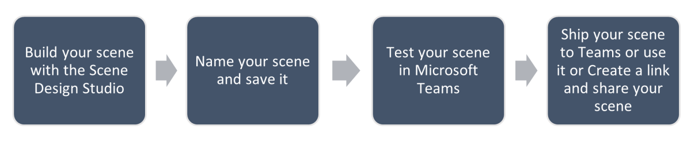

>[!NOTE]
> Multiple scenes in a single app package appear as a flat list of scenes to users.

## Build a scene using Scene Design Studio

Together Mode allows you to apply different scenes while conducting meetings in a virtual environment.

A scene is an artifact that contains the following:

* Seats of meeting participants if their videos are turned on.
* Each seat is placed on an XY canvas.
* A collection of images that are camouflaged as one image.
* Each seat and image has width and height.
* Optionally, you can reserve a spot for the meeting organizer and a set of reserved spots for participants.

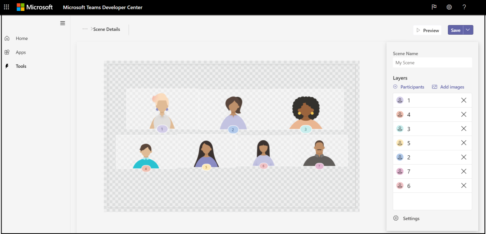

In the Scene Design Studio, each seat represents an avatar for design purposes. Each seat and image has a placement in the third dimension that is the Z-axis to give a sense of depth in scenes that demand them.

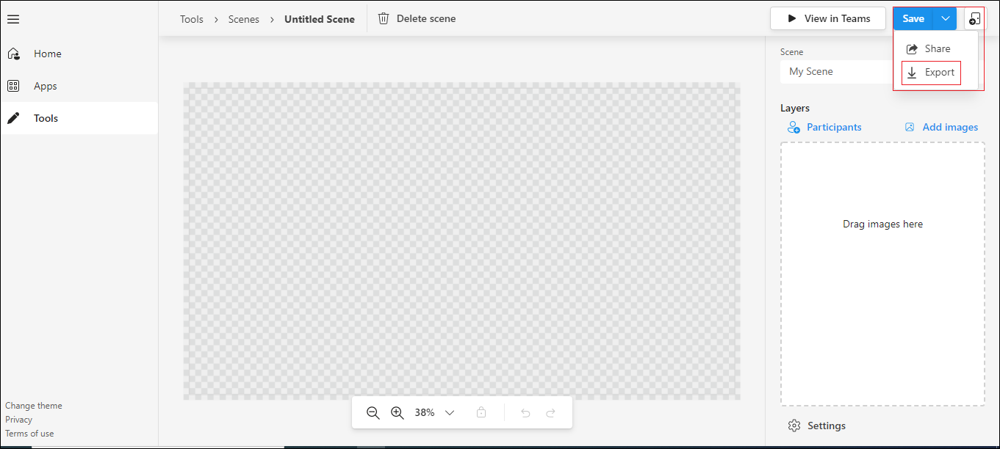

After setting-up dev.teams.microsoft.com, complete the following steps to build a scene using the Scene Design Studio:

1. Select **Scenes Editor** and choose **Create a new scene** to display the Scene Design Studio.

2. Select **Participants** under **Layers** in the upper-right corner.

3. Select the number of participants for this scene from the **Number of participants** box and select **Add**. Once the scene is shipped, the avatar placements are replaced with actual participant video streams.

4. Add background images to the scene using **Add images**. The assets can also be dragged and dropped into the environment as displayed in the following image:

    

5. Select any participant image that you have placed in the scene.

6. From the rightmost corner, select an alignment for the image or use the **Size & rotation** slider to adjust the image size. Alternately, you can drag the images around the scene and place them in the required position and resize them using the resize arrow.

    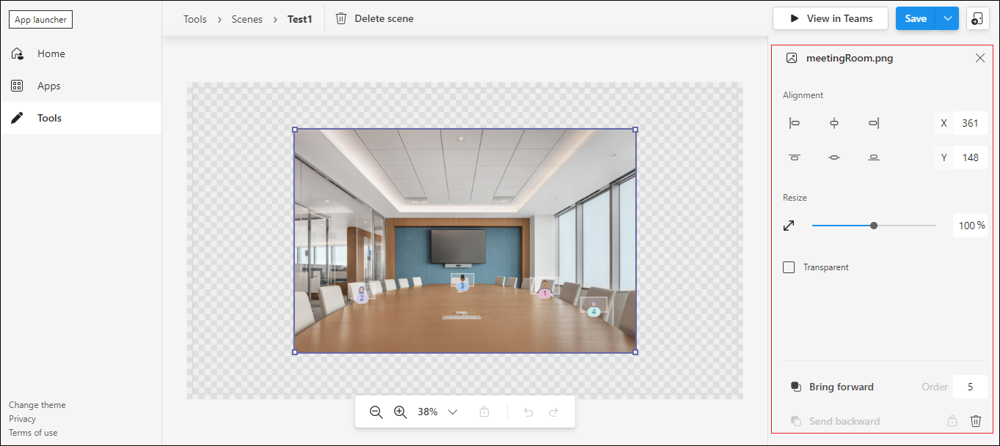

7. Select any participant image, select the **Assign Spot** check box, and choose **Meeting Organizer** and **Presenter** to assign that spot to the participant. Alternately, you can choose either **Meeting Organizer** or **Presenter** options for that participant.

    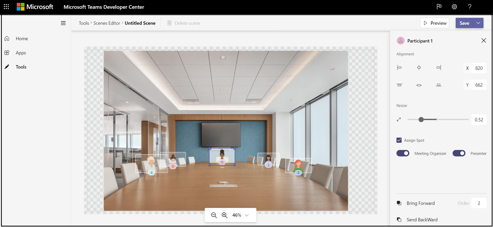

8. In the **Scene Name** box, enter a name for the scene.

9. Select **Save** or select **Export the Scene** from the **Save** drop-down menu. If you select **Export the Scene**, a .zip file is downloaded.

Now that you have built a scene using the Scene Design Studio, you can assemble a scene package to indicate the exact position of the seats.

## Assemble a scene package

A scene package is a collection of all assets particularly images.

You must have the ability to ship a scene package that includes the following:

* **Role based scene:** Within a scene package, you must be able to render an experience preview, for example, for the teacher and the students.

    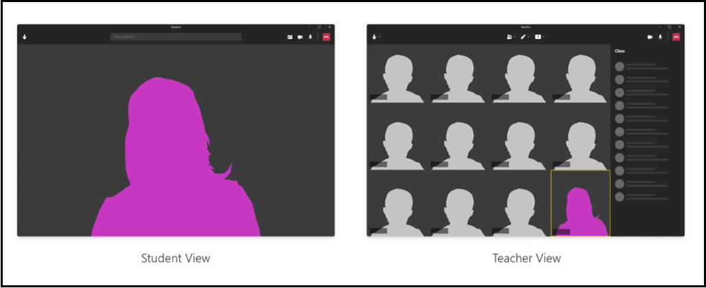

* **In scene configuration:** The JSON package assumes a single image with seat assignment. For example, in the following picture, the astronaut seat can be applied by default to the organizer through `participantRole` API, but the teacher can dynamically move this around using the class roster:

    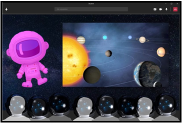

* **Moving images:** You must be able to support scenes that are in motion to simulate moving objects. A brute force method of doing this is to support gif format in Together Mode. Advanced scene rendering is more like a movie being played.

* **Visual no-code designer experience:** Snap has made it simple through GUI for users to build their own filters. It is a challenge to ship a scene generic enough for all teachers to use it. At present teachers are able to create custom scenes that serve the purpose.

A scene package is used to build the scene and a scene JSON to indicate the exact position of the seats. In the Scene Design Studio, there is an option to simply get the scene package that is a zip file.
Use the following scene JSON sample:

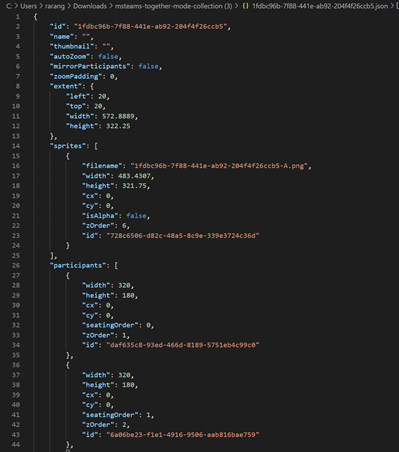

Each scene has a unique ID and name. The scene JSON also contains information on all the assets used for the scene. Each asset contains a filename, width, height, and positions on the X and Y-axis. Similarly, each seat contains a seat ID, width, height, and positions on the X and Y-axis. The seating order is generated automatically for each seat when it is created. Hence, the seating order must be altered according to the preferred order.

>[!NOTE]
> Seating order number corresponds to the order of people joining the call.

The zOrder represents the order of placing images and seats along the Z-axis. In many cases, it gives a sense of depth or partition if required.

Now that you have assembled a scene package, you can create an app package and apply the scene in Teams.

## Create an app package and use the scene in Teams

An app package contains the scene package. App Studio simplifies app packaging.

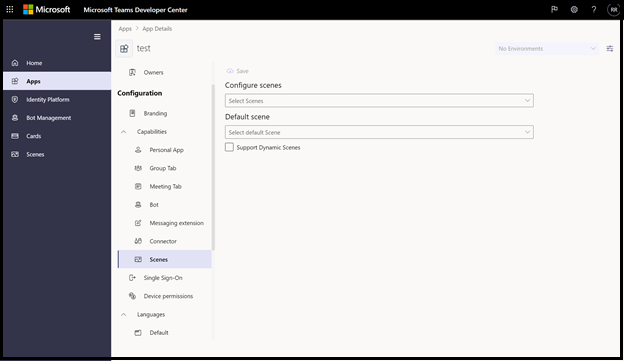

After you build a scene, complete the following steps:

1. Go to **Apps** in App Studio.

2. Create a new app and enter the necessary details.

3. Go to **Scenes** under **Configuration** in **Apps**.

4. Select the scene you built and import the package.

5. Sideload this package in Teams.

Now that you have created an app package and used the scene in Teams, you can activate the Together Mode to engage in scenes in the mode.

## Activate the Together Mode

Get end-to-end information of how a user engages with scenes in Together Mode. To do this, complete the following steps to choose scenes and activate the Together mode:

1. From the **Gallery** drop-down in the upper-left corner, select **Change scene** to change the default scene. The **Choose a scene** dialog box appears.

2. From **Choose a scene**, select the scene you want to use for your meeting.

    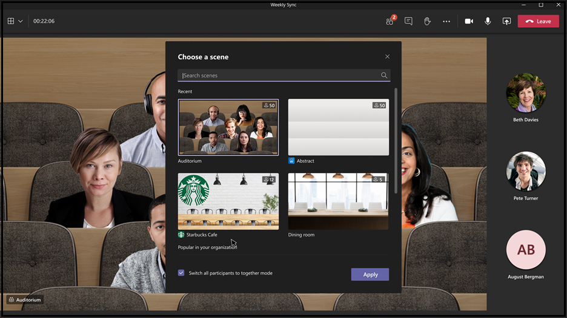

3. Choose **Switch all participants to together mode** in the meeting.

4. Select **Apply**. Teams installs the app for the user and applies the scene.

    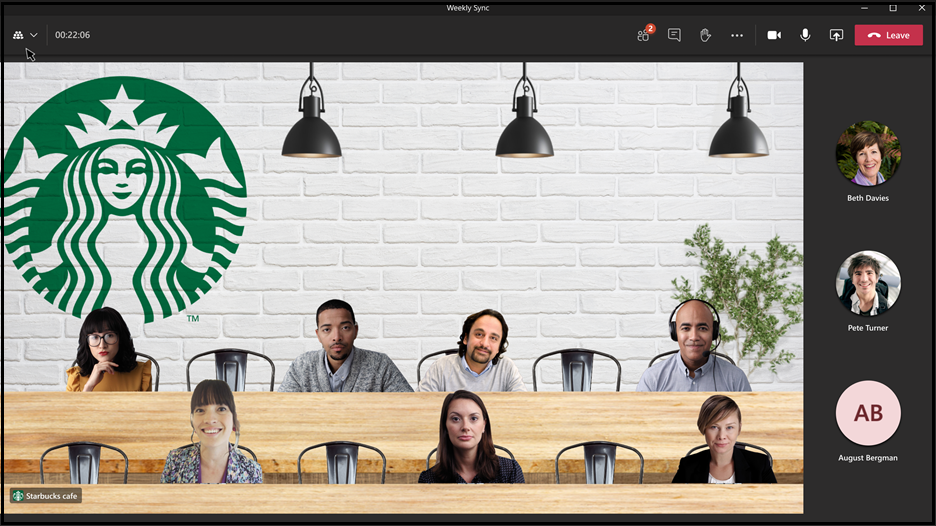

To use the Together Mode to its fullest, follow these best practices:

* Keep an open mind and encourage your participants to interact more.
* Request users not to walk around during the session.
* Keep your camera on. For example, teachers find that students understand better and pay more attention in the Together Mode. Students can interact with the teachers and at the same time understand their peer’s reactions.
