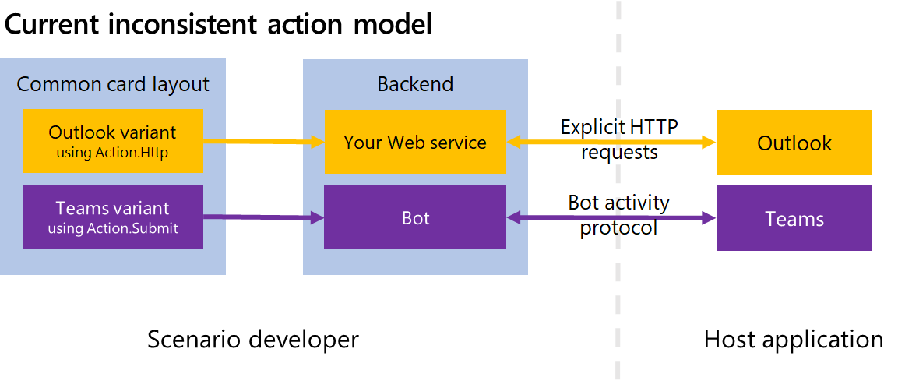
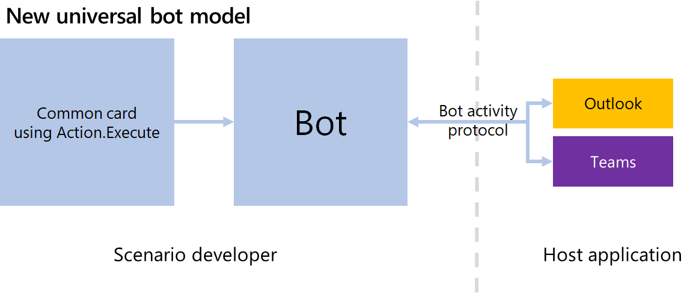
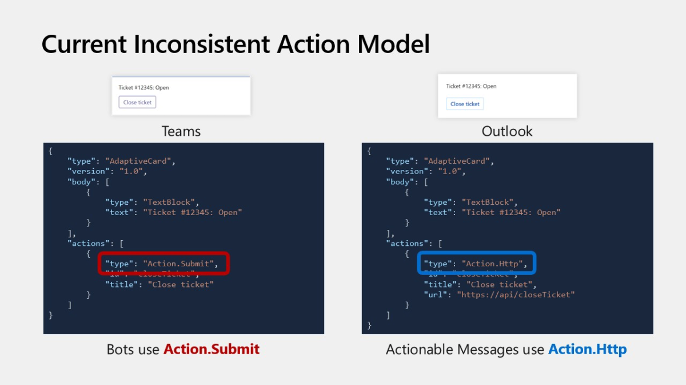
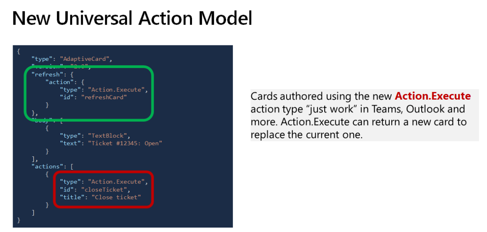
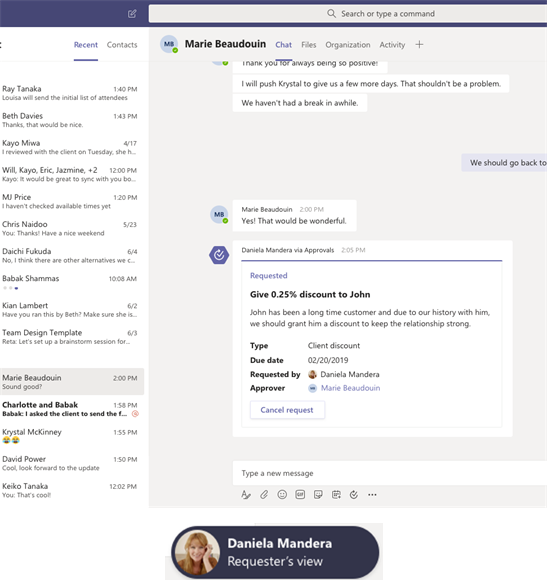
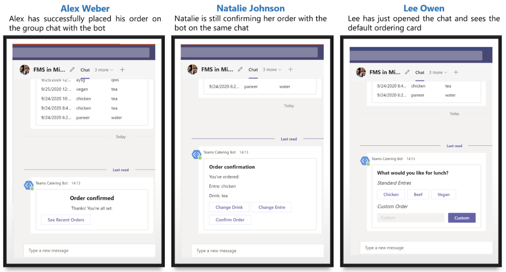

# Universal bot action model

A universal bot action model is a model that makes adaptive cards available across different platforms like Outlook, Teams, WebChat, Cortana, Timeline, and your applications through one `Action.Execute` command. Layout and rendering were already provided universally and now action handling is also provided.

Adaptive cards are a combination of content such as text and graphics, and actions that can be performed by a user. As a developer you can add adaptive cards to a conversation through a bot or messaging extension. Adaptive cards are cross-platform and cross-app snippets of UI, authored using a lightweight JSON format, that apps and services can share. For more information, see [adaptivecards.io](http://adaptivecards.io/).

## Lifecycle of an adaptive card





## Overview

The universal bot action model provides the following:
* The generalization of bots and the Bot Framework as the way to implement adaptive card-based scenarios for both Teams and Outlook.
* `Action.Execute` replaces both `Action.Submit` used by bots and `Action.Http` used by actionable messages.
* Popular features only supported by actionable messages made available to bots, namely:
    * The ability for a card to be refreshed at the time it is displayed.
    * The ability for `Action.Execute` actions to return an updated card to be immediately displayed in the client.

For more information, see [actionable message documentation](https://docs.microsoft.com/en-us/outlook/actionable-messages/send-via-email).

>[!NOTE]
> If you are already using adaptive cards on Teams with bot, you can use the same bot with a few changes to support `Action.Execute`. If you are using actionable messages on Outlook, you will need to develop a bot that supports `Action.Execute`.

### Enhancements

Universal bot action model leverages the full Bot Framework stack, with the following enhancements:
* Support the adaptiveCard/action Invoke activity.
    * Do not support chat like conversational experiences.
    * All user interactions happen within the confines of a single area on the screen.
* Implement a synchronous model.
    * When a user takes an action from within the card, that action is executed synchronously and the card waits for the response to be returned.
    * The channel that accepted the card in the first place is responsible for allowing or disallowing the bot to send updates to the card, as is appropriate for that channel.
* Client runtimes and channels operate over HTTP only. This simplifies implementation, both on the client and server, while addressing the vast majority of needs.
* Is Implemented using the existing bot builder SDKs. Developers can reuse their code. The main difference is they can only use adaptiveCard/action Invoke activities for their bots to be universal.

### Features

The universal bot action model provides the following features:

#### Universal actions

Before using the `Action.Execute` model, different hosts used different action models as follows:
* Teams or bots uses the `Action.Submit` model, essentially an approach which defers the actual communication model to the underlying channel.
* Windows also uses `Action.Submit`, but requires a special set of named verbs to be used.
* Outlook uses the `Action.Http` model where the way to communicate with the backend service is explicitly specified in the adaptive card payload
* Search currently does not support actions.



The new `Action.Execute` model solves these problems as the developer can use one model for action handling throughout different platforms.



#### Contextual views

Contextual views or role-based views refers to the ability of a card to look or behave differently depending on the user that views it. For instance, a poll author might see a read-only view of the overall poll results while a poll responder might see a set of inputs allowing them to respond to the poll.



#### Sequential workflow support

Sequential workflow is a progressive workflow scenario where any user part of a chat or channel can take action on their specific card and progress through a set of cards stepwise without modifying the card for other users. With sequential workflow support now in Teams, users can go through their respective workflows without modifying the card for other users.



## Schema for universal bot action model

The universal bot action model is introduced in the adaptive cards schema version 1.4. To use these new capabilities, the adaptive card `version` property must be set to 1.4 or higher.

Note: Setting the adaptive card `version` property to 1.4 or higher will make your adaptive card incompatible with older clients such as Outlook or Teams that do not support the universal bot action model.

If you use the `refresh` property and `Action.Execute` and specify a card version less than 1.4, the following issues occur:

| Client | Behavior |
| :-- | :-- |
| Outlook | Your card stops working. `refresh` is not honored and `Action.Execute` does not render or your card is rejected entirely. |
| Teams | Your card stops working. `refresh` is not honored, and the `Action.Execute` action does not render depending on the version of the Teams client. To ensure maximum compatibility in Teams, define your `Action.Execute` actions with an `Action.Submit` action in the fallback property. |

For more information, see [backward compatibility](#backward-compatibility).

## Action.Execute command

When authoring adaptive cards, use `Action.Execute` in place of both `Action.Submit` and `Action.Http`. The schema for `Action.Execute` is quite similar to that of `Action.Submit`.

### Example JSON

```json
{
  "$schema": "http://adaptivecards.io/schemas/adaptive-card.json",
  "type": "AdaptiveCard",
  "version": "1.4",
  "body": [
    {
      "type": "TextBlock",
      "text": "Present a form and submit it back to the originator"
    },
    {
      "type": "Input.Text",
      "id": "firstName",
      "placeholder": "What is your first name?"
    },
    {
      "type": "Input.Text",
      "id": "lastName",
      "placeholder": "What is your last name?"
    },
    {
      "type": "ActionSet",
      "actions": [
        {
          "type": "Action.Execute",
          "title": "Submit",
          "verb": "personalDetailsFormSubmit",
          "fallback": "Action.Submit"
        }
      ]
    }
  ]
}
```

### Properties

| Property | Type | Required | Description |
| :-- | :-- | :-- | :-- |
| type | `Action.Execute` | Yes | Must be `Action.Execute`. |
| verb | string | No | A convenience string used by developer to identify the action. |
| data | string, object | No | Initial data that input fields are combined with. These are essentially hidden properties. |
| title | string | No | Label for button or link that represents this action. |
| iconUrl | uri | No | Optional icon shown on the action along with the title. Supports data URI in Adaptive Cards version 1.2+. |
| style | ActionStyle | No | Controls the style of an action, which influences how the action is displayed and spoken. |
| fallback | <action object>, "drop" | No | Describes what to do when `Action.Execute` is unsupported by the client displaying the card. |
| requires | Dictionary<string> | No | A series of key or value pairs indicating features that the item requires corresponding minimum version. When a feature is missing or is of a previous version, fallback is triggered. |

## Refresh feature

Along with `Action.Execute` a new refresh mechanism is now supported, making it possible to create adaptive cards that automatically update at the time they are displayed. This ensures that users always see up to date data. A typical refresh use case is an approval request: once approved, it is best that users are not presented with a card prompting them to approve when it's already been done, but instead provides information on the time the request was approved and by whom.

To allow an adaptive card to automatically refresh, define its refresh property, which embeds an action of type `Action.Execute` and a `userIds` array.

| Property | Type | Required | Description |
| :-- | :-- | :-- | :-- |
| action | `Action.Execute` | Yes | Must be an action instance of type `Action.Execute`. |
| userIds | Array<string> | Yes | An array of `MRIs` of users for whom auto refresh must be enabled. |

>[!IMPORTANT]
> If the `userIds` list property is not included in the refresh section of the card, the card is not automatically refreshed on display. Instead, a button is presented to the user to allow them to manually refresh. The reason for this is channels in Teams can include a large number of members; if many members are all viewing the channel at the same time, and unconditional automatic refresh would results in many concurrent calls to the Bot, which would not scale. To alleviate the potential scale problem, the `userIds` property should always be included to identify which users should get an automatic refresh, with a maximum of five user IDs currently being allowed.

>[!NOTE]
> The `userIds` property is ignored in Outlook, and the refresh property is always automatically honored. There is no scale issue in Outlook because users will typically view the card at different times.

### Sample JSON

```json
{
  "$schema": "http://adaptivecards.io/schemas/adaptive-card.json",
  "type": "AdaptiveCard",
  "originator":"c9b4352b-a76b-43b9-88ff-80edddaa243b",
  "version": "1.4",
  "refresh": {
    "action": {
      "type": "Action.Execute",
      "title": "Submit",
      "verb": "personalDetailsCardRefresh"
    },
    "userIds": []
  },
  "body": [
    {
      "type": "TextBlock",
      "text": "Present a form and submit it back to the originator"
    },
    {
      "type": "Input.Text",
      "id": "firstName",
      "placeholder": "What is your first name?"
    },
    {
      "type": "Input.Text",
      "id": "lastName",
      "placeholder": "What is your last name?"
    },
    { 
      "type": "ActionSet",
      "actions": [
        {
          "type": "Action.Execute",
          "title": "Submit",
          "verb": "personalDetailsFormSubmit",
          "fallback": "Action.Submit"
        }
      ]
    }
  ]
}
```

### Important note for Outlook actionable message developers

When developing Outlook Actionable Message scenarios, the Adaptive Card's `originator` property must be specified. `originator` is a Globally Unique Identified (GUID) generated at the time a Bot subscribes to the Outlook channel. It is used by Outlook to validate that the Adaptive Card was sent by an authorized Bot. The Adaptive Card will not be rendered in Outlook if originator is absent. `originator` is ignored in Teams.

### adaptiveCard/action invoke activity

When an `Action.Execute` is executed in the client whether it is the refresh action or an action explicitly taken by a user by clicking a button, a new type of Invoke activity `adaptiveCard/action` is made to your bot. The following code provides a typical `adaptiveCard/action` invoke activity request:

#### Request format

```json
{ 
  "type": "invoke",
  "name": "adaptiveCard/action",

  // ... other properties omitted for brevity

  "value": { 
    "action": { 
      "type": "Action.Execute", 
      "id": "abc", 
      "verb": "def",
      "data": { ... } 
    },
    "trigger": "automatic | manual" 
  }
}
```

| Field | Description |
| :-- | :-- |
| value.action | A copy of the action as defined in the Adaptive Card. Like with Action.Submit, the data property of the action includes the values of the various inputs in the card, if there are any. |
| value.trigger | Indicates if the action was triggered explicitly (by the user clicking a button) or implicitly (via automatic refresh) |

#### Response format

If the Bot did process an incoming `adaptiveCard/action Invoke` activity that is if the Bot's code was involved in processing the request, the HTTP response's status code returned by the bot must be equal to 200 and the body of the HTTP response must be formatted as follows:

```json
{
    "statusCode": <number (200 – 599)>,
    "type": "<string>",
    "value": "<object>"
}
```

| Field | Description |
| :-- | :-- |
| statusCode | An HTTP response status code of 200 does NOT necessarily mean the Bot was able to successfully process the request. A client application MUST always look at the `statusCode` property in the response's body to know how the Bot processed the request. `statusCode` is a number ranging from 200-599 that mirrors HTTP status code values and is meant to be a sub-status for the result of the bot processing the Invoke. A missing, null, or undefined value for `statusCode` implies a 200 (Success). |
| type | A set of well-known string constants that describe the expected shape of the value property. |
| value | An object that is specific to the type of response body. |

### Use the universal Bot action model

1. Use `Action.Execute` instead of `Action.Submit`. To update an existing scenario on teams, replace all instances of `Action.Submit` with `Action.Execute`.
2. For cards to surface on Outlook add the `originator` field. Refer [sample JSON](#sample-json).
3. Add a `refresh` clause to your Adaptive Card if you want to leverage the automatic refresh mechanism or if your scenario requires contextual views. Be sure to specify the `userIds` property to identify which users (maximum 5) will get automatic updates.
4. Handle `adaptiveCard/action` Invoke requests in your Bot
5. Whenever your Bot needs to return a new card as a result of processing an `Action.Execute`, you can use the Invoke request's context to generate cards that are specifically crafted for a given user. Make sure the response conforms to the response schema defined above.

### Backward compatibility

#### Outlook
The new `Action.Execute` universal action model is a departure from the `Action.Http` action model currently used by Outlook actionable messages, where actions are encoded in the adaptive card as explicit HTTP calls. The `Action.Execute` model makes it possible for developers to implement scenarios that work in both Outlook and Teams. Actionable message scenarios can either use the `Action.Http` model or the new `Action.Execute` model, but not both. Scenarios that use the universal `Action.Execute` model must be implemented as bots and subscribe to Outlook actionable messages channel.

>[!IMPORTANT]
> * Scenarios implemented using the universal `Action.Execute` model will not be compatible with older versions of Outlook.

#### Teams

In order for your cards to be backward compatible and work for users on older versions of Teams, your `Action.Execute` actions should include a fallback property defined as an `Action.Submit`. Your bot should be coded in such a way that it can process both `Action.Execute` and `Action.Submit`.

>[!IMPORTANT]
> * Some older Teams clients do not support fallback property when not wrapped in an ActionSet. In order to not break on such clients, it is strongly recommended that you wrap all your Action.Execute in ActionSet. See example below on how to wrap Action.Execute in ActionSet.

The version property of the card is set to 1.2 and `Action.Execute` is defined with an `Action.Submit` as its fallback. When rendered in a Teams client that supports Adaptive Cards 1.4, the `Action.Execute` renders and works as expected. In Teams clients that do not support Adaptive Cards 1.4, the `Action.Submit` is rendered in place of `Action.Execute`.

```json
{
  "$schema": "http://adaptivecards.io/schemas/adaptive-card.json",
  "type": "AdaptiveCard",
  "version": "1.2",
  "body": [
    {
      "type": "TextBlock",
      "text": "Present a form and submit it back to the originator"
    },
    {
      "type": "Input.Text",
      "id": "firstName",
      "placeholder": "What is your first name?"
    },
    {
      "type": "Input.Text",
      "id": "lastName",
      "placeholder": "What is your last name?"
    },
    {
      "type": "ActionSet",
      "actions": [
        {
          "type": "Action.Execute",
          "title": "Submit",
          "verb": "personalDetailsFormSubmit",
          "fallback": {
            "Action.Submit",
            "title": "Submit"
          }  
        }
      ]
    }
  ]
}
```
