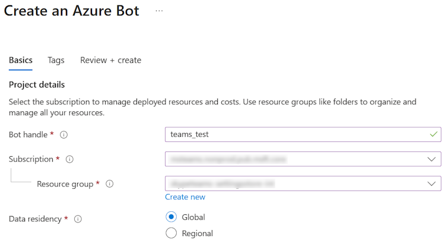
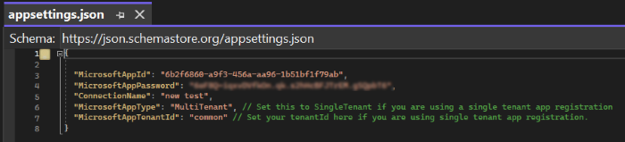

# Build a bot with SSO authentication

Conversational bots in Microsoft Teams perform repetitive automated tasks initiated by users, such as customer service. The user needs to sign in multiple times without single sign-on (SSO) authentication. With SSO authentication methods, the users don't need to sign in to the bot multiple times.

A bot behaves differently depending on the conversation it's involved in:

* Bots in channel and group chat conversations require the users to @mention the bot. 
* Bots in a one-to-one conversation don't require an @mention. All messages sent by the user routes to the bot.
  
This step-by-step guide helps you to build a bot with SSO authentication. You'll see the following output:

## Prerequisites

Ensure that you install the following tools and set up your development environment:

| **Install** | **For using...** |
|-------------|------------------|
| [Microsoft Teams](https://www.microsoft.com/microsoft-teams/download-app) | Microsoft Teams to collaborate with everyone you work with through apps for chat, meetings, and calls all in one place. |
| [Visual Studio 2022](https://visualstudio.microsoft.com) | You can install the enterprise version in Visual Studio 2022, and install the ASP.NET and web development workloads. Use the latest version. |
| [Microsoft 365 developer account](/microsoftteams/platform/concepts/build-and-test/prepare-your-o365-tenant) | Access to Teams account with the appropriate permissions to install an app. |
| Dev tunnel | Teams app features (conversational bots, message extensions, and incoming webhooks) need inbound connections. A tunnel connects your development system to Teams. Dev tunnel is a powerful tool to securely open your localhost to the internet and control who has access. Dev tunnel is available in Visual Studio 2022 version 17.7.0 or later. Or you can also use [ngrok](https://ngrok.com/download) as a tunnel to connect your development system to Teams. It isn't required for apps that only include tabs. This package is installed within the project directory (using npm `devDependencies`). |

 > [!NOTE]
> After downloading ngrok, sign up and install [authtoken](https://ngrok.com/download).

### Set up your Teams development tenant

A tenant is like a space or a container where you chat, share files, and run meetings for your organization in Teams. You can also upload and test the custom app.

### Check for custom app upload option

After creating the app, you must load your app in Teams without distributing it. This process is known as custom app upload. Sign in to your Microsoft 365 account to view this option.

> [!NOTE]
> Custom app upload is necessary for previewing and testing apps in Teams local environment. Enable app upload to preview and test your app in Teams locally.

Do you already have a tenant, and do you have the admin access? Let's check if you really do!

To verify custom upload apps in Teams:

1. In the Teams client, select the **Apps** icon.
2. Select **Manage your apps**.
3. Select **Upload an app**
4. Look for the option **Upload a custom app**. If you see the option, custom app upload is enabled.

> [!NOTE]
> Contact Teams administrator, if you don't have the option to upload a custom app.

### Create a free Teams developer tenant (optional)

If you don't have a Teams developer account, you can get it for free. Join the Microsoft 365 developer program!

1. Go to the [Microsoft 365 developer program](https://developer.microsoft.com/microsoft-365/dev-program).
2. Select **Join Now** and follow the onscreen instructions.
3. In the welcome screen, select **Setup E5 subscription**.
4. Set up an administrator account. After you finish, the following screen displays.

5. Sign in to Teams using the new administrator account you just set up. Verify that you have the **Upload a custom app** option in Teams.

> [!div class="nextstepaction"]
> [I ran into an issue](https://github.com/MicrosoftDocs/msteams-docs/issues/new?template=Doc-Feedback.yaml&title=%5BI+ran+into+an+issue%5D+Create+a+free+Teams+developer+tenant+(optional)&pageUrl=https%3A%2F%2Flearn.microsoft.com%2Fen-us%2Fmicrosoftteams%2Fplatform%2Fsbs-bots-with-sso%3Ftabs%3Ddev%26tutorial-step%3D1&contentSourceUrl=https%3A%2F%2Fgithub.com%2FMicrosoftDocs%2Fmsteams-docs%2Fblob%2Fmain%2Fmsteams-platform%2Fsbs-bots-with-sso.yml&documentVersionIndependentId=b410630d-3624-e389-480f-ea3307a3b774&author=surbhigupta&platformId=4b2022ca-ee48-5c9a-b390-7ed303c02fd8&metadata=*%2BID%253A%2Be473e1f3-69f5-bcfa-bcab-54b098b59c80%2B%250A*%2BService%253A%2B**msteams**)

## Set up local environment

1. Open [Microsoft-Teams-Samples](https://github.com/OfficeDev/Microsoft-Teams-Samples).
2. Select **Code**.
3. From the dropdown menu, select **Open with GitHub Desktop**.

4. Select **Clone**.

> [!div class="nextstepaction"]
> [I ran into an issue](https://github.com/MicrosoftDocs/msteams-docs/issues/new?template=Doc-Feedback.yaml&title=%5BI+ran+into+an+issue%5D+Set+up+local+environment&pageUrl=https%3A%2F%2Flearn.microsoft.com%2Fen-us%2Fmicrosoftteams%2Fplatform%2Fsbs-bots-with-sso%3Ftabs%3Ddev%26tutorial-step%3D2&contentSourceUrl=https%3A%2F%2Fgithub.com%2FMicrosoftDocs%2Fmsteams-docs%2Fblob%2Fmain%2Fmsteams-platform%2Fsbs-bots-with-sso.yml&documentVersionIndependentId=b410630d-3624-e389-480f-ea3307a3b774&author=surbhigupta&platformId=4b2022ca-ee48-5c9a-b390-7ed303c02fd8&metadata=*%2BID%253A%2Be473e1f3-69f5-bcfa-bcab-54b098b59c80%2B%250A*%2BService%253A%2B**msteams**)

## Register Microsoft Entra app

The following steps help you to create and register your bot in the Azure portal:

* Create and register your Azure app. 
* Create client secret to enable SSO authentication of the bot.
* Add Teams channel to deploy the bot.
* Create a tunnel to your web server's endpoints using dev tunnel (recommended) or ngrok.
* Add messaging endpoint to the dev tunnel that you created.

[!INCLUDE [Azure app registration](../includes/get-started/azure-app-registration.md)]

> [!div class="nextstepaction"]
> [I ran into an issue](https://github.com/MicrosoftDocs/msteams-docs/issues/new?template=Doc-Feedback.yaml&title=%5BI+ran+into+an+issue%5D+Add+App+registration&pageUrl=https%3A%2F%2Flearn.microsoft.com%2Fen-us%2Fmicrosoftteams%2Fplatform%2Fsbs-bots-with-sso%3Ftabs%3Ddev%26tutorial-step%3D3&contentSourceUrl=https%3A%2F%2Fgithub.com%2FMicrosoftDocs%2Fmsteams-docs%2Fblob%2Fmain%2Fmsteams-platform%2Fsbs-bots-with-sso.yml&documentVersionIndependentId=b410630d-3624-e389-480f-ea3307a3b774&author=surbhigupta&platformId=4b2022ca-ee48-5c9a-b390-7ed303c02fd8&metadata=*%2BID%253A%2Be473e1f3-69f5-bcfa-bcab-54b098b59c80%2B%250A*%2BService%253A%2B**msteams**)

**Create a tunnel**

# [Dev tunnel](#tab/dev)

[!INCLUDE [Tunnel](../includes/get-started/dev-tunnel.md)]

> [!div class="nextstepaction"]
> [I ran into an issue](https://github.com/MicrosoftDocs/msteams-docs/issues/new?template=Doc-Feedback.yaml&title=%5BI+ran+into+an+issue%5D+Create+a+tunnel+using+dev+tunnel&pageUrl=https%3A%2F%2Flearn.microsoft.com%2Fen-us%2Fmicrosoftteams%2Fplatform%2Fsbs-bots-with-sso%3Ftabs%3Ddev%26tutorial-step%3D3&contentSourceUrl=https%3A%2F%2Fgithub.com%2FMicrosoftDocs%2Fmsteams-docs%2Fblob%2Fmain%2Fmsteams-platform%2Fsbs-bots-with-sso.yml&documentVersionIndependentId=b410630d-3624-e389-480f-ea3307a3b774&author=surbhigupta&platformId=4b2022ca-ee48-5c9a-b390-7ed303c02fd8&metadata=*%2BID%253A%2Be473e1f3-69f5-bcfa-bcab-54b098b59c80%2B%250A*%2BService%253A%2B**msteams**)

# [Ngrok](#tab/ngrok)

[!INCLUDE [Tunnel](../includes/get-started/ngrok-tunnel.md)]

> [!div class="nextstepaction"]
> [I ran into an issue](https://github.com/MicrosoftDocs/msteams-docs/issues/new?template=Doc-Feedback.yaml&title=%5BI+ran+into+an+issue%5D+Create+a+tunnel+using+ngrok&pageUrl=https%3A%2F%2Flearn.microsoft.com%2Fen-us%2Fmicrosoftteams%2Fplatform%2Fsbs-bots-with-sso%3Ftabs%3Ddev%26tutorial-step%3D3&contentSourceUrl=https%3A%2F%2Fgithub.com%2FMicrosoftDocs%2Fmsteams-docs%2Fblob%2Fmain%2Fmsteams-platform%2Fsbs-bots-with-sso.yml&documentVersionIndependentId=b410630d-3624-e389-480f-ea3307a3b774&author=surbhigupta&platformId=4b2022ca-ee48-5c9a-b390-7ed303c02fd8&metadata=*%2BID%253A%2Be473e1f3-69f5-bcfa-bcab-54b098b59c80%2B%250A*%2BService%253A%2B**msteams**)

---

**Add API permissions**

1. In the left pane, select **API permissions**. 

2. Select **+ Add a permission**.

1. Select **Microsoft Graph**.

2. Select **Delegated permissions**.

3. Select **User** > **User.Read**.

4. Select **Add permissions**.

> [!div class="nextstepaction"]
> [I ran into an issue](https://github.com/MicrosoftDocs/msteams-docs/issues/new?template=Doc-Feedback.yaml&title=%5BI+ran+into+an+issue%5D+Add+API+permissions&pageUrl=https%3A%2F%2Flearn.microsoft.com%2Fen-us%2Fmicrosoftteams%2Fplatform%2Fsbs-bots-with-sso%3Ftabs%3Ddev%26tutorial-step%3D3&contentSourceUrl=https%3A%2F%2Fgithub.com%2FMicrosoftDocs%2Fmsteams-docs%2Fblob%2Fmain%2Fmsteams-platform%2Fsbs-bots-with-sso.yml&documentVersionIndependentId=b410630d-3624-e389-480f-ea3307a3b774&author=surbhigupta&platformId=4b2022ca-ee48-5c9a-b390-7ed303c02fd8&metadata=*%2BID%253A%2Be473e1f3-69f5-bcfa-bcab-54b098b59c80%2B%250A*%2BService%253A%2B**msteams**) 

> [!NOTE]
> If an app isn't granted IT admin consent, users must provide consent the first time they use an app.
> Users need to consent to the API permissions only if the Microsoft Entra app is registered in a different tenant.

**Application ID URI**

1. In the left pane, under **Manage**, select **Expose an API**.

2. Next to **Application ID URI**, select **Add**.

1. Update the **Application ID URI** in the `api://botid-{AppID}` format and select **Save**.

> [!div class="nextstepaction"]
> [I ran into an issue](https://github.com/MicrosoftDocs/msteams-docs/issues/new?template=Doc-Feedback.yaml&title=%5BI+ran+into+an+issue%5D+Application+ID+URI&pageUrl=https%3A%2F%2Flearn.microsoft.com%2Fen-us%2Fmicrosoftteams%2Fplatform%2Fsbs-bots-with-sso%3Ftabs%3Ddev%26tutorial-step%3D3&contentSourceUrl=https%3A%2F%2Fgithub.com%2FMicrosoftDocs%2Fmsteams-docs%2Fblob%2Fmain%2Fmsteams-platform%2Fsbs-bots-with-sso.yml&documentVersionIndependentId=b410630d-3624-e389-480f-ea3307a3b774&author=surbhigupta&platformId=4b2022ca-ee48-5c9a-b390-7ed303c02fd8&metadata=*%2BID%253A%2Be473e1f3-69f5-bcfa-bcab-54b098b59c80%2B%250A*%2BService%253A%2B**msteams**)

[!INCLUDE [Azure add scope](../includes/get-started/azure-add-scope.md)]

> [!div class="nextstepaction"]
> [I ran into an issue](https://github.com/MicrosoftDocs/msteams-docs/issues/new?template=Doc-Feedback.yaml&title=%5BI+ran+into+an+issue%5D+Add+a+scope&pageUrl=https%3A%2F%2Flearn.microsoft.com%2Fen-us%2Fmicrosoftteams%2Fplatform%2Fsbs-bots-with-sso%3Ftabs%3Ddev%26tutorial-step%3D3&contentSourceUrl=https%3A%2F%2Fgithub.com%2FMicrosoftDocs%2Fmsteams-docs%2Fblob%2Fmain%2Fmsteams-platform%2Fsbs-bots-with-sso.yml&documentVersionIndependentId=b410630d-3624-e389-480f-ea3307a3b774&author=surbhigupta&platformId=4b2022ca-ee48-5c9a-b390-7ed303c02fd8&metadata=*%2BID%253A%2Be473e1f3-69f5-bcfa-bcab-54b098b59c80%2B%250A*%2BService%253A%2B**msteams**)

[!INCLUDE [Azure client application](../includes/get-started/azure-client-application.md)]

> [!div class="nextstepaction"]
> [I ran into an issue](https://github.com/MicrosoftDocs/msteams-docs/issues/new?template=Doc-Feedback.yaml&title=%5BI+ran+into+an+issue%5D+Add+client+application&pageUrl=https%3A%2F%2Flearn.microsoft.com%2Fen-us%2Fmicrosoftteams%2Fplatform%2Fsbs-bots-with-sso%3Ftabs%3Ddev%26tutorial-step%3D3&contentSourceUrl=https%3A%2F%2Fgithub.com%2FMicrosoftDocs%2Fmsteams-docs%2Fblob%2Fmain%2Fmsteams-platform%2Fsbs-bots-with-sso.yml&documentVersionIndependentId=b410630d-3624-e389-480f-ea3307a3b774&author=surbhigupta&platformId=4b2022ca-ee48-5c9a-b390-7ed303c02fd8&metadata=*%2BID%253A%2Be473e1f3-69f5-bcfa-bcab-54b098b59c80%2B%250A*%2BService%253A%2B**msteams**)

[!INCLUDE [Manifest](../includes/get-started/azure-manifest.md)]

## Create your bot

Create an Azure bot resource.

> [!NOTE]
> If you're already testing your bot in Teams, sign out of this app and Teams. To see this change, sign in again.

1. Go to **Home**.
2. Select **+ Create a resource**.
3. In the search box, enter **Azure Bot**.
4. Select **Enter**.
5. Select **Azure Bot**.
6. Select **Create**.

7. Enter the bot name in **Bot handle**.
8. Select your **Subscription** from the dropdown list.
9. Select your **Resource group** from the dropdown list.

If you don't have an existing resource group, you can create a new resource group. To create a new resource group, follow these steps:
    a. Select **Create new**.
    b. Enter the resource name and select **OK**.
    c. Select a location from **New resource group location** dropdown list.

10. Under **Pricing**, select **Change plan**.

11. Select **FO Free** > **Select**.

12. Under **Microsoft App ID**, select **Type of App** as **Multi Tenant**.

13. In the **Creation type**, select **Use existing app registration**.

14. Enter the **App ID**.

> [!NOTE]
> You can't create more than one bot with the same **Microsoft App ID**.

15. Select **Review + create**.

16. After the validation passes, select **Create**.

The bot takes a few minutes to provision.

17. Select **Go to resource**.

 You've successfully created your Azure bot.

> [!div class="nextstepaction"]
> [I ran into an issue](https://github.com/MicrosoftDocs/msteams-docs/issues/new?template=Doc-Feedback.yaml&title=%5BI+ran+into+an+issue%5D+Create+an+Azure+bot+resource&pageUrl=https%3A%2F%2Flearn.microsoft.com%2Fen-us%2Fmicrosoftteams%2Fplatform%2Fsbs-bots-with-sso%3Ftabs%3Ddev%26tutorial-step%3D4&contentSourceUrl=https%3A%2F%2Fgithub.com%2FMicrosoftDocs%2Fmsteams-docs%2Fblob%2Fmain%2Fmsteams-platform%2Fsbs-bots-with-sso.yml&documentVersionIndependentId=b410630d-3624-e389-480f-ea3307a3b774&author=surbhigupta&platformId=4b2022ca-ee48-5c9a-b390-7ed303c02fd8&metadata=*%2BID%253A%2Be473e1f3-69f5-bcfa-bcab-54b098b59c80%2B%250A*%2BService%253A%2B**msteams**)

### Add a Teams channel

1. In the left pane, select **Channels**.
2. Under **Available Channels**, select **Microsoft Teams**.

3. Select the checkbox to accept the **Terms of Service**.
4. Select **Agree**.

5. Select **Apply**.

> [!div class="nextstepaction"]
> [I ran into an issue](https://github.com/MicrosoftDocs/msteams-docs/issues/new?template=Doc-Feedback.yaml&title=%5BI+ran+into+an+issue%5D+Add+a+Teams+channel&pageUrl=https%3A%2F%2Flearn.microsoft.com%2Fen-us%2Fmicrosoftteams%2Fplatform%2Fsbs-bots-with-sso%3Ftabs%3Ddev%26tutorial-step%3D4&contentSourceUrl=https%3A%2F%2Fgithub.com%2FMicrosoftDocs%2Fmsteams-docs%2Fblob%2Fmain%2Fmsteams-platform%2Fsbs-bots-with-sso.yml&documentVersionIndependentId=b410630d-3624-e389-480f-ea3307a3b774&author=surbhigupta&platformId=4b2022ca-ee48-5c9a-b390-7ed303c02fd8&metadata=*%2BID%253A%2Be473e1f3-69f5-bcfa-bcab-54b098b59c80%2B%250A*%2BService%253A%2B**msteams)

### To add a messaging endpoint

# [dev tunnel](#tab/dev2)

1. Use the dev tunnel URL in the **Output** console as the messaging endpoint.

2. In the left pane, under **Settings**, select **Configuration**.

3. Update the **Messaging endpoint** in the format `https://your-devtunnel-domain/api/messages`.

4. Select **Apply**.

You've successfully set up a bot in Azure Bot service.

> [!NOTE]
> If the **Application Insights Instrumentation key** shows an error, update with **App ID**.

# [ngrok](#tab/ngrok2)

1. From ngrok, copy the HTTPS URL.

> [!NOTE]
> The HTTPS URL in your ngrok is a fully qualified domain name.
> The `WebAppDomain` is a fully qualified domain name that doesn't include `https://` in it.

2. In the left pane, under **Settings**, select **Configuration**.

3. Update the **Messaging endpoint** in the format `https://your-ngrok-domain/api/messages`.

4. Select **Apply**.

You have successfully set up a bot in Azure Bot service.

> [!NOTE]
> If the **Application Insights Instrumentation key** shows an error update with **App ID**.

> [!div class="nextstepaction"]
> [I ran into an issue](https://github.com/MicrosoftDocs/msteams-docs/issues/new?template=Doc-Feedback.yaml&title=%5BI+ran+into+an+issue%5D+To+add+a+messaging+endpoint&pageUrl=https%3A%2F%2Flearn.microsoft.com%2Fen-us%2Fmicrosoftteams%2Fplatform%2Fsbs-bots-with-sso%3Ftabs%3Ddev%26tutorial-step%3D4&contentSourceUrl=https%3A%2F%2Fgithub.com%2FMicrosoftDocs%2Fmsteams-docs%2Fblob%2Fmain%2Fmsteams-platform%2Fsbs-bots-with-sso.yml&documentVersionIndependentId=b410630d-3624-e389-480f-ea3307a3b774&author=surbhigupta&platformId=4b2022ca-ee48-5c9a-b390-7ed303c02fd8&metadata=*%2BID%253A%2Be473e1f3-69f5-bcfa-bcab-54b098b59c80%2B%250A*%2BService%253A%2B**msteams**)

### Add an OAuth connection settings

1. In the left pane, select **Configuration**.

2. Select **Add OAuth Connection Settings**.

3. Under **New Connection Setting**, update the following details:

    * **Name**: Enter a name for your new connection setting. You can use the name in the settings of your bot service code.
    * **Service Provider**: From the dropdown list, select **Azure Active Directory v2**.
    * **Client id**: Update your **Microsoft App ID**.
    * **Client secret**: Update the client secrets **Value**.
    * **Token Exchange URL**: Update the **Application ID URI**.
    * **Tenant ID**: Enter **Common**.
    * **Scopes**: Enter **User.Read**.

4. Select **Save**.

> [!div class="nextstepaction"]
> [I ran into an issue](https://github.com/MicrosoftDocs/msteams-docs/issues/new?template=Doc-Feedback.yaml&title=%5BI+ran+into+an+issue%5D+Add+an+OAuth+connection+settings&pageUrl=https%3A%2F%2Flearn.microsoft.com%2Fen-us%2Fmicrosoftteams%2Fplatform%2Fsbs-bots-with-sso%3Ftabs%3Ddev%26tutorial-step%3D4&contentSourceUrl=https%3A%2F%2Fgithub.com%2FMicrosoftDocs%2Fmsteams-docs%2Fblob%2Fmain%2Fmsteams-platform%2Fsbs-bots-with-sso.yml&documentVersionIndependentId=b410630d-3624-e389-480f-ea3307a3b774&author=surbhigupta&platformId=4b2022ca-ee48-5c9a-b390-7ed303c02fd8&metadata=*%2BID%253A%2Be473e1f3-69f5-bcfa-bcab-54b098b59c80%2B%250A*%2BService%253A%2B**msteams**)

## Set up app settings

1. Go to the **appsettings.json** file in the cloned repository.

2. Open the **appsettings.json** file in Visual Studio and update the following information:
    * Set MicrosoftAppId to your bot's **Microsoft App ID**.
    * Set MicrosoftAppPassword to your bot's client secret ID **value**.
    * Set ConnectionName as OAuth connection name.
    * Set MicrosoftAppType to **MultiTenant**.
    * Set MicrosoftAppTenantId to **common**.

## Set up manifest file

1. Go to the **manifest.json** file in the cloned repository.

2. Open the **manifest.json** file and update the following changes:

    * Replace all occurrences of `"{TODO: MicrosoftAppId}"` with your **Microsoft App ID**.
    * Set `"<<domain-name>>"` to your ngrok or dev tunnel domain.

## Build and run the service

1. Open Visual Studio.

2. Go to **File** > **Open** > **Project/Solution...**.

3. From **bot-conversation-sso-quickstart** > **csharp_dotnetcore** folder, and select **BotConversationSsoQuickstart.sln** file.

4. Select **F5**  to run the project.

5. If a **Security Warning** dialog appears, select **Yes**.

A webpage opens with a message **Your bot is ready!**.

> [!NOTE]
> This page appears only when you navigate to the localhost URL.

  

<b>Troubleshooting</b>

If you get the **Unable to find package** error, follow these steps:

1. Go to **Tools** > **NuGet Package Manager** > **Package Manager Settings**.
2. In the **Options** window that appears, select **NuGet Package Manager** > **Package Sources**.
3. Select **Add**.
4. In **Name**, enter `nuget.org` and in **Source**, enter `https://api.nuget.org/v3/index.json`.
5. Select **Update** and **OK**.
6. Rebuild your project.
 

> [!div class="nextstepaction"]
> [I ran into an issue](https://github.com/MicrosoftDocs/msteams-docs/issues/new?template=Doc-Feedback.yaml&title=%5BI+ran+into+an+issue%5D+Build+and+run+the+service&pageUrl=https%3A%2F%2Flearn.microsoft.com%2Fen-us%2Fmicrosoftteams%2Fplatform%2Fsbs-bots-with-sso%3Ftabs%3Ddev%26tutorial-step%3D6&contentSourceUrl=https%3A%2F%2Fgithub.com%2FMicrosoftDocs%2Fmsteams-docs%2Fblob%2Fmain%2Fmsteams-platform%2Fsbs-bots-with-sso.yml&documentVersionIndependentId=b410630d-3624-e389-480f-ea3307a3b774&author=surbhigupta&platformId=4b2022ca-ee48-5c9a-b390-7ed303c02fd8&metadata=*%2BID%253A%2Be473e1f3-69f5-bcfa-bcab-54b098b59c80%2B%250A*%2BService%253A%2B**msteams**)

## Upload the bot in Teams

1. In your cloned repository, go to **Microsoft-Teams-Samples** > **samples** > **bot-conversation-sso-quickstart** > **csharp_dotnetcore** > **TeamsApp** > **appPackage**.

2. Create a .zip file with the following files that are present in the **appPackage** folder:
    * manifest.json
    * outline.png
    * color.png

3. Go to Microsoft Teams
    a. In the Teams client, select **Apps**.
    b. Select **Manage your apps**.
    c. Select **Upload an app**.
    d. Look for the option to **Upload a custom app**.

7. Select **Open** to upload the .zip file that you've created in the **Manifest** folder.

8. Select **Add** to add the bot to your chat.

9. Select **Open**.

You can interact with the bot by sending it a message. The bot exchanges an SSO token and calls the Graph API on your behalf. It keeps you signed in unless you send a message to sign out.

1. Send a message to the bot. The conversation bot asks for consent for the first time.

a. For desktop: Select **Continue** to give permissions to Teams client for accessing the bot.

> [!NOTE]
> Now you’ve configured SSO with your bot app and it's the only time you'll have to give consent.

1. For mobile: Select **Accept**.

> [!NOTE]
> Now you’ve configured SSO with your bot app in mobile, and it's the only time you'll have to give consent.

> [!div class="nextstepaction"]
> [I ran into an issue](https://github.com/MicrosoftDocs/msteams-docs/issues/new?template=Doc-Feedback.yaml&title=%5BI+ran+into+an+issue%5D+Upload+the+bot+in+Teams&pageUrl=https%3A%2F%2Flearn.microsoft.com%2Fen-us%2Fmicrosoftteams%2Fplatform%2Fsbs-bots-with-sso%3Ftabs%3Ddev%26tutorial-step%3D7&contentSourceUrl=https%3A%2F%2Fgithub.com%2FMicrosoftDocs%2Fmsteams-docs%2Fblob%2Fmain%2Fmsteams-platform%2Fsbs-bots-with-sso.yml&documentVersionIndependentId=b410630d-3624-e389-480f-ea3307a3b774&author=surbhigupta&platformId=4b2022ca-ee48-5c9a-b390-7ed303c02fd8&metadata=*%2BID%253A%2Be473e1f3-69f5-bcfa-bcab-54b098b59c80%2B%250A*%2BService%253A%2B**msteams**)

## Complete challenge

Did you come up with something like this?

## Congratulations

You've completed the tutorial to get started with build a bot with SSO authentication.

