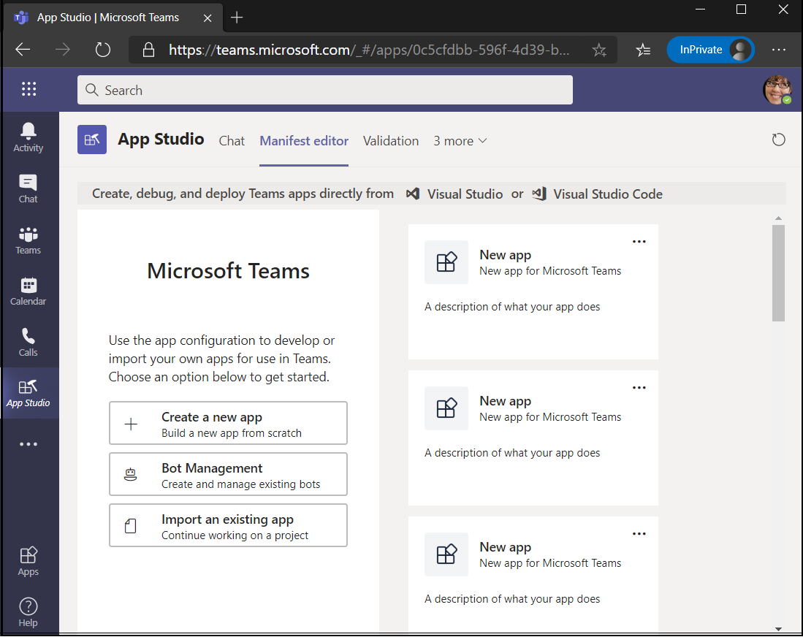
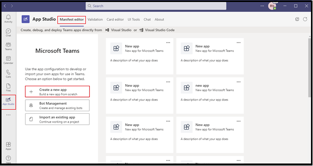
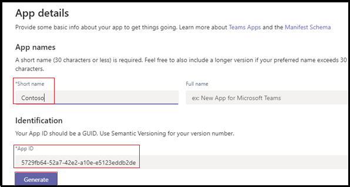
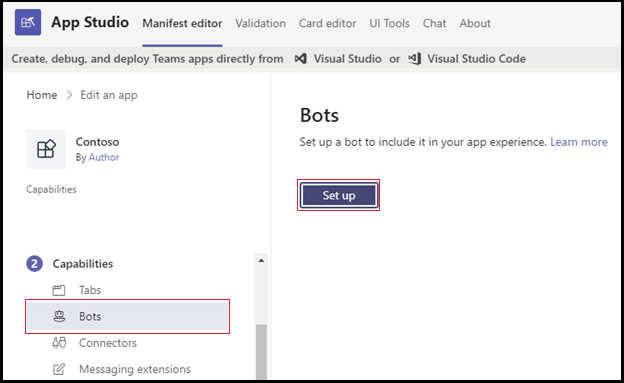
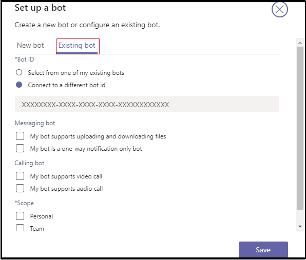
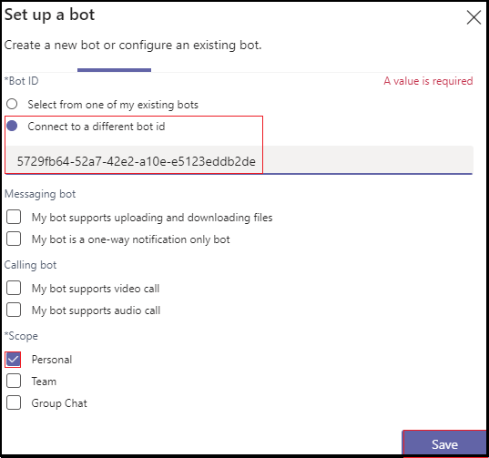

# Add Power Virtual Agents chatbot 

Power Virtual Agents is a no-code, guided graphical interface solution that empowers every member of your team to create rich, conversational chatbots that easily integrate with the Teams platform. All content authored in Power Virtual Agents renders naturally in Teams. Power Virtual Agents bots engage with users in the Teams native chat canvas. The IT administrators, business analysts, domain specialists, and skilled app developers can design, develop and publish intelligent virtual agents for Teams without having to setup a development environment. They can create a web service, or directly register with the Bot Framework. 

This document guides you on how to make your chatbot available in Teams through the Power Virtual Agents portal, and add your bot to Teams using App Studio. 

Power Virtual Agents lets you create powerful chatbots that can answer questions posed by your customers, other employees, or visitors to your website or service.

These bots can be created easily without the need for data scientists or developers.

> [!NOTE]
> By adding your chatbot to Microsoft Teams, some of the data, such as bot content and user chat content, is shared with Microsoft Teams. It means that your data flows outside of your [organization’s compliance and geographic or regional boundaries](/power-virtual-agents/data-location). <br/>

## Make your chatbot available in Teams through the Power Virtual Agents portal

To make your chatbot available in Teams through the Power Virtual Agents portal, you must perform the following process steps:

**To make the chatbot available in Teams**

1. **Publish the latest bot content**  
After creating a chatbot in the Power Virtual Agents portal, you must publish your bot before Teams users can interact with it. For more information, see [Publish the latest bot content](/power-virtual-agents/publication-fundamentals-publish-channels#publish-the-latest-bot-content).

   

1. **Configure the Teams channel**  
After publishing your bot, add the Teams channel to make the bot available to Teams users.

   

1. **Generate an App ID for your chatbot**  
After adding the Teams channel to your chatbot, an **App ID** is generated in the dialog box. The App ID is a unique Microsoft generated identifier for your bot. Save the App ID to create an app package for Teams.

## Add your bot to Teams using App Studio

If [uploading custom apps is enabled](/microsoftteams/admin-settings) in your Teams instance, you can use Teams App Studio to directly upload your chatbot and start using it immediately. To share your chatbot, you can request your admin to make your bot available in the tenant app catalog or you can send your app package to others and ask them to upload it independently.

1. **Install App Studio in Teams**  
App Studio is a Teams app. Install App Studio from the Teams store that simplifies the process of bot creation and registration in Teams: 

   1. Select the app store icon from Teams instance, and search for **App Studio**.

      &emsp;&emsp;    

   1. Select the **App Studio** tile and select **Install** in the pop-up dialog box.

      &emsp;&emsp; 

1. **Create the Teams app manifest in App Studio**  
Bots in Teams are defined by an app manifest JSON file that provides the basic information about your bot and its capabilities. In **App Studio**, select **Manifest editor**, and select **Create a new app**.  
The following image guides you to create a new app in App Studio:  

   

1. **Add your bot details**  
Complete all the required fields. For a full description of each field see [manifest schema definition](../../resources/schema/manifest-schema.md).   
The following image guides you to add the app details:  

   

1. **Set up your bot** 
To set-up the bot, perform the following steps: 
     1. Open the **Bots** tab. 
     1. Select **Setup** > **Existing bot** and enter the name of your bot.

   The following image guides you to set-up a bot:    

    

   The following image guides you to set-up an existing bot:      

       
1. **Add your App ID**  
To add your App ID, perform the following steps:  
    1. Select **Connect to a different bot id** and paste the **App Id** you copied earlier. 
    1. Select **Scope** > **Personal** > **Save**.      
The following image guides you to set-up an existing bot:    

   

1. **Add valid domains for your bot**  
This step is only required if your bot requires the user to sign in. Select **Domains and permissions** and in the **Valid Domains** field, provide the following input:

    ```bash
       token.botframework.com
    ```

7.  **Test and distribute your bot**  
Open **Test and distribute** tab and select **Install** to add your bot directly to your Teams instance. Alternately, you can download the completed app package to share with Teams users or provide it to your admin to make your bot available in the tenant app catalog.

8. **Start a chat**   
The set-up process for adding your Power Virtual Agents chat bot to Teams is complete. You can now start a conversation with your bot in a personal chat.

## See also
> [!div class="nextstepaction"]
> [Power Virtual Agents](/power-virtual-agents/fundamentals-what-is-power-virtual-agents)  

> [!div class="nextstepaction"]
> [Create a chatbot for Teams with Microsoft Power Virtual Agents](../bot-features.md#bots-and-the-microsoft-power-virtual-agents).  

> [!div class="nextstepaction"]
>  [Power Virtual Agents portal](https://powervirtualagents.microsoft.com)

> [!div class="nextstepaction"]
> [Publish your Power Virtual Agents bot](/power-virtual-agents/publication-fundamentals-publish-channels)

> [!div class="nextstepaction"]
> [Security and compliance in Microsoft Teams](/MicrosoftTeams/security-compliance-overview).

## Next step

> [!div class="nextstepaction"]
> [Create virtual assistant](~/samples/virtual-assistant.md)

