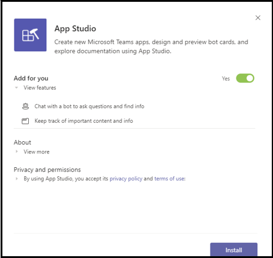

# Integrate a Power Virtual Agents chatbot with Microsoft Teams

[Power Virtual Agents](/power-virtual-agents/fundamentals-what-is-power-virtual-agents) is a no-code, guided graphical interface solution that empowers every member of your team to create rich, conversational chatbots that easily integrate with the Teams platform. All content authored in Power Virtual Agents renders naturally in Teams and Power Virtual Agents bots engage with users in the Teams native chat canvas. Your IT administrators, business analysts, domain specialists, and skilled app developers can design, develop and publish intelligent virtual agents for Teams without having to setup a development environment, create a web service, or directly register with the Bot Framework.  *See* [Create a chatbot for Teams with Microsoft Power Virtual Agents](../bot-features.md#bots-and-the-microsoft-power-virtual-agents).

> [!NOTE]
> By adding your chatbot to Microsoft Teams, some of data, such as bot content and end-user chat content, will be shared with Microsoft Teams (meaning that your data will flow outside of your [organization’s compliance and geographic or regional boundaries](/power-virtual-agents/data-location)). <br/>
> For more information, see the [Security and compliance in Microsoft Teams](/MicrosoftTeams/security-compliance-overview).

## Make your chatbot available in Teams via the Power Virtual Agents portal

1. **Publish the latest bot content**.  After you have created a chatbot in the [Power Virtual Agents portal](https://powervirtualagents.microsoft.com), you need to publish your bot at least once before Teams users can interact with it. See [Publish the latest bot content](/power-virtual-agents/publication-fundamentals-publish-channels#publish-the-latest-bot-content).


2. **Configure the Teams channel**. After publishing your bot, you can add the Teams channel to make the bot available to Teams users.


3. **Generate an App Id for your chatbot**.  When the Teams channel has been successfully added to your chatbot, an **App Id** will be generated in the dialog box. The App Id is a unique Microsoft generated identifier for your bot.  Copy and save the App Id — you will need it later to create an app package for Teams.

## Add your bot to Teams using App Studio

If [uploading custom apps is enabled](/microsoftteams/admin-settings) in your Teams instance, you can use Teams App Studio to directly upload your chatbot and start using it right away. If you want to share your chatbot, you can request that your admin make your bot available in the tenant app catalog or you can send others your app package and ask them to upload it independently.

1. **Install App Studio in Teams**. App Studio is a Teams app you can install from the Teams store that simplifies the creation and registration of your bot in Teams: 

  * Select the app store icon from the bottom of the left nav bar in your Teams instance, and search for **App Studio**.
>

&emsp;&emsp;    

  * Select the **App Studio** tile and choose **Install** in the pop-up dialog box.
>
&emsp;&emsp; 

2. **Create the Teams app manifest in App Studio**.  Bots in Teams are defined by an app manifest (JSON) file that provides basic information about your bot and its capabilities. In **App Studio** select **Manifest editor**  => **Create a new app**.
3. **Add your bot details**. For a full descriptions of each field see [manifest schema definition](../../resources/schema/manifest-schema.md). Be sure to complete all required fields.
4. **Set up your bot**. Navigate to the **Bots** tab, select the **Setup** button, choose **Existing bot**, and enter your bot name.
5. **Add your App Id**. Navigate to **Connect to a different bot id** and paste in the **App Id** you copied earlier. Under scope, select **Personal** and then select **Save**.
6. **Add valid domains for your bot**.  This step is only required if your bot requires the user to sign in. Navigate to **Domains and permissions** and  in the **Valid Domains** field input the following:

```bash
token.botframework.com
```

7.  **Test and distribute your bot**. Choose the **Test and distribute** tab and choose **Install** to add your bot directly to your Teams instance. Optionally, you can download your completed app package to share with Teams users or provide it to your admin to make your bot available in the tenant app catalog.
8. **Start a chat**. The setup process for adding your Power Virtual Agents chat bot to Teams is complete. You can now start a conversation with your bot in a personal chat.

> [!div class="nextstepaction"]
> [Learn more: Publish your Power Virtual Agents bot](/power-virtual-agents/publication-fundamentals-publish-channels)
