# Add authentication to your Teams bot

There are times when you may need to create bots in Microsoft Teams that can access resources on behalf of the user, such as a mail service.

This article demonstrates how to use Azure Bot Service v4 SDK authentication, based on OAuth 2.0. This makes it easier to develop a bot that can use authentication tokens based on the user's credentials. Key in all this is the use of **identity providers**, as we will see later.

OAuth 2.0 is an open standard for authentication and authorization used by Azure Active Directory (Azure AD) and many other identity providers. A basic understanding of OAuth 2.0 is a prerequisite for working with authentication in Teams.

See [OAuth 2 Simplified](https://aka.ms/oauth2-simplified) for a basic understanding, and [OAuth 2.0](https://oauth.net/2/) for the complete specification.

For more information about how the Azure Bot Service handles authentication, see [User authentication within a conversation](https://aka.ms/azure-bot-authentication).

In this article you'll learn:

- **How to create an authentication-enabled bot**. You'll use [cs-auth-sample][teams-auth-bot-cs] to handle user sign-in credentials and the generating the authentication token.
- **How to deploy the bot to Azure and associate it with an identity provider**. The provider issues a token based on user sign-in credentials. The bot can use the token to access resources, such as a mail service, which require authentication. For more information see  [Microsoft Teams authentication flow for bots](auth-flow-bot.md).
- **How to integrate the bot within Microsoft Teams**. Once the bot has been integrated, you can sign in and exchange messages with it in a chat.

## Prerequisites

- Knowledge of [bot basics][concept-basics], [managing state][concept-state], the [dialogs library][concept-dialogs], and how to [implement sequential conversation flow][simple-dialog].
- Knowledge of Azure and OAuth 2.0 development.
- The current versions of Visual Studio and Git.
- Azure account. If needed, you can create an [Azure free account](https://azure.microsoft.com/free/).
- The following sample.

    | Sample | BotBuilder version | Demonstrates |
    |:---|:---:|:---|
    | **Bot authentication** in [cs-auth-sample][teams-auth-bot-cs] | v4 | OAuthCard support |
    | **Bot authentication** in [js-auth-sample][teams-auth-bot-js] | v4| OAuthCard support  |
    | **Bot authentication** in [py-auth-sample][teams-auth-bot-py] | v4 | OAuthCard support |

## Create the resource group

The resource group and the service plan aren't strictly necessary, but they allow you to conveniently release the resources you create. This is good practice for keeping your resources organized and manageable.

You use a resource group to create individual resources for the Bot Framework. For performance, ensure that these resources are located in the same Azure region.

1. In your browser, sign into the [**Azure portal**][azure-portal].
1. In the left navigation panel, select **Resource groups**.
1. In the upper left of the displayed window, select **Add** tab to create a new resource group. You'll be prompted to provide the following:
    1. **Subscription**. Use your existing subscription.
    1. **Resource group**. Enter the name for the resource group. An example could be  *TeamsResourceGroup*. Remember that the name must be unique.
    1. From the **Region** drop-down menu, select *West US*, or a region close to your applications.
    1. Select the **Review and create** button. You should see a banner that reads *Validation passed*.
    1. Select the **Create** button. It may take a few minutes to create the resource group.

> [!TIP]
> As with the resources you'll create later in this tutorial, it's a good idea to pin this resource group to your dashboard for easy access. If you'd like to do so, select the pin icon &#128204; in the upper right of the dashboard.

## Create the service plan

1. In the [**Azure portal**][azure-portal], on the left navigation panel, select **Create a resource**.
1. In the search box, type *App Service Plan*. Select the **App Service Plan** card from the search results.
1. Select **Create**.
1. You'll be asked to provide the following information:
    1. **Subscription**. You can use an existing subscription.
    1. **Resource Group**. Select the group you created earlier.
    1. **Name**. Enter the name for the service plan. An example could be  *TeamsServicePlan*. Remember that the name must be unique, within the group.
    1. **Operating System**. Select *Windows* or your applicable OS.
    1. **Region**. Select *West US* or a region close to your applications.
    1. **Pricing Tier**. Make sure that *Standard S1* is selected. This should be the default value.
    1. Select the **Review and create** button. You should see a banner that reads *Validation passed*.
    1. Select **Create**. It may take a few minutes to create the app service plan. The plan will be listed in the resource group.

## Create the bot channels registration

The bot channels registration registers your web service as a bot with the Bot Framework, provided you have a Microsoft App Id and App password (client secret).

> [!IMPORTANT]
> You only need to register your bot if it is not hosted in Azure. If you [created a bot](/azure/bot-service/abs-quickstart?view=azure-bot-service-4.0&viewFallbackFrom=azure-bot-service-3.0&preserve-view=true) through the Azure portal then it is already registered with the service. If you created your bot through the [Bot Framework](https://dev.botframework.com/bots/new) or [AppStudio](~/concepts/build-and-test/app-studio-overview.md) your bot isn't registered in Azure.

[!INCLUDE [bot channels registration steps](~/includes/bots/azure-bot-channels-registration.md)]

> [!NOTE]
> The Bot Channels Registration resource will show the **Global** region even if you selected West US. This is expected.

For more information, see [Create a bot for Teams](../create-a-bot-for-teams.md).

## Create the identity provider

You need an identity provider that can be used for authentication.
In this procedure you'll use an Azure AD provider; other Azure AD supported identity providers can also be used.

1. In the [**Azure portal**][azure-portal], on the left navigation panel, select **Azure Active Directory**.
    > [!TIP]
    > You'll need to create and register this Azure AD resource in a tenant
    > in which you can consent to delegate permissions requested by an application.
    > For instruction on creating a tenant, see [Access the portal and create a tenant](/azure/active-directory/fundamentals/active-directory-access-create-new-tenant).
1. In the left panel, select **App registrations**.
1. In the right panel, select the **New registration** tab, in the upper left.
1. You'll be asked to provide the following information:
   1. **Name**. Enter the name for the application. An example could be  *BotTeamsIdentity*. Remember that the name must be unique.
   1. Select the **Supported account types** for your application. Select *Accounts in any organizational directory (Any Azure AD directory - Multitenant) and personal Microsoft accounts (e.g. Skype, Xbox)*.
   1. For the **Redirect URI**:<br/>
       &#x2713;Select **Web**. <br/>
       &#x2713; Set the URL to `https://token.botframework.com/.auth/web/redirect`.
   1. Select **Register**.

1. Once it is created, Azure displays the **Overview** page for the app. Copy and save the following information to a file:

    1. The **Application (client) ID** value. You'll use this value later as the *Client ID* when you register this Azure identity application with your bot.
    1. The **Directory (tenant) ID** value. You'll also use this value later as the *Tenant ID* to register this Azure identity application with your bot.

1. In the left panel, select **Certificates & secrets** to create a client secret for your application.

   1. Under **Client secrets**, select &#x2795; **New client secret**.
   1. Add a description to identify this secret from others you might need to create for this app, such as *Bot identity app in Teams*.
   1. Set **Expires** to your selection.
   1. Select **Add**.
   1. Before leaving this page, **record the secret**. You'll use this value later as the _Client secret_ when you register your Azure AD application with your bot.

### Configure the identity provider connection and register it with the bot

Note-there are two options for Service Providers here-Azure AD V1 and Azure AD V2.  The differences between the two providers are summarized [here](https://docs.microsoft.com/azure/active-directory/azuread-dev/azure-ad-endpoint-comparison), but in general, V2 provides more flexibility with respect to changing bot permissions.  Graph API permissions are listed in the scopes field, and as new ones are added, bots will allow users to consent to the new permissions on the next sign in.  For V1, the bot consent must be deleted by the user for new permissions to be prompted in the OAuth dialog. 

#### Azure AD V1

1. In the [**Azure portal**][azure-portal], select your resource group from the dashboard.
1. Select your bot channel registration link.
1. On the resource page, select **Settings**.
1. Under **OAuth Connection Settings** near the bottom of the page, select **Add Setting**.
1. Complete the form as follows:

    1. **Name**. Enter a name for the connection. You'll use this name in your bot in the `appsettings.json` file. For example *BotTeamsAuthADv1*.
    1. **Service Provider**. Select **Azure Active Directory**. Once you select this, the Azure AD-specific fields will be displayed.
    1. **Client id**. Enter the Application (client) ID that you recorded for your Azure identity provider app in the steps above.
    1. **Client secret**. Enter the secret that you recorded for your Azure identity provider app in the steps above.
    1. **Grant Type**. Enter `authorization_code`.
    1. **Login URL**. Enter `https://login.microsoftonline.com`.
    1. **Tenant ID**, enter the **Directory (tenant) ID** that you recorded earlier for your Azure identity app or **common** depending on the supported account type selected when you created the identity provider app. To decide which value to assign follow these criteria:

        - If you selected either *Accounts in this organizational directory only (Microsoft only - Single tenant)* or *Accounts in any organizational directory(Microsoft AAD directory - Multi tenant)* enter the **tenant ID** you recorded earlier for the AAD app. This will be the tenant associated with the users who can be authenticated.

        - If you selected *Accounts in any organizational directory (Any AAD directory - Multi tenant and personal Microsoft accounts e.g. Skype, Xbox, Outlook)* enter the word **common** instead of a tenant ID. Otherwise, the AAD app will verify through the tenant whose ID was selected and exclude personal Microsoft accounts.

    h. For **Resource URL**, enter `https://graph.microsoft.com/`. This is not used in the current code sample.  
    i. Leave **Scopes** blank. The following image is an example:

    

1. Select **Save**.

#### Azure AD V2

1. In the [**Azure portal**][azure-portal], select your resource group from the dashboard.
1. Select your bot channel registration link.
1. On the resource page, select **Settings**.
1. Under **OAuth Connection Settings** near the bottom of the page, select **Add Setting**.
1. Complete the form as follows:

    1. **Name**. Enter a name for the connection. You'll use this name in your bot in the `appsettings.json` file. For example *BotTeamsAuthADv2*.
    1. **Service Provider**. Select **Azure Active Directory v2**. Once you select this, the Azure AD-specific fields will be displayed.
    1. **Client id**. Enter the Application (client) ID that you recorded for your Azure identity provider app in the steps above.
    1. **Client secret**. Enter the secret that you recorded for your Azure identity provider app in the steps above.
    1. **Token Exchange URL**. Leave this blank.
    1. **Tenant ID**, enter the **Directory (tenant) ID** that you recorded earlier for your Azure identity app or **common** depending on the supported account type selected when you created the identity provider app. To decide which value to assign follow these criteria:

        - If you selected either *Accounts in this organizational directory only (Microsoft only - Single tenant)* or *Accounts in any organizational directory(Microsoft AAD directory - Multi tenant)* enter the **tenant ID** you recorded earlier for the AAD app. This will be the tenant associated with the users who can be authenticated.

        - If you selected *Accounts in any organizational directory (Any AAD directory - Multi tenant and personal Microsoft accounts e.g. Skype, Xbox, Outlook)* enter the word **common** instead of a tenant ID. Otherwise, the AAD app will verify through the tenant whose ID was selected and exclude personal Microsoft accounts.

    1. For **Scopes**, enter a space-delimited list of graph permissions this application requires e.g.: User.Read User.ReadBasic.All Mail.Read 

1. Select **Save**.

### Test the connection

1. Select the connection entry to open the connection you just created.
1. Select **Test Connection** at the top of the **Service Provider Connection Setting** panel.
1. The first time you do this will open a new browser window asking you to select an account. Select the one you want to use.
1. Next, you'll be asked to allow to the identity provider to use your data (credentials). The following image is an example:

    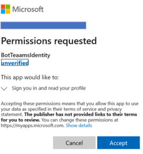

1. Select **Accept**.
1. This should then redirect you to a **Test Connection to \<your-connection-name> Succeeded** page. Refresh the page if you get an error. The following image is an example:

  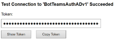

The connection name is used by the bot code to retrieve user authentication tokens.

## Prepare the bot sample code

With the preliminary settings done, let's focus on the creation of the bot to use in this article.

# [C#/.NET](#tab/dotnet)

1. Clone [cs-auth-sample][teams-auth-bot-cs].
1. Launch Visual Studio.
1. From the toolbar select **File -> Open -> Project/Solution** and open the bot project.
1. In C# Update **appsettings.json** as follows:

    - Set `ConnectionName` to the name of the identity provider connection you added to the bot channel registration. The name we used in this example is *BotTeamsAuthADv1*.
    - Set `MicrosoftAppId` to the **bot App ID** you saved at the time of the bot channel registration.
    - Set `MicrosoftAppPassword` to the **customer secret** you saved at the time of the bot channel registration.

    Depending on the characters in your bot secret, you may need to XML escape the password. For example, any ampersands (&) will need to be encoded as `&amp;`.

     [!code-json[appsettings](~/../botbuilder-samples/samples/csharp_dotnetcore/46.teams-auth/appsettings.json?range=1-5)]

1. In the Solution Explorer, navigate to the `TeamsAppManifest` folder, open `manifest.json` and set `id` and `botId` to the **bot App ID** you saved at the time of the bot channel registration.

# [JavaScript](#tab/node-js)

1. Clone [node-auth-sample][teams-auth-bot-js].
1. In a console, navigate to the project: </br></br>
`cd samples/javascript_nodejs/46.teams`  
1. Install modules</br></br>
`npm install`
1. Update the **.env** configuration as follows:

    - Set `MicrosoftAppId` to the **bot App ID** you saved at the time of the bot channel registration.
    - Set `MicrosoftAppPassword` to the **customer secret** you saved at the time of the bot channel registration.
    - Set the `connectionName` to the name of the identity provider connection.
    Depending on the characters in your bot secret, you may need to XML escape the password. For example, any ampersands (&) will need to be encoded as `&amp;`.

     [!code-javascript[settings](~/../botbuilder-samples/samples/javascript_nodejs/46.teams-auth/.env)]

1. In the `teamsAppManifest` folder, open `manifest.json` and set `id`  to your **Microsoft App ID** and `botId` to the **bot App ID** you saved at the time of the bot channel registration.

# [Python](#tab/python)

1. Clone [py-auth-sample][teams-auth-bot-py] from the github repository.
1. Update **config.py**:

    - Set `ConnectionName` to the name of the OAuth connection setting you added to your bot.
    - Set `MicrosoftAppId` and `MicrosoftAppPassword` to your bot's app ID and app secret.

      Depending on the characters in your bot secret, you may need to XML escape the password. For example, any ampersands (&) will need to be encoded as `&amp;`.

      [!code-python[config](~/../botbuilder-samples/samples/python/46.teams-auth/config.py?range=14-16)]

---

### Deploy the bot to Azure

To deploy the bot, follow the steps in the how to [Deploy your bot to Azure](https://aka.ms/azure-bot-deployment-cli).

Alternatively, while in Visual Studio, you can follow these steps:

1. In Visual Studio *Solution Explorer* select and hold (or right-click) the project name.
1. In the drop-down menu, select **Publish**.
1. In the displayed window, select the **New** link.
1. In the dialog window, select **App Service** on the left and **Create New** on the right.
1. Select the **Publish** button.
1. In the next dialog window, enter the required information. The following is an example:

   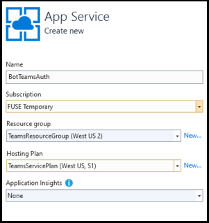

1. Select **Create**.
1. If the deployment completes successfully, you should see it reflected in Visual Studio. Moreover, a page is displayed in your default browser saying *Your bot is ready!*. The URL will be similar to this: `https://botteamsauth.azurewebsites.net/`. Save it to a file.
1. In your browser, navigate to the [**Azure portal**][azure-portal].
1. Check your resource group, the bot should be listed along with the other resources. The following image is an example:

    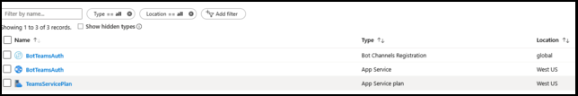

1. In the resource group, select the bot channel registration name (link).
1. In the left panel, select **Settings**.
1. In the **Messaging endpoint** box, enter the URL obtained above followed by `api/messages`. This is an example: `https://botteamsauth.azurewebsites.net/api/messages`.
1. Select the **Save** button in the upper left.

## Test the bot using the Emulator

If you haven't done it already, install the [Microsoft Bot Framework Emulator](https://aka.ms/bot-framework-emulator-readme). See also [Debug with the Emulator](https://aka.ms/bot-framework-emulator-debug-with-emulator).

In order for the bot sample login to work you must configure the Emulator as shown below.

### Configure the Emulator for authentication

If a bot requires authentication, you must configure the Emulator as shown below.

1. Start the Emulator.
1. In the Emulator, select the gear icon &#9881; in the bottom left, or the **Emulator Settings** tab in the upper right.
1. Check the box by **Use version 1.0 authentication tokens**.
1. Enter the local path to the **ngrok** tool. *See* the Bot Framework Emulator / ngrok tunneling integration [Wiki](https://github.com/Microsoft/BotFramework-Emulator/wiki/Tunneling-(ngrok)). For more tool information, see [ngrok](https://ngrok.com/).
1. Check the box by **Run ngrok when the Emulator starts up**.
1. Select the **Save** button.

When the bot displays a sign-in card and the user selects the sign-in button, the Emulator opens a page that the user can use to sign in with the authentication provider.
Once the user does so, the provider generates a user token and sends it to the bot. After that, the bot can act on behalf of the user.

### Test the bot locally

After you have configured the authentication mechanism, you can perform the actual bot testing.  

1. Run the bot sample locally on your machine, via Visual Studio for example.
1. Start the Emulator.
1. Select the **Open bot** button.
1. In the **Bot URL**, enter the bot's local URL. Usually, `http://localhost:3978/api/messages`.
1. In the **Microsoft App ID** enter the bot's app ID from `appsettings.json`.
1. In the **Microsoft App password** enter the bot's app password from the `appsettings.json`.
1. Select **Connect**.
1. After the bot is up and running, enter any text to display the sign-in card.
1. Select the **Sign in** button.
1. A pop-up dialog is displayed to **Confirm Open URL**. This is to allow the bot's user (you) to be authenticated.  
1. Select **Confirm**.
1. If asked, select the applicable user's account.
1. Depending which configuration you used for the Emulator, you get one of the following:
    1. **Using sign-in verification code**  
      &#x2713; A window is opened displaying the validation code.  
      &#x2713; Copy and enter the validation code into the chat box to complete the sign-in.
    1. **Using authentication tokens**.  
      &#x2713; You're logged in based on your credentials.

    The following image is an example of the bot UI after you've logged in:

    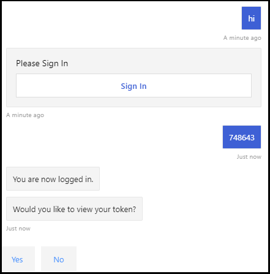

1. If you select **Yes** when the bot asks *Would you like to view your token?*, you'll get a response similar to the following:

    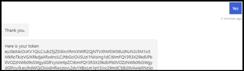

1. Enter **logout** in the input chat box to sign out.
This releases the user token, and the bot won't be able to act on your behalf until you sign in again.

> [!NOTE]
> Bot authentication requires use of the **Bot Connector Service**. The service accesses the bot channels registration information for your bot.

## Test the deployed bot

<!--There are several testing scenarios here. Ideally, we'd have a separate article on the what, why, 
and when for these, and just reference that from here, along with the set of steps that exercises the bot code.-->

1. In your browser, navigate to the [**Azure portal**][azure-portal].
1. Find your resource group.
1. Select the resource link. The resource page is displayed.
1. In the resource page, select **Test in Web Chat**. The bot starts and displays the predefined greetings.
1. Type anything in the chat box.
1. Select the **Sign in** box.
1. A pop-up dialog is displayed to **Confirm Open URL**. This is to allow the bot's user (you) to be authenticated.  
1. Select **Confirm**.
1. If asked, select the applicable user's account.
    The following image is an example of the bot UI after you have logged in:

    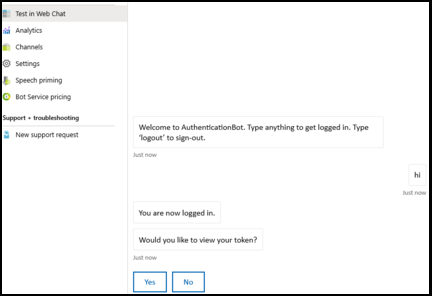.

1. Select the **Yes** button to display your authentication token. The following image is an example:

    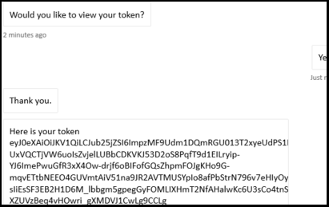.

1. Enter logout to sign out.

    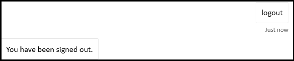

> [!NOTE]
> If you're having problems signing in, try to test the connection again as described in the previous steps. This could recreate the authentication token.
> With the Bot Framework Web Chat client in Azure, you may need to sign in several times before the authentication is established correctly.

## Install and test the bot in Teams

1. In your bot project, ensure that the `TeamsAppManifest` folder contains the `manifest.json` along with an `outline.png` and `color.png` files.
1. In Solution Explorer, navigate to the `TeamsAppManifest` folder. Edit `manifest.json` by assigning the following values:
    1. Ensure that the **bot App ID** you received at the time of the bot channel registration is assigned to `id` and `botId`.
    1. Assign this value: `validDomains: [ "token.botframework.com" ]`.
1. Select and **zip** the `manifest.json`, `outline.png`, and `color.png` files.
1. Open **Microsoft Teams**.
1. In the left panel, at the bottom, select the **Apps icon**.
1. In the right panel, at the bottom, select **Upload a custom app**.
1. Navigate to the `TeamsAppManifest` folder and upload the zipped manifest.
The following wizard is displayed:

    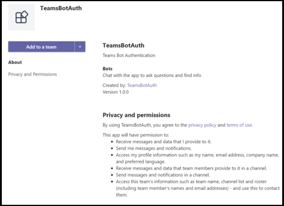

1. Select the **Add to a team** button.
1. In the next window, select the team where you want to use the bot.
1. Select the **Set up a bot** button.
1. Select the three dots (&#x25cf;&#x25cf;&#x25cf;) in the left panel. Then select the **App Studio** icon.
1. Select the **Manifest editor** tab. You should see the icon for the bot you uploaded.
1. Also, you should be able to see the bot listed as a contact in the chat list
that you can use to exchange messages with the bot.

### Testing the bot locally in Teams

Microsoft Teams is an entirely cloud-based product, it requires all services it accesses to be available from the cloud using HTTPS endpoints. Therefore, to enable the bot (our sample) to work in Teams, you need to either publish the code to the cloud of your choice, or make a locally running instance externally accessible via a **tunneling** tool. We recommend  [ngrok](https://ngrok.com/download), which creates an externally addressable URL for a port you open locally on your machine.
To set up ngrok in preparation for running your Microsoft Teams app locally, follow these steps:

1. In a terminal window, go the directory where you have `ngrok.exe` installed. We suggest setting the *environment variable* path to point to it.
1. Run, for example, `ngrok http 3978 --host-header=localhost:3978`. Replace the port number as needed.
This launches ngrok to listen on the port you specify. In return, it gives you an externally addressable URL, valid for as long as ngrok is running. The following image is an example:

    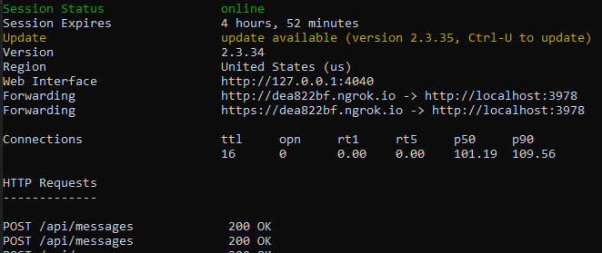.

1. Copy the forwarding HTTPS address. It should be similar to the following: `https://dea822bf.ngrok.io/`.
1. Append `/api/messages` to obtain `https://dea822bf.ngrok.io/api/messages`. This is the **messages endpoint** for the bot running locally on your machine and reachable over the web in a chat in Microsoft Teams.
1. One final step to perform is to update the messages endpoint of the deployed bot. In the example, we deployed the bot in Azure. So **let's perform these steps:
    1. In your browser navigate to the [**Azure portal**][azure-portal].
    1. Select your **Bot Channel Registration**.
    1. In the left panel, select **Settings**.
    1. In the right panel, in the **Messaging endpoint** box, enter the ngrok URL, in our example, `https://dea822bf.ngrok.io/api/messages`.
1. Start your bot locally, for example in Visual Studio debug mode.
1. Test the bot while running locally using the Bot Framework portal's **Test Web chat**. Like the Emulator, this test doesn't allow you to access Teams-specific functionality.
1. In the terminal window where `ngrok` is running you can see HTTP traffic between the bot and the web chat client. If you want a more detailed view, in a browser window enter `http://127.0.0.1:4040` you obtained from the previous terminal window. The following image is an example:

    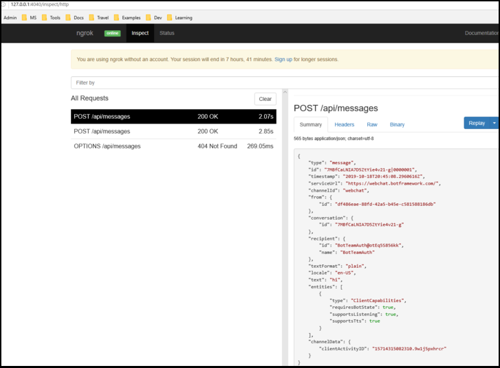.

> [!NOTE]
> If you stop and restart ngrok, the URL changes. To use ngrok in your project, and depending on the capabilities you're using, you must update all URL references.
 

## Additional information

### TeamsAppManifest/manifest.json

This manifest contains information needed by Microsoft Teams to connect with the bot.  

```json
{
  "$schema": "https://developer.microsoft.com/json-schemas/teams/v1.8/MicrosoftTeams.schema.json",
  "manifestVersion": "1.5",
  "version": "1.0.0",
  "id": "",
  "packageName": "com.teams.auth.bot",
  "developer": {
    "name": "TeamsBotAuth",
    "websiteUrl": "https://www.microsoft.com",
    "privacyUrl": "https://www.teams.com/privacy",
    "termsOfUseUrl": "https://www.teams.com/termsofuse"
  },
  "icons": {
    "color": "color.png",
    "outline": "outline.png"
  },
  "name": {
    "short": "TeamsBotAuth",
    "full": "Teams Bot Authentication"
  },
  "description": {
    "short": "TeamsBotAuth",
    "full": "Teams Bot Authentication"
  },
  "accentColor": "#FFFFFF",
  "bots": [
    {
      "botId": "",
      "scopes": [
        "groupchat",
        "team"
      ],
      "supportsFiles": false,
      "isNotificationOnly": false
    }
  ],
  "permissions": [
    "identity",
    "messageTeamMembers"
  ],
  "validDomains": [ "token.botframework.com" ]
}
```

With authentication, Teams behaves slightly differently than other channels, as explained below.

### Handling Invoke Activity

An **Invoke Activity** is sent to the bot rather than the Event Activity used by other channels.
This is done by sub-classing the **ActivityHandler**.

# [C#/.NET](#tab/dotnet-sample)

**Bots/DialogBot.cs**

[!code-csharp[ActivityHandler](~/../botbuilder-samples/samples/csharp_dotnetcore/46.teams-auth/Bots/DialogBot.cs?range=19-51)]

**Bots/TeamsBot.cs**

The *Invoke Activity* must be forwarded to the dialog if the **OAuthPrompt** is used.

[!code-csharp[ActivityHandler](~/../botbuilder-samples/samples/csharp_dotnetcore/46.teams-auth/Bots/TeamsBot.cs?range=34-42)]

#### TeamsActivityHandler.cs

```csharp

protected virtual Task OnInvokeActivityAsync(ITurnContext<IInvokeActivity> turnContext, CancellationToken cancellationToken)
{
    switch (turnContext.Activity.Name)
    {
        case "signin/verifyState":
            return OnSigninVerifyStateAsync(turnContext, cancellationToken);

        default:
            return Task.CompletedTask;
    }
}

protected virtual Task OnSigninVerifyStateAsync(ITurnContext<IInvokeActivity> turnContext, CancellationToken cancellationToken)
{
    return Task.CompletedTask;
}
```

# [JavaScript](#tab/node-js-dialog-sample)

**bots/dialogBot.js**

[!code-javascript[ActivityHandler](~/../botbuilder-samples/samples/javascript_nodejs/46.teams-auth/bots/dialogBot.js?range=4-46)]

**bots/teamsBot.js**

The *Invoke Activity* must be forwarded to the dialog if the **OAuthPrompt** is used.

[!code-javascript[ActivityHandler](~/../botbuilder-samples/samples/javascript_nodejs/46.teams-auth/bots/teamsBot.js?range=4-33)]

**dialogs/mainDialog.js**

Within a dialog step, use `beginDialog` to start the OAuth prompt, which asks the user to sign in.

- If the user is already signed in, this will generate a token response event, without prompting the user.
- Otherwise, this will prompt the user to sign in. The Azure Bot Service sends the token response event after the user attempts to sign in.

[!code-javascript[AddOAuthPrompt](~/../botbuilder-samples/samples/javascript_nodejs/46.teams-auth/dialogs/mainDialog.js?range=50-52)]

Within the following dialog step, check for the presence of a token in the result from the previous step. If it is not null, the user successfully signed in.

[!code-javascript[AddOAuthPrompt](~/../botbuilder-samples/samples/javascript_nodejs/46.teams-auth/dialogs/mainDialog.js?range=50-64)]

**bots/logoutDialog.js**

[!code-javascript[allow-logout](~/../botbuilder-samples/samples/javascript_nodejs/46.teams-auth/dialogs/logoutDialog.js?range=31-42&highlight=7)]

# [Python](#tab/python-sample)

**bots/dialog_bot.py**

[!code-python[ActivityHandler](~/../botbuilder-samples/samples/python/46.teams-auth/bots/dialog_bot.py?range=10-42)]

**bots/teams_bot.py**

The *Invoke Activity* must be forwarded to the dialog if the **OAuthPrompt** is used.

[!code-python[on_token_response_event](~/../botbuilder-samples/samples/python/46.teams-auth/bots/teams_bot.py?range=38-45)]

**dialogs/main_dialog.py**

Within a dialog step, use `begin_dialog` to start the OAuth prompt, which asks the user to sign in.

- If the user is already signed in, this will generate a token response event, without prompting the user.
- Otherwise, this will prompt the user to sign in. The Azure Bot Service sends the token response event after the user attempts to sign in.

[!code-python[Add OAuthPrompt](~/../botbuilder-samples/samples/python/46.teams-auth/dialogs/main_dialog.py?range=48-49)]

Within the following dialog step, check for the presence of a token in the result from the previous step. If it is not null, the user successfully signed in.

[!code-python[Add OAuthPrompt](~/../botbuilder-samples/samples/python/46.teams-auth/dialogs/main_dialog.py?range=51-61)]

**dialogs/logout_dialog.py**

[!code-python[allow logout](~/../botbuilder-samples/samples/python/46.teams-auth/dialogs/logout_dialog.py?range=29-36&highlight=6)]

---

> [!div class="nextstepaction"]
> [Learn about adding authentication via Azure Bot Service](https://aka.ms/azure-bot-add-authentication)

<!-- Footnote-style links -->

[azure-portal]: https://ms.portal.azure.com

[concept-basics]: https://docs.microsoft.com/azure/bot-service/bot-builder-basics?view=azure-bot-service-4.0&preserve-view=true
[concept-state]: https://docs.microsoft.com/azure/bot-service/bot-builder-concept-state?view=azure-bot-service-4.0&preserve-view=true
[concept-dialogs]: https://docs.microsoft.com/azure/bot-service/bot-builder-concept-dialog?view=azure-bot-service-4.0&preserve-view=true
[simple-dialog]: https://docs.microsoft.com/azure/bot-service/bot-builder-dialog-manage-conversation-flow?view=azure-bot-service-4.0&preserve-view=true

[teams-auth-bot-cs]: https://github.com/microsoft/BotBuilder-Samples/tree/master/samples/csharp_dotnetcore/46.teams-auth

[teams-auth-bot-py]: https://github.com/microsoft/BotBuilder-Samples/tree/master/samples/python/46.teams-auth

[teams-auth-bot-js]: https://github.com/microsoft/BotBuilder-Samples/tree/master/samples/javascript_nodejs/46.teams-auth

[azure-aad-blade]: https://ms.portal.azure.com/#blade/Microsoft_AAD_IAM/ActiveDirectoryMenuBlade/Overview
[aad-registration-blade]: https://ms.portal.azure.com/#blade/Microsoft_AAD_IAM/ActiveDirectoryMenuBlade/RegisteredAppsPreview
