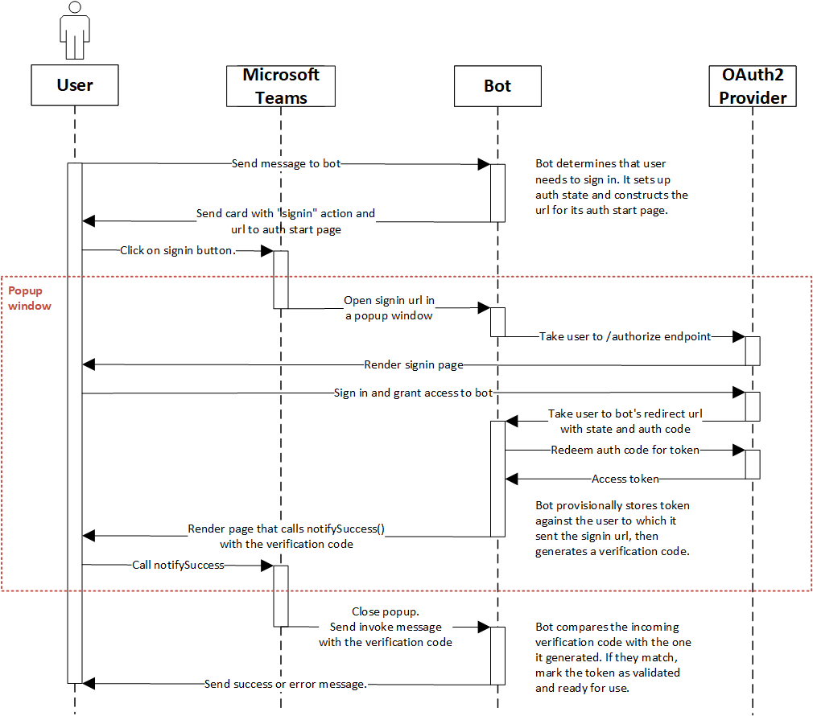

# Single Sign-On support for bots

## Current Oauth story for bots

1. To get a user token, go to [Microsoft Teams authentication flow for bots]( https://docs.microsoft.com/en-us/microsoftteams/platform/bots/how-to/authentication/auth-flow-bot).

>[!NOTE]
> * In this flow the bot developer is sending a sign in card to the user with a sign in URL. 
> * Teams client opens the URL in a popup window where the user signs in and consents to the bot.
> * The bot developer is in charge of handing the exchange of the auth code for a user access token and storing it.

2. To register an AAD application in portal go to [Using Azure bot service for authentication in Teams](https://docs.microsoft.com/en-us/microsoftteams/platform/bots/how-to/authentication/add-authentication?tabs=dotnet%2Cdotnet-sample).

* In this flow the bot developer registeres the AAD application in the portal in the bot connection settings. When the bot requires a token and if the BF does not have a token in storage, it creates  a sign in card and sends it to the user. When the user selects the sign in button, it will prompt to sign in and give consent to the bot.

>[!NOTE]
> The AAD redirect URL is the Token Service endpoint here. When the Token Service receives the authorization code it will exchange it using the stored bot app key and secret key for a user Access Token. Tokens are stored in the Secure Token store and returned to the bot for subsequent requests, until it expires.

>[!Limitations]
> With both these approaches even if the application is a 1st party app or tenant approved application the user still needs to sign in. Moreover, BF is not refreshing the tokens from the Store which means that subsequent sign ins from the user will be needed.

## Single Sign-On (SSO) support for bots

The SSO support for bots is addressing the "multiple sign-in" problem for the users of your application. If a user agrees to use your app, they will not have to consent again on another device and will be signed in automatically.

### 1. How does it work and fit in the SSO support?

The following diagram shows how the SSO process works for bots. The flow is very similar to the [tab SSO] ( https://docs.microsoft.com/en-us/microsoftteams/platform/tabs/how-to/authentication/auth-aad-sso). The only difference is the protocol through which the bot requests for tokens and receives the response.

1. The bot sends a message with an OAuth card that contains the tokenExchangeResource property. It tells Teams to obtain an authentication token for the bot application. The user receives messages at all the active endpoints of the user.

>[!NOTE]
> A user can have more than one active endpoint at a time.

2. If this is the first time the current user has used your bot application, there will be a request prompt to consent (if consent is required) or to handle step-up authentication (such as two-factor authentication).

3. Teams requests the bot application token from the Azure AD endpoint for the current user.

4. Azure AD sends the bot application token to the Teams application.

5. Teams sends the token to the bot as part of the value object returned by the invoke activity with the name signin/tokenExchange.
  [!NOTE]: the token is received from every active endpoint of the user.
  
6. The token will be parsed in the bot application, to extract the needed information, such as the user's email address.
  
### 2. Develop an SSO Microsoft Teams bot
  
The SSO support is currently requiring the app to be installed in personal scope. To develop an SSO Microsoft Teams bot a developer needs to:
1. Create the azure active directory application.
2. Update the Microsoft Teams application manifest.
3. Make the bot code changes to request/receive the bot token.

[!NOTE]: The first two steps are similar to the [tab SSO](https://docs.microsoft.com/en-us/microsoftteams/platform/tabs/how-to/authentication/auth-aad-sso) flow.

#### Create the azure active directory application

This step is similar to the [tab SSO](https://docs.microsoft.com/en-us/microsoftteams/platform/tabs/how-to/authentication/auth-aad-sso) flow. Please follow [Create the azure active directory application]( https://docs.microsoft.com/en-us/microsoftteams/platform/tabs/how-to/authentication/auth-aad-sso#1-create-your-azure-active-directory-azure-ad-application) to create the aad application. At step 5 in the instructions, if you are building only a bot, set the Application ID URI to api://botid-{YourBotId}, if you are using a bot and a tab, set the Application ID URI to api://fully-qualified-domain-name.com/botid-{YourBotId}.
ex: api://subdomain.example.com/botid-00000000-0000-0000-0000-000000000000.

#### Update the Microsoft Teams application manifest

This step is identical to the tab SSO flow. Please follow [Update your Microsoft Teams application manifest]( https://docs.microsoft.com/en-us/microsoftteams/platform/tabs/how-to/authentication/auth-aad-sso#2-update-your-microsoft-teams-application-manifest)

#### Make the bot code changes to request/receive the bot token
To get the bot SSO flow working you could use the bot framework oAuthPrompt or implement the flow without relying on it. Below sections describe both approaches.

##### *SSO without bot framework token store auth support (you don’t need to create an auth connection)*

###### Requesting the token

The request to get the token is a normal post message request (using the existing message schema) which includes in the attachments an oauth card. The schema for the oauth card is defined [here]( https://docs.microsoft.com/en-us/dotnet/api/microsoft.bot.schema.oauthcard?view=botbuilder-dotnet-stable) and it is very similar to a signin card. Teams will treat this request as a silent token acquisition if the TokenExchangeResource property is populated on the card. For Teams channel we honor only the Id property, which uniquely identifies a token request.

If this is the first time the user is using your application and the user consent is required, the user will be shown a dialog to continue with the consent experience similar to the one below. When the user presses Continue, two different things can happen depending if the bot defined or not a sign in button on the oauth card. 

If the bot defined a sign in button, the sign in flow for bots will be triggered similarly to how the sign in works from a card button in a message stream. It is up to the developer to decide which permissions to ask the user to consent. This approach is recommended if you need a token with permissions beyond openId, for example if you want to exchange the token for some graph resources.

If the bot is not providing a sign in button on the card the user consent will be trigger for a minimal set of permissions. This token is useful for basic authentication and getting the user email address.

**C# token request without a sign in button**:

            var attachment = new Attachment
            {
                Content = new OAuthCard
                {
                    TokenExchangeResource = new TokenExchangeResource
                    {
                        Id = requestId
                    }
                },
                ContentType = OAuthCard.ContentType,
            };
            var activity = MessageFactory.Attachment(attachment);

            // NOTE: This activity needs to be sent in the 1:1 conversation between the bot and the user
            // if the bot supports group and channel scope, this code should be updated to send the request to the 1:1 chat
            await turnContext.SendActivityAsync(activity, cancellationToken);

###### Receiving the token

The response with the token is sent through an invoke activity, with the same schema as other invoke activities the bots receive today. The only difference is the invoke name, “signin/tokenExchange” and the value field, which will contain the “id” ( a string) of the initial request to get the token and the “token” field ( a string value including the token). Please note that if the user has multiple active endpoints you might receive multiple responses for a given request. It is up to the bot developer to dedup the responses with the token.

**C# code to respond to handle the invoke activity**:
protected override async Task<InvokeResponse> OnInvokeActivityAsync(ITurnContext<IInvokeActivity> turnContext, CancellationToken cancellationToken)
        {
            try
            {
                if (turnContext.Activity.Name == SignInConstants.TokenExchangeOperationName && turnContext.Activity.ChannelId == Channels.Msteams)
                {
                    await OnTokenResponse(turnContext, cancellationToken);
                    return new InvokeResponse() { Status = 200 };
                }
                else
                {
                    return await base.OnInvokeActivityAsync(turnContext, cancellationToken);
                }
            }
            catch (InvokeResponseException e)
            {
                return e.CreateInvokeResponse();
            }
        }

The turnContext.activity.value is of type [TokenExchangeInvokeRequest](https://docs.microsoft.com/en-us/dotnet/api/microsoft.bot.schema.tokenexchangeinvokerequest?view=botbuilder-dotnet-stable) and contains the token that can be further used by the developer. We recommend to store securely the tokens for performance reasons and refresh them.

###### *SSO with Bot framework token store auth connection support*.

Requirements: BF SDK version >= 4.9.4
Bot framework is abstracting all the sign in flow and token storage through the oAuthPrompt. To setup SSO flow with bot framework, please follow the next steps.

###### Update the azure portal with the oauth connection

1. In the Azure Portal, navigate back to the Bot Channels Registration.

2. Switch to the "Settings" blade and click "Add Setting" under the OAuth Connection Settings section.

3. Fill out the Connection Setting form:

  * Enter a name for your new Connection setting. This will be the name that gets referenced inside the settings of your bot service code in step 5.
  * In the Service Provider dropdown, select Azure Active Directory V2.
  * Enter in the client id and client secret for your AAD application.
  * For the Token Exchange URL use the scope value defined in the previous step of your AAD application. The presence of Token Exchange URL is indicating to the SDK that this AAD application was configured for SSO.
  * Specify "common" as the Tenant ID.
  * Add all the scopes configured when specifying permissions to downstream APIs for your AAD application (using the client id and client secret provided token store will exchange the token for you for a graph token with the defined permissions).
  * Click "Save".

  

###### Update the auth sample

Start with the teams auth sample from [here](https://github.com/microsoft/BotBuilder-Samples/tree/master/samples/csharp_dotnetcore/46.teams-auth)

1. Update the TeamsBot to include the following. To handle the deduping of the incoming request please see the sample “b” below:

   protected override async Task OnSignInInvokeAsync(ITurnContext<IInvokeActivity> turnContext, CancellationToken cancellationToken)
        {
            await Dialog.RunAsync(turnContext, ConversationState.CreateProperty<DialogState>(nameof(DialogState)), cancellationToken);
        }
    protected override async Task OnTokenResponseEventAsync(ITurnContext<IEventActivity> turnContext, CancellationToken cancellationToken)
        {
            await Dialog.RunAsync(turnContext, ConversationState.CreateProperty<DialogState>(nameof(DialogState)), cancellationToken);
        }
  
2. Update the appsettings.json to include the bot id, password and the connection name defined at the previous step.
3. Update the manifest as defined in the section 2.2 and ensure that "token.botframework.com" is in the valid domains section.
4. Zip the manifest with the profile images and install in Teams.

###### Code samples

a. C# sample using the BF SDK: (https://microsoft-my.sharepoint-df.com/:u:/p/vul/ETZQfeTViDlCv-frjgTIincB7dvk2HOnma1TLvcoeGGIxg?e=uPq62c)

b. C# sample using the BF SDK which is using the storage to dedup the token request: (https://microsoft.sharepoint.com/:u:/t/ExtensibilityandFundamentals/Ea36rUGiN1BGt1RiLOb-mY8BGMF8NwPtronYGym0sCGOTw?e=4bB682)

c. C# sample which is not using the BF SDK token store: (https://microsoft-my.sharepoint-df.com/:u:/p/tac/EceKDXrkMn5AuGbh6iGid8ABKEVQ6hkxArxK1y7-M8OVPw)

d. Javascript sample: (https://github.com/ydogandjiev/taskmeow).
