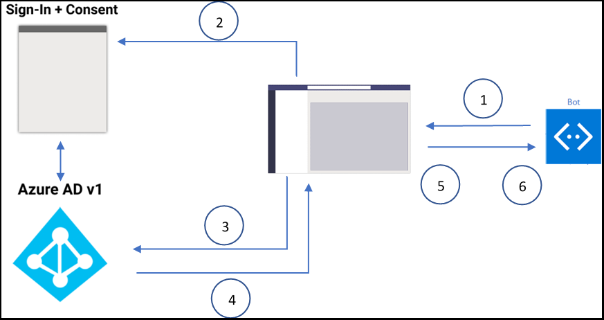
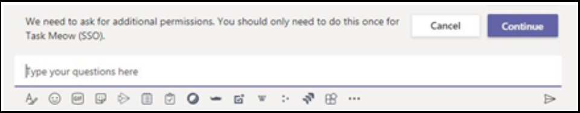
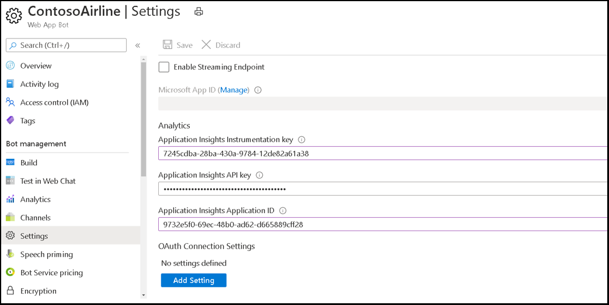
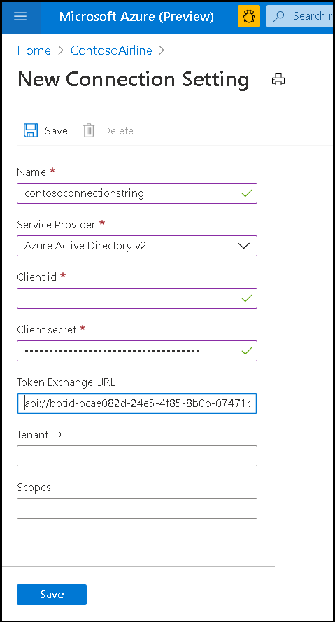

# Single sign-on (SSO) support for bots

Single sign-on authentication in Azure Active Directory (Azure AD) minimizes the number of times users need to enter their login credentials by silently refreshing the authentication token. If users agrees to use your app, they will not have to consent again on another device and will be signed in automatically. The flow is very similar to the [Teams tab SSO support]( ../../../tabs/how-to/authentication/auth-aad-sso.md). The difference is the protocol for how a bot requests tokens and receives responses.

OAuth 2.0 is an open standard for authentication and authorization used by Azure Active Directory (Azure AD) and many other identity providers. A basic understanding of OAuth 2.0 is a prerequisite for working with authentication in Teams.

## Bot SSO at runtime



1. The bot sends a message with an OAuthCard that contains the `tokenExchangeResource` property. It tells Teams to obtain an authentication token for the bot application. The user receives messages at all the active endpoints of the user.

> [!NOTE]
>* A user can have more than one active endpoint at a time.  
>* The bot token is received from every active endpoint of the user.
>* Single sign-on support currently requires the app to be installed in personal scope.

2. If it is the first time the current user has used your bot application, there will be a request prompt to consent (if consent is required) or to handle step-up authentication (such as two-factor authentication).

3. Microsoft Teams requests the bot application token from the Azure AD endpoint for the current user.

4. Azure AD sends the bot application token to the Teams application.

5. Microsoft Teams sends the token to the bot as part of the value object returned by the invoke activity with the name sign-in/tokenExchange.
  
6. The token will be parsed in the bot application to extract the needed information, such as the user's email address.
  
## Develop a Single sign-on Microsoft Teams bot
  
The following steps: are required to develop an SSO Microsoft Teams bot:

1. [Create an Azure free account](#create-an-azure-account)
2. [Update your Teams app manifest](#update-your-app-manifest)
3. [Add the code to request and receive the bot token](#request-a-bot-token)

### Create an Azure account

This step is similar to the [tab SSO flow](../../../tabs/how-to/authentication/auth-aad-sso.md):

1. Get your [Azure AD Application ID](/azure/active-directory/develop/howto-create-service-principal-portal#get-values-for-signing-in) for Teams desktop, Teams web, or Teams mobile client.
2. Specify the permissions that your application needs for the Azure AD endpoint and, optionally, Microsoft Graph.
3. [Grant permissions](/azure/active-directory/develop/howto-create-service-principal-portal#configure-access-policies-on-resources) for Teams desktop, web, and mobile applications.
4. Add a client app by selecting the **Add a scope** button and in the panel that opens, enter `access_as_user` as the **Scope name**.

>[!NOTE]
> The "access_as_user" scope used to add a client app is for "Administrators and users".

> [!IMPORTANT]
> * If you are building a standalone bot, set the Application ID URI to `api://botid-{YourBotId}` Here, **YourBotId** refers your Azure AD application ID.
> * If you are building an app with a bot and a tab, set the Application ID URI to `api://fully-qualified-domain-name.com/botid-{YourBotId}`.

### Update your app manifest

Add new properties to your Microsoft Teams manifest:

**WebApplicationInfo** - The parent of the following elements:

> [!div class="checklist"]
>
> * **id** - The client ID of the application. This is the application ID that you obtained as part of registering the application with Azure AD.
>* **resource** - The domain and subdomain of your application. This is the same URI (including the `api://` protocol) that you registered when creating your `scope` in step 6 above. You shouldn't include the `access_as_user` path in your resource. The domain part of this URI should match the domain, including any subdomains, used in the URLs of your Teams application manifest.

```json
"webApplicationInfo": {
  "id": "00000000-0000-0000-0000-000000000000",
  "resource": "api://subdomain.example.com/00000000-0000-0000-0000-000000000000"
}
```

### Request a bot token

The request to get the token is a normal POST message request (using the existing message schema). It is included in the attachments of an OAuthCard. The schema for the OAuthCard class is defined in [Microsoft Bot Schema 4.0](/dotnet/api/microsoft.bot.schema.oauthcard?view=botbuilder-dotnet-stable&preserve-view=true) and it is very similar to a sign-in card. Teams will treat this request as a silent token acquisition if the `TokenExchangeResource` property is populated on the card. For the Teams channel we honor only the `Id` property, which uniquely identifies a token request.

>[!NOTE]
> The `OAuthPrompt` or the `MultiProviderAuthDialog` for the Bot Framework is supported work for single sign-on (SSO) authentication.

If this is the first time the user is using your application and the user consent is required, the user will be shown a dialog to continue with the consent experience similar to the one below. When the user selects **Continue**, two different things occur depending on whether the bot is defined or not and a sign-in button on the OAuthCard.



If the bot defines a sign-in button, the sign-in flow for bots will be triggered similarly to the sign-in flow from a card button in a message stream. It is up to the developer to decide which permissions to ask for the user to consent. This approach is recommended if you need a token with permissions beyond `openId`, for example, if you want to exchange the token for graph resources.

If the bot is not providing a sign-in button on the card, it triggers user consent for a minimal set of permissions. This token is useful for basic authentication and getting the user email address.

**C# token request without a sign-in button**:

```csharp
var attachment = new Attachment
            {
                Content = new OAuthCard
                {
                    TokenExchangeResource = new TokenExchangeResource
                    {
                        Id = requestId
                    }
                },
                ContentType = OAuthCard.ContentType,
            };
            var activity = MessageFactory.Attachment(attachment);

            // NOTE: This activity needs to be sent in the 1:1 conversation between the bot and the user. 
            // If the bot supports group and channel scope, this code should be updated to send the request to the 1:1 chat. 

   await turnContext.SendActivityAsync(activity, cancellationToken);
```

#### Receiving the token

The response with the token is sent through an invoke activity with the same schema as others invoke activities the bots receive today. The only difference is the invoke name, **sign-in/tokenExchange** and the **value** field which will contain the **Id** (a string) of the initial request to get the token and the **token** field (a string value including the token). Please note that you might receive multiple responses for a given request if the user has multiple active endpoints. It is up to you to deduplicate the responses with the token.

**C# code to respond to handle the invoke activity**:

```csharp
protected override async Task<InvokeResponse> OnInvokeActivityAsync
  (ITurnContext<IInvokeActivity> turnContext, CancellationToken cancellationToken)
        {
            try
            {
                if (turnContext.Activity.Name == SignInConstants.TokenExchangeOperationName && turnContext.Activity.ChannelId == Channels.Msteams)
                {
                    await OnTokenResponseEventAsync(turnContext, cancellationToken);
                    return new InvokeResponse() { Status = 200 };
                }
                else
                {
                    return await base.OnInvokeActivityAsync(turnContext, cancellationToken);
                }
            }
            catch (InvokeResponseException e)
            {
                return e.CreateInvokeResponse();
            }
        }
```

The `turnContext.activity.value` is of type [TokenExchangeInvokeRequest](/dotnet/api/microsoft.bot.schema.tokenexchangeinvokerequest?view=botbuilder-dotnet-stable&preserve-view=true) and contains the token that can be further used by your bot. Store the tokens securely for performance reasons and refresh them.

### Update the Azure portal with the OAuth connection

1. In the Azure Portal, navigate back to the **Bot Channels Registration**.

2. Switch to the **Settings** blade and choose **Add Setting** under the OAuth Connection Settings section.



3. Complete the **Connection Setting** form:

> [!div class="checklist"]
>
> * Enter a name for your new Connection Setting. This will be the name that gets referenced inside the settings of your bot service code in **step 5**.
> * In the Service Provider dropdown, select **Azure Active Directory V2**.
>* Enter the client credentials for the AAD application.

>[!NOTE]
> **Implicit grant** may be required in the AAD application.

>* For the Token Exchange URL, use the scope value defined in the previous step of your AAD application. The presence of the Token Exchange URL is indicating to the SDK that this AAD application is configured for SSO.
>* Specify "common" as the **Tenant ID**.
>* Add all the scopes configured when specifying permissions to downstream APIs for your AAD application. With the client id and client secret provided, token store will exchange the token for a graph token with defined permissions for you.
>* Select **Save**.



### Update the auth sample

Start with the [teams auth sample](https://github.com/microsoft/BotBuilder-Samples/tree/master/samples/csharp_dotnetcore/46.teams-auth).

1. Update the TeamsBot to include the following. To handle the deduping of the incoming request, see below:

```csharp
 protected override async Task OnSignInInvokeAsync(ITurnContext<IInvokeActivity> turnContext, CancellationToken cancellationToken)
        {
            await Dialog.RunAsync(turnContext, ConversationState.CreateProperty<DialogState>(nameof(DialogState)), cancellationToken);
        }
    protected override async Task OnTokenResponseEventAsync(ITurnContext<IEventActivity> turnContext, CancellationToken cancellationToken)
        {
            await Dialog.RunAsync(turnContext, ConversationState.CreateProperty<DialogState>(nameof(DialogState)), cancellationToken);
        }
```
  
2. Update the `appsettings.json` to include the `botId`, password, and the connection name defined above.
3. Update the manifest and ensure that `token.botframework.com` is in the valid domains section.
4. Zip the manifest with the profile images and install it in Teams.

#### Additional code samples

* [C# sample using the Bot Framework SDK](https://microsoft-my.sharepoint-df.com/:u:/p/vul/ETZQfeTViDlCv-frjgTIincB7dvk2HOnma1TLvcoeGGIxg?e=uPq62c).

* [C# sample using the Bot Framework SDK to deduplicate the token request](https://microsoft.sharepoint.com/:u:/t/ExtensibilityandFundamentals/Ea36rUGiN1BGt1RiLOb-mY8BGMF8NwPtronYGym0sCGOTw?e=4bB682).

* [C# sample without using the Bot Framework SDK token store](https://microsoft-my.sharepoint-df.com/:u:/p/tac/EceKDXrkMn5AuGbh6iGid8ABKEVQ6hkxArxK1y7-M8OVPw)
