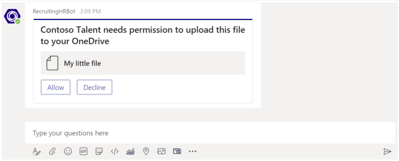
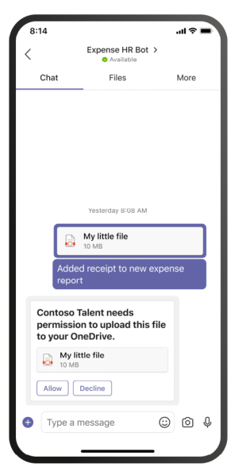
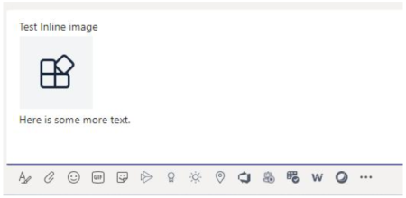

# Send and receive files through the bot

> [!IMPORTANT]
> The articles in this document are based on the v4 Bot Framework SDK.

There are two ways to send files to and receive files from a bot:

* [**Use the Microsoft Graph APIs:**](#use-the-graph-apis) This method works for bots in all Microsoft Teams scopes:
  * `personal`
  * `channel`
  * `groupchat`

* [**Use the Teams bot APIs:**](#use-the-teams-bot-apis) These only support files in `personal` context.

## Use the Graph APIs

Post messages with card attachments that refer to existing SharePoint files, using the Graph APIs for [OneDrive and SharePoint](/onedrive/developer/rest-api/). To use the Graph APIs, obtain access to either of the following through the standard OAuth 2.0 authorization flow:

* A user's OneDrive folder for `personal` and `groupchat` files.
* The files in a team's channel for `channel` files.

Graph APIs work in all Teams scopes.

Alternately, you can send files to and receive files from a bot using the Teams bot APIs.

## Use the Teams bot APIs

> [!NOTE]
> Teams bot APIs work only in the `personal` context. They do not work in the `channel` or `groupchat` context.

Using Teams APIs, the bot can directly send and receive files with users in the `personal` context, also known as personal chats. Implement features, such as expense reporting, image recognition, file archival, and e-signatures involving the editing of file content. Files shared in Teams typically appear as cards and allow rich in-app viewing.

The next sections describe how to send file content as a direct user interaction, like sending a message. This API is provided as part of the Teams bot platform.

### Configure the bot to support files

To send and receive files in the bot, set the `supportsFiles` property in the manifest to `true`. This property is described in the [bots](~/resources/schema/manifest-schema.md#bots) section of the Manifest reference.

The definition looks like this, `"supportsFiles": true`. If the bot does not enable `supportsFiles`, the features listed in this section do not work.

### Receive files in personal chat

When a user sends a file to the bot, the file is first uploaded to the user's OneDrive for business storage. The bot then receives a message activity notifying the user about the user upload. The activity contains file metadata, such as its name and the content URL. The user can directly read from this URL to fetch its binary content.

#### Message activity with file attachment example

The following code shows an example of message activity with file attachment:

```json
{
  "attachments": [{
    "contentType": "application/vnd.microsoft.teams.file.download.info",
    "contentUrl": "https://contoso.sharepoint.com/personal/johnadams_contoso_com/Documents/Applications/file_example.txt",
    "name": "file_example.txt",
    "content": {
      "downloadUrl" : "https://download.link",
      "uniqueId": "1150D938-8870-4044-9F2C-5BBDEBA70C9D",
      "fileType": "txt",
      "etag": "123"
    }
  }]
}
```

The following table describes the content properties of the attachment:

| Property | Purpose |
| --- | --- |
| `downloadUrl` | OneDrive URL for fetching the content of the file. The user can issue an `HTTP GET` directly from this URL. |
| `uniqueId` | Unique file ID. This is the OneDrive drive item ID, in case the user sends a file to the bot. |
| `fileType` | Type of file, such as .pdf or .docx. |

As a best practice, acknowledge the file upload by sending a message back to the user.

### Upload files to personal chat

**To upload a file to a user**

1. Send a message to the user requesting permission to write the file. This message must contain a `FileConsentCard` attachment with the name of the file to be uploaded.
2. If the user accepts the file download, the bot receives an invoke activity with a location URL.
3. To transfer the file, the bot performs an `HTTP POST` directly into the provided location URL.
4. Optionally, remove the original consent card if you do not want the user to accept further uploads of the same file.

#### Message requesting permission to upload

The following desktop message contains a simple attachment object requesting user permission to upload the file:



The following mobile message contains an attachment object requesting user permission to upload the file:



```json
{
  "attachments": [{
    "contentType": "application/vnd.microsoft.teams.card.file.consent",
    "name": "file_example.txt",
    "content": {
      "description": "<Purpose of the file, such as: this is your monthly expense report>",
      "sizeInBytes": 1029393,
      "acceptContext": {
      },
      "declineContext": {
      }
    }
  }]
}
```

The following table describes the content properties of the attachment:

| Property | Purpose |
| --- | --- |
| `description` | Describes the purpose of the file or summarizes its content. |
| `sizeInBytes` | Provides the user an estimate of the file size and the amount of space it takes in OneDrive. |
| `acceptContext` | Additional context that is silently transmitted to the bot when the user accepts the file. |
| `declineContext` | Additional context that is silently transmitted to the bot when the user declines the file. |

#### Invoke activity when the user accepts the file

An invoke activity is sent to the bot if and when the user accepts the file. It contains the OneDrive for Business placeholder URL that the bot can then issue a `PUT` to transfer the file contents. For information on uploading to the OneDrive URL, see [upload bytes to the upload session](/onedrive/developer/rest-api/api/driveitem_createuploadsession#upload-bytes-to-the-upload-session).

The following code shows an example of a concise version of the invoke activity that the bot receives:

```json
{
  "name": "fileConsent/invoke",
  "value": {
    "type": "fileUpload",
    "action": "accept",
    "context": {
    },
    "uploadInfo": {
      "contentUrl": "https://contoso.sharepoint.com/personal/johnadams_contoso_com/Documents/Applications/file_example.txt",
      "name": "file_example.txt",
      "uploadUrl": "https://upload.link",
      "uniqueId": "1150D938-8870-4044-9F2C-5BBDEBA70C8C",
      "fileType": "txt",
      "etag": "123"
    }
  }
}
```

Similarly, if the user declines the file, the bot receives the following event with the same overall activity name:

```json
{
  "name": "fileConsent/invoke",
  "value": {
    "type": "fileUpload",
    "action": "decline",
    "context": {
    }
  }
}
```

### Notifying the user about an uploaded file

After uploading a file to the user's OneDrive, send a confirmation message to the user. The message must contain the following `FileCard` attachment that the user can select, either to preview or open it in OneDrive, or download locally:

```json
{
  "attachments": [{
    "contentType": "application/vnd.microsoft.teams.card.file.info",
    "contentUrl": "https://contoso.sharepoint.com/personal/johnadams_contoso_com/Documents/Applications/file_example.txt",
    "name": "file_example.txt",
    "content": {
      "uniqueId": "1150D938-8870-4044-9F2C-5BBDEBA70C8C",
      "fileType": "txt",
    }
  }]
}
```

The following table describes the content properties of the attachment:

| Property | Purpose |
| --- | --- |
| `uniqueId` | OneDrive or SharePoint drive item ID. |
| `fileType` | Type of file, such as .pdf or .docx. |

### Fetch inline images from message

Fetch inline images that are part of the message using the Bot's access token.



The following code shows an example of fetching inline images from message:

```csharp
private async Task ProcessInlineImage(ITurnContext<IMessageActivity> turnContext, CancellationToken cancellationToken)
{​​​​​
    var attachment = turnContext.Activity.Attachments[0];
    var client = _clientFactory.CreateClient();
    // Get Bot's access token to fetch inline image. 
    var token = await new MicrosoftAppCredentials(microsoftAppId, microsoftAppPassword).GetTokenAsync();
    client.DefaultRequestHeaders.Authorization = new AuthenticationHeaderValue("Bearer", token);
    var responseMessage = await client.GetAsync(attachment.ContentUrl);
    // Save the inline image to Files directory.
    var filePath = Path.Combine("Files", "ImageFromUser.png");
    using (var fileStream = new FileStream(filePath, FileMode.Create, FileAccess.Write, FileShare.None))
    {​​​​​
        await responseMessage.Content.CopyToAsync(fileStream);
    }​​​​​
    // Create reply with image.
    var reply = MessageFactory.Text($"Attachment of {​​​​​attachment.ContentType}​​​​​ type and size of {​​​​​responseMessage.Content.Headers.ContentLength}​​​​​ bytes received.");
    reply.Attachments = new List<Attachment>() {​​​​​ 
        GetInlineAttachment() 
    }​​​​​;
    await turnContext.SendActivityAsync(reply, cancellationToken);
}​​​​​
private static Attachment GetInlineAttachment()
{​​​​​
    var imagePath = Path.Combine("Files", "ImageFromUser.png");
    var imageData = Convert.ToBase64String(File.ReadAllBytes(imagePath));
    return new Attachment
    {​​​​​
        Name = @"ImageFromUser.png",
        ContentType = "image/png",
        ContentUrl = $"data:image/png;base64,{​​​​​imageData}​​​​​",
    }​​​​​;
}​​​​​
```

### Basic example in C#

The following code shows an example of how to handle file uploads and send file consent requests in the bot's dialog:

```csharp

protected override async Task OnMessageActivityAsync(ITurnContext<IMessageActivity> turnContext, CancellationToken cancellationToken)
{
    if (turnContext.Activity.Attachments?[0].ContentType.Contains("image/*") == true)
    {
        // Inline image.
        await ProcessInlineImage(turnContext, cancellationToken);
    }
    else
    {
        string filename = "teams-logo.png";
        string filePath = Path.Combine("Files", filename);
        long fileSize = new FileInfo(filePath).Length;
        await SendFileCardAsync(turnContext, filename, fileSize, cancellationToken);
    }
}
private async Task ProcessInlineImage(ITurnContext<IMessageActivity> turnContext, CancellationToken cancellationToken)
{
    var attachment = turnContext.Activity.Attachments[0];
    var client = _clientFactory.CreateClient();
    // Get Bot's access token to fetch inline image. 
    var token = await new MicrosoftAppCredentials(microsoftAppId, microsoftAppPassword).GetTokenAsync();
    client.DefaultRequestHeaders.Authorization = new AuthenticationHeaderValue("Bearer", token);
    var responseMessage = await client.GetAsync(attachment.ContentUrl);
    // Save the inline image to Files directory.
    var filePath = Path.Combine("Files", "ImageFromUser.png");
    using (var fileStream = new FileStream(filePath, FileMode.Create, FileAccess.Write, FileShare.None))
    {
        await responseMessage.Content.CopyToAsync(fileStream);
    }
    // Create reply with image.
    var reply = MessageFactory.Text($"Attachment of {attachment.ContentType} type and size of {responseMessage.Content.Headers.ContentLength} bytes received.");
    reply.Attachments = new List<Attachment>() { GetInlineAttachment() };
    await turnContext.SendActivityAsync(reply, cancellationToken);
}
private static Attachment GetInlineAttachment()
{
    var imagePath = Path.Combine("Files", "ImageFromUser.png");
    var imageData = Convert.ToBase64String(File.ReadAllBytes(imagePath));
    return new Attachment
    {
        Name = @"ImageFromUser.png",
        ContentType = "image/png",
        ContentUrl = $"data:image/png;base64,{imageData}",
    };
}
private async Task SendFileCardAsync(ITurnContext turnContext, string filename, long filesize, CancellationToken cancellationToken)
{
    var consentContext = new Dictionary<string, string>
    {
        { 
            "filename", filename 
        },
    };
    var fileCard = new FileConsentCard
    {
        Description = "This is the file I want to send you",
        SizeInBytes = filesize,
        AcceptContext = consentContext,
        DeclineContext = consentContext,
    };
    var asAttachment = new Attachment
    {
        Content = fileCard,
        ContentType = FileConsentCard.ContentType,
        Name = filename,
    };
    var replyActivity = turnContext.Activity.CreateReply();
    replyActivity.Attachments = new List<Attachment>() { asAttachment };
    await turnContext.SendActivityAsync(replyActivity, cancellationToken);
}
```

### Code sample

The following code sample demonstrates how to obtain file consent and upload files to Teams from a bot:

|Sample name | Description | .NETCore | Javascript | Python |
|----------------|-----------------|--------------|----------------|-----------|
| File upload | Demonstrates how to obtain file consent and upload files to Teams from a bot. Also, how to receive a file sent to a bot. | [View](https://github.com/microsoft/BotBuilder-Samples/blob/main/samples/csharp_dotnetcore/56.teams-file-upload) | [View](https://github.com/microsoft/BotBuilder-Samples/blob/main/samples/javascript_nodejs/56.teams-file-upload) | [View](https://github.com/microsoft/BotBuilder-Samples/blob/main/samples/python/56.teams-file-upload) |

## Next step

> [!div class="nextstepaction"]
> [Optimize your bot with rate limiting in Teams](~/bots/how-to/rate-limit.md)
