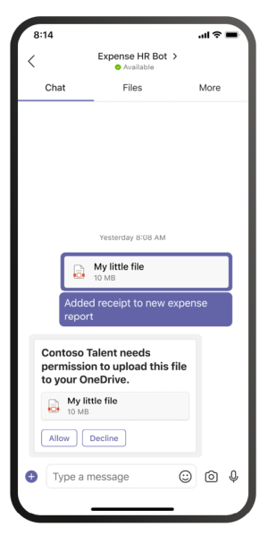

# Send and receive files

> [!IMPORTANT]
>
> * This article is based on the [Teams SDK (Teams AI Library)](~/teams-sdk/why.md).
> * Bots don't support sending and receiving files in Government Community Cloud High (GCC High), Department of Defense (DoD), and Teams operated by 21Vianet environments.

There are two ways to send files to and receive files:

* [**Use the Microsoft Graph APIs:**](#use-the-graph-apis) This method works in all Microsoft Teams scopes:
  * `personal`
  * `channel`
  * `groupchat`

* [**Use the Teams SDK file consent APIs:**](#use-the-teams-bot-apis) These only support files in `personal` context.

The following video demonstrates how a bot simplifies the process of sending and receiving files with ease and efficiency:

<br>

> [!VIDEO https://www.youtube.com/embed/8RWctZ2XPqg]

## Use the Graph APIs

Post messages with card attachments that refer to existing SharePoint files, using the Graph APIs for [OneDrive and SharePoint](/onedrive/developer/rest-api/). To use the Graph APIs, obtain access to either of the following through the standard OAuth 2.0 authorization flow:

* A user's OneDrive folder for `personal` and `groupchat` files.
* The files in a team's channel for `channel` files.

Graph APIs work in all Teams scopes. For more information, see [send chat message file attachments](/graph/api/chatmessage-post?view=graph-rest-beta&preserve-view=true&tabs=http#example-4-file-attachments).

Alternately, you can send files to and receive files from a bot using the Teams SDK file consent APIs.

## Use the Teams bot APIs

Teams SDK file consent APIs work only in the `personal` context. They don't work in the `channel` or `groupchat` context.

Using the Teams SDK, the bot can directly send and receive files with users in the `personal` context, also known as personal chats. Implement features, such as expense reporting, image recognition, file archival, and e-signatures involving the editing of file content. Files shared in Teams typically appear as cards and allow rich in-app viewing.

The next sections describe how to send file content as direct user interaction, like sending a message. The Teams SDK provides activity routes for handling file consent workflows, including `file.consent.accept` and `file.consent.decline`.

### Configure the bot to support files

To send and receive files in the bot, set the `supportsFiles` property in the manifest to `true`. This property is described in the [bots](/microsoft-365/extensibility/schema/root-bots#supportsfiles) section of the manifest reference.

The definition looks like this, `"supportsFiles": true`. If the bot does not enable `supportsFiles`, the features listed in this section do not work.

### Receive files in personal chat

When a user sends a file to the bot, the file is first uploaded to the user's OneDrive for business storage. The bot then receives a message activity notifying the user about the user upload. The activity contains file metadata, such as its name and the content URL. The user can directly read from this URL to fetch its binary content.

#### Message activity with file attachment example

The following code shows an example of message activity with file attachment:

```json
{
  "attachments": [{
    "contentType": "application/vnd.microsoft.teams.file.download.info",
    "contentUrl": "https://contoso.sharepoint.com/personal/johnadams_contoso_com/Documents/Applications/file_example.txt",
    "name": "file_example.txt",
    "content": {
      "downloadUrl" : "https://download.link",
      "uniqueId": "1150D938-8870-4044-9F2C-5BBDEBA70C9D",
      "fileType": "txt",
      "etag": "123"
    }
  }]
}
```

The following table describes the content properties of the attachment:

| Property | Purpose |
| --- | --- |
| `downloadUrl` | OneDrive URL for fetching the content of the file. The user can issue an `HTTP GET` directly from this URL. |
| `uniqueId` | Unique file ID. This is the OneDrive drive item ID, in case the user sends a file to the bot. |
| `fileType` | Type of file, such as .pdf or .docx. |

As a best practice, acknowledge the file upload by sending a message back to the user.

### Upload files to personal chat

To upload a file to a user:

1. Send a message to the user requesting permission to write the file. This message must contain a `FileConsentCard` attachment with the name of the file to be uploaded.
2. If the user accepts the file download, the bot receives an invoke activity with a location URL.
3. To transfer the file, the bot performs an `HTTP POST` directly into the provided location URL.
4. Optionally, remove the original consent card if you do not want the user to accept further uploads of the same file.

#### Message requesting permission to upload

The following desktop message contains a simple attachment object requesting user permission to upload the file:

:::image type="content" source="../../assets/images/bots/bot-file-consent-card.png" alt-text="Consent card requesting user permission to upload file"lightbox="../../assets/images/bots/bot-file-consent-card.png"border="true":::

The following mobile message contains an attachment object requesting user permission to upload the file:



```json
{
  "attachments": [{
    "contentType": "application/vnd.microsoft.teams.card.file.consent",
    "name": "file_example.txt",
    "content": {
      "description": "<Purpose of the file, such as: this is your monthly expense report>",
      "sizeInBytes": 1029393,
      "acceptContext": {
      },
      "declineContext": {
      }
    }
  }]
}
```

The following table describes the content properties of the attachment:

| Property | Purpose |
| --- | --- |
| `description` | Describes the purpose of the file or summarizes its content. |
| `sizeInBytes` | Provides the user an estimate of the file size and the amount of space it takes in OneDrive. |
| `acceptContext` | Additional context that is silently transmitted to the bot when the user accepts the file. |
| `declineContext` | Additional context that is silently transmitted to the bot when the user declines the file. |

#### Invoke activity when the user accepts the file

An invoke activity is sent to the bot when a user accepts the file. It contains the OneDrive for Business placeholder URL that the bot can then issue a `PUT` to transfer the file contents. For information on uploading to the OneDrive URL, see [upload bytes to the upload session](/onedrive/developer/rest-api/api/driveitem_createuploadsession#upload-bytes-to-the-upload-session).

The following code shows an example of a concise version of the invoke activity that the bot receives:

```json
{
  "name": "fileConsent/invoke",
  "value": {
    "type": "fileUpload",
    "action": "accept",
    "context": {
    },
    "uploadInfo": {
      "contentUrl": "https://contoso.sharepoint.com/personal/johnadams_contoso_com/Documents/Applications/file_example.txt",
      "name": "file_example.txt",
      "uploadUrl": "https://upload.link",
      "uniqueId": "1150D938-8870-4044-9F2C-5BBDEBA70C8C",
      "fileType": "txt",
      "etag": "123"
    }
  }
}
```

Similarly, if the user declines the file, the bot receives the following event with the same overall activity name:

```json
{
  "name": "fileConsent/invoke",
  "value": {
    "type": "fileUpload",
    "action": "decline",
    "context": {
    }
  }
}
```

### Notifying the user about an uploaded file

After uploading a file to the user's OneDrive, send a confirmation message to the user. The message must contain the following `FileCard` attachment that the user can select, either to preview or open it in OneDrive, or download locally:

```json
{
  "attachments": [{
    "contentType": "application/vnd.microsoft.teams.card.file.info",
    "contentUrl": "https://contoso.sharepoint.com/personal/johnadams_contoso_com/Documents/Applications/file_example.txt",
    "name": "file_example.txt",
    "content": {
      "uniqueId": "1150D938-8870-4044-9F2C-5BBDEBA70C8C",
      "fileType": "txt",
    }
  }]
}
```

The following table describes the content properties of the attachment:

| Property | Purpose |
| --- | --- |
| `uniqueId` | OneDrive or SharePoint drive item ID. |
| `fileType` | Type of file, such as .pdf or .docx. |

### Fetch inline images from message

Fetch inline images that are part of the message using the `OnMessage` handler. The Teams SDK handles authentication automatically, so you can access attachment content URLs directly from the activity context.

:::image type="content" source="../../assets/images/bots/inline-image.png" alt-text="Inline image"border="true":::

The following code shows an example of fetching inline images from a message:

# [C#](#tab/csharp1)

```csharp
using Microsoft.Teams.Api;
using Microsoft.Teams.Apps;
using Microsoft.Teams.Plugins.AspNetCore.Extensions;

var builder = WebApplication.CreateBuilder(args);
builder.AddTeams();
var app = builder.Build();
var teams = app.UseTeams();

teams.OnMessage(async (context, cancellationToken) =>
{
    var attachment = context.Activity.Attachments?[0];
    if (attachment != null && attachment.ContentType.Contains("image"))
    {
        // Download the inline image from the content URL.
        var client = new HttpClient();
        var responseMessage = await client.GetAsync(attachment.ContentUrl);

        // Save the inline image to Files directory.
        var filePath = Path.Combine("Files", "ImageFromUser.png");
        using (var fileStream = new FileStream(filePath, FileMode.Create, FileAccess.Write, FileShare.None))
        {
            await responseMessage.Content.CopyToAsync(fileStream);
        }

        // Create reply with the received image.
        var imageData = Convert.ToBase64String(File.ReadAllBytes(filePath));
        var reply = new MessageActivity(
            $"Attachment of {attachment.ContentType} type and size of {responseMessage.Content.Headers.ContentLength} bytes received.");
        reply.AddAttachment(new Attachment
        {
            Name = "ImageFromUser.png",
            ContentType = "image/png",
            ContentUrl = $"data:image/png;base64,{imageData}",
        });
        await context.SendAsync(reply, cancellationToken);
    }
});

app.Run();
```

# [Python](#tab/Python1)

```python
import httpx
from microsoft_teams.api import Attachment, MessageActivity, MessageActivityInput
from microsoft_teams.apps import ActivityContext, App

app = App()

@app.on_message
async def on_message(context: ActivityContext[MessageActivity]):
    attachment = context.activity.attachments[0] if context.activity.attachments else None
    if attachment and "image" in attachment.content_type:
        # Download the inline image from the content URL.
        async with httpx.AsyncClient() as client:
            response = await client.get(attachment.content_url)
            file_path = "files/ImageFromUser.png"
            with open(file_path, "wb") as f:
                f.write(response.content)

        await context.send(
            f"Attachment of {attachment.content_type} type and size of "
            f"{len(response.content)} bytes received."
        )
```

# [TypeScript](#tab/typescript1)

```typescript
import { App } from '@microsoft/teams.apps';
import { MessageActivity } from '@microsoft/teams.api';
import * as fs from 'fs';

const app = new App();

app.on('message', async ({ activity, send }) => {
  const attachment = activity.attachments?.[0];
  if (attachment && attachment.contentType?.includes('image')) {
    // Download the inline image from the content URL.
    const response = await fetch(attachment.contentUrl!);
    const buffer = Buffer.from(await response.arrayBuffer());

    // Save the inline image to Files directory.
    fs.writeFileSync('files/ImageFromUser.png', buffer);

    await send(
      `Attachment of ${attachment.contentType} type and size of ${buffer.length} bytes received.`
    );
  }
});
```

---

### Basic example

The following example shows how to handle the complete file consent workflow, including sending consent cards, handling accepted and declined responses, and uploading files to OneDrive.

## Send File Consent Card

The following code sends a file consent card to the user, requesting permission to upload the received file to their OneDrive:

# [C#](#tab/csharp2)

```csharp
async Task SendFileConsentCard<T>(IContext<T> context, string fileName, string fileId, int fileSize)
    where T : IActivity
{
    var consentContext = new { filename = fileName, file_id = fileId };

    var fileCard = new FileConsentCard
    {
        Description = "This is the file I want to send you",
        SizeInBytes = fileSize,
        AcceptContext = consentContext,
        DeclineContext = consentContext
    };

    var message = new MessageActivity
    {
        Attachments =
        [
            new Attachment
            {
                Content = fileCard,
                ContentType = new ContentType(ContentTypeFileConsent),
                Name = fileName
            }
        ]
    };
    await context.Send(message);
}
```

# [TypeScript](#tab/typescript2)

```typescript
async function sendFileConsentCard(context: any, filename: string, fileId: string): Promise<void> {
  const consentContext = { filename: filename, file_id: fileId };
  await context.send({
    type: 'message',
    attachments: [{
      content: {
        description: 'This is the file I want to send you',
        sizeInBytes: pendingUploads.get(fileId)!.length,
        acceptContext: consentContext,
        declineContext: consentContext
      },
      contentType: CONTENT_TYPE_FILE_CONSENT,
      name: filename
    }]
  });
}
```

# [Python](#tab/python2)

```python
async def _send_file_consent_card(ctx: ActivityContext, filename: str, file_id: str) -> None:
    consent_context = {"filename": filename, "file_id": file_id}
    await ctx.send(MessageActivityInput(attachments=[Attachment(
        content=FileConsentCard(
            description="This is the file I want to send you",
            size_in_bytes=len(pending_uploads[file_id]),
            accept_context=consent_context,
            decline_context=consent_context,
        ),
        content_type=CONTENT_TYPE_FILE_CONSENT,
        name=filename,
    )]))
```

---

## Handle File Upload

The following code performs the actual file upload after the user accepts the consent card, uploads the content to OneDrive, and sends a success message with a file info attachment. In C#, this logic is inline within the `OnFileConsent` handler shown above:

# [TypeScript](#tab/typescript3)

```typescript
async function handleFileUpload(context: any, uploadInfo: FileUploadInfo, fileId: string): Promise<void> {
  try {
    const content = pendingUploads.get(fileId)!;
    pendingUploads.delete(fileId);
    await uploadToOnedrive(uploadInfo.uploadUrl!, content);
    await context.send({
      type: 'message',
      text: `<b>${uploadInfo.name}</b> has been successfully uploaded.`,
      attachments: [{
        content: {
          uniqueId: uploadInfo.uniqueId,
          fileType: uploadInfo.fileType
        },
        contentType: CONTENT_TYPE_FILE_INFO,
        name: uploadInfo.name,
        contentUrl: uploadInfo.contentUrl
      }]
    });
  } catch (e: any) {
    pendingUploads.delete(fileId);
    console.log(`File upload failed: ${e}`);
  }
}

async function uploadToOnedrive(url: string, content: Buffer): Promise<void> {
  const fileSize = content.length;
  const response = await axios.put(url, content, {
    headers: {
      'Content-Type': 'application/octet-stream',
      'Content-Length': fileSize.toString(),
      'Content-Range': `bytes 0-${fileSize - 1}/${fileSize}`
    }
  });
  if (![200, 201].includes(response.status)) {
    throw new Error(`Upload failed with status ${response.status}`);
  }
}
```

# [Python](#tab/Python3)

```python
async def _handle_file_upload(ctx: ActivityContext, upload_info: FileUploadInfo, file_id: str) -> None:
    try:
        content = pending_uploads.pop(file_id)
        await _upload_to_onedrive(upload_info.upload_url, content)
        await ctx.send(MessageActivityInput(
            text=f"<b>{upload_info.name}</b> has been successfully uploaded.",
            attachments=[Attachment(
                content=FileInfoCard(
                    unique_id=upload_info.unique_id,
                    file_type=upload_info.file_type,
                ),
                content_type=CONTENT_TYPE_FILE_INFO,
                name=upload_info.name,
                content_url=upload_info.content_url,
            )],
        ))
    except Exception as e:
        pending_uploads.pop(file_id, None)
        print(f"File upload failed: {e}")

async def _upload_to_onedrive(url: str, content: bytes) -> None:
    file_size = len(content)
    client = Client(ClientOptions(headers={
        "Content-Type": "application/octet-stream",
        "Content-Length": str(file_size),
        "Content-Range": f"bytes 0-{file_size - 1}/{file_size}",
    }))
    response = await client.put(url, content=content)
    if response.status_code not in [200, 201]:
        raise Exception(f"Upload failed with status {response.status_code}")
```

---

## Code sample

The following code sample demonstrates how to obtain file consent and upload files to Teams from a bot:

|**Sample name** | **Description** | **.NET** | **Node.js** | **Python**| **Manifest**|
|----------------|-----------------|--------------|----------------|-----------|-----------|
| File upload | This sample for Teams demonstrates file upload capabilities, enabling users to upload files and view inline images within chats. | [View](https://github.com/OfficeDev/Microsoft-Teams-Samples/tree/main/samples/TeamsSDK/bot-cards/dotnet/bot-cards) | [View](https://github.com/OfficeDev/Microsoft-Teams-Samples/tree/main/samples/TeamsSDK/bot-cards/nodejs/bot-cards) | [View](https://github.com/OfficeDev/Microsoft-Teams-Samples/tree/main/samples/TeamsSDK/bot-cards/python/bot-cards) | NA |

## Next step

> [!div class="nextstepaction"]
> [Activity type reference](~/teams-sdk/essentials/on-activity/activity-ref.md)

## See also

* [Teams SDK overview](~/teams-sdk/why.md)
* [User authentication](~/teams-sdk/in-depth-guides/user-authentication.md)
* [Sending messages](~/teams-sdk/essentials/sending-messages/overview.md)
* [Teams core concepts](~/teams-sdk/teams/core-concepts.md)
