# Add authentication to your Teams bot

> [!WARNING]
> Work in progress.

This article demonstrates how to use Azure Bot Service v4 SDK authentication, which includes new bot authentication capabilities based on OAuth 2.0, and provides features to make it easier to develop a bot that authenticates users to various identity providers.

OAuth 2.0 is an open standard for authentication and authorization used by Azure Active Directory and many other identity providers. A basic understanding of OAuth 2.0 is a prerequisite for working with authentication in Teams.

Notice that authentication flow for tabs and bots are different. Tabs are very similar to websites so they can use OAuth 2.0 directly. Bots must do a few things differently, but the core concepts still apply.

For more information see  [Microsoft Teams authentication flow for bots](../../../_old/concepts/bots/bot-authentication/auth-flow-bot.md).

For more information about how the Azure Bot Service handles authentication, see [User authentication within a conversation](https://docs.microsoft.com/azure/bot-service/bot-builder-concept-authentication?view=azure-bot-service-4.0).

## Prerequisites

- Knowledge of [bot basics][concept-basics], [managing state][concept-state], the [dialogs library][concept-dialogs], how to [implement sequential conversation flow][simple-dialog].
- Knowledge of Azure and OAuth 2.0 development.
- Visual Studio 2017 or later, npm, and git.
- One of these samples.

| Sample | BotBuilder version | Demonstrates |
|:---|:---:|:---|
| **Bot authentication** in [cs-auth-sample][teams-auth-bot] | v4 | OAuthCard support |
| **Bot authentication MSGraph** in [cs-msgraph-sample][teams-auth-bot] | v4 |  Microsoft Graph API support with OAuth 2 |

## Bot in Azure

---

The resource group and the service plan are not strictly necessary for this authentication topic.
But their use is a good practice to keep the resources better organized and manageable.

### Create a resource group

You are going to use a resource group to create individual resources for the Bot Framework. For performance, assure that these services are located in the same Azure region.

1. In your browser navigate to the [Azure portal][azure-portal].
1. In the left navigation panel, select **Resource groups**.
1. Click **Add** to add a new resource group. You are prompted to provide some information:
    1. **Subscription** Use your existing subscription.
    1. **Name** Enter tne name for the resource group. An example could be  *TeamsBotsResourceGroup*. Remember that the name must be unique.
    1. From the Region drop-down, select *West US*, or a region close to your services.
    1. Click **Review and create** button. You should see a banner that reads *Validation passed*.
    1. Click the **Create** button. It may take a few minutes to create the resource group.
 
 > [!TIP]
> As with the resources you'll create later in this tutorial, it's a good idea to pin this resource group to your dashboard for easy access. If you'd like to pin this resource group, click the pin icon in the upper right of the dashboard.

### Create a service plan

1. In your browser navigate to the [**Azure portal**][azure-portal].
1. In the left navigation panel, select **Create a resource**.
1. In the search box, type *App Service Plan*. Select the **App Service Plan** card from the search results.
1. Click **Create**.
1. You'll be asked to provide the following information: 
    1. **Subscription**. You can use an existing subscription.
    1. **Resource Group**. Select *TeamsBotsResourceGroup* you created earlier.
    1. **Name**. Enter tne name for the service plan. An example could be  An example could be  *TeamsBotsServicePlan*. Remember that the name must be unique.*. Remember that the name must be unique.
    1. **Operating System**. Select *Windows*.
    1. **Region**. Select *West US*.
    1. **Pricing Tier**. Make sure that *Standard S1* is selected. This should be the default value.
    1. Click **Review and create** button. You should see a banner that reads *Validation passed*.
    1. Click **Create**. It may take a few minutes to create the app service plan. The plan will be listed in the resource group. 


### Create the bot (move it down)

With the preliminary settings done, let's focus on the creation of the echo bot to use in this article.
We are going to use the code sample stored in the GitHub repository: [cs-auth-sample][teams-auth-bot].

1. Clone [cs-auth-sample][teams-auth-bot].
2. Make a copy of the project or use it directly from the downloaded location.
1. Launch Visual Studio.
1. From the toolbar select **File->Open->Project/Solution** and open the bot project.


### Deploy the echo bot to Azure (move it down)

The following steps allow to create an **Azure App Service** to host the bot.

1. In Visual Studio, in the *Solution Explorer* right-click on the project name.
1. In the drop-down menu, select **Publish**. 
1. In the pop-up wizard, select **App Service** on the left and **Create New** on the right.
1. Click **Publish**.
1. In the next dialog window, enter the required information. The following is an example:

   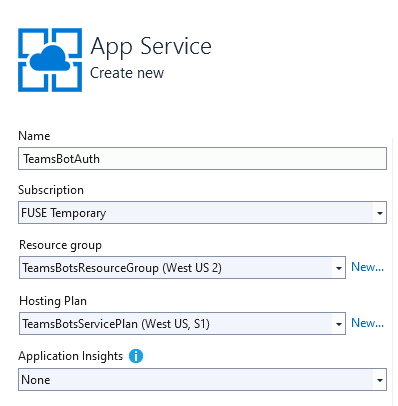

1. Click **Create**.
1. If the deployment completes successfully, you should see it reflected in Visual Studio. Moreover, a page is displayed in your default browser saying *Your bot is ready!*. The URL will be similar to this: `https://teamsbotauth.azurewebsites.net/`. Save it to a file. 
1. Check your resource group, the bot should be listed along with the other resources. The following picture shows an example:

    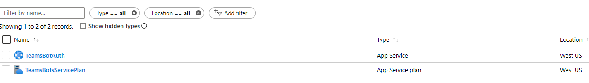

### Create a channel registration application for the bot

After creating the *Azure App Service* to host your bot, you must create a **Bot Channels Registration** app which is needed for registering the bot with the **Teams** channel.

1. In your browser navigate to the [Azure portal][azure-portal].
1. In the left navigation panel, select **Create a resource**.
1. In the right panel selection box enter "bot". And in the drop-down list, select **Bot Channels Registration**. 
1. Click the **Create** button.
1. In the **Bot Service** blade, provide the requested information about your bot. For the *Messaging endpoint* enter the URL of the app service followed by `/api/messages`. For example, `https://teamsbotauth.azurewebsites.net/api/messages`. The following picture shows an example of the registration settings:

    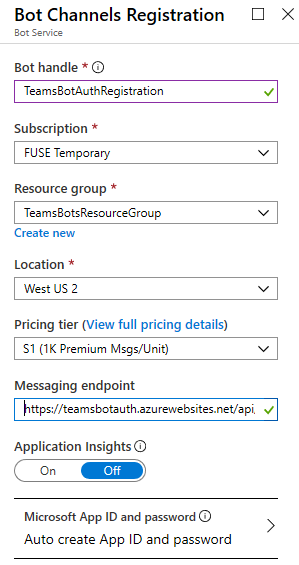

1. Click **Microsoft App ID and password** and then **Create New**.
1. Click **Create App ID in the App Registration Portal** link.
1. In the new window, click the **New registration** tab.
1. Enter the name of the bot application you are registering, we used *TeamsBotAuth* (you need to select your own unique name). 
1. For the **Supported account types** select *Accounts in any organizational directory (Any Azure AD directory - Multitenant) and personal Microsoft accounts (e.g. Skype, Xbox)*. 
1. Click **Register**.
1. Once completed, Azure displays the *Overview* page for the application.
1. Copy and save to a file the **Application (client) ID** value. 
1. In the blade, click **Certificate and secrets**.
    1. Under *Client secrets*, click **New client secret**.
    1. Add a description to identify this secret from others you might need to create for this app.
    1. Set *Expires* to you selection.
    1. Click **Add**.
    1. Copy the client secret and save it to a file. 
1. Go back to the **Bot Channel Registration** window and copy the *App ID* and the *Clinet secret* in the **Microsoft App ID** and **Password** boxes, respectively. 
1. Click **OK**.
1. Finally, click **Create**. 

    After Azure has created the registration resource it lists it in the related resource group.  

    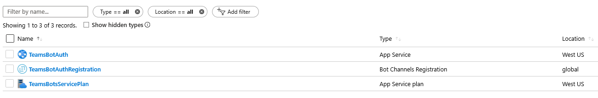

> [!NOTE]
> The Bot Channels Registration resource will show the **Global** region even though you selected West US. This is expected.

For more information, see [Register a bot with Azure Bot Service](https://docs.microsoft.com/azure/bot-service/bot-service-quickstart-registration?view=azure-bot-service-3.0A).

### Create an Azure AD application

You need an Azure Active Directory application that can be used for authentication.

> [!TIP]
> You will need to create and register the Azure AD application in a tenant
> in which you can consent to delegate permissions requested by an application.

1. Open the [Azure Active Directory][azure-aad-blade] panel in the Azure portal.
    If you are not in the correct tenant, click **Switch directory** to switch to the correct tenant. (For instruction on creating a tenant, see [Access the portal and create a tenant](https://docs.microsoft.com/azure/active-directory/fundamentals/active-directory-access-create-new-tenant).)
1. IN the left panel, click **App registrations**.
1. In the **App registrations** panel, click **New registration** tab.
1. Fill in the required fields and create the app registration.
   1. Name your application.
   1. Select the **Supported account types** for your application. (Any of these options will work with this sample.)
   1. For the **Redirect URI**
       1. Select **Web**.
       1. Set the URL to `https://token.botframework.com/.auth/web/redirect`.

        The following picture shows an example:

        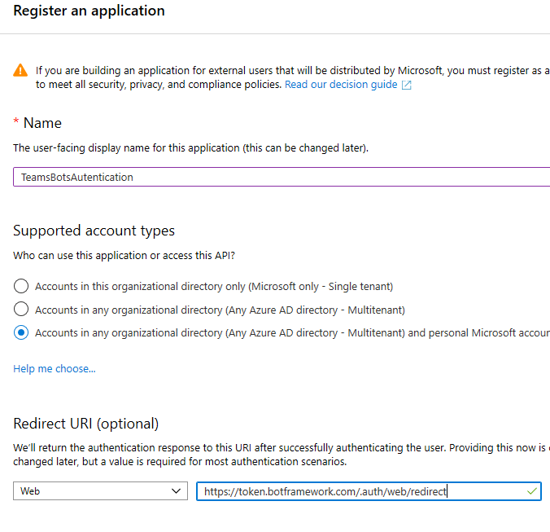

   1. Click **Register**.

      - Once it is created, Azure displays the **Overview** page for the app.
      - Record the **Application (client) ID** value. You will use this value later as the *Client id* when you register your Azure AD application with your bot.
      - Also record the **Directory (tenant) ID** value. You will also use this to register this application with your bot.

1. In the navigation pane, click **Certificates & secrets** to create a secret for your application.

   1. Under **Client secrets**, click **New client secret**.
   1. Add a description to identify this secret from others you might need to create for this app, such as `bot login`.
   1. Set **Expires** to your selection.
   1. Click **Add**.
   1. Before leaving this page, record the secret. You will use this value later as the _Client secret_ when you register your Azure AD application with your bot.

### Register your Azure AD application with your bot

The next step is to register with your bot the Azure AD application that you just created.

#### Azure AD v1

1. Navigate to your bot's channel registration resource page on the [Azure Portal](http://portal.azure.com/).
1. Click **Settings**.
1. Under **OAuth Connection Settings** near the bottom of the page, click **Add Setting**.
1. Fill in the form as follows:

    1. For **Name**, enter a name for your connection. You'll use this name in your bot code.
    1. For **Service Provider**, select **Azure Active Directory**. Once you select this, the Azure AD-specific fields will be displayed.
    1. For **Client id**, enter the application (client) ID that you recorded for your Azure AD application in the steps above. 
    1. For **Client secret**, enter the secret that you recorded for your Azure AD application in the steps above.
    1. For **Grant Type**, enter `authorization_code`.
    1. For **Login URL**, enter `https://login.microsoftonline.com`.
    1.For **Tenant ID**, enter the **directory (tenant) ID** that your recorded earlier for your AAD app or **common** depending on the supported account types selected when you created the ADD app. To decide which value to assign follow these criteria:

        - When creating the AAD app if you selected either *Accounts in this organizational directory only (Microsoft only - Single tenant)* or *Accounts in any organizational directory(Microsoft AAD directory - Multi tenant)* enter the **tenant ID** you recorded earlier for the AAD app.

        - However, if you selected *Accounts in any organizational directory (Any AAD directory - Multi tenant and personal Microsoft accounts e.g. Skype, Xbox, Outlook.com)* enter the word **common** instead of a tenant ID. Otherwise, the AAD app will verify through the tenant whose ID was selected and exclude personal MS accounts.

       This will be the tenant associated with the users who can be authenticated.

    1. For **Resource URL**, enter `https://graph.microsoft.com/`.
    1. Leave **Scopes** blank.
     The following picture shows an example:

        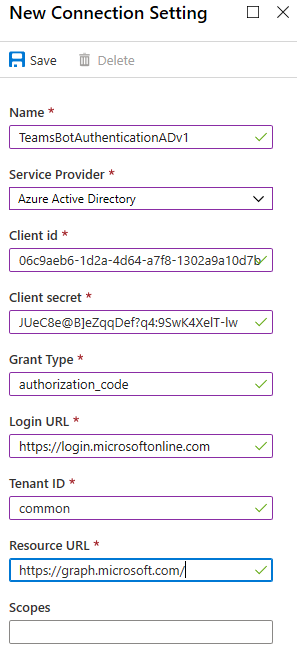

1. Click **Save**.

### Test the connection

1. Click on the connection entry to open the connection you just created.
1. Click **Test Connection** at the top of the **Service Provider Connection Setting** pane.
1. The first time, this should open a new browser tab listing the permissions your app is requesting and prompt you to accept. The following picture shows an example:

    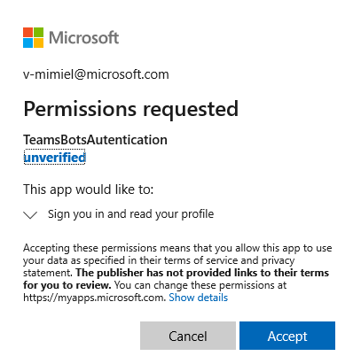

1. Click **Accept**.
1. This should then redirect you to a **Test Connection to \<your-connection-name> Succeeded** page. The following picture shows an example:

    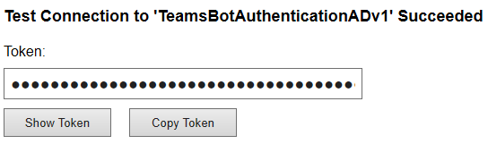

You can now use this connection name in your bot code to retrieve user tokens.

## Prepare the bot code

<!-- TODO: Add guidance (once we have it) on how not to hard-code IDs and ABS auth. -->

1. In Visual Studio, in the *Solution Explorer* right-click on the project name. 
1. Update **appsettings.json**:

    - Set `ConnectionName` to the name of the authentication connection setting you added to your bot channel registration.
    - Set `MicrosoftAppId` and `MicrosoftAppPassword` to your bot's app ID and app secret.

      Depending on the characters in your bot secret, you may need to XML escape the password. For example, any ampersands (&) will need to be encoded as `&amp;`.
      The following is an example:

        ```cs
        {
            "MicrosoftAppId": "", // The bot App Id 
            "MicrosoftAppPassword": "", // The bot client secret
            "ConnectionName": "" // The name of the Azure AD auth connection
        }
        ```

If you do not know how to get your **Microsoft app ID** and **Microsoft app password** values, you can create a new password [as described here](https://review.docs.microsoft.com/azure/bot-service/bot-service-quickstart-registration?view=azure-bot-service-3.0&branch=pr-en-us-1722&viewFallbackFrom=azure-bot-service-4.0#get-registration-password)


## Test the bot using the emulator

If you have not done so already, install the [Bot Framework Emulator](https://aka.ms/bot-framework-emulator-readme). See also [Debug with the emulator](https://review.docs.microsoft.com/azure/bot-service/bot-service-debug-emulator?view=azure-bot-service-4.0&branch=pr-en-us-1722&tabs=csharp).

In order for the bot sample login to work you must configure the emulator as shown below.

<!-- auth config steps -->

### Configure the emulator for authentication

If a bot requires authentication, you must configure the emulator as shown below.

#### Using sign-in verification code

1. Start the emulator.
1. In the emulator, click the gear icon in the bottom left, or the **Emulator Settings** tab in the upper right.
1. Check the box by **Use a sign-in verification code for OAuthCards**.
1. Check the box by **Bypass ngrok for local address**
1. Click the  **Save** button.

When you click the login button displayed by the bot, a code will be generated.
You wil enter the code in the bot UI input box for the authentication to happen.
After that you can perform the allowed operations.

Alternatively, you can perform the steps described below.

#### Using authentication tokens

1. Start the emulator.
1. In the emulator, click the gear icon in the bottom left, or the **Emulator Settings** tab in the upper right.
1. Check the box by **Use version 1.0 authentication tokens**.
1. Enter the local path to the **ngrok** tool. For more the tool information, see [ngrok](https://ngrok.com/).
1. Check the box by **Run ngrok when the Emulator starts up**.
1. Click the  **Save** button.

When you click the login button displayed by the bot, you will be asked to enter your credentials. An authentication token is generated. After that you can perform the allowed operations.

### Testing

After you have configured the authentication mechanism, you can perform the actual bot sample testing.  

1. Run the bot sample locally on your machine, via Visual Studio for example.
1. Start the emulator.
1. Click the **Open bot** button. 
1. In the **Bot URL**, enter the bot local URL. Usually, `http://localhost:3978/api/messages`. 
1. In the **Microsoft App ID** enter the bot app ID from the `appsetting.json`. 
1. In the **Microsoft App password** enter the bot app ID from the `appsetting.json`.
1. Click **Connect**.
1. After the bot is up and running, enter any text to display the login dialog.
1. Click the **Sign in** box.
1. A pop-up dialog is displayed to **Confirm Open URL**. This is to allow the bot's user (you) to be authenticated.  
1. Click **Confirm**.
1. If you are asked, select the applicable user's account. 
1. Depending which configuration you used for the emulator, you get one of the following:
    1. **Using sign-in verification code**
        1. A window is opened displaying the validation code.
        1. Copy and enter the validation code into the chat box to complete the sign-in.
    1. **Using authentication tokens**.
        1. You are logged in based on your credentials. 

 1. The following picture is an example of the bot UI after you have logged in:

     

1. If you click the **Would ypu like to view your token?**, you get a response similar to the following:

    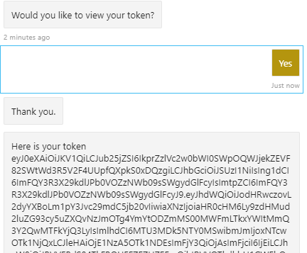

1. Enter **logout** in the chat box to exit. 

> [!NOTE]
> Bot authentication requires use of the Bot Connector Service. The service accesses the bot channels registration information for your bot.

## Test the deployed bot

1. In your browser, navigate to the [Azure portal][azure-portal].
1. In the left pane, select **All Resources**.
1. In the right panel find your bot **Azure AD Registration**. 
1. Click on the resource link. The resource page is displayed.
1. In the resource blade, click **Test in Web Chat**. The bot starts and displays the predefined greetings. 
1. Type anything in the chat box. You will be logged in. The following picture shows an example:

    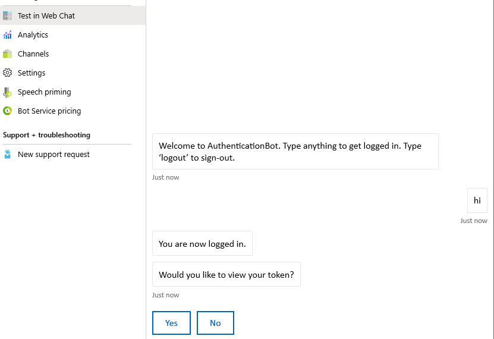.

1. Click the **Yes** button to display your authentication token. The following picture shows an example:

    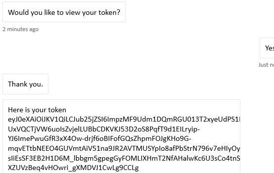.

1. Enter logout to exit the chat.

    .


## Bot in Microsoft Teams

---

The following sections apply specifically to a bot that requires authentication ad running Teams. 

### Install and test the bot in Teams

1. In your bot project, assure that the `TeamsAppManifest` folder contains the `manifest.json` along with an `outline.png` and `color.png` files. The manifest for the sample code associated with this article, is shown below. 

```json 
{
  "$schema": "https://developer.microsoft.com/en-us/json-schemas/teams/v1.3/MicrosoftTeams.schema.json",
  "manifestVersion": "1.3",
  "version": "1.0.0",
  "id": "",
  "packageName": "com.teams.auth.bot",
  "developer": {
    "name": "TeamsBotAuth",
    "websiteUrl": "https://www.microsoft.com",
    "privacyUrl": "https://www.teams.com/privacy",
    "termsOfUseUrl": "https://www.teams.com/termsofuse"
  },
  "icons": {
    "color": "color.png",
    "outline": "outline.png"
  },
  "name": {
    "short": "TeamsBotAuth",
    "full": "Teams Bot Authentication"
  },
  "description": {
    "short": "TeamsBotAuth",
    "full": "Teams Bot Authentication"
  },
  "accentColor": "#FFFFFF",
  "bots": [
    {
      "botId": "",
      "scopes": [
        "groupchat",
        "team"
      ],
      "supportsFiles": false,
      "isNotificationOnly": false
    }
  ],
  "permissions": [
    "identity",
    "messageTeamMembers"
  ],
  "validDomains": [ "token.botframework.com" ]
}
```

1. In file explorer, navigate to the folder `TeamsAppManifest` folder. Edit the `manifest.json` file ed assign the following values:
    1. To `id` and `botId` assign the **bot App ID** you got at the time of the Azure **Bot Channel Registration**.
    1. Assure that this values is assigned: `validDomains: [ "token.botframework.com" ]`. For more information, see [Using Azure Bot Service for Authentication in Teams](../../../_old/concepts/bots/bot-authentication/auth-oauth-card.md).
    1. Select and **zip** the files `manifest.json`, `outline.png`, and `color.png`.
1. Open **Microsoft Teams**.
1. In the left panel, bottom left, click the **Apps** icon.
1. Select **Upload a custom app** on the bottom left.
1. Navigate to th e`TeamsAppManifest` folder and select the zipped archive.
1. Click on the three dots in the left panel. Then click **App Studio** icon.
1. Click the **Manifest editor** tab. You should see the icon of the bot you uploaded. 
1. You should be able to see the bot listed as a contact in that chat list. 
1. Use it to exchange messages with the bot.

### Preliminary quick testing the bot in Teams

The following steps allow you to do a quick install by using the bot GUID, so you can perform preliminary testing.

> [!WARNING]
> Adding a bot by GUID, for anything other than testing purposes, is not recommended. 
> Doing so severely limits the functionality of a bot.
> Bots in production must be added to Teams as part of an app. See [Create a bot](../../../_old/concepts/bots/bots-create.md) and [Test and debug your Microsoft Teams](../../../_old/concepts/bots/bots-test.md) bot.

1. In your browser, navigate to the [Azure portal][azure-portal].
1. In the left pane, select **All Resources**.
1. In the right panel find your bot **Azure AD Registration**. 
1. Click the **Channels** blade, and then click the **Teams** icon.

    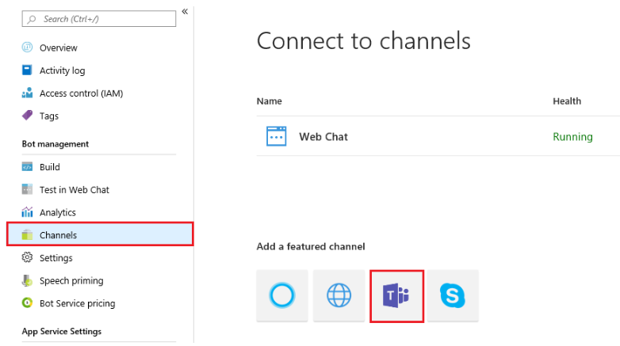.

1. Click the **Save** button. 
1. After adding the Teams channel, go to the Channels page and click the **Get bot embed code**.
1. Copy the https part of the code that is showing in the Get bot embed code dialog. For example, `https://teams.microsoft.com/l/chat/0/0?users=28:b8a22302e-9303-4e54-b348-343232`.
1. In the browser, paste this address and then choose the Microsoft Teams app (client or web) that you use to add the bot to Teams. You should be able to see the bot listed as a contact in that chat list. 
1. Use it to exchange messages with the bot.
For more information, see [Connect a bot to Teams](https://docs.microsoft.com/azure/bot-service/channel-connect-teams?view=azure-bot-service-4.0).


### Testing the bot locally in Teams 

Microsoft Teams is an entirely cloud-based product, it requires all services it accesses to be available from the cloud using HTTPS endpoints. Therefore, to enable the bot (our sample)to work in Teams, you need to either publish the code to the cloud of your choice, or make a local running instance externally accessible via a **tunneling**. tool. We recommend  [ngrok](https://ngrok.com/download), which creates an externally addressable URL for a port you open locally on your machine. 
To set up ngrok in preparation for running your Microsoft Teams app locally, perform these steps:

1. In a terminal window, go the directory where you have `ngrok.exe` installed. We suggest too set the *environment variable* path pointing to it. 
1. Run, for example, `> ngrok http 3978 --host-header=localhost:3978`. Replace the port number as needed.
This launches ngrok to listen on the port you specify. In return, it gives you an externally addressable URL, valid for as long as ngrok is running. The following picture shows an example:

    .

1. Copy the forwarding https address, in the picture shown is: `https://dea822bf.ngrok.io/`.
1. Append to it `/api/messages` to obtain `https://dea822bf.ngrok.io/api/messages`. This is the **messages endpoint** for the bot running locally on your machine and reachable over the web in a chat in Microsoft Teams.
1. One final step to perform is to update the messages end point of the deployed bot. In teh example, we deployed the bot in Azure. So let's perform these steps:
    1. In your browser navigate to the [Azure portal][azure-portal].
    1. Select your **Bot Channel Registration**.
    1. In the left panel, click **Settings**.
    1. In the right panel, in the **Messaging endpoint** box, enter the ngrok URL, in our example, `https://dea822bf.ngrok.io/api/messages`.
1. Now you can start your bot locally, for example in Visual Studio debug mode. 
1. You can validate that ngrok is working, too, by testing bot response in the Bot Framework portal's Test Web chat window. Like the emulator, this test doesn't allow you to access Teams-specific functionality.

> [!NOTE]
> If you stop and restart ngrok, the URL changes. To use ngrok in your project, and depending on the capabilities you are using, you must replace all URL references. 


## Teams bot authentication implementation
---

Teams behaves slightly differently than other channels, in case of authentication as explained below.

### Handling Invoke Activity

The **Invoke Activity** must be forwarded to the dialog when the **OAuthPrompt** is used. This is done by sub-classing the **ActivityHandler**.

#### Bots\DialogBots.cs

```cs
public class DialogBot<T> : TeamsActivityHandler where T : Dialog
{
    protected readonly BotState ConversationState;
    protected readonly Dialog Dialog;
    protected readonly ILogger Logger;
    protected readonly BotState UserState;

    public DialogBot(ConversationState conversationState, UserState userState, T dialog, ILogger<DialogBot<T>> logger)
    {
        ConversationState = conversationState;
        UserState = userState;
        Dialog = dialog;
        Logger = logger;
    }

    public override async Task OnTurnAsync(ITurnContext turnContext, CancellationToken cancellationToken = default(CancellationToken))
    {
        await base.OnTurnAsync(turnContext, cancellationToken);

        // Save any state changes that might have occured during the turn.
        await ConversationState.SaveChangesAsync(turnContext, false, cancellationToken);
        await UserState.SaveChangesAsync(turnContext, false, cancellationToken);
    }

    protected override async Task OnMessageActivityAsync(ITurnContext<IMessageActivity> turnContext, CancellationToken cancellationToken)
    {
        Logger.LogInformation("Running dialog with Message Activity.");

        // Run the Dialog with the new message Activity.
        await Dialog.RunAsync(turnContext, ConversationState.CreateProperty<DialogState>(nameof(DialogState)), cancellationToken);
    }
}
```

#### Bots\TeamsBot.cs

An **Invoke Activity** is **sent to the bot** rather than the *Event Activity* as done in other channels. The *Invoke Activity* must be 
forwarded to the dialog if the **OAuthPrompt** is used. 

```cs
protected override async Task OnSigninVerifyStateAsync(ITurnContext<IInvokeActivity> turnContext, CancellationToken cancellationToken)
{
    Logger.LogInformation("Running dialog with signin/verifystate from an Invoke Activity.");

    // OAuth Prompt needs to see the Invoke Activity in order to complete the login process.
    // Run the Dialog with the new Invoke Activity.
    await Dialog.RunAsync(turnContext, ConversationState.CreateProperty<DialogState>(nameof(DialogState)), cancellationToken);
}

```

<!-- 

The sample shown next includes a reusable `TeamsActivityHandler` class which in future could be included in the Bot Framework SDK.
- The Teams channel is also capable of sending **Message Reaction Activities**. Virtual methods for these are included in the **TeamsActivityHandler**. 
- A Message Reaction Activity references the original Activity using the `replyToId`. 
  - This id would have actually been the value returned from a previous Message Activity the bot had sent. 
  - This activity should also be visible through the Activity Feed in Microsoft Teams, documentation for which can be found here [activity-feed](https://docs.microsoft.com/microsoftteams/platform/concepts/activity-feed).


// This IBot implementation can run any type of Dialog. The use of type parameterization is to allows multiple different bots
// to be run at different endpoints within the same project. This can be achieved by defining distinct Controller types
// each with dependency on distinct IBot types, this way ASP Dependency Injection can glue everything together without ambiguity.
// The ConversationState is used by the Dialog system. The UserState isn't, however, it might have been used in a Dialog implementation,
// and the requirement is that all BotState objects are saved at the end of a turn.


## Example

The sample uses the bot authentication capabilities in Azure Bot Service, providing features to make it easier to develop a bot that authenticates users to various identity providers such as Azure AD (Azure Active Directory), GitHub, Uber, etc. You cna download the code at this location: [teams-auth bot](https://github.com/microsoft/BotBuilder-Samples/tree/master/samples/csharp_dotnetcore/46.teams-auth). 

-->

## References

#### Teams
---

> [!WARNING]
> The following links to be revised. They are in the _old folder.  

- [Microsoft Teams authentication flow for bots](../../../_old/concepts/bots/bot-authentication/auth-flow-bot.md)
- [Authenticate a user in a Microsoft Teams bot](../../../_old/concepts/bots/bot-authentication/auth-bot-aad.md)
- [Using Azure Bot Service for Authentication in Teams](../../../_old/concepts/bots/bot-authentication/auth-oauth-card.md)


#### Bot framework
----

- [Add authentication to your bot via Azure Bot Service](https://docs.microsoft.com/azure/bot-service/bot-builder-authentication?view=azure-bot-service-4.0&tabs=csharp%2Cbot-oauth)


<!-- Footnote-style links -->

[azure-portal]: https://ms.portal.azure.com

[concept-basics]: https://docs.microsoft.com/azure/bot-service/bot-builder-basics?view=azure-bot-service-4.0
[concept-state]: https://docs.microsoft.com/azure/bot-service/bot-builder-concept-state?view=azure-bot-service-4.0
[concept-dialogs]: https://docs.microsoft.com/azure/bot-service/bot-builder-concept-dialog?view=azure-bot-service-4.0
[simple-dialog]: https://docs.microsoft.com/azure/bot-service/bot-builder-dialog-manage-conversation-flow?view=azure-bot-service-4.0

[teams-auth-bot]: https://github.com/microsoft/BotBuilder-Samples/tree/master/samples/csharp_dotnetcore/46.teams-auth

[azure-aad-blade]: https://ms.portal.azure.com/#blade/Microsoft_AAD_IAM/ActiveDirectoryMenuBlade/Overview
[aad-registration-blade]: https://ms.portal.azure.com/#blade/Microsoft_AAD_IAM/ActiveDirectoryMenuBlade/RegisteredAppsPreview


<!--- Ref links 
## Writing notes

 * **Purpose** Explain how to add authentication to your bot.
 * **Existing teams doc reference**
   * [https://docs.microsoft.com/en-us/microsoftteams/platform/concepts/authentication/auth-flow-bot](https://docs.microsoft.com/en-us/microsoftteams/platform/concepts/authentication/auth-flow-bot)
   * [https://docs.microsoft.com/en-us/microsoftteams/platform/concepts/authentication/auth-bot-aad](https://docs.microsoft.com/en-us/microsoftteams/platform/concepts/authentication/auth-bot-aad)
   * [https://docs.microsoft.com/en-us/microsoftteams/platform/concepts/authentication/auth-oauth-card](https://docs.microsoft.com/en-us/microsoftteams/platform/concepts/authentication/auth-oauth-card)
 * **Existing Bot framework doc reference**
   * [https://docs.microsoft.com/en-us/azure/bot-service/bot-builder-authentication?view=azure-bot-service-4.0&tabs=csharp%2Cbot-oauth](https://docs.microsoft.com/en-us/azure/bot-service/bot-builder-authentication?view=azure-bot-service-4.0&tabs=csharp%2Cbot-oauth)
 * **Code Snippets**
   * [https://github.com/microsoft/BotBuilder-Samples/tree/master/samples/csharp_dotnetcore/46.teams-auth](https://github.com/microsoft/BotBuilder-Samples/tree/master/samples/csharp_dotnetcore/46.teams-auth)
   --->
