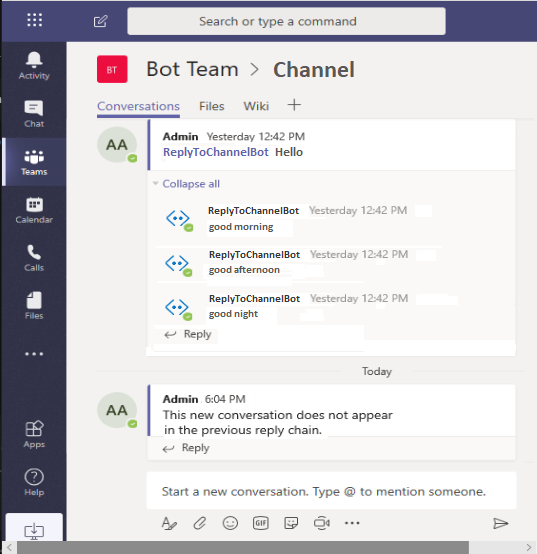

# Channel and Group chat conversations with a Microsoft Teams bot

[!INCLUDE [pre-release-label](~/includes/pre-release-label.md)]

Microsoft Teams enables you to add bots into your channel or group chat conversations, and by so doing that bot becomes another team member and everyone in the conversation can take advantage of its capabilities directly in the conversation. You can also access Teams-specific functionality directly in your bot, which will enable you to do things like querying team information and @mention users.

To access your bot in a channel or group chat, you need to [@mention](#@mention) the bot, otherwise the message will not be sent to the bot. If your bot is used in multiple scopes (personal, groupchat or channel) you will need to detect what scope the bot messages came from, and process them accordingly.

## Design considerations

A bot should provide information that is both appropriate and relevant to all members in a group or channel. While your bot can certainly provide any information relevant to the experience, keep in mind conversations with it are visible to everyone that is a part of the group or channel and a well designed bot can add value to all users while not inadvertently sharing information that is more appropriate in a one-to-one conversation.

In Microsoft Teams there is no requirement that your bot function in all scopes, it can be work with any combination of the three available scopes (_personal_, _groupchat_ or _channel_) and it is up to you to ensure your bot provides user value in the scope(s) you do support. 

> [!NOTE]
> For more information on scopes, see [Apps in Microsoft Teams](NEED REFERENCE).

Developing a bot that works in groups or channels uses much of the same functionality used in personal conversations, with the addition of events and data in the payload that provide Teams group and channel information. The additional fun, as well as key differences in common functionality are described in the following sections.

For more information on design considerations, refer to the [Teams Design Guidelines](https://aka.ms/teams-design-guidelines)

## Creating messages

For information on how to create messages in channels see [Proactive messaging for bots](send-proactive-messages.md), and specifically [Creating a channel conversation](send-proactive-messages.md#creating-a-channel-conversation).

## `TBD - OPEN ISSUE: What about "Reply to Group" (or "Reply to Personal"?)` 

## Replying to messages

You respond to messages in a channel by initiating reply chain by passing the Channel Id and any desired message to the `TeamsCreateConversation` method, with additional messages to the reply chain using the `ContinueConversation` method. The following are the steps you can take to create a basic Teams bot:

# [C#](#tab/csharp)

1. Get your bots application ID in the constructor, you will need it to when sending messages to the Teams channel. The following code demonstrates getting the AppId from your configuration file, which is generally __AppSettings.json__ if using C#.


    ```csharp
      public class ReplyToChannelBot : ActivityHandler
      {
          private string _botId;

          public ReplyToChannelBot(IConfiguration configuration)
          {
              _botId = configuration["MicrosoftAppId"];
          }

          ...

      }
    ```

2. You will also need the ID of the Teams channel your bot is being called from. There is a Teams extension method in the `Activity` class named `TeamsGetChannelId` that you can call to get your channel once the `OnMessageActivity` method is invoked.

    ```csharp
      public class ReplyToChannelBot : ActivityHandler
      {

          ...

        protected override async Task OnMessageActivityAsync(ITurnContext<IMessageActivity> turnContext, CancellationToken cancellationToken)
        {
            var teamChannelId = turnContext.Activity.TeamsGetChannelId();

            ...

        }
      }
    ```

3. Now that you have your Teams channel ID you can create your desired message and send it to the channel, which creates a reply chain. 

    ```csharp
      public class ReplyToChannelBot : ActivityHandler
      {

          ...

          protected override async Task OnMessageActivityAsync(ITurnContext<IMessageActivity> turnContext, CancellationToken cancellationToken)
          {
              var teamChannelId = turnContext.Activity.TeamsGetChannelId();
              var message = MessageFactory.Text("good morning");

              var (conversationReference, activityId) = 
                await turnContext.TeamsCreateConversationAsync(teamChannelId, message, cancellationToken);
              
              ...

          }
      }
    ```

4. You can send additional messages within the reply chain by calling the `ContinueConversation` method.

    ```csharp
      public class ReplyToChannelBot : ActivityHandler
      {

          ...

          protected override async Task OnMessageActivityAsync(ITurnContext<IMessageActivity> turnContext, CancellationToken cancellationToken)
          {

              ...

            await ((BotFrameworkAdapter)turnContext.Adapter).ContinueConversationAsync(
                _botId,
                conversationReference,
                async (t, ct) =>
                {
                    await t.SendActivityAsync(MessageFactory.Text("good afternoon"), ct);
                    await t.SendActivityAsync(MessageFactory.Text("good night"), ct);
                },
                cancellationToken);
          }
      }
    ```
<!--
# [JavaScript](#tab/javascript)
-->

---

### Putting it all together, the ReplyToChannelBot class:

The following C# sample code demonstrates the concepts discussed previously, putting it all together into a bot.


# [C#](#tab/csharp)

```csharp
using System.Threading;
using System.Threading.Tasks;
using Microsoft.Bot.Builder;
using Microsoft.Bot.Builder.Teams;
using Microsoft.Bot.Schema;
using Microsoft.Extensions.Configuration;

namespace Microsoft.BotBuilderSamples.Bots
{
    public class ReplyToChannelBot : ActivityHandler
    {
        private string _botId;

        public ReplyToChannelBot(IConfiguration configuration)
        {
            _botId = configuration["MicrosoftAppId"];
        }

        protected override async Task OnMessageActivityAsync(ITurnContext<IMessageActivity> turnContext, CancellationToken cancellationToken)
        {
            var teamChannelId = turnContext.Activity.TeamsGetChannelId();
            var message = MessageFactory.Text("good morning");

            var (conversationReference, activityId) = 
              await turnContext.TeamsCreateConversationAsync(teamChannelId, message, cancellationToken);

            await ((BotFrameworkAdapter)turnContext.Adapter).ContinueConversationAsync(
                _botId,
                conversationReference,
                async (t, ct) =>
                {
                    await t.SendActivityAsync(MessageFactory.Text("good afternoon"), ct);
                    await t.SendActivityAsync(MessageFactory.Text("good night"), ct);
                },
                cancellationToken);
        }
    }
}
```

<!--
# [JavaScript](#tab/javascript)
-->

---

Running this bot, you should get similar results to the following:




## Best practice: Welcome messages in Teams

When your bot is first added to the group or team, it may be useful to send a welcome message introducing it to all team members. The welcome message should provide a description of the bot’s functionality and benefits. Ideally the message should also include any commands needed to interact with it. To do this, ensure that your bot responds to the `conversationUpdate` event, with the `teamMemberAdded` EventType in the `channelData` object.  Since the `teamMemberAdded` EventType is sent when any new team member is added, not just when the bot is added, you need to check to determine if the new member added is the bot or a new team member before sending any welcome message from the bot to the team. See [Sending a welcome message to a new team member](subscribe-to-conversation-events.md#Sending-a-welcome-message-to-a-new-team-member) in the article [Subscribe to conversation events](subscribe-to-conversation-events.md) for more details on sending a team wide welcome message when the bot or a new team member is added. 

You might also want to send a personal message to each member of the team when the bot is added. To do this, you could get the team roster and send each user a direct message.

It is not recommended to send a welcome message in the following situations:

* The team is large (obviously subjective, but for example larger than 100 members). Your bot may be seen as 'spammy' and the person who added it may get complaints unless you clearly communicate your bot's value proposition to everyone who sees the welcome message.

* Your bot is first mentioned in a group or channel (versus being first added to a team)

* A group or channel is renamed

* A team member is added to a group or channel

For more best practices, see our [design guidelines](https://aka.ms/teams-design-guidelines).


## @ Mentions

Bots in a group or channel respond only when they are mentioned ("@botname") directly in a message, every message received by a bot when in a group or channel scope will contains it own name in the message text returned (see turnContext.Activity.Text), and you need to ensure your message parsing handles that. In addition, you can write code in your bot to parse out other users mentioned, and then mention those users as part of your response.

> [!NOTE]
> You must @Mention the bot directly by name. While entering @Team or @Channel will generally mention everyone in that scope, it will not result in a message from Teams to your bot.

> [!TIP]
> Use the RemoveMentionText method to remove the bot name (mention text) from the message if needed.

### Retrieving mentions

When processing a message in your bots message handler, the senders name is passed in with the `turnContext` that is passed in to the OnMessageActivity method. You can find it in the `Name` property of the `From` object that is a property of the `Activity` object that is passed in as a property of the`turnContext`. 

To get the senders user name:

```csharp
turnContext.Activity.From.Name
```

The `From` property is a `ChannelAccount` object that contains  the information that Teams needs to route the message back to the correct person which is explained in the next section.


### Constructing mentions

When responding back to the user that messaged the bot, it is generally a good idea to @Mention them in the response. To do this, you will need to create a `Mention` object and pass that in your response. 

The `Mention` object has two properties that you will need to set:

1. `Mentioned`: This is a `ChannelAccount` object that contains the user name of the person you are mentioning as well as their ID. You can get this from the `From` object in the message that the user just sent to you as explained in the previous section.

2. `Text`: This is the text that represents the mention, which is the users name embedded in the '<at>' tag. Since you get the users name from the `From` object as explained in the previous section, this will look like:

    ```csharp
    Text = $"<at>{turnContext.Activity.From.Name}</at>"
    ```

The following code snippet demonstrates a bot that responds to a message sent to it with "Hello" followed with an @mention of the user that sent the message.

# [C#](#tab/csharp)

```csharp
public class MentionsBot : ActivityHandler
{
	/*
	 * You can @mention the bot from any scope and it will reply with the mention.
	 */
	protected override async Task OnMessageActivityAsync(ITurnContext<IMessageActivity> turnContext, CancellationToken cancellationToken)
	{
    // Create an instance of the Mention class, assigning the ChannelAccount of the user that 
    // sent the message to the Mentioned property and the user name to the Text property.
		var mention = new Mention
		{
			Mentioned = turnContext.Activity.From,
			Text = $"<at>{turnContext.Activity.From.Name}</at>",
		};

		// Against Teams having a Mention in the Entities but not including that
		// mention Text in the Activity Text will result in a BadRequest.
		var replyActivity = MessageFactory.Text($"Hello {mention.Text}.");
		replyActivity.Entities = new List<Entity> { mention };

		await turnContext.SendActivityAsync(replyActivity, cancellationToken);
	}
}
```

<!--
# [JavaScript](#tab/javascript)
-->

---


## Sending notifications

 Microsoft Teams notifications alert users about new tasks, mentions and comments related to what they are working on, or need to look at. You can set notifications to trigger when responding by setting the `TeamsChannelData` objects `Notification.Alert` property to true. Whether or not a notification is raised will ultimately depend on the individual users Teams settings and you cannot programmatically override these settings. The type of notification will be either a banner or both a banner and an email.

>[!TIP]
> To personalize your Microsoft Teams notifications, click on your profile picture in the upper right-hand part of the Teams UI to access the account settings. From there you can access ___Settings___ and then you can click on ___Notifications___ The two primary things that can trigger a notification are _mentions_ and _messages_. 

> [!IMPORTANT]
> The following sample code will demonstrate the user sending a command to the bot, and the bot responding based on the command it receives. Each command will demonstrate of to handle some of the most basic actions you will encounter when writing bots for Microsoft Teams. The valid commands will include: notify, card, random and general. 

In order to parse the incoming message so that you can isolate and react to the command sent by the user, you first need to remove the @Mention from the incoming text. For example, if you send the message "notify" to the bot, the message text that the bot receives will be "<at>BotName</at> notify". The bot framework makes it easy to parse out the "<at>BotName</at> " with a built in method in the `Activity` class named `RemoveRecipientMention`, which you could call upon entering the OnMessageActivity method.

# [C#](#tab/csharp)

```csharp
turnContext.Activity.RemoveRecipientMention();
```

<!--
# [JavaScript](#tab/javascript)
-->

---

Next, you will need to evaluate the message text and respond accordingly, calling `TeamsNotifyUser` for the command that will require sending a notification to the user, responding with a list of valid commands if none are found etc.


# [C#](#tab/csharp)

```csharp
if (turnContext.Activity.Text == "notify")
{
	var msg = MessageFactory.Text("This message will contain a notification");
	msg.TeamsNotifyUser();

	await turnContext.SendActivityAsync(msg, cancellationToken);
}
else if (turnContext.Activity.Text == "card")
{
	var heroCard = new HeroCard(text: "You will receive a notification in your Activity feed.");
	var msg = MessageFactory.Text("hi");
	msg.Attachments = new List<Attachment> { heroCard.ToAttachment() };
	msg.Summary = "This text will show in the activity feed as preview text";
	msg.TeamsNotifyUser();

	await turnContext.SendActivityAsync(msg, cancellationToken);
}
else if (turnContext.Activity.Text == "random")
{
	var channels = await GetChannelsAsync(turnContext, cancellationToken);
	Random random = new Random();
	var channel = random.Next(0, channels.Count);
	var channelName = channels[channel].Name == null ? "General" : channels[channel].Name;

	var msg = MessageFactory.Text($"I will send this to the {channelName} channel");

	await turnContext.TeamsSendToChannelAsync(channels[channel].Id, msg, cancellationToken);
	await turnContext.SendActivityAsync(msg, cancellationToken);
}
else if (turnContext.Activity.Text == "general")
{
	var msg = MessageFactory.Text("This message will appear in the team's general channel");
	await turnContext.TeamsSendToGeneralChannelAsync(msg, cancellationToken);
}
else
{
	var msg = MessageFactory.Text("Send me \"notify\" to get a notification. Send me \"random\" to send a message to a random channel." +
		"Send me \"general\" to send a message to the general channel. Send me \"card\" to receive a card notification.");
	await turnContext.SendActivityAsync(msg, cancellationToken);
}
```

<!--
# [JavaScript](#tab/javascript)
-->

---


## Additional Information

* [Overview of teams and channels in Microsoft Teams](https://aka.ms/teams-overview-teams-channels)
* [Manage notifications in Teams](https://aka.ms/support-teams-manage-notifications)

<!--


```csharp
public static void TeamsNotifyUser(this IActivity activity)
{
    var teamsChannelData = activity.ChannelData as TeamsChannelData;
    if (teamsChannelData == null)
    {
        teamsChannelData = new TeamsChannelData();
        activity.ChannelData = teamsChannelData;
    }

    teamsChannelData.Notification = new NotificationInfo
    {
        Alert = true,
    };
```

-->


<!--
## Writing notes

 * **Purpose** Describe the nuances of using a bot in a channel or group chat. Should include:
   * Creating a new message thread (probably a link to the proactive messaging article? Technically is proactive messaging if you want to start a new thread, but not *true* proactive messaging in all cases because you could do it in response to an Activity.)
   * Replying to a message thread
   * Parsing and creating `@` mentions (including the need to sometimes strip the bot's mention in the incoming message before processing)
   * Creating Activity Feed notifications
 * **Existing teams doc reference** 
   * [bots-conv-channel](https://docs.microsoft.com/en-us/microsoftteams/platform/concepts/bots/bot-conversations/bots-conv-channel)
   * [activity-feed](https://docs.microsoft.com/en-us/microsoftteams/platform/concepts/activity-feed)
 * **Existing Bot framework doc reference**
   * none
 * **Code Snippets** 
   * [ReplyToChannel](https://github.com/microsoft/botbuilder-dotnet/tree/master/tests/Teams/ReplyToChannel)
   * [Activity feed notifications](https://github.com/microsoft/botbuilder-dotnet/blob/5820ffb69beb6ca35114017663de62734f77689c/tests/Teams/Helpers/Bots/HelperBot.cs#L25)
   * [Mentions](https://github.com/microsoft/botbuilder-dotnet/tree/master/tests/Teams/Mentions)
  -->
