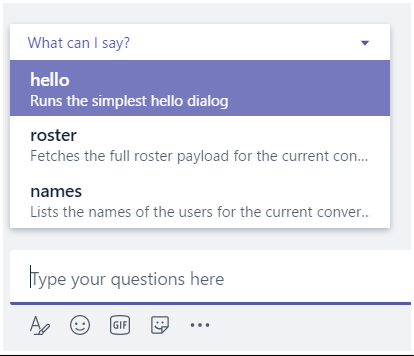
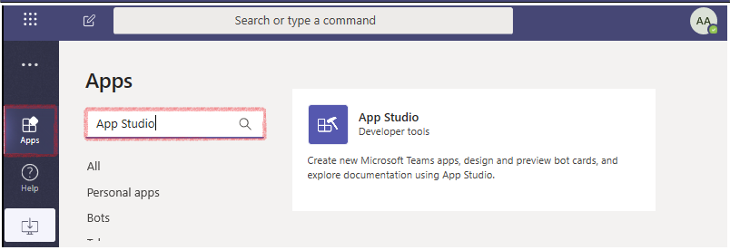
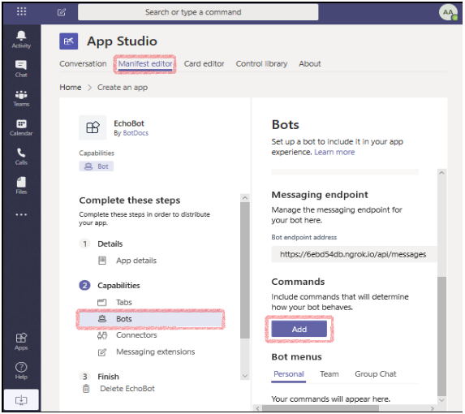
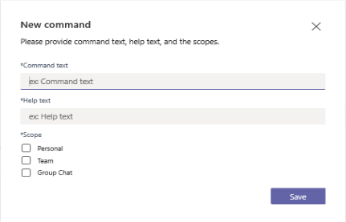

# Bot command menus

[!INCLUDE [pre-release-label](../../../includes/v4-to-v3-pointer-bots.md)]

Creating a command menu enables you to give your users a list of commands that your bot is designed to execute, along with simple help text associated with each command that you can use to explain the command. The user can select the command from the list and it is placed in the message, then all they need to do is click __Send__.




## Create a command menu for your bot

Command menus are contained in your app manifest, which can be created in <!--NEED LINK--> [App Studio](https://docs.microsoft.com/en-us/microsoftteams/platform/get-started/get-started-app-studio#manifest-editor), or edited directly in your source code in the `manifest.json` file in the `TeamsAppManifest` folder. In this section we will demonstrate how to create the command menu in App Studio, then we will show you the resulting `manifest.json` file so you can choose the approach that best suites your needs.

### Creating a command menu for your bot using App Studio

The instructions here assume that you will be editing an existing app manifest. The steps of adding a command menu are the same, whether you are creating a new manifest or editing an existing manifest.

1. Open App Studio from the ... overflow menu on the left navigation rail. If you do not have App Studio available you can download it, please refer to [Installing App Studio](https://aka.ms/teams-app-studio#installing-app-studio). 

    

2. Once in App Studio, select the __Manifest editor__ tab.

3. In the left column of the manifest editor view in the _Capabilities_ section, select __Bots__.

4. In the right column of the manifest editor view in the _Commands_ section, select the __Add__ button.

    

5. The __New Command__ screen appears. Enter the __Command text__ that you want to have appear as the menu command, and the __Help text__ that you want to have appear directly under the command text in the menu. This should be a brief explanation of the purpose of the command.

6. Next, select the scope(s) that you want this command menu to appear in, then select the __Save__ button.

    

The next time you use your bot in teams you will see ___What can I do?___ appear. If you select it, it will drop down the command window that you created. When you select an item it appears in the text box, and you can select the __Send__ button to send the command to your bot for processing.

### Creating a command menu for your bot by editing __Manifest.json__ 

Another valid approach for creating a commend menu is to create it directly in the manifest file while developing your bot source code. Here are a few things to keep in mind when using this approach:

1. Each menu supports up to 10 commands.

2. You can create a single command menu that will work in all scopes.

3. You can create a different command menu for each scope

#### Manifest example - single menu for both scopes

```json
{
  ⋮
  "bots":[
    {
      "botId":"[Microsoft App ID for your bot]",
      "scopes": [
        "personal",
        "team"
      ],
      "commandLists":[
        {
          "scopes":[
            "team",
            "personal"
          ],
          "commands":[
            {
              "title":"Help",
              "description":"Displays this help message"
            },
            {
              "title":"Search Flights",
              "description":"Search flights from Seattle to Phoenix May 2-5 departing after 3pm"
            },
            {
              "title":"Search Hotels",
              "description":"Search hotels in Portland tonight"
            },
            {
              "title":"Best Time to Fly",
              "description":"Best time to fly to London for a 5 day trip this summer"
            }
          ]
        }
      ]
    }
  ],
  ...
}
```

#### Manifest example - single menu for both scopes

```json
{
  ...
  "bots":[
    {
      "botId":"<Microsoft app ID for your bot>",
      "scopes": [
        "groupChat",
        "team"
      ],
      "commandLists":[
        {
          "scopes":[
            "team"
          ],
          "commands":[
            {
            "title":"help",
            "description":"Displays this help message for channels"
            }
          ]
        },
        {
          "scopes":[
            "groupChat"
          ],
          "commands":[
            {
            "title":"help",
            "description":"Displays this help message for group chat"
            }
          ]
        }
      ]
    }
  ],
  ...
}
```


## Handling menu commands in your bot code

Bots in a group or channel respond only when they are mentioned ("@botname") directly in a message, and as a result every message received by a bot when in a group or channel scope will contains it own name in the message text returned (see `turnContext.Activity.Text`), and you need to ensure your message parsing handles that before handling the command being returned. You can parse out the _@Mention_ portion of the message text using a static method provided with the Microsoft Bot Framework, a method of the `Activity` class named `RemoveRecipientMention`.

```csharp
turnContext.Activity.RemoveRecipientMention();
```

## Command menu best practices

* Keep it simple: The bot menu is meant to present the key capabilities of your bot.
* Keep it short: Menu options shouldn’t be extremely long and complex natural language statements - they should be simple commands.
* Always available: Bot menu actions/commands should be always invocable, regardless of the state of the conversation or the dialog the bot is in.


<!--
## Writing notes

 * **Purpose** Explain how to add a bot command menu to your teams bot using your app manifest. Needs to include a note that this doesn't work on the mobile Team's clients.
 * **Existing teams doc reference** 
   * [](https://docs.microsoft.com/en-us/microsoftteams/platform/concepts/bots/bots-menus)
 * **Existing Bot framework doc reference** 
   * none
 * **Code Snippets**
   * none
-->
