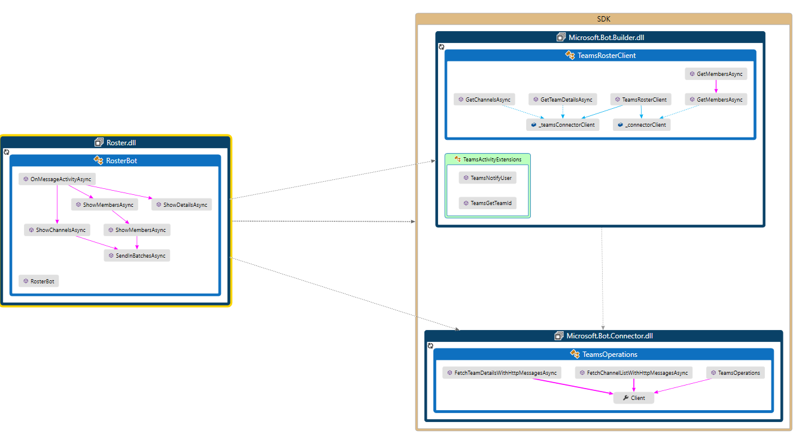

# Get Team's specific context for your bot

A bot can access additional context about the team or chat, such as user profile. This information can be used to enrich the bot's functionality and to provide a more personalized experience.


## Prerequisites

- Knowledge of [bot basics][concept-basics], [managing state][concept-state], the [dialogs library][concept-dialogs], how to [implement sequential conversation flow][simple-dialog].
- Visual Studio 2017 or later and git.
- [Microsoft.Bot.Connector.Teams](https://www.nuget.org/packages/Microsoft.Bot.Connector.Teams) NuGet package.
- Microsoft Teams. If needed you can create a [Microsoft Teams account](https://products.office.com/microsoft-teams/group-chat-software).
- The following example.

    | Example | BotBuilder version | Demonstrates |
    |:---|:---:|:---|
    | **Teams Bot Roster** in [cs teams bot roster][teams-bot-roster] | v4 | Accessing Teamns information |


## Roster bot code example

This section shows how to create a bot which you can use in Microsoft Teams. The bot allows the user to perform operations such as list team members, get channel information and other details. If the user `@mention` the bot, it responds with a message based on the request received.  You can download the code at this location: [cs teams bot roster][teams-bot-roster].


## Additional information



### List team's members

To list the members that belong to a team, you use the function `GetMembersAsync`.
The function is contained in the `TeamsRosterClient.cs` class which belongs to the **Microsoft.Bot.Builder** library.  The function calls the `GetChannelData` in the
`TeamsActivityExtensions.cs` class to obtain team members information.
The second overloaded `ShowMembersAsync` function, shown below, is responsible for creating a message activity with the requested team members information.  


### RosterBot.cs/ShowMembersAsync

```cs
private async Task ShowMembersAsync(ITurnContext<IMessageActivity> turnContext, CancellationToken cancellationToken)
{
    await ShowMembersAsync(turnContext, await GetMembersAsync(turnContext, cancellationToken), cancellationToken);
}


 private async Task ShowMembersAsync(ITurnContext<IMessageActivity> turnContext, IEnumerable<TeamsChannelAccount> teamsChannelAccounts, CancellationToken cancellationToken)
{
    var replyActivity = MessageFactory.Text($"Total of {teamsChannelAccounts.Count()} members are currently in team");
    await turnContext.SendActivityAsync(replyActivity);

    var messages = teamsChannelAccounts
        .Select(teamsChannelAccount => $"{teamsChannelAccount.AadObjectId} --> {teamsChannelAccount.Name} -->  {teamsChannelAccount.UserPrincipalName}");

    await SendInBatchesAsync(turnContext, messages, cancellationToken);
}

```

### Get team's details

The following flow shows the main functions used to obtain a team's details.

1. `ShowDetailsAsync` calls `GetTeamDetailsAsync`  in the `TeamsRosterClient.cs` class which belongs to the **Microsoft.Bot.Builder** library.
1. `GetTeamDetailsAsync` calls the `FetchTeamDetailsAsync` function in the `TeamsOperationsExtensions.cs` class  which belongs to the **Microsoft.Bot.Connector** library.
1. `FetchTeamDetailsAsync` calls the `FetchTeamDetailsWithHttpMessagesAsync` function in the class `TeamsOperations.cs` which belongs to the **Microsoft.Bot.Connector** library. 
1. `FetchTeamDetailsWithHttpMessagesAsync`issues the actual HTTP request to the Microsoft Teams to obtain the team's details.  

#### RosterBot.cs/ShowDetailsAsync

```cs

private async Task ShowDetailsAsync(ITurnContext<IMessageActivity> turnContext, CancellationToken cancellationToken)
{
    var teamDetails = await GetTeamDetailsAsync(turnContext, cancellationToken);

    var replyActivity = MessageFactory.Text($"The team name is {teamDetails.Name}. The team ID is {teamDetails.Id}. The ADDGroupID is {teamDetails.AadGroupId}.");

    await turnContext.SendActivityAsync(replyActivity, cancellationToken);
}
```

#### TeamsRosterClient.cs/GetTeamDetailsAsync

```cs
public async Task<TeamDetails> GetTeamDetailsAsync(ITurnContext turnContext, CancellationToken cancellationToken)
{
    if (turnContext == null)
    {
        throw new ArgumentNullException(nameof(turnContext));
    }

    var teamDetails = await _teamsConnectorClient.Teams.FetchTeamDetailsAsync(turnContext.Activity.GetChannelData<TeamsChannelData>().Team.Id, cancellationToken).ConfigureAwait(false);
    return teamDetails;
}
```

#### TeamsOperationsExtensions.cs/FetchTeamDetailsAsync

```cs
 public static async Task<TeamDetails> FetchTeamDetailsAsync(this ITeamsOperations operations, string teamId, CancellationToken cancellationToken = default(CancellationToken))
{
    using (var _result = await operations.FetchTeamDetailsWithHttpMessagesAsync(teamId, null, cancellationToken).ConfigureAwait(false))
    {
        return _result.Body;
    }
}
```

#### TeamsOperations.cs/FetchTeamDetailsWithHttpMessagesAsync

```cs
/// <summary>
/// Fetches details related to a team
/// </summary>
/// <remarks>
/// Fetch details for a team
/// </remarks>
/// <param name='teamId'>
/// Team Id
/// </param>
/// <param name='customHeaders'>
/// Headers that will be added to request.
/// </param>
/// <param name='cancellationToken'>
/// The cancellation token.
/// </param>
/// <exception cref="HttpOperationException">
/// Thrown when the operation returned an invalid status code
/// </exception>
/// <exception cref="SerializationException">
/// Thrown when unable to deserialize the response
/// </exception>
/// <exception cref="ValidationException">
/// Thrown when a required parameter is null
/// </exception>
/// <exception cref="System.ArgumentNullException">
/// Thrown when a required parameter is null
/// </exception>
/// <return>
/// A response object containing the response body and response headers.
/// </return>
public async Task<HttpOperationResponse<TeamDetails>> FetchTeamDetailsWithHttpMessagesAsync(string teamId, Dictionary<string, List<string>> customHeaders = null, CancellationToken cancellationToken = default(CancellationToken))
{
    if (teamId == null)
    {
        throw new ValidationException(ValidationRules.CannotBeNull, "teamId");
    }
    // Tracing
    bool _shouldTrace = ServiceClientTracing.IsEnabled;
    string _invocationId = null;
    if (_shouldTrace)
    {
        _invocationId = ServiceClientTracing.NextInvocationId.ToString();
        Dictionary<string, object> tracingParameters = new Dictionary<string, object>();
        tracingParameters.Add("teamId", teamId);
        tracingParameters.Add("cancellationToken", cancellationToken);
        ServiceClientTracing.Enter(_invocationId, this, "FetchTeamDetails", tracingParameters);
    }
    // Construct URL
    var _baseUrl = Client.BaseUri.AbsoluteUri;
    var _url = new System.Uri(new System.Uri(_baseUrl + (_baseUrl.EndsWith("/") ? "" : "/")), "v3/teams/{teamId}").ToString();
    _url = _url.Replace("{teamId}", System.Uri.EscapeDataString(teamId));
    // Create HTTP transport objects
    var _httpRequest = new HttpRequestMessage();
    HttpResponseMessage _httpResponse = null;
    _httpRequest.Method = new HttpMethod("GET");
    _httpRequest.RequestUri = new System.Uri(_url);
    // Set Headers


    if (customHeaders != null)
    {
        foreach(var _header in customHeaders)
        {
            if (_httpRequest.Headers.Contains(_header.Key))
            {
                _httpRequest.Headers.Remove(_header.Key);
            }
            _httpRequest.Headers.TryAddWithoutValidation(_header.Key, _header.Value);
        }
    }

    // Serialize Request
    string _requestContent = null;
    // Set Credentials
    if (Client.Credentials != null)
    {
        cancellationToken.ThrowIfCancellationRequested();
        await Client.Credentials.ProcessHttpRequestAsync(_httpRequest, cancellationToken).ConfigureAwait(false);
    }
    // Send Request
    if (_shouldTrace)
    {
        ServiceClientTracing.SendRequest(_invocationId, _httpRequest);
    }
    cancellationToken.ThrowIfCancellationRequested();
    _httpResponse = await Client.HttpClient.SendAsync(_httpRequest, cancellationToken).ConfigureAwait(false);
    if (_shouldTrace)
    {
        ServiceClientTracing.ReceiveResponse(_invocationId, _httpResponse);
    }
    HttpStatusCode _statusCode = _httpResponse.StatusCode;
    cancellationToken.ThrowIfCancellationRequested();
    string _responseContent = null;
    if ((int)_statusCode != 200)
    {
        var ex = new HttpOperationException(string.Format("Operation returned an invalid status code '{0}'", _statusCode));
        if (_httpResponse.Content != null) {
            _responseContent = await _httpResponse.Content.ReadAsStringAsync().ConfigureAwait(false);
        }
        else {
            _responseContent = string.Empty;
        }
        ex.Request = new HttpRequestMessageWrapper(_httpRequest, _requestContent);
        ex.Response = new HttpResponseMessageWrapper(_httpResponse, _responseContent);
        if (_shouldTrace)
        {
            ServiceClientTracing.Error(_invocationId, ex);
        }
        _httpRequest.Dispose();
        if (_httpResponse != null)
        {
            _httpResponse.Dispose();
        }
        throw ex;
    }
    // Create Result
    var _result = new HttpOperationResponse<TeamDetails>();
    _result.Request = _httpRequest;
    _result.Response = _httpResponse;
    // Deserialize Response
    if ((int)_statusCode == 200)
    {
        _responseContent = await _httpResponse.Content.ReadAsStringAsync().ConfigureAwait(false);
        try
        {
            _result.Body = Rest.Serialization.SafeJsonConvert.DeserializeObject<TeamDetails>(_responseContent, Client.DeserializationSettings);
        }
        catch (JsonException ex)
        {
            _httpRequest.Dispose();
            if (_httpResponse != null)
            {
                _httpResponse.Dispose();
            }
            throw new SerializationException("Unable to deserialize the response.", _responseContent, ex);
        }
    }
    if (_shouldTrace)
    {
        ServiceClientTracing.Exit(_invocationId, _result);
    }
    return _result;
}

```

<!-- Footnote-style links -->

[azure-portal]: https://ms.portal.azure.com

[teams-bot-roster]: https://github.com/microsoft/botbuilder-dotnet/tree/master/tests/Teams/Roster


<!-- Writing ref 
 * **Purpose** Explain how to use the helper methods to get addtional Team's metadata for your bot. Includes:
   * Get the team/conversation roster
   * Get the team/conversation details
   * Get the list of channels in a team
 * **Existing teams doc reference**
   * [https://docs.microsoft.com/en-us/microsoftteams/platform/concepts/bots/bots-context](https://docs.microsoft.com/en-us/microsoftteams/platform/concepts/bots/bots-context)
 * **Existing Bot framework doc reference**
   * none
 * **Code Snippets** 
   * [https://github.com/microsoft/botbuilder-dotnet/tree/master/tests/Teams/Roster](https://github.com/microsoft/botbuilder-dotnet/tree/master/tests/Teams/Roster)
   -->