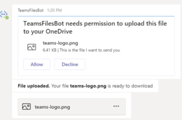

# Send and receive files with a bot

[!INCLUDE [v4 to v3 pointer](~/includes/v4-to-v3-pointer-bots.md)]

This article describe how to exchange files with a user in a one-to-one chat with your bot. You cannot use this functionality to exchange files in a team or group chat.

There are two approaches to choose from:

1. **Microsoft Graph APIs**, which supports all three scopes: `personal`, `channel`, and `groupchat`
2. **Teams bot APIs**, which only support the `personal` scope.

> [!NOTE] 
> Sending and receiving files to bots on mobile devices is not supported.

## Using the Microsoft Graph APIs

You can post messages with card attachments referencing existing SharePoint files using the Microsoft Graph APIs for [OneDrive and SharePoint](https://docs.microsoft.com/onedrive/developer/rest-api/). Using the Graph APIs requires obtaining authenticated access, through the standard OAuth 2.0 flow, to:

- A user's OneDrive folder (for `personal` and `groupchat` files).
- Or to the files in a team's channels (for `channel` files). This method works in all Teams scopes.

## Using the Teams Bot APIs

Your bot can directly send and receive files with users in the `personal` context, also known as personal chats, using Teams APIs. This lets you implement scenarios such expense reporting, image recognition, file archival, e-signatures, and other scenarios involving direct manipulation of file content. Files shared in Teams typically appear as cards, and allow rich in-app viewing.  The API is provided as part of the **Microsoft Teams Bot Platform**.

> [!NOTE]
> This method works only in the `personal` context. It does not work in the `channel` or `groupchat` context.

### Configure your bot to support files

To send and receive files in your bot, you must set the `supportsFiles` property in the manifest to `true`. This property is described in the [bots](https://docs.microsoft.com/microsoftteams/platform/resources/schema/manifest-schema#bots
) section of the Manifest reference.

The setting looks like this: `"supportsFiles": true`.

## Invoke activity when the user accepts the file upload

The file is uploaded to the user's **OneDrive** storage after the consent to upload is issued. The bot will receive a message activity which contains file metadata, such as its name and the content URL. Follow these steps:

1. Send a message to the user requesting permission to write the file. This message must contain a `FileConsentCard` attachment with the name of the file to be uploaded.

    

2. If the user accepts the file upload, your bot will receive an *Invoke* activity with a location URL.
3. To transfer the file, your bot performs an `HTTP POST` directly into the provided location URL.
4. Optionally, you can remove the original consent card if you do not want to allow the user to accept further uploads of the same file.
 
The following example shows an abridged version of the invoke activity that your bot will receive:

```json
{
    "name": "fileConsent/invoke",
    "type": "invoke",
    "timestamp": "2019-10-24T20:22:37.875Z",
    "localTimestamp": "2019-10-24T13:22:37.875-07:00",
    "id": "f:8805947989118514037",

    ...

    "value": {
        "type": "fileUpload",
        "action": "accept",
        "context": {
            "filename": "teams-logo.png"
        },
        "uploadInfo": {
            "contentUrl": "https://contoso.sharepoint.com//personal/<user alias>/Documents/Applications/TeamsFilesBot/teams-logo.png",
            "name": "teams-logo.png",
            "uploadUrl": "https://contoso.sharepoint.com//personal/<user alias>/_api/v2.0/drive/items/01FED6KHQXVVCUCI6XVJCZZMU2WMUSA6JS/uploadSession?guid=<GUID>",
            "uniqueId": "<Unique ID>",
            "fileType": "png"
        }
    },

    "locale": "en-US"
}

```

The following table describes the content properties of the attachment:

| Property | Purpose |
| --- | --- |
| `uploadUrl` | OneDrive URL for uploading the content of the file. |
| `uniqueId` | Unique file ID. This will be the OneDrive drive item ID. |
| `fileType` | File extension type, such as pdf or *png**. |

As a best practice, you should acknowledge the file upload by sending back a message to the user.

If the user declines the file, your bot will receive the following event, with the same overall activity name:

```json
{
  "name": "fileConsent/invoke",
  "value": {
    "type": "fileUpload",
    "action": "decline",
    "context": {
      ...
    }
  }
}
```

### Notifying the user about an uploaded file

After uploading a file to the user's OneDrive, you should send a confirmation message to the user. This message should contain  a `FileCard` attachment that the user can click on, either to preview it, open it in OneDrive, or download locally. The following is an example. 

```json
{
  "attachments": [{
    "contentType": "application/vnd.microsoft.teams.card.file.info",
    "contentUrl": "https://contoso.sharepoint.com/personal/johnadams_contoso_com/Documents/Applications/file_example.txt",
    "name": "file_example.txt",
    "content": {
      "uniqueId": "<unique ID>",
      "fileType": "png",
    }
  }]
}

```

The following table describes the content properties of the attachment:

| Property | Purpose |
| --- | --- |
| `uniqueId` | OneDrive/SharePoint drive item ID. |
| `fileType` | File type, such as pdf or docx. |

## Example using the Bot Framework SDK

The following example shows how you can handle file uploads and send file consent requests to the user in the bot's dialog. The code snippets shown next, belong to a complete runnable example you can download at this location: [FileUpload](https://github.com/microsoft/botbuilder-dotnet/tree/main/tests/Teams/FileUpload).

# [C#/.NET](#tab/dotnet)

```csharp
protected override async Task OnMessageActivityAsync(ITurnContext<IMessageActivity> turnContext, CancellationToken cancellationToken)
{
    bool messageWithFileDownloadInfo = turnContext.Activity.Attachments?[0].ContentType == FileDownloadInfo.ContentType;
    if (messageWithFileDownloadInfo)
    {
        var file = turnContext.Activity.Attachments[0];
        var fileDownload = JObject.FromObject(file.Content).ToObject<FileDownloadInfo>();

        string filePath = Path.Combine("Files", file.Name);

        var client = _clientFactory.CreateClient();
        var response = await client.GetAsync(fileDownload.DownloadUrl);
        using (var fileStream = new FileStream(filePath, FileMode.Create, FileAccess.Write, FileShare.None))
        {
            await response.Content.CopyToAsync(fileStream);
        }

        var reply = ((Activity)turnContext.Activity).CreateReply();
        reply.TextFormat = "xml";
        reply.Text = $"Complete downloading <b>{file.Name}</b>";
        await turnContext.SendActivityAsync(reply, cancellationToken);
    }
    else
    {
        string filename = "teams-logo.png";
        string filePath = Path.Combine("Files", filename);
        long fileSize = new FileInfo(filePath).Length;
        await SendFileCardAsync(turnContext, filename, fileSize, cancellationToken);
    }
}

private async Task SendFileCardAsync(ITurnContext turnContext, string filename, long filesize, CancellationToken cancellationToken)
{
    var consentContext = new Dictionary<string, string>
    {
        { "filename", filename },
    };

    var fileCard = new FileConsentCard
    {
        Description = "This is the file I want to send you",
        SizeInBytes = filesize,
        AcceptContext = consentContext,
        DeclineContext = consentContext,
    };

    var asAttachment = new Attachment
    {
        Content = fileCard,
        ContentType = FileConsentCard.ContentType,
        Name = filename,
    };

    var replyActivity = turnContext.Activity.CreateReply();
    replyActivity.Attachments = new List<Attachment>() { asAttachment };

    await turnContext.SendActivityAsync(replyActivity, cancellationToken);
}

protected override async Task OnTeamsFileConsentAcceptAsync(ITurnContext<IInvokeActivity> turnContext, FileConsentCardResponse fileConsentCardResponse, CancellationToken cancellationToken)
{
    try
    {
        JToken context = JObject.FromObject(fileConsentCardResponse.Context);

        string filePath = Path.Combine("Files", context["filename"].ToString());
        long fileSize = new FileInfo(filePath).Length;
        var client = _clientFactory.CreateClient();
        using (var fileStream = File.OpenRead(filePath))
        {
            var fileContent = new StreamContent(fileStream);
            fileContent.Headers.ContentLength = fileSize;
            fileContent.Headers.ContentRange = new ContentRangeHeaderValue(0, fileSize - 1, fileSize);
            await client.PutAsync(fileConsentCardResponse.UploadInfo.UploadUrl, fileContent, cancellationToken);
        }

        await FileUploadCompletedAsync(turnContext, fileConsentCardResponse, cancellationToken);
    }
    catch (Exception e)
    {
        await FileUploadFailedAsync(turnContext, e.ToString(), cancellationToken);
    }
}

protected override async Task OnTeamsFileConsentDeclineAsync(ITurnContext<IInvokeActivity> turnContext, FileConsentCardResponse fileConsentCardResponse, CancellationToken cancellationToken)
{
    JToken context = JObject.FromObject(fileConsentCardResponse.Context);

    var reply = ((Activity)turnContext.Activity).CreateReply();
    reply.TextFormat = "xml";
    reply.Text = $"Declined. We won't upload file <b>{context["filename"]}</b>.";
    await turnContext.SendActivityAsync(reply, cancellationToken);
}
```

# [TypeScript/Node.js](#tab/typescript)

<!-- From sample: libraries\botbuilder\tests\teams\fileUpload\src\fileUploadBot.ts-->

```typescript

export class FileUploadBot extends TeamsActivityHandler {
    constructor() {
        super();

        this.onMessage(async (context, next) => {
            await this.sendFileCard(context);
            await next();
        });

        this.onMembersAdded(async (context, next) => {
            const membersAdded = context.activity.membersAdded;
            for (const member of membersAdded) {
                if (member.id !== context.activity.recipient.id) {
                    await context.sendActivity('Hello and welcome!');
                }
            }
            await next();
        });
    }

    private async sendFileCard(context: TurnContext): Promise<void> {
        let filename = "file name";
        let fs = require('fs'); 
        let path = require('path');
        let stats = fs.statSync(path.join('files', filename));
        let fileSizeInBytes = stats['size'];

        let fileContext = {
            filename: filename
        };

        let attachment = {
            content: <FileConsentCard>{
                description: 'This is the file I want to send you',
                fileSizeInBytes: fileSizeInBytes,
                acceptContext: fileContext,
                declineContext: fileContext
            },
            contentType: 'application/vnd.microsoft.teams.card.file.consent',
            name: filename
        } as Attachment;

        var replyActivity = this.createReply(context.activity);
        replyActivity.attachments = [ attachment ];
        await context.sendActivity(replyActivity);
    }

    protected async handleTeamsFileConsentAccept(context: TurnContext, fileConsentCardResponse: FileConsentCardResponse): Promise<void> {
        try {
            await this.sendFile(fileConsentCardResponse);
            await this.fileUploadCompleted(context, fileConsentCardResponse);
        }
        catch (err) {
            await this.fileUploadFailed(context, err.toString());
        }
    }

    protected async handleTeamsFileConsentDecline(context: TurnContext, fileConsentCardResponse: FileConsentCardResponse): Promise<void> {
        let reply = this.createReply(context.activity);
        reply.textFormat = "xml";
        reply.text = `Declined. We won't upload file <b>${fileConsentCardResponse.context["filename"]}</b>.`;
        await context.sendActivity(reply);
    }
...

}

```

<!-- Python samples verify -->

# [Python](#tab/python)

```python
class TeamsFileUploadBot(TeamsActivityHandler):
    async def on_message_activity(self, turn_context: TurnContext):
        message_with_file_download = (
            False
            if not turn_context.activity.attachments
            else turn_context.activity.attachments[0].content_type == ContentType.FILE_DOWNLOAD_INFO
        )

        if message_with_file_download:
            # Save an uploaded file locally
            file = turn_context.activity.attachments[0]
            file_download = FileDownloadInfo.deserialize(file.content)
            file_path = "files/" + file.name

            response = requests.get(file_download.download_url, allow_redirects=True)
            open(file_path, "wb").write(response.content)

            reply = self._create_reply(
                turn_context.activity, f"Complete downloading <b>{file.name}</b>", "xml"
            )
            await turn_context.send_activity(reply)
        else:
            # Attempt to upload a file to Teams.  This will display a confirmation to
            # the user (Accept/Decline card).  If they accept, on_teams_file_consent_accept
            # will be called, otherwise on_teams_file_consent_decline.
            filename = "teams-logo.png"
            file_path = "files/" + filename
            file_size = os.path.getsize(file_path)
            await self._send_file_card(turn_context, filename, file_size)

    async def _send_file_card(
            self, turn_context: TurnContext, filename: str, file_size: int
    ):
        """
        Send a FileConsentCard to get permission from the user to upload a file.
        """

        consent_context = {"filename": filename}

        file_card = FileConsentCard(
            description="This is the file I want to send you",
            size_in_bytes=file_size,
            accept_context=consent_context,
            decline_context=consent_context
        )

        as_attachment = Attachment(
            content=file_card.serialize(), content_type=ContentType.FILE_CONSENT_CARD, name=filename
        )

        reply_activity = self._create_reply(turn_context.activity)
        reply_activity.attachments = [as_attachment]
        await turn_context.send_activity(reply_activity)

    async def on_teams_file_consent_accept(
            self,
            turn_context: TurnContext,
            file_consent_card_response: FileConsentCardResponse
    ):
        """
        The user accepted the file upload request.  Do the actual upload now.
        """

        file_path = "files/" + file_consent_card_response.context["filename"]
        file_size = os.path.getsize(file_path)

        headers = {
            "Content-Length": f"\"{file_size}\"",
            "Content-Range": f"bytes 0-{file_size-1}/{file_size}"
        }
        response = requests.put(
            file_consent_card_response.upload_info.upload_url, open(file_path, "rb"), headers=headers
        )

        if response.status_code != 200:
            await self._file_upload_failed(turn_context, "Unable to upload file.")
        else:
            await self._file_upload_complete(turn_context, file_consent_card_response)

    async def on_teams_file_consent_decline(
            self,
            turn_context: TurnContext,
            file_consent_card_response: FileConsentCardResponse
    ):
        """
        The user declined the file upload.
        """

        context = file_consent_card_response.context

        reply = self._create_reply(
            turn_context.activity,
            f"Declined. We won't upload file <b>{context['filename']}</b>.",
            "xml"
        )
        await turn_context.send_activity(reply)

    async def _file_upload_complete(
            self,
            turn_context: TurnContext,
            file_consent_card_response: FileConsentCardResponse
    ):
        """
        The file was uploaded, so display a FileInfoCard so the user can view the
        file in Teams.
        """

        name = file_consent_card_response.upload_info.name

        download_card = FileInfoCard(
            unique_id=file_consent_card_response.upload_info.unique_id,
            file_type=file_consent_card_response.upload_info.file_type
        )

        as_attachment = Attachment(
            content=download_card.serialize(),
            content_type=ContentType.FILE_INFO_CARD,
            name=name,
            content_url=file_consent_card_response.upload_info.content_url
        )

        reply = self._create_reply(
            turn_context.activity,
            f"<b>File uploaded.</b> Your file <b>{name}</b> is ready to download",
            "xml"
        )
        reply.attachments = [as_attachment]

        await turn_context.send_activity(reply)

    async def _file_upload_failed(self, turn_context: TurnContext, error: str):
        reply = self._create_reply(
            turn_context.activity,
            f"<b>File upload failed.</b> Error: <pre>{error}</pre>",
            "xml"
        )
        await turn_context.send_activity(reply)

    def _create_reply(self, activity, text=None, text_format=None):
        return Activity(
            type=ActivityTypes.message,
            timestamp=datetime.utcnow(),
            from_property=ChannelAccount(
                id=activity.recipient.id, name=activity.recipient.name
            ),
            recipient=ChannelAccount(
                id=activity.from_property.id, name=activity.from_property.name
            ),
            reply_to_id=activity.id,
            service_url=activity.service_url,
            channel_id=activity.channel_id,
            conversation=ConversationAccount(
                is_group=activity.conversation.is_group,
                id=activity.conversation.id,
                name=activity.conversation.name,
            ),
            text=text or "",
            text_format=text_format or None,
            locale=activity.locale,
        )


```

---
