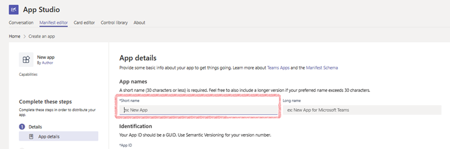
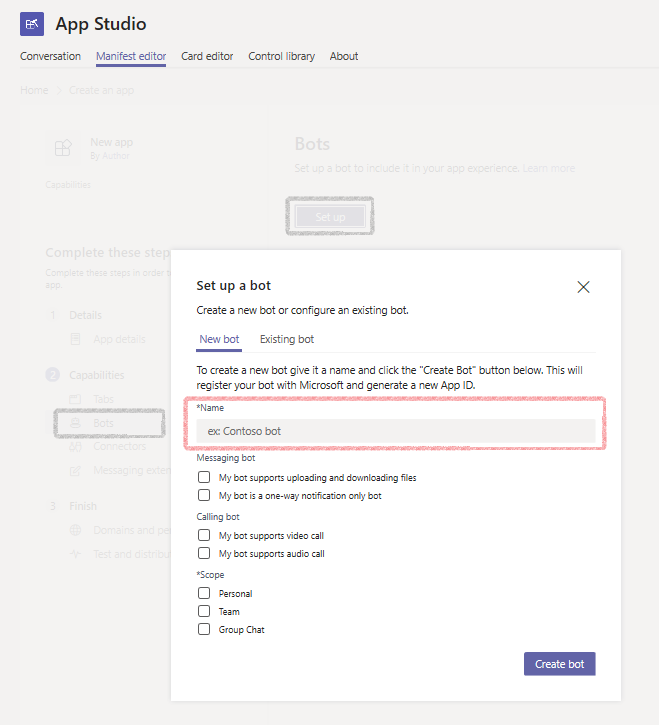
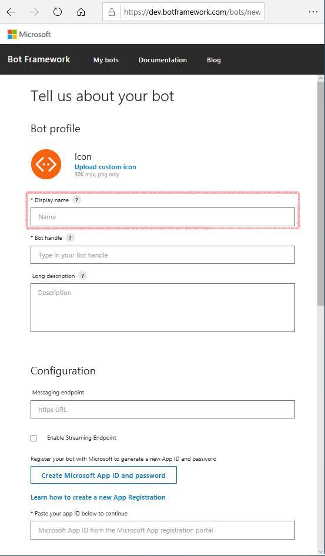

# Subscribe to Conversation Events

Microsoft Teams sends notifications to your bot for events that happen in scopes where your bot is active. You can capture these events in your code and take action on them, such as the following:

* Trigger a welcome message when your bot is added to a team
* Trigger a welcome message when a new team member is added or removed
* Trigger a notification when a channel is created, renamed or deleted
* When a bot message is liked by a user


## Conversation Update Events

A bot receives a `conversationUpdate` event when it has been added to a conversation, other members have been added to or removed from a conversation, or conversation metadata has changed.

The `conversationUpdate` event is sent to your bot when it receives information on membership updates for teams where it has been added. It also receives an update when it has been added for the first time specifically for personal conversations. 

> [!Note]
> The user information (Id) is unique for your bot and can be cached for future use by your service (such as sending a message to a specific user).


The following table shows a list of Teams conversation update events, with links to more details.


| Action Taken        | EventType         | Method Called              | Description                | Scope |
| ------------------- | ----------------- | -------------------------- | -------------------------- | ----- |
| channel created     | channelCreated    | OnTeamsChannelCreatedAsync | [A channel was created](#channel-created) | Team |
| channel renamed     | channelRenamed    | OnTeamsChannelRenamedAsync | [A channel was renamed](#channel-renamed) | Team |
| channel deleted     | channelDeleted    | OnTeamsChannelDeletedAsync | [A channel was deleted](#channel-deleted) | Team |
| team member added   | teamMemberAdded   | OnTeamsMembersAddedAsync   | [A Member added to team](#member-added)   | All |
| team renamed        | teamRenamed       | OnTeamsTeamRenamedAsync    | [A Team was renamed](#team-renamed)       | Team |
| team member removed | teamMemberRemoved | OnTeamsMembersRemovedAsync | [A Member was removed from team](#member-removed) | groupChat & team |


### Channel Updates

Your bot is notified when a channel is created, renamed, or deleted in a team where it has been added. Again, the `conversationUpdate` event is received, and a Teams-specific event identifier is sent as part of the channelData.eventType object, where the channel data's `channel.id` is the GUID for the channel, and `channel.name` contains the channel name.

The channel events are as follows:

* channelCreated: A user adds a new channel to the team
* channelRenamed: A user renames an existing channel
* channelDeleted: A user removes a channel


#### Channel Created

# [C#](#tab/csharp)

The following code snippet demonstrates handling the `channelCreated` event, which calls the `OnTeamsChannelCreatedAsync` method. You will need to add the `OnTeamsChannelCreatedAsync` method directly to your bot class to handle this event. 

```csharp
protected override async Task OnTeamsChannelCreatedAsync(ChannelInfo channelInfo, TeamInfo teamInfo, ITurnContext<IConversationUpdateActivity> turnContext, CancellationToken cancellationToken)
{
    var heroCard = new HeroCard(text: $"{channelInfo.Name} is the Channel created");
    await turnContext.SendActivityAsync(MessageFactory.Attachment(heroCard.ToAttachment()), cancellationToken);
}
```


<!--
# [JavaScript](#tab/javascript)
-->

---


#### Channel Renamed

# [C#](#tab/csharp)

The following code snippet demonstrates handling the `channelRenamed` event, which calls the `OnTeamsChannelRenamedAsync` method. You will need to add the `OnTeamsChannelRenamedAsync` method directly to your bot class to handle this event. 

```csharp
protected override async Task OnTeamsChannelRenamedAsync(ChannelInfo channelInfo, TeamInfo teamInfo, ITurnContext<IConversationUpdateActivity> turnContext, CancellationToken cancellationToken)
{
    var heroCard = new HeroCard(text: $"{channelInfo.Name} is the new Channel name");
    await turnContext.SendActivityAsync(MessageFactory.Attachment(heroCard.ToAttachment()), cancellationToken);
}
```        
<!--
# [JavaScript](#tab/javascript)
-->

---


#### Channel Deleted

# [C#](#tab/csharp)

The following code snippet demonstrates handling the `channelDeleted` event, which calls the `OnTeamsChannelDeletedAsync` method. You will need to add the `OnTeamsChannelDeletedAsync` method directly to your bot class to handle this event. 

```csharp
protected override async Task OnTeamsChannelDeletedAsync(ChannelInfo channelInfo, TeamInfo teamInfo, ITurnContext<IConversationUpdateActivity> turnContext, CancellationToken cancellationToken)
{
    var heroCard = new HeroCard(text: $"{channelInfo.Name} is the Channel deleted");
    await turnContext.SendActivityAsync(MessageFactory.Attachment(heroCard.ToAttachment()), cancellationToken);
}
```


<!--
# [JavaScript](#tab/javascript)
-->

---


### Team Member Added

The `teamMemberAdded` event is sent to your bot the first time it is added to a team and every time a new user is added to a team that your bot is a member of. 


# [C#](#tab/csharp)

The following code snippet demonstrates handling the `teamMemberAdded` event, which calls the `OnTeamsMembersAddedAsync` method. You will need to add the `OnTeamsMembersAddedAsync` method directly to your bot class to handle this event. 


```csharp
protected override async Task OnTeamsMembersAddedAsync(IList<ChannelAccount> membersAdded, TeamInfo teamInfo, ITurnContext<IConversationUpdateActivity> turnContext, CancellationToken cancellationToken)
{
    var heroCard = new HeroCard(text: $"{string.Join(' ', membersAdded.Select(member => member.Id))} joined {teamInfo.Name}");
    await turnContext.SendActivityAsync(MessageFactory.Attachment(heroCard.ToAttachment()), cancellationToken);
}
```

#### Sending a welcome message to a new team member

It is a good practice to send a welcome message, possibly with information about your bot and how to use it, when a new user is added to a team. There are potentially two ways to determine if the new user added was the bot itself or a new user.  One approach is by looking at the `Activity` object of the `turnContext`.  If the `Id` field of the `MembersAdded` object is the same as the `Id` field of the `Recipient` object, then the new member added is the bot, otherwise it is a new user.  The bot's `Id` will generally be: `28:<MicrosoftAppId>`.

The other way is to see is the new members AadObjectId is null.  Since bots do not have an AadObjectId, it will always be null and since all team members should, you can send a welcome message to all team members by doing this check. Either approach can be used, the later approach is demonstrated below.


```csharp
protected override async Task OnTeamsMembersAddedAsync
                                (IList<ChannelAccount> membersAdded, 
                                TeamInfo teamInfo, 
                                ITurnContext<IConversationUpdateActivity> turnContext, 
                                CancellationToken cancellationToken)
{

    if (membersAdded.First().AadObjectId == null)
    {
        if (membersAdded.First().Id == turnContext.Activity.Recipient.Id)
        {
            var heroCard = new HeroCard(text: $"The {turnContext.Activity.Recipient.Name} bot has joined {teamInfo.Name}");
            await turnContext.SendActivityAsync(MessageFactory.Attachment(heroCard.ToAttachment()), cancellationToken);
        }
        else
        {
            throw new ArgumentNullException(nameof(membersAdded));
        }
    }
    else
    {
        IEnumerable<TeamsChannelAccount> teamsChannelAccounts = await TeamsInfo.GetMembersAsync(turnContext, cancellationToken);

        var newTeamMember =
            from teamsChannelAccount in teamsChannelAccounts
            where teamsChannelAccount.AadObjectId.Equals(membersAdded.First().AadObjectId)
            select teamsChannelAccount.Name;

        var heroCard = new HeroCard(text: $"{string.Join(' ', newTeamMember.First())} joined {teamInfo.Name}");
        await turnContext.SendActivityAsync(MessageFactory.Attachment(heroCard.ToAttachment()), cancellationToken);
    }
}
```


> [!Tip]
> When your bot receives a `membersAdded` event when in a personal scoped chat, the `channelData.team` object will be null. You can use this as a filter to enable a different welcome message depending on scope.

<!--
# [JavaScript](#tab/javascript)
-->

---


> [!NOTE]
> If the bot name that you use to @Mention your bot is different from the name given in the message response, that is because the names come from different places. The name of your bot that you @Mention is the value you entered for the _app short name_ in the __App details__ section of the Manifest editor in App Studio:
> 
> 
> 
> The name you will see associated with the bot's response will be the name you entered in the ___Setup a bot___ dialog that appears in App Studio in the bot capabilities section of the Manifest editor: 
>
> 
>
> However, if you registered your bot using `https://dev.botframework.com/bots/new`, the response will come from the name you entered into the _Display name_ field. 
> 
> 


### Team Member Removed

The `teamMemberRemoved` event is sent to your bot if it is removed from a team and every time any user is removed from a team that your bot is a member of. You can determine if the new member removed was the bot itself or a user by looking at the `Activity` object of the `turnContext`.  If the `Id` field of the `MembersRemoved` object is the same as the `Id` field of the `Recipient` object, then the member removed is the bot, otherwise it is a user.  The bot's `Id` will generally be: `28:<MicrosoftAppId>`


# [C#](#tab/csharp)

The following code snippet demonstrates handling the `teamMemberRemoved` event, which calls the `OnTeamsMembersRemovedAsync` method. You will need to add the `OnTeamsMembersRemovedAsync` method directly to your bot class to handle this event. 

```csharp
protected override async Task OnTeamsMembersRemovedAsync(IList<ChannelAccount> membersRemoved, TeamInfo teamInfo, ITurnContext<IConversationUpdateActivity> turnContext, CancellationToken cancellationToken)
{
    var heroCard = new HeroCard(text: $"{string.Join(' ', membersRemoved.Select(member => member.Id))} removed from {teamInfo.Name}");
    await turnContext.SendActivityAsync(MessageFactory.Attachment(heroCard.ToAttachment()), cancellationToken);
}
```


<!--
# [JavaScript](#tab/javascript)
-->

---


### Team Renamed

Your bot is notified when the team it is in has been renamed. It receives a `conversationUpdate` event with eventType.teamRenamed in the channelData object. Please note that there are no notifications for team creation or deletion, because bots exist only as part of teams and have no visibility outside the scope in which they have been added.

# [C#](#tab/csharp)

The following code snippet demonstrates handling the `teamRenamed` event, which calls the `OnTeamsTeamRenamedAsync` method. You will need to aAdd the `OnTeamsTeamRenamedAsync` method directly to your bot class to handle this event. 

```csharp
protected override async Task OnTeamsTeamRenamedAsync(TeamInfo teamInfo, ITurnContext<IConversationUpdateActivity> turnContext, CancellationToken cancellationToken)
{
    var heroCard = new HeroCard(text: $"{teamInfo.Name} is the new Team name");
    await turnContext.SendActivityAsync(MessageFactory.Attachment(heroCard.ToAttachment()), cancellationToken);
}
```


<!--
# [JavaScript](#tab/javascript)
-->

---


## Message Reaction Events

The `messageReaction` event is sent when a user adds or removes his or her reaction to a message which was originally sent by your bot. 

| EventType       | Payload object   | Description                                                             | Scope |
| --------------- | ---------------- | ----------------------------------------------------------------------- | ----- |
| messageReaction | reactionsAdded   | [Reaction to bot message](#Reaction-to-bot-message)                     | All   |
| messageReaction | reactionsRemoved | [Reaction removed from bot message](#Reaction-removed-from-bot-message) | All   |

The `ActivityTypes.MessageReaction` event is sent when a user adds or removes his or her reaction to a message which was originally sent by your bot. `replyToId` contains the ID of the specific message, and the `Type` is the type of reaction in text format.  The types of reactions include: "angry", "heart", "laugh", "like", "Sad", "surprised".


### Reactions to a bot message


# [C#](#tab/csharp)


```csharp
protected override async Task OnReactionsAddedAsync(IList<MessageReaction> messageReactions, ITurnContext<IMessageReactionActivity> turnContext, CancellationToken cancellationToken)
{
    foreach (var reaction in messageReactions)
    {
      var newReaction = $"You reacted with '{reaction.Type}' to the following message: '{turnContext.Activity.ReplyToId}'";
      var replyActivity = MessageFactory.Text(newReaction);
      var resourceResponse = await turnContext.SendActivityAsync(replyActivity, cancellationToken);
    }
}
```

<!--
# [JavaScript](#tab/javascript)
-->

---


### Reactions removed from bot message


# [C#](#tab/csharp)


```csharp
protected override async Task OnReactionsRemovedAsync(IList<MessageReaction> messageReactions, ITurnContext<IMessageReactionActivity> turnContext, CancellationToken cancellationToken)
{
    foreach (var reaction in messageReactions)
    {
      var newReaction = $"You removed the reaction '{reaction.Type}' from the following message: '{turnContext.Activity.ReplyToId}'";
      var replyActivity = MessageFactory.Text(newReaction);
      var resourceResponse = await turnContext.SendActivityAsync(replyActivity, cancellationToken);
    }
}
```


<!--
# [JavaScript](#tab/javascript)
-->

---

## Writing notes

 * **Purpose** Describes the events your bot can subscribe to, and how to work with them. Includes:
   * Conversation Update events
     * channel renamed
     * channel created
     * channel deleted
     * team renamed
     * member added
     * member removed
     * team member added
     * team member removed
   * Message reactions
     * reactions added
     * reactions removed
 * **Existing teams doc reference** 
   * [Handle bot events in Microsoft Teams](https://docs.microsoft.com/en-us/microsoftteams/platform/concepts/bots/bots-notifications)
 * **Existing Bot framework doc reference** 
   * [bot-builder-send-welcome-message](https://docs.microsoft.com/en-us/azure/bot-service/bot-builder-send-welcome-message?view=azure-bot-service-4.0&tabs=csharp)
 * **Code Snippets** 
   * [ConversationUpdate](https://github.com/microsoft/botbuilder-dotnet/tree/master/tests/Teams/ConversationUpdate)
   * [MessageReaction](https://github.com/microsoft/botbuilder-dotnet/tree/master/tests/Teams/MessageReaction)