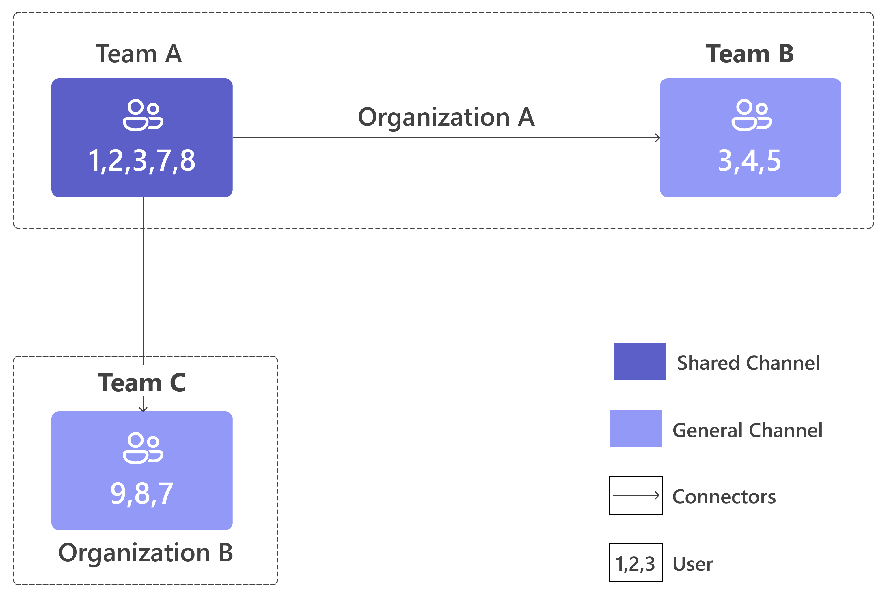

# Microsoft Teams connect shared and private channels

Shared and private channels in Microsoft Teams enable flexible collaboration within and across teams or organizations. Shared channels allow seamless communication with internal or external partners. Private channels provide a secure space for selected team members to collaborate on sensitive or confidential content, ensuring privacy and focused discussions within the team.

## Understand channel models in Microsoft Teams

When building or integrating apps with Microsoft Teams, understand how different channel types affect visibility, membership, and data storage.

* **Standard channels:** Accessible to every team member by default. The standard channels support team-wide collaboration and are suitable for scenarios where bots, or tabs, need to be accessible to every team member. Files shared in standard channels are stored in the team’s SharePoint site.

* **Private channels:** Visible only to a selected subset of team members. The private channels are suited for scenarios that require tighter control over membership and data, such as limiting bots, connectors, or stored files to only members of the private channel. Files shared in private channels are stored in a dedicated SharePoint site, separate from the team’s default site.

* **Shared channels:** Designed for cross-team and cross-organization collaboration. They support scenarios where app components such as bots and tabs, need to interact with users who aren’t part of the host team, without requiring those users to join the team. Files are managed in the shared channel's SharePoint site.

## Teams channels – capabilities comparison

Following is a detailed table outlining the capabilities of different Teams channel types.

| **Model**       | **Channel Capability**                                                   | **Standard Channel**                          | **Other Channels**                                                                 |
|----------------|---------------------------------------------------------------------------|-----------------------------------------------|-------------------------------------------------------------------------------------|
| **Membership** | Can add people to the channel without adding to the host team  | :x:                                             | Supported (Shared channels)                                                        |
|                | Channel membership can be limited to a subset of the host team | :x:                                             | Supported                                                                           |
|                | Channel can be shared with other teams to inherit members | :x:                                             | Supported (Shared channels)                                                        |
|                | Channel can be shared directly with its parent team | N/A                                           | Supported (Shared channels)                                                        |
|                | External users can participate in the channel                             | :white_check_mark:   (B2B collab users)                        | :white_check_mark:   (B2B Direct Connect in Shared channels, B2B collab users in Private channels)  |
|                | Channel is hosted under a host team                                       | :white_check_mark:                                             | :white_check_mark:                                                                                  |
| **Storage**     | Each channel has a dedicated SharePoint site                              | :x:  (Inherits team site)                       | :white_check_mark:                                                                                  |
| **App Model**   | App must be installed in the host team                                    | :white_check_mark:                                             | :white_check_mark:                                                                                   |
|                | App installed to host team automatically available in channel             | :white_check_mark:                                             | :x:                                                                                  |
|                | App must be added to each channel                                          | :x:                                             | :white_check_mark:                                                                                   |

## Understand channel differences that impact app functionality

Understanding the difference between Microsoft Teams channel types is essential. Incorrect assumptions about membership, storage, or privacy can lead to broken functionality or unintended data exposure.

* In private and shared channels, not everyone in the team has access. Only members who are specifically added to the channel can participate in these channels. If your bot targets "everyone," it may violate privacy or miss external members. Always use channel-specific membership APIs to determine the correct members.

* Channel members might include in-tenant users, guests, or cross-tenant users (external users from other tenants). Your app must distinguish between these roles to manage access, data visibility, and feature availability. Always validate user roles and tenant IDs before granting permissions or executing actions.

* Private and shared channels have their own SharePoint sites. If your app targets the wrong site, it may encounter missing files or unauthorized access errors. Always resolve the correct site URL for each channel.

* Aggregate or cross-post data across channels only when necessary. Keep data scoped to the channel unless clearly defined to prevent accidental leaks. For example, analytics apps should not include private channel data in team-wide reports unless permissions are clearly defined.

                                                   |

> [!NOTE]
>
> Don't depend on channel type to determine behavior. Avoid making make any logic decisions based on the channel type in your code. Instead, check for the capabilities your app needs (for example, membership boundaries, storage location, external access) and always use APIs and patterns that work across all channel types.

Use the following guidance to enable app support for shared and private channels.

## Enable app support for shared and private channels

You can enable app support for shared and private channels based on whether your app is:
  
* Using channel or team membership to determine message delivery, task assignment, or permissions
* Accessing or managing files stored in Teams or SharePoint
* Combining or sharing data across multiple channels or teams
* Customizing the experience based on whether users are internal, guests, or external participants 

If it doesn't follow the preceding parameters, perform the following steps to enable app support in shared and private channels:

1. Add ``"supportsChannelFeatures": "tier1"`` to your app manifest to enable support for shared and private channels.
2. To verify expected behavior, test your app in standard, private, and shared channels.

If your app uses any of the preceding features, see the following articles, for more information:

* [Manage channel membership](#manage-channel-membership)
* [Understand app permissions in shared channels](#understand-app-permissions-in-shared-channels)
* [Verify if your app is added to a channel](#verify-if-your-app-is-added-to-a-channel)

> [!NOTE]
>
> * Tab and bot apps in shared and private channels are available in [Government Community Cloud (GCC), GCC High, Department of Defense (DoD)](../cloud-overview.md#teams-app-capabilities), and [Teams operated by 21Vianet](../sovereign-cloud.md) environments.
> * SharePoint and the SharePoint pages apps aren't supported for shared channels in GCC, GCC High, DoD, and Teams operated by 21Vianet environments.                                                   |

### Get context for shared and private channels

When loading the content UX in a shared or private channel, use the data received from `getContext` call for shared or private channel changes. `getContext` call publishes two new properties, `hostTeamGroupID` and `hostTenantID`, which are used to retrieve channel membership using Microsoft Graph APIs. `hostTeam` is the team that creates the shared channel.

For more information to enable your tab, see:

* [Get context for your tab for private channels](../../tabs/how-to/access-teams-context.md#retrieve-context-in-private-channels)
* [Get context in shared channels](../../tabs/how-to/access-teams-context.md#get-context-in-shared-channels)

## Manage channel membership

This section explains how to view and manage the membership of Microsoft Teams Channels.

### Retrieve full channel membership

To accurately retrieve the all members of any Microsoft Teams channel Standard, Private, or Shared use the ``allMembers`` API:

```HTTP
GET /teams/{team-id}/channels/{channel-id}/allMembers``
```

This API works across all channel types and returns the actual members of a channel, rather than the broader team members. For shared channels, it also includes indirect members, such as users from other teams who have been granted access.

### Understand shared channel membership

Shared channels support three types of membership direct, indirect and external allowing flexible collaboration across teams.

#### Direct members

Direct members are users who has been explicitly added to the shared channel itself. Direct members has access to the shared channel regardless of their team membership.

You can retrieve the list of direct members in a shared channel by using the ``hostTeamGroupID`` obtained from ``getContext`` and calling the appropriate API. This method returns all users who have been explicitly added to the shared channel, including both internal and external participants.

To retrieve direct members of a shared channel:

1. Call the following API:

    ```HTTP
    GET /teams/{host-team-group-id}/channels/{channel-id}/members
    ```

#### Indirect members

Indirect members are users who can access shared channel through their membership in a team that the channel is shared with. These users are not added directly to the channel but are eligible to participate because their team has been granted access.

To retrieve indirect members of a shared channel:

1. Call the following API to identify which teams the channel is shared with:

```HTTP
GET /teams/{host-team-group-id}/channels/{channel-id}/sharedWithTeams
```

2. Call the following API for each team returned:

```HTTP
GET /teams/{host-team-group-id}/channels/{channel-id}/sharedWithTeams/{shared-team-id}/allowedMembers
```

#### External members

An external member are users who is not part of your organization but has been granted access to a shared channel through guest access or cross-tenant collaboration.

To retrieve external members of a shared channel:

1. Call the following API:

```HTTP
GET /teams/{host-team-group-id}/channels/{channel-id}/members
```

## Get app notifications for direct and indirect membership changes

### [Graph](#tab/graph)

Apps installed in shared channels receive notifications when users are added to or removed from a team that shares the channel. To receive these notifications, you must:

1. [Install the app](../deploy-and-publish/apps-upload.md) in a host team and enable it for the shared channel.
2. Create a valid Microsoft Graph change notification subscription to monitor associated team membership changes and shared or unshared events using supported APIs.

To receive both direct and indirect member update notifications, you must include both the query string parameters when creating a subscription. If the query strings aren't provided, the subscription only delivers notifications for direct member updates. To learn more, see [Channel membership access](/graph/teams-changenotifications-channelmembership).

```HTTP
`/teams/{team-id}/channels/getAllMembers?notifyOnIndirectMembershipUpdate=true&suppressNotificationWhenSharedUnsharedWithTeam=true`
```

This subscription enables apps to monitor membership changes in shared channels and its associated teams. For more information on how to create a Microsoft Graph change notification subscription, see [Create a subscription.](/graph/teams-changenotifications-teammembership)

### [Microsoft 365 Agents SDK](#tab/microsoft365agentssdk1)

When a new member is added to a shared channel, the ```OnMembersAddedAsync``` method is called. This method provides the context and details of the user who was added, allowing the bot to respond accordingly.

```csharp
 protected override async Task OnTeamsMembersAddedAsync(
            IList<TeamsChannelAccount> membersAdded,
            TeamInfo teamInfo,
            ITurnContext<IConversationUpdateActivity> turnContext,
            CancellationToken cancellationToken)
        {
            var extended = turnContext.Activity.GetChannelData<SharedChannelChannelData>();
            var source = extended?.MembershipSource
                        ?? (turnContext.Activity.ChannelData as JObject)?["membershipSource"]?.ToObject<MembershipSourceEx>();

            if (source != null)
            {
                _logger.LogInformation("MemberAdded via {SourceType} ({MembershipType}). SourceId={Id}, TeamGroupId={TeamGroupId}, TenantId={TenantId}",
                    source.SourceType, source.MembershipType, source.Id, source.TeamGroupId, source.TenantId);

                await turnContext.SendActivityAsync(
                    MessageFactory.Text($"👤 Member added via **{source.SourceType}** ({source.MembershipType})."),
                    cancellationToken);
            }

            await base.OnTeamsMembersAddedAsync(membersAdded, teamInfo, turnContext, cancellationToken);
```

Similarly, when a member is removed from the channel, the ```OnMembersRemovedAsync``` method is called. This method allows the bot to handle clean-up tasks or adjust access controls as needed.

```csharp
        protected override async Task OnTeamsMembersRemovedAsync(
            IList<TeamsChannelAccount> membersRemoved,
            TeamInfo teamInfo,
            ITurnContext<IConversationUpdateActivity> turnContext,
            CancellationToken cancellationToken)
        {
            var source = turnContext.Activity.GetChannelData<SharedChannelChannelData>()?.MembershipSource
                        ?? (turnContext.Activity.ChannelData as JObject)?["membershipSource"]?.ToObject<MembershipSourceEx>();

            if (source != null)
            {
                _logger.LogInformation("MemberRemoved via {SourceType} ({MembershipType}). SourceId={Id}, TeamGroupId={TeamGroupId}, TenantId={TenantId}",
                    source.SourceType, source.MembershipType, source.Id, source.TeamGroupId, source.TenantId);

                await turnContext.SendActivityAsync(
                    MessageFactory.Text($"👋 Member removed (source **{source.SourceType}**, {source.MembershipType})."),
                    cancellationToken);
            }

            await base.OnTeamsMembersRemovedAsync(membersRemoved, teamInfo, turnContext, cancellationToken);
        }
```

These Microsoft 365 Agents SDK endpoints are essential for monitoring membership changes and maintaining accurate membership data across shared and private channel.

---

## Validate user access for membership updates

When an app receives a notification for an indirect membership update, it’s important to verify whether the user still has access to the shared channel as the same user might have both direct and indirect membership. For example, if a user is removed from a team that shares a channel, the app should confirm whether the user's access is truly lost. Use the ```doesUserHaveAccess``` API to determine whether the user still has access to the shared channel.

```HTTP
GET /teams/{team-id}/channels/{channel-id}/doesUserHaveAccess(userId='@userid',tenantId='@TenantID',userPrincipalName='@UserPrincipalName')
```

See [doesUserHaveAccess API](/graph/api/channel-doesuserhaveaccess?view=graph-rest-beta&tabs=http) to learn more about user accesses and relevant permissions.

## Handle bulk membership changes

If there are bulk membership changes, Teams curbs individual membership update notifications when a channel is shared or unshared with a team. This feature reduces notification volume and improves performance.

### Use sharedWithTeams subscription for bulk membership changes

### [Graph](#tab/graph-bulk)

To reduce notification overload during membership updates, such as when a shared channel is added to or removed from a team with thousands of members, use the new sharedWithTeams subscription resource:

```HTTP
`/teams/{team-id}/channels/{channel-id}/sharedWithTeams`
```

The sharedWithTeams subscription sends a single notification when a channel is shared or unshared with a team. It avoids thousands of per-user notifications and improves performance for apps that monitor membership changes. Ensure that you update the shared channel member list using the /allMembers API after receiving a "shared with" or "unshared from" team notification.

> [!NOTE]
> To support membership updates in shared channels, apps using resource-specific consent (RSC) must request extended permissions.
> These permissions let the app:
>
> * Access membership data (both direct and indirect members).
> * Receive and respond to membership change notifications.

### [Microsoft 365 Agents SDK](#tab/microsoft365agentssdk-bulk)

When a shared channel is added to another team, the Microsoft 365 Agents SDK might receive a conversationUpdate activity through the ```OnConversationUpdateActivityAsync``` method, but only if the bot is installed in the team or channel.

```csharp
        protected override async Task OnConversationUpdateActivityAsync(
            ITurnContext<IConversationUpdateActivity> turnContext,
            CancellationToken cancellationToken)
        {
            // Always present on Teams activities
            var tcd = turnContext.Activity.GetChannelData<TeamsChannelData>();
            var eventType = tcd?.EventType?.ToLowerInvariant();

            // Read extended shared-channel shape (safe even if fields are absent)
            var extended = turnContext.Activity.GetChannelData<SharedChannelChannelData>();

            // Also keep a raw JObject for logging / future-proof access
            var raw = turnContext.Activity.ChannelData as JObject
                      ?? (turnContext.Activity.ChannelData != null
                          ? JObject.FromObject(turnContext.Activity.ChannelData)
                          : new JObject());

            // Helpful baseline log
            _logger.LogInformation("ConversationUpdate eventType={EventType}, channelId={ChannelId}, teamId={TeamId}",
                eventType, tcd?.Channel?.Id, tcd?.Team?.Id);

            switch (eventType)
            {
                case "channelshared":
                {
                    var hostTeam = extended?.Team; // The channel's host team
                    var sharedWith = extended?.SharedWithTeams ?? new List<TeamInfoEx>();

                    _logger.LogInformation("ChannelShared: hostTeam={HostTeamId}, sharedWithCount={Count}",
                        hostTeam?.Id, sharedWith.Count);

                    foreach (var team in sharedWith)
                    {
                        _logger.LogInformation("SharedWithTeam: id={Id}, name={Name}, aadGroupId={AadGroupId}, tenantId={TenantId}",
                            team.Id, team.Name, team.AadGroupId, team.TenantId);
                    }

                    // Optional: surface a quick confirmation in-channel
                    await turnContext.SendActivityAsync(
                        MessageFactory.Text($"✅ Channel shared with {sharedWith.Count} team(s)."),
                        cancellationToken);
                    break;
                }

                case "channelunshared":
                {
                    var unsharedFrom = extended?.UnsharedFromTeams ?? new List<TeamInfoEx>();

                    _logger.LogInformation("ChannelUnshared: unsharedFromCount={Count}", unsharedFrom.Count);

                    foreach (var team in unsharedFrom)
                    {
                        _logger.LogInformation("UnsharedFromTeam: id={Id}, name={Name}, aadGroupId={AadGroupId}, tenantId={TenantId}",
                            team.Id, team.Name, team.AadGroupId, team.TenantId);
                    }

                    await turnContext.SendActivityAsync(
                        MessageFactory.Text($"❎ Channel unshared from {unsharedFrom.Count} team(s)."),
                        cancellationToken);
                    break;
                }

                default:
                    // No-op; continue normal routing
                    break;
            }

            await base.OnConversationUpdateActivityAsync(turnContext, cancellationToken);
        }
```

---

## Understand app permissions in shared channels

You can collaborate with external members outside of your organization using shared channels. App permissions in shared channels follow the host team's app roster and host tenant's app policy.

> [!NOTE]
> The [activity feed notification API](/graph/teams-send-activityfeednotifications) doesn't support cross-tenant notifications for apps in a shared channel.

## Verify if your app is added to a channel

For bots using the Microsoft 365 Agents SDK, if your bot receives a channelMemberAdded event in a conversationUpdate activity for itself, it indicates that the app is added to the channel.
Begin your channel-specific logic at that point, for example, send a welcome message, fetch the roster, configure tabs, or schedule jobs as needed. Bot events start flowing only after the app is added to the channel

There’s no direct API to check whether your app is added to a channel.

> [!NOTE]
>
> * Use ``GET /teams/{team-id}/installedApps``, to list installed apps at the team level.
> * Channel level InstalledApps aren't listed.
> * Avoid using team-level installations to determine which apps are  in a channel.

## Authenticate external users to access app content in SharePoint

You need to complete this step when your app stores content in the SharePoint site of the tenant that hosts the channel and requests a SharePoint token.

### [Tabs](#tab/tabs)

Save host tenant ID of shared channel where tab is configured. You can get host tenant ID from ``channel.ownerTenantId`` for JSv2 or host tenant ID for JSv1 received under ``getContext`` call.

### [Bots](#tab/bots)

For any event payload or action payload received for a bot, use Get hostTenant ID, from ``turnContext.activity.conversation.tenantId``.

---

Now, send saved host tenant ID inside tenantId parameter of getAuthToken call to allow cross-tenant users to access content hosted inside Sharepoint site attached to the shared channel.

## Identify guest users (B2B guests) in private channels

You can identify if a member of private channel is guest user, invited to your tenant from external organization, using 'roles' property received for each [conversationMember](/graph/api/resources/conversationmember) object in [List members of a channel - Microsoft Graph v1.0 | Microsoft Learn](/graph/api/channel-list-members) response.  

For guests, “roles” = “guest”

## Access sharepoint data in shared and private channels

If you're building an app using [SharePoint](/sharepoint/dev/spfx/integrate-with-teams-introduction) Framework, you need to use the SharePoint Online (SPO) site linked to the shared channel—not the one linked to the host team group. Each private channel has its own SPO site that is only accessible to members of that specific shared or private channel.

Use the Graph API to access the document library of the SPO site linked to a shared or private channel. Ensure you pass the Team ID and Channel ID received from the [Get Host Team Group ID & Channel ID](#get-host-team-group-id--channel-id) and pass in [Get filesFolder - Microsoft Graph v1.0 | Microsoft Learn](/graph/api/channel-get-filesfolder).

## Test your app across channel types

Before publishing updates, validate your app behaves correctly in real situations behaves across all channel types.

### Standard channel

Confirm that the existing functionality remains intact after your changes. Ensure tabs, bots and messaging extensions continue to work as expected.

### Private channel

Create a private channel P in Team A with atleast two members (one owner, one member).

Perform the following steps to validate:

1. Add the app to Team A then add it to private channel P.
2. Verify that your tab loads correctly in the private channel.
3. Test bot responses for different user types:
   * In-tenant member
   * Guest user or external user
4. If your app lists members or assigns tasks, confirm it only uses channel members and not the complete team.
5. Add a new member to the private channel and check:
   * Whether your app receives a membership change event
   * Whether your membership API reflects the new member.
  
### Shared channel
  
### [Shared channel (same tenant)](#tab/sharedchannel)

Create shared channel X in Team A, then share it with Team B (requires owner permissions).

Perform the following steps to validate:

1. Add the app to Team A (host team), then to Channel X.
2. Validate that members from Team B.
   * Can see the tab
   * Receive bot responses
3. Unshare the channel from Team B and confirm:
   * Your bot receives a ``channelUnshared`` event
   * Membership updates are handled correctly

### [Shared channel (external tenant)](#tab/sharedchannel-externaltenant)

Use two tenants or collaborate with a colleague from another organization via Teams Connect.

Perform the following steps to validate:

1. Have an external user send a message to your bot and confirm that is responds.
   * The bot should receive the message, provided it is added to the appropriate scope (personal chat, group chat, or channel).
2. Have the external user trigger a task module or tab interaction and verify that the authentication succeeds.
   * If using SSO, ensure ``getAuthToken`` handles the user's home tenant ID correctly.
3. Attempt to send a direct message from your bot to the external user:
   * This will fail if the user is outside your tenant
   * Confirm that in-channel communication still works.

---
  
Testing across these scenarios will help you spot any issues with functionality, permissions, and user experience.
  
## Best practices for supporting all channels

Follow these best practices to ensure your app works reliably across all channel types:

* Always retrieve the current channel’s member list and roles before performing actions. For example, when sending notifications or assigning tasks, target only the actual channel members and not the entire team.
  
* Adjust app functionality and access controls based on user roles (owner, member, guest, external). Limit sensitive actions to owners or internal users, and offer limited features to guests or external participants.

* Control data access and sharing based on channel membership and permissions. Never include private-channel data in broader reports or public channels unless explicitly authorized.

* Identify whether users are internal, guests, or external (cross-tenant), and authenticate them in their home tenant. Always validate permissions for cross-tenant scenarios, especially when they access files.

* Update help text and user guides to explain how your app behaves in different channel types, including any limitations for guests or external users.

* Cache large member lists and use change notifications to update them, rather than relying on frequent API calls. For example, refresh your cache only when a membership change event occurs.

* Test your app across different user roles and channel configurations including owners, members, guests, and external users to confirm it behaves correctly and enforces appropriate permissions.

* Review Microsoft Teams documentation and changelogs to keep your app aligned with the latest updates to APIs, permissions, and channel configurations.

## Code sample

|Sample name|Description|Node.js|
|-------------|-------------|------|
|||

## Frequently asked questions

<details>
<summary>Why isn’t the app visible when trying to add it to a channel?</summary>

If an app isn’t visible when trying to add it to a channel, there are a few likely causes. The app manifest might be missing required support, such as ``"supportsChannelFeatures": tier1``, which enables compatibility with channel features. Additionally, the installer might not have sufficient permissions, only team members or owners can add apps, and local policies must allow app installation. If the channel is an incoming shared channel (shared into a team), apps can't be added directly from that location. In such cases, switch to the host team to add the app to the channel. You can detect whether a channel is shared-in by checking the channel metadata for the host team ID.

<br>
&nbsp;
</details>
<details>
<summary>Why am I getting a 403 error stating "app not enabled in this channel" when calling channel APIs?</summary>

You’ll see a 403 error saying "app not enabled in this channel" if the app is installed at the team level but hasn’t been added to the channel. To resolve this issue, first confirm that the app is explicitly added to the channel. If your app uses resource-specific consent (RSC), verify that the permissions declared in the manifest match the API calls being made, for example, ``ChannelMember.Read.Group`` for reading channel membership. After adding the app, retry the operation. For bots, initiate channel-specific logic when the bot receives the ``channelMemberAdded`` event to confirm it has been successfully added to the channel.

<br>
&nbsp;
</details>
<details>
<summary>Why does the channel roster appear incomplete, showing only owners or missing users?</summary>

If the channel roster appears incomplete showing only owners or missing users, it might be due to using the team members API instead of the correct channel-specific API. To resolve this issue, use the ``/channels/{id}/allMembers`` API to retrieve the full channel roster. If the response still shows only owners, the app likely isn't added to the channel. Prompt the user to add the app to the channel, then retry the request to fetch the updated roster.

<br>
&nbsp;
</details>
<details>
<summary>Why does file access fail for some users even though they're part of the channel?</summary>

This failure can happen if the app is using the team’s main SharePoint site instead of the specific site linked to the channel. Your organization’s sharing policies might block the type of link, or external users might lack the necessary permissions. To resolve this issue, make sure your app uses the channel’s filesFolder property to get the correct driveId and itemId for file operations. When sharing files, use "people with existing access" links or the invite API to give access to specific users or groups.

<br>
&nbsp;
</details>
<details>
<summary>Why are external users experiencing authentication issues in tabs or task modules?</summary>

Authentication issues in tabs or task modules for external users often occur when the app requests a token for the host tenant instead of the user’s home tenant. To resolve this authentication issue, check whether the user is external by comparing ``context.user.tenant.id`` with the host or owner tenant ID. If they're different, the user is external, and your app should request the token for the user’s home tenant. You can do this by passing the correct tenant ID (tid) when calling getAuthToken.

<br>
&nbsp;
</details>
<details>
<summary>How do I know my app was added to a channel?</summary>

This issue might occur if the app is expecting a centralized list of installed apps at the channel level or relying on team-level installation behavior. Currently, there's no channel-level installedApps list available. Bots should instead listen for the channelMemberAdded event within the channel to detect when they're added. When the app gets a 403 error and misses the event, it asks the user to add the bot to the channel and manages the error.

<br>
&nbsp;
</details>
<details>
<summary>Why is my app failing to create message change notifications in shared or private channels?</summary>

Message change notifications might fail in shared or private channels because subscriptions to ``/channels/{id}/messages`` are blocked when using resource-specific consent (RSC) in these types of channels. If your app encounters a 403 error when attempting to create a subscription, this behavior is expected. To resolve this issue, use on-demand message reads after the app is successfully added to the channel.

<br>
&nbsp;
</details>
<details>
<summary>Why do file links still fail for external users even after the app is added to the channel?</summary>

This happens when the tenant’s sharing policy blocks the link type, or when the user doesn’t have access to the item, even if they’re a member of the channel. Another common cause is that the app might generate links pointing to the team drive instead of the channel’s dedicated drive. To resolve this issue, reissue the links using the "people with existing access" option or use the invite API to grant access to specific users. Also, make sure the links reference the channel drive, which can be identified using the filesFolder property, rather than the team site.

## See also

* [Build tabs for Teams](../../tabs/what-are-tabs.md)
* [App manifest schema for Teams](../../resources/schema/manifest-schema.md)
* [Shared channels in Microsoft Teams](/microsoftteams/shared-channels)
* [Channel resource type](/graph/api/resources/channel)
* [Retention policy for Teams locations](/microsoft-365/compliance/create-retention-policies)
* [Use guest access and external access to collaborate with people outside your organization](/microsoftteams/communicate-with-users-from-other-organizations)
* [Manage external meetings and chat with people and organizations using Microsoft identities](/microsoftteams/trusted-organizations-external-meetings-chat?tabs=organization-settings)
