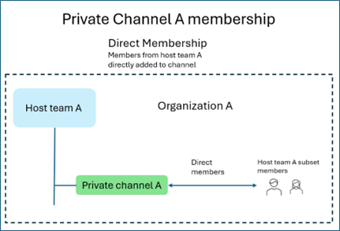

# Adapting Microsoft Teams App for Private and Shared Channels: A Developer's Guide

As Microsoft Teams evolves, shared and private channels introduce new collaboration patterns that differ significantly from Standard channels. To function reliably and securely across all channel types, apps must become context-aware—specifically in terms of:

- Membership structure
- Storage architecture
- Privacy boundaries

## Updating Your App Ensures

- Visible and usable everywhere: Your app can be added to private and shared channels, not just standard ones.
- Works as expected: Your app handles channel-specific members and file storage correctly.
- Safe and secure: Your app respects privacy rules and avoids data leaks between channels.
- Future Readiness: Your app follows Microsoft’s direction to support private and shared channels.

This guide helps you understand the updates needed to make your Teams app work seamlessly across Standard, private, and Shared channels.

What This Guide Covers?

- key concepts (membership, access, installation, storage)
- Implementation steps
- testing guidance
- Best practices

## Channel Models in Microsoft Teams

### Standard Channels

- Visible to the entire team
- All team members have access to the channel by default

### Private Channels

- Access limited to invited team members only
- Files are stored in the channel’s dedicated SharePoint site

### Shared Channels

- Including external and nonhost team members
- Sharing with individuals or teams across organizations
- Storing files in the channel’s dedicated SharePoint sit

## Shared Channel Capabilities

### Teams Channel Models – Capabilities Comparison

| **Category** | **Capability**                                                                 | **Standard Channel** | **Private Channel** | **Shared Channel** |
|--------------|----------------------------------------------------------------------------------|----------------------|---------------------|---------------------|
| **Membership** | Can add people to the channel without adding to the host team                 | No                   | No                  | Yes                 |
|              | Channel membership can be limited to a subset of the host team                 | No                   | Yes                 | Yes                 |
|              | Channel can be shared with other teams to inherit members from the team        | No                   | No                  | Yes                 |
|              | Channel can be shared directly with its parent team to inherit members         | N/A                  | No                  | Yes                 |
|              | Guests (B2B Guests) can participate in the channel                             | Yes                  | Yes                 | No                  |
|              | External participants (B2B Direct Connect) can participate in the channel      | No                   | No                  | Yes                 |
|              | Channel is hosted under a host team                                            | Yes                  | Yes                 | Yes                 |
| **Storage**   | Each channel has a dedicated SharePoint site                                  | No (inherits team site) | Yes              | Yes                 |
| **App Model** | App must be installed in the host team                                        | Yes                  | Yes                 | Yes                 |
|              | App installed to host team automatically available in channel                 | Yes                  | No                  | No                  |
|              | App must be added to each channel                                              | No                   | Yes                 | Yes                 |

> **Note:**  

> - Currently, only apps that include tabs are supported in private and shared channels in Microsoft Teams.  
> - Tab apps in shared channels are available in [Government Community Cloud (GCC), GCC High, Department of Defense (DoD)](../cloud-overview.md#teams-app-capabilities), and [Teams operated by 21Vianet](../sovereign-cloud.md) environments.  
> - SharePoint and the SharePoint pages apps aren't supported for shared channels in GCC, GCC High, DoD, and Teams operated by 21Vianet environments.  
> - Bots and message extensions are not supported in shared channels.

## Understanding How Your Teams App Works in Private and Shared Channels

Microsoft Teams supports different types of channels—Standard, Private, and Shared. Each has unique rules for membership, storage, and access. To ensure your app works reliably and securely, it’s important to understand these differences.

### Channel Membership Considerations

- Private and Shared channels include only selected members; team membership isn't automatic.
- Private and Shared channels deliver app messages or notifications exclusively to users who are members of that specific channel.
- Private and Shared channels require the use of channel-designated tools to view or manage membership accurately.

### External and Guest Users

- Shared channels might include users from outside your organization or tenant.
- These users might have limited permissions depending on their role.
- Tip: Always check user roles before assigning tasks or granting access through the app.

### File Storage Behavior in Private and Shared Channels

- Private and Shared channels use dedicated SharePoint sites for storing files.
- Private and Shared channels require apps to access or save documents using the correct site linked to the channel.
- Private and Shared channels work best when your app is configured to locate and use the associated SharePoint site.

### Data Privacy and Scope

- Apps that collect or display data (like analytics or reports) should only show information from the current channel.
- Aggregating data across channels can expose private content to unintended users.
- Tip: Keep data scoped to the channel unless broader sharing is explicitly allowed.

### Implementation Guidelines for Developers

- Confirm your app is installed in the correct channel type.
- Check membership lists before sending messages or assigning tasks.
- Use approved SharePoint sites for file access.
- Be cautious when sharing or aggregating data across channels.

## Core Implementation Concepts for Shared and Private Channels

## Channel Membership Basics

Every channel—whether Standard, Private, or Shared—lives inside a host team. Understanding how users are added to these channels helps you build apps that behave correctly for different member types.

### Direct vs. Indirect Membership

Private Channels

- Only members of the host team can be added directly.

Shared Channels

- Can include direct members from:
  - The host team
  - Other users within the same organization
  - Users from external organizations (via B2B Direct Connect)

Indirect Members (Shared Channels Only)

- A shared channel can be linked to other teams (inside or outside your org).
- Members of those teams get indirect access to the channel.

### Types of Users in Channels

Understanding user types helps you tailor app behavior:

| **User Type**        | **Description**                                                      | **Channel Access**                        |
|----------------------|----------------------------------------------------------------------|-------------------------------------------|
| Host Team Users      | Members of the team where the channel was created                   | Standard, Private, Shared                 |
| In-Tenant Users      | Users from your organization, not necessarily in the host team      | Shared channels only                      |
| Guest Users          | External users added as B2B guests in your organization             | Standard and Private channels only        |
| External Users       | Users from other organizations via B2B Direct Connect               | Shared channels only                      |

### Developer Tips

- Always fetch channel members, not team members—channel membership is what matters.
- Use user roles to adjust app behavior:
    For example, limit actions for external users to protect sensitive features.

## SharePoint Storage for Private and Shared Channels

Each Private or Shared channel has its own SharePoint site, separate from the host team's site. This site includes:

- A dedicated document library
- Channel-specific folders, lists, and pages

### Key Considerations

- Ensure you're targeting the channel’s site—not the team’s root site—when uploading or retrieving files, or interacting with SharePoint lists/pages.
- Use 'people with existing access' links to respect channel-level permissions when sharing files or links.
- Call the Microsoft Graph invite API to explicitly grant access, especially for external users in shared channels.

## App Installation in Private and Shared Channels

To make your app available in Private or Shared channels, you need to explicitly declare support in the app manifest. Unlike Standard channels, where installing the app at the team level is sufficient, Private and Shared channels require an extra step.

### Installation Workflow

- Install the app at the team level.
- Add the app to the specific channel. A channel owner or member adds the app to each Private or Shared channel as needed.

 Note: Without this step, your app doesn’t appear or function in those channels—even if it's installed at the team level.

Now that we understand the concepts, let’s look at how to make the required changes in your app.
