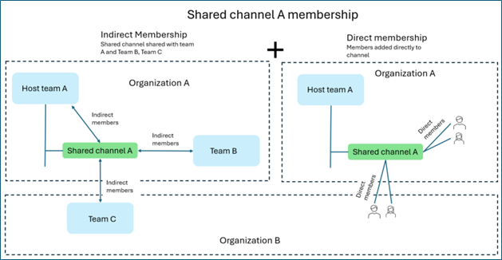

# Adapting Microsoft Teams App for Private and Shared Channels: A Developer's Guide

As Microsoft Teams evolves, shared and private channels introduce new collaboration patterns that differ significantly from Standard channels. To function reliably and securely across all channel types, apps must become context-aware—specifically in terms of:

- Membership structure
- Storage architecture
- Privacy boundaries

This guide helps you understand the updates, best practices, and testing steps needed to adapt your app for private and shared channels.

## Updating Your App Ensures

- Visible and usable everywhere: Your app can be added to private and shared channels, not just standard ones.
- Works as expected: Your app handles channel-specific members and file storage correctly.
- Safe and secure: Your app respects privacy rules and avoids data leaks between channels.
- Future Readiness: Your app follows Microsoft’s direction to support private and shared channels.

What This Guide Covers?

- key concepts (membership, access, installation, storage)
- Implementation steps
- testing guidance
- Best practices

## Channel Models in Microsoft Teams

### Standard Channels

- Visible to the entire team
- All team members have access to the channel by default

### Private Channels

- Access limited to invited team members only
- Files are stored in the channel’s dedicated SharePoint site

### Shared Channels

- Including external and nonhost team members
- Sharing with individuals or teams across organizations
- Storing files in the channel’s dedicated SharePoint sit

## Shared Channel Capabilities

### Teams Channel Models – Capabilities Comparison

| **Category** | **Capability**                                                                 | **Standard Channel** | **Private Channel** | **Shared Channel** |
|--------------|----------------------------------------------------------------------------------|----------------------|---------------------|---------------------|
| **Membership** | Can add people to the channel without adding to the host team                 | No                   | No                  | Yes                 |
|              | Channel membership can be limited to a subset of the host team                 | No                   | Yes                 | Yes                 |
|              | Channel can be shared with other teams to inherit members from the team        | No                   | No                  | Yes                 |
|              | Channel can be shared directly with its parent team to inherit members         | N/A                  | No                  | Yes                 |
|              | Guests (B2B Guests) can participate in the channel                             | Yes                  | Yes                 | No                  |
|              | External participants (B2B Direct Connect) can participate in the channel      | No                   | No                  | Yes                 |
|              | Channel is hosted under a host team                                            | Yes                  | Yes                 | Yes                 |
| **Storage**   | Each channel has a dedicated SharePoint site                                  | No (inherits team site) | Yes              | Yes                 |
| **App Model** | App must be installed in the host team                                        | Yes                  | Yes                 | Yes                 |
|              | App installed to host team automatically available in channel                 | Yes                  | No                  | No                  |
|              | App must be added to each channel                                              | No                   | Yes                 | Yes                 |

> **Note:**  

> - Currently, only apps that include tabs are supported in private and shared channels in Microsoft Teams.  
> - Tab apps in shared channels are available in [Government Community Cloud (GCC), GCC High, Department of Defense (DoD)](../cloud-overview.md#teams-app-capabilities), and [Teams operated by 21Vianet](../sovereign-cloud.md) environments.  
> - SharePoint and the SharePoint pages apps aren't supported for shared channels in GCC, GCC High, DoD, and Teams operated by 21Vianet environments.  
> - Bots and message extensions are not supported in shared channels.

## Understanding How Your Teams App Works in Private and Shared Channels

Microsoft Teams supports different types of channels—Standard, Private, and Shared. Each has unique rules for membership, storage, and access. To ensure your app works reliably and securely, it’s important to understand these differences.

### Channel Membership Considerations

- Private and Shared channels include only selected members; team membership isn't automatic.
- Private and Shared channels deliver app messages or notifications exclusively to users who are members of that specific channel.
- Private and Shared channels require the use of channel-designated tools to view or manage membership accurately.

### External and Guest Users

- Shared channels might include users from outside your organization or tenant.
- These users might have limited permissions depending on their role.
- Tip: Always check user roles before assigning tasks or granting access through the app.

### File Storage Behavior in Private and Shared Channels

- Private and Shared channels use dedicated SharePoint sites for storing files.
- Private and Shared channels require apps to access or save documents using the correct site linked to the channel.
- Private and Shared channels work best when your app is configured to locate and use the associated SharePoint site.

### Data Privacy and Scope

- Apps that collect or display data (like analytics or reports) should only show information from the current channel.
- Aggregating data across channels can expose private content to unintended users.
- Tip: Keep data scoped to the channel unless broader sharing is explicitly allowed.

### Implementation Guidelines for Developers

- Confirm your app is installed in the correct channel type.
- Check membership lists before sending messages or assigning tasks.
- Use approved SharePoint sites for file access.
- Be cautious when sharing or aggregating data across channels.

## Core Implementation Concepts for Shared and Private Channels

## Channel Membership Basics

Every channel—whether Standard, Private, or Shared—lives inside a host team. Understanding how users are added to these channels helps you build apps that behave correctly for different member types.

### Direct vs. Indirect Membership

Private Channels

- Only members of the host team can be added directly.

Shared Channels

- Can include direct members from:
  - The host team
  - Other users within the same organization
  - Users from external organizations (via B2B Direct Connect)

Indirect Members (Shared Channels Only)

- A shared channel can be linked to other teams (inside or outside your org).
- Members of those teams get indirect access to the channel.

### Types of Users in Channels

Understanding user types helps you tailor app behavior:

| **User Type**        | **Description**                                                      | **Channel Access**                        |
|----------------------|----------------------------------------------------------------------|-------------------------------------------|
| Host Team Users      | Members of the team where the channel was created                   | Standard, Private, Shared                 |
| In-Tenant Users      | Users from your organization, not necessarily in the host team      | Shared channels only                      |
| Guest Users          | External users added as [B2B](/entra/external-id/what-is-b2b) guests in your organization             | Standard and Private channels only        |
| External Users       | Users from other organizations via [B2B Direct Connect](/entra/external-id/b2b-direct-connect-overview)               | Shared channels only                      |

### Developer Tips

- Always fetch channel members, not team members—channel membership is what matters.
- Use user roles to adjust app behavior:
    For example, limit actions for external users to protect sensitive features.

## SharePoint Storage for Private and Shared Channels

Each Private or Shared channel has its own SharePoint site, separate from the host team's site. This site includes:

- A dedicated document library
- Channel-specific folders, lists, and pages

### Key Considerations

- Ensure you're targeting the channel’s site—not the team’s root site—when uploading or retrieving files, or interacting with SharePoint lists/pages.
- Use 'people with existing access' links to respect channel-level permissions when sharing files or links.
- Call the Microsoft Graph invite API to explicitly grant access, especially for external users in shared channels.

## App Installation in Private and Shared Channels

To make your app available in Private or Shared channels, you need to explicitly declare support in the app manifest. Unlike Standard channels, where installing the app at the team level is sufficient, Private and Shared channels require an extra step.

### Installation Workflow

- Install the app at the team level.
- Add the app to the specific channel. A channel owner or member adds the app to each Private or Shared channel as needed.

 Note: Without this step, your app doesn’t appear or function in those channels—even if it's installed at the team level.

Now that we understand the concepts, let’s look at how to make the required changes in your app.

## Step-by-step Guide for Updating Your App

### Design Principle

Avoid using the channel type (Standard, Private, Shared) as the basis for determining your app’s behavior. Instead, base behavior on:

- Channel membership
- User permissions
- App installation status in the channel
  
This approach makes your app work reliably across all channel types.

### Preliminary Configuration Requirements

Update Your App Manifest

- Add "supportsChannelFeatures": "tier1" to your manifest. This step makes your app available in Shared and Private channels.[More details here]

Install the App Properly

- Install the app at the team level.
- Manually add the app in each Shared or Private channel where required.
if the app isn't added to the channel, most APIs that rely on resource-specific consent fails with a 403 error message 'Caller isn't enabled for requesting the lwg channel of Shared channel type…'
- When a 403 error with the specified message occurs or API responses return incomplete data, assume the app isn't added to the channel. This error typically means channel members didn't add the app to the channel.

## Bot Lifecycle Events

### Handling Shared and Private Channel Events in Microsoft Teams Bots

Microsoft Teams sends specific event payloads to bots when shared or private channels are created, updated, or removed. These events are delivered as conversationUpdate activities and can be used to trigger custom logic in your app.

Key Event Types

- channelSharedWithTeam
- channelUnsharedFromTeam
- channelMemberRemoved

Developer Action Points

- Detect the event: To capture this payload, use OnConversationUpdateAsync in your bot logic.
- Parse the context: To determine if the channel was shared or unshared, check conversationType, tenantId, and channelData.eventType.
- Respond accordingly: You might log the event, notify users, or update your app’s internal state.

Best Practices

- Private channels: Only members added to the channel can access it. Use this framework to scope bot responses and permissions.
- Shared channels: These collaboration spaces allow cross-team or cross-org collaboration. Ensure your bot respects access boundaries and doesn’t expose sensitive data.

### Handling Bot Addition to Shared and Private Channel

Microsoft Teams sends a conversationUpdate activity when your bot is added to a shared or private channel. This event is crucial for initializing bot logic specific to that channel.

Event Summary

The payload includes:

- type: "conversationUpdate"
- channelData.eventType: "channelMemberAdded"
- channelData.channel.type: "shared" or "private"
- channelData.channel.name: Name of the channel
- channelData.channel.id: Unique identifier of the channel
- membersAdded: Array of added members, typically including the bot:
- - ID: Bot ID
- recipient: Metadata about the bot receiving the event:
- - ID: Bot ID
- - name: Bot display name

Developer Action Points

- Detect the event: Use OnConversationUpdateAsync to capture when your bot is added to a channel.
- Check channelData.channel.type: "This category indicates the channel classification type, either 'shared' or 'private.'
- Use channelData.eventType: "channelMemberAdded" indicates your bot was added.
- Initialize logic: Set up channel-specific state, permissions, or welcome messages.
  
Best Practices

- Avoid assuming team-level installation means channel-level availability.
- Use this event to verify your bot is active in the channel before performing actions.
- Log or audit bot additions for cross-tenant shared channels to ensure.

### Bot Removal from Shared or Private Channel

When your bot is removed from a shared or private channel, Microsoft Teams sends a conversationUpdate activity with the channelMemberRemoved event type. This event allows your app to clean up resources, revoke access, or log the removal for auditing.

Event Summary

When your bot is added to a channel, the activity includes:

- type: "conversationUpdate"
- channelData.eventType: "channelMemberAdded"
- channelData.channel.type: "shared" or "private"
- membersAdded: Contains the bot's ID
- recipient: Identifies your bot

Developer Action Points

- Detect the event: Use OnConversationUpdateAsync to capture when your bot is removed.
- Check channelData.channel.type: "shared" or "private" indicates the channel type.
- Use channelData.eventType: "channelMemberRemoved" confirms bot removal.

Best Practices

- Graceful exit: Avoid errors or retries after removal—respect the channel’s updated access boundaries.
- Audit trail: Log bot removals to monitor usage and detect unexpected removals.
- User experience: If your app has a dashboard or admin panel, reflect the removal status clearly.

### Detecting Channel Rename Events in Shared and Private Channels

When a channel is renamed—whether it's a shared or private channel—Microsoft Teams sends a conversationUpdate activity with the eventType: "channelRenamed". Bots can use this mechanism to update internal records, logs, or user-facing labels.

Event Summary

The payload includes:

- type: "conversationUpdate"
- channelData.eventType: "channelRenamed"
- channelData.channel.name: The updated channel name
- channelData.channel.type: "shared" or "private"
- recipient: Identifies the bot receiving the even

Developer Action Points

- Detect the event: Use OnConversationUpdateAsync to capture the rename.
- Check channelData.eventType: Look for "channelRenamed."
- Update internal records: Sync the new channel name in your app’s database or UI.
- Log the change: Optionally log the rename for audit or analytics.
- Notify users: If your bot displays channel names, consider sending a message or updating the interface.
  
Best Practices

- Avoid using hardcoded channel names: Always retrieve the latest name dynamically from the API.
- Avoid notifying unauthorized users: Ensure notifications are sent only to users with access to the renamed channel.
- Avoid overlooking cross-tenant scenarios: In shared channels, make sure your bot handles renames across both host and member teams.

### Handling Channel Deletion Events in Shared and Private Channels

When a shared or private channel is deleted, Microsoft Teams sends a conversationUpdate activity with eventType: "channelDeleted". Bots should use this event to clean up resources, revoke access, and update internal records.

Event Summary

The payload includes:

- type: "conversationUpdate"
- channelData.eventType: "channelDeleted"
- channelData.channel.type: "shared" or "private"
- channelData.channel.name: The name of the deleted channel
- channelData.team.id: The team associated with the channel
- channelData.tenant.id: The tenant where the event occurred
- recipient: Identifies the bot receiving the even

Developer Action Points

- Detect the event: Use OnConversationUpdateAsync to capture channelDeleted.
- Check channelData.channel.type: "shared" or "private" indicates the channel type.
- Use channelData.eventType: "channelDeleted" confirms the deletion.

Best Practices

- Avoid retries or proactive messaging after deletion.
- Log deletions to monitor usage and detect unexpected removals.
- Respect tenant boundaries in shared channels—ensure cleanup spans all contributing teams.

### Handling Channel Restoration Events in Shared and Private Channels

When a shared or private channel is restored in Microsoft Teams, bots receive a conversationUpdate activity with eventType: "channelRestored." This event signals that a previously deleted channel is reactivated and is available for use again. Bots should respond by reinitializing resources, re-enabling access, and updating internal records accordingly.

Event Summary

The payload includes:

- type: "conversationUpdate"
- channelData.eventType: "channelRestored"
- channelData.channel.type: "shared" or "private"
- channelData.channel.name: The restored channel’s name
- channelData.team.id: The associated team
- channelData.tenant.id: The tenant where the event occurred
- recipient: Identifies the bot receiving the even

Developer Action Points

- Detect the event: Use OnConversationUpdateAsync to capture channelRestored.
- Identify channel type: Check channelData.channel.type for "shared" or "private."
- Confirm restoration: Ensure channelData.eventType is "channelRestored."
  
Best Practices

- Reinitialize bot state for the restored channel if needed.
- Resume any suspended workflows or subscriptions tied to the channel.
- Audit restoration events to track lifecycle changes and ensure compliance.
- Respect tenant boundaries in shared channels—restoration might affect multiple teams.

### Handling Member Additions in Shared Channels

When a member is added to a shared channel in Microsoft Teams, bots receive a conversationUpdate activity with eventType: "channelMemberAdded". This event allows bots to track membership changes and respond accordingly—such as onboarding users, updating access controls, or syncing internal records.

Event Summary

The payload includes:

- type: "conversationUpdate"
- channelData.eventType: "channelMemberAdded"
- channelData.channel.type: "shared"
- channelData.channel.name: The name of the shared channel
- membersAdded: An array of newly added members, including their ID and membershipSource details
- membershipSource: Indicates how the user was added (for example, transitive membership via team)
- channelData.tenant.id: The tenant where the event occurred
- recipient: Identifies the bot receiving the event

 Developer Action Points

- Detect the event: Use OnConversationUpdateAsync to capture channelMemberAdded.
- Identify channel type: Confirm channelData.channel.type is "shared" to apply shared channel logic.
- Inspect membersAdded array: Each entry contains user identity and membershipSource, which indicates how the user was added (for example, transitive membership via team).
- Respect tenant boundaries: Use membershipSource.tenantId to determine cross-tenant relationships.

Best Practices

- Welcome new members: Send onboarding messages or resources if appropriate.
- Sync permissions: Update internal systems to reflect new access rights.
- Audit membership changes: Log additions for compliance and traceability.
- Handle transitive membership: Recognize that users might be added via team-level membership and not directly to the channel.

### Handling Member Removal in Shared Channels

When a member is removed from a shared channel in Microsoft Teams, bots receive a conversationUpdate activity with eventType: "channelMemberRemoved". This event allows bots to update internal records, revoke access, and maintain accurate membership tracking across tenants and teams.

Event Summary

The payload includes:

type:"conversationUpdate"
channelData.eventType:"channelMemberRemoved"
channelData.channel.type:"Shared"
channelData.channel.name: The name of the shared channel
channelData.channel.id: The unique ID of the shared channel
channelData.team.id: The ID of the team associated with the shared channel
channelData.tenant.id: The tenant where the event occurred
membersRemoved:
ID: The Teams user ID of the removed member
aadObjectId: The Azure AD object ID of the removed member
membershipSource: Details about how the user was removed, including:
sourceType: The source of membership (for example, team)
ID: The source ID
membershipType: Indicates if the membership was direct or indirect
tenantId: The tenant ID of the source
recipient: Identifies the bot receiving the event, including bot ID and name

Developer Action Points

- Detect the event: To capture channelMemberRemoved, use OnConversationUpdateAsync.
- Identify channel type: To apply shared channel logic, Confirm channelData.channel.type is "shared."
- Inspect membersRemoved array: Each entry contains user identity and membershipSource, which indicates how the user was removed (for example, indirect removal via team membership).
- Respect tenant boundaries: To determine cross-tenant implications, use membershipSource.tenantId.

Best Practices

- Revoke access: Ensure the removed member no longer has access to bot features or data tied to the channel.
- Update internal records: To maintain accuracy, reflect membership changes in your system.
- Audit removals: Log removal events for compliance and traceability.
- Handle indirect membership: Recognize that users might be removed due to changes at the team level, not directly from the channel.

### Retrieving Member Details in Shared Channels

When a bot or app queries a member in a shared channel, the API response includes detailed identity and membership metadata. This information helps the bot or app understand how the user is associated with the channel—either directly or transitively through a team.

Event Summary: Member Added to Shared Channel

The payload includes:

- type: "conversationUpdate"
- channelData.eventType: "channelMemberAdded"
- channelData.channel.type: "shared"
- channelData.channel.name: Name of the shared channel
- channelData.channel.id: Unique ID of the shared channel
- channelData.tenant.id: Tenant where the event occurred
- membersAdded: Array of added members with:
- ID: Teams user ID
- aadObjectId: Azure AD object ID
- membershipSource: Details on how the user was added:
- - sourceType: for example, "team"
- - membershipType: "direct" or "transitive"
- - tenantId: Source tenant ID
- recipient: Bot ID and name receiving the event

Developer Action Points

- Support multiple membership paths: A user might appear in both direct and transitive contexts.
- Respect tenant boundaries: Use tenantId to determine cross-tenant relationships.
- Audit membership types: Use membershipType to distinguish between explicit and inherited access.
- Handle nulls gracefully: teamAadGroupId might be null for direct channel membership.

Best Practices

- Avoid duplicate processing: When both direct and transitive memberships exist, ensure logic doesn’t double-count.
- Use aadObjectId for identity resolution: This identifier framework is consistent across tenants and contexts.
- Log membership sources: Useful for debugging access issues or validating permissions.

### Get Member in Shared Channel

The Get Member API retrieves detailed information about a specific user in a shared channel. This user-channel linkage includes identity attributes and a breakdown of how the user is connected to the channel—either directly or transitively via a team.

Event Summary

The payload includes:

- name: Full name of the user
- givenName: First name
- surname: Family name
- email: Primary email address
- userPrincipalName: User's sign-in name
- userRole: Role in the channel (for example, "user")
- ID: Teams user ID
- aadObjectId: Microsoft Entra object ID
- objectId: Legacy object ID (might match aadObjectId)
- tenantId: Tenant where the user belongs
- membershipSource: Array showing how the user is linked to the channel:
- - conversationId: ID of the conversation (channel or team thread)
- - conversationType: "channel" or "team"
- - membershipType: "direct" or "transitive"
- - teamAadGroupId: Group ID for team membership (might be null)
- - tenantId: Source tenant ID

Developer Action Points

- Use this API to audit individual user access to shared channels.
- Check membershipSource to determine if the user was added directly or inherited access via a team.
- Use tenantId to identify cross-tenant relationships in shared channels.
- Handle multiple membership paths gracefully—users might have both direct and transitive links.
  
Best Practices

- Avoid duplicate logic when both membership types exist.
- Log membership paths for compliance and access reviews.
- Use aadObjectId for consistent identity resolution across tenants.
- Respect tenant boundaries when managing access or sending messages.

### Get Members in Shared Channel

The Get Members API retrieves a list of all users in a shared channel, including identity details and optional membership metadata. This response is useful for bulk operations such as syncing, auditing, or broadcasting messages.

Event Summary

The payload includes:

- members: Array of user objects, each containing:
- name: Full name of the user
- givenName: First name
- surname: Family name (if available)
- email: Primary email address
- userPrincipalName: Sign-in name
- userRole: Role in the channel (for example, "user")
- ID: Teams user ID
- aadObjectId: Microsoft Entra object ID
- objectId: Legacy object ID (might match aadObjectId)
- tenantId: Tenant where the user belongs
- membershipSource (optional): Array showing how the user is linked to the channel:
- - conversationId: ID of the conversation
- - conversationType: "channel" or "team"
- - membershipType: "direct" or "transitive"
- - teamAadGroupId: Group ID for team membership (might be null)
- - tenantId: Source tenant ID

Developer Action Points

- Avoid redundant processing by deduplicating users based on aadObjectId or ID.
- Avoid fragmented data by merging membershipSource arrays when the same user appears more than once.
- Avoid incomplete insights by using the Get Member API when membershipSource is missing or partial.
- Avoid misinterpreting access by respecting tenant boundaries in cross-tenant scenarios.
  
Best Practices

- Normalize data before applying business logic or access controls.
- Log membership types for audit and compliance tracking.
- Use aadObjectId for consistent identity resolution across tenants and contexts.

### Developer Action Points

- Detect the event: To capture this payload, use OnConversationUpdateAsync in your bot logic.
- Parse the context: To determine if the channel was shared or unshared, check conversationType, tenantId, and channelData.eventType.
- Respond accordingly: You might log the event, notify users, or update your app’s internal state.

### Best Practices

- Private channels: Only members added to the channel can access it. Use this framework to scope bot responses and permissions.
- Shared channels: These collaboration environments allow cross-team or cross-org collaboration. Ensure your bot respects access boundaries and doesn’t expose sensitive data.

## Getting Accurate Channel Membership in Microsoft Teams

### Why It Matters

When sending messages, assigning tasks, or managing permissions, check who is in the channel, not just who is in the team. Shared channels and cross-tenant access often cause team and channel member lists to differ.

### To Get Channel Members Use Microsoft Graph

Get Full Roster for Any Channel Type

- Endpoint GET /teams/{team-id}/members returns only team membership, applicable to standard channels.
- Endpoint GET /teams/{team-id}/channels/{channel-id}/allMembers provides accurate channel membership for Standard, Shared, and Private channels.
- Response from this endpoint includes only eligible members.
- Support for Resource-Specific Consent (RSC) isn't available on these endpoints yet.

### Understand Indirect Membership in Shared Channels

Use these endpoints to identify which teams provide access and which users from those teams can access the shared channel:

- Get contributing teams:
GET /teams/{team-id}/channels/{channel-id}/sharedWithTeams

Returns each team’s ID, displayName, and isHostTeam.

Get allowed members from a contributing team:
GET /teams/{team-id}/channels/{channel-id}/sharedWithTeams/{id}/allowedMembers

- Returns only eligible members.
- These endpoints don't support RSC yet.

### Identify Direct vs Indirect Members

- Property @microsoft.graph.originalSourceMembershipUrl on allMembers (beta) indicates indirect membership.
- Property absence signifies that the member is direct.
- Property usage is recommended only as a hint—avoid parsing it directly and prefer supported endpoints instead.

### Check User Access Before Sensitive Actions

Use: doesUserHaveAccess(userId, tenantId, upn)

- Function result returns a Boolean.
- Function purpose is to determine whether to show sensitive actions or target users outside the host tenant.
- Function scope is limited to shared channels only.
- Function roadmap includes broader support, but it's not available yet.

## Retrieving Full Channel Roster Using Bot Framework SDK

When working with the Bot Framework SDK (C#, JavaScript, etc.), you can retrieve the full roster from any channel as follows:

- Use paginated access: Call TeamsInfo.GetPagedMembersAsync(turnContext, pageSize, continuationToken) and continue paging until all members are retrieved.
  
- Set required permissions: Make sure your app manifest includes the RSC permission ChannelMember.Read.Group. Without this permission, roster access fails within channels.

## Handling Known Failure Patterns

Be aware of the following common issues when accessing channel rosters:

- Error 403 on Graph calls under RSC
  
  Cause: The app isn't added to the channel.
  
  Resolution: Prompt the user to add the app to the channel and retry the request.

- Partial results (owners only) in Shared channels
  
  Cause: App is disabled or not added to the channel.
  
  Resolution: Treat the response as a partial roster. Instruct the user to add the app to the channel, then refetch the roster after successful addition.

## Handling Channel Membership Changes

Channel membership is fluid—users might join or leave, and channels can be shared or unshared with other teams. Your integration should be designed to respond to these changes dynamically.

### Using Microsoft Graph

To track membership updates:

- Subscribe to changes
Set up a Microsoft Graph subscription on:
/teams/{team-id}/channels/getAllMembers
This notifies your app whenever there are changes to channel membership.

- Respond to notifications
When you receive a membership, share, or unshare notification:
- Refresh the allMembers list to get the current state of channel members. If the channel is shared:
  - call sharedWithTeams to identify which teams have access to the shared channel.
  - Call allowedMembers to efficiently retrieve indirect members added through shared teams.

### Handling Membership Changes in Bot Framework (Bot SDK)

In the Bot Framework SDK, monitor the conversationUpdate activity to track channel membership changes.

Key Events to Handle

- channelShared / channelUnshared
Triggered when a channel is shared or unshared with a team.
  - Expect changes in indirect membership.
  - Refresh your channel topology and member roster.
  - To update your member list, use the member APIs described earlier.
- channelMemberAdded / channelMemberRemoved
Triggered when a user is added or removed from the channel.
  - Also fires when the app itself is added or removed.
  - Update your member list accordingly when this event occurs.

Required Permissions

- Manifest requirement: To receive and process these membership events, include the RSC permission ChannelMember.Read.Group in your app manifest.

## Detecting If Your App Is Added to a Channel

As you build your app, consider the following guidelines:

- No direct API exists to check whether your app is installed in a specific channel.
  
- Bot installation is confirmed when your bot receives a channelMemberAdded event in the conversationUpdate activity for itself.
  - This event signals the start of your channel-specific logic—such as sending a welcome message, fetching the roster, configuring tabs, or scheduling background jobs.
  - Bot events begin flowing only after the app is added to the channel

- Channel API access is blocked with a 403 error and the message:
'Caller isn't enabled for requesting the lwg channel of Shared channel type.' To access channel data, app has to be enabled in the requesting channel. if the app isn't yet added to the channel. Wait until installation is complete before accessing channel data via Graph or the Bot SDK.

Note: You can list apps installed at the team level using GET /teams/{team-id}/installedApps, but there's no equivalent API for channel-level installations.
Don't assume that a team-level install means the app is present in all its channels.

## Identifying External Users and Guests in Channel

As a developer, it's important to differentiate between internal users, guests, and external (cross-tenant) users in channels to:

- Limit sensitive actions to internal users only
- Show or hide certain features based on user type
- Set up the right sign-in process for external users in tabs or bots

### Detecting User Type at Runtime (Tabs & Bots)

For Tabs (using Teams JS SDK):

- Call microsoftTeams.getContext() when the tab loads.
- Check context.user.userRole or context.team.userRole: if it's 'guest,' the user is a guest.
- Compare context.user.tenant.id with context.channel.ownerTenantId (or context.team.groupTenantId): if they differ, the user is external (via B2B Direct Connect).

For Bots:

- To detect guests:
Use TeamsInfo.getMemberAsync or TeamsInfo.getPagedMembersAsync and check if userRole === 'guest.'
- To detect external users:
Each incoming activity includes conversation.tenantId and from.aadObjectId.

Compare the member’s tenant ID with the channel’s host tenant (from Graph channel metadata). (Note: This part might need further clarification.)

### Detecting User Type from Roster (Graph API or Bot SDK)

Using Microsoft Graph:

- Call GET /teams/{team-id}/channels/{channel-id}/allMembers to retrieve the channel roster.
- Check the roles field: if it includes "guest," the user is a guest.
- Compare member.tenantId with channel.hostTenantId: if they’re different, the user is external.

Using Bot SDK:

- Use TeamsInfo.GetPagedMembersAsync to get channel members.
- Check TeamsChannelAccount.UserRole: "guest" indicates a guest user.
- Compare TeamsChannelAccount.TenantId with the channel’s host tenant ID (which can be fetched via Graph if needed). (Note: Host tenant ID retrieval might need clarification.)

## Working with Files Across Channel Types

When handling files in channels—whether it's file tabs, document libraries, or uploading and retrieving files, you need to account for the distinct SharePoint sites that support private and shared channels, along with their respective storage locations. Relying on the Team’s main site to access channel files or folders doesn’t work.

### Resolving Storage Correctly

- Call GET /teams/{teamId}/channels/{channelId}/filesFolder
→ Returns a DriveItem representing the root folder for the channel’s files.
- Use the following details from the response for all subsequent file operations:
  - parentReference.driveId: the SharePoint drive linked to the channel’s site
  - ID: the folder ID
- Standard channels
  - The drive ID typically points to the team’s main SharePoint site.
- Private and shared channels
  - Expect a different drive ID, as these channels have their own dedicated SharePoint sites.
  
You can find detailed guidance on this article on [Microsoft Learn](/graph/api/channel-get-filesfolder).

Best Practice

- Store and reuse the exact drive ID and item ID from the filesFolder API.
- Avoid hardcoding library names or URLs assuming the team site applies to all channels.

Note: This API works consistently across all channel types.

### File Access Management for External and Guest Users

External Users (Cross-Tenant)

- Ensure external users remain in their home tenant while accessing the host channel’s SharePoint site.
- Ensure cross-tenant access is properly configured on both the source and target tenants.
- Ensure your app is multitenant, with consent granted in the host tenant for correct functionality.
  
Guest Users (Within Tenant)

- The channel’s SharePoint site automatically grants channel members access, including guest users from the same tenant.

### You can take the following actions

Avoid relying on “Org-wide” sharing links.

- Use sharing methods that typically exclude users from outside the organization.
- Use specific-people sharing or membership-based direct permissions instead of broad access links.
- Use tenant or site policies to determine whether anonymous or org-wide links are permitted.

Use the Invite API for precise access control.

- POST /drives/{driveId}/items/{itemId}/invite
- This method is the most reliable way, to programmatically grant access to specific users or groups.

### Authenticating External Users in Tabs or Task Modules

When creating a tab or task module that needs to access SharePoint files from the channel’s tenant, ensure external users are authenticated correctly—especially in private or shared channels.

- Use getContext() when the content page loads for retrieving the full channel context in which the tab is running.
- Use user.tenant.id and compare it with channel.ownerTenantId or hostTenantId for identifying if the user is external.
- Use getAuthToken with user.tenant.id (or tid) for ensuring the token is issued from the user’s home tenant instead of the host.

## Messaging in Channels

### Microsoft Graph

- Use GET /teams/{team-id}/channels/{channel-id}/messages and .../messages/delta only when the app is added in Shared or Private channels; otherwise, a 403 error occurs with an "app not added to channel" message.
- Use change notifications on /channels/{id}/messages for Shared or Private channels only if RSC permissions are set up correctly. If not, the request fails with a 403 error.
- Use on-demand message reads after the app is added to the channel for reliable access.

### Bots SDK

- Use normal v3 conversation routes to send, edit, or delete messages; refer to the documentation for details.
- Use the channel roster to fetch recipients—never rely on team membership.

## Update the App Manifest to Declare Support for Shared and Private Channels

Declare support for shared and private channels by adding a new property in your app manifest. This change is mandatory.

"supportsChannelFeatures": {
  "type": "string,"
  "enum": [
    "tier1,"
    "tier2,"
    null
  ]
  "description": "A property in the app manifest that declares support for all channel features, categorized by tiers."
}

To support shared and private channels, set supportsChannelFeatures = tier1.

Benefits of Declaring Tier1 Support:

- Enable your app to appear in shared and private channels.
- Enable support for the membership model used in shared and private channels.
- Enable access to channel-based SharePoint storage, if your app interacts with files.
- Enable identification of external users in shared channels and guest users in private channels.

As Microsoft Teams evolves, other channel capabilities might be introduced. To take advantage of future features, further updates to your app might be required.

## Test Your App Thoroughly Before Shipping

Make sure to test your app in real scenarios before releasing changes. Here's how to validate it across different channel types.

### In a standard channel

- Check that everything still works after your changes.

### In a private channel (for example, Channel P in Team A)

- Add the app to Team A, then to private channel P.
- Check if your tab loads properly.
- Check if your bot responds when a member sends a message—test with both in-tenant and guest users.
- Check any feature that lists members or assigns tasks—make sure it only uses channel members.
- Add a new member to the private channel—see if your bot gets an event or if your membership API shows the new member.

### In a shared channel within the same tenant (for example, Channel X in Team A shared with Team B)

- Add the app to Team A, then to Channel X.
- Test with a Team B member—make sure they can see the tab and interact with the bot.
- Unshare the channel from Team B—check if your bot receives a channelUnshared event.

### In a shared channel with an external tenant (for example, using Teams Connect)

- Send a message from an external user to the bot—check if the bot receives it.
- Trigger a tab or task module from the external user—check if authentication works. If using single sign-On (SSO), you might need to handle it with getAuthToken using the user’s home tenant ID.
- Avoid sending direct messages from your bot to external users—direct messaging functionality doesn't work unless they’re in the same tenant. But bot messages inside the shared channel should work fine.

Final Step

- To make sure all required changes are complete, review your test results and check the full documentation.

## Best Practices for Supporting All Channel Types

To make sure your app works smoothly in shared, private, and standard channels, follow these best practices:

- Fetch the latest member list and roles before doing anything. For example, when sending a message or assigning a task, use the actual channel members—not the full team list.
- Adjust features based on user roles. For example, allow sensitive actions only for owners or internal users, and show limited options to guests or external users.
- Protect user data and respect privacy. For example, don’t include private channel data in public reports unless you have clear permission.
- Authenticate users based on their type (internal, guest, external). For example, make sure external users are authenticated in their own tenant, especially when accessing files.
- Update your help guides and tooltips with explanations of how your app behaves in different channels, including any limits for guests or external users.
- Improve performance by caching large member lists. For example, update the cache only when you get a membership change event, instead of calling the API too often.
- Test your app with all kinds of users—owners, members, guests, and external users—across every channel type and confirm everything works as expected.
- Watch for updates in Microsoft Teams documentation and changelogs. For example, keep your app updated when APIs, permissions, or channel features change.

## Technical Appendix: Teams App Update Guide for Shared & Private Channel Support

### Mandatory Updates for Teams Apps in Shared & Private Channels

| Change Type | What to Do | Why It Matters | Example |
|-------------|------------|----------------|---------|
| **Mandatory** | Use the Channel Members API | Shared/Private channels have different members than the team. Using the wrong API can miss users or cause data leaks. | **Task app**: Assign tasks only to channel members, not all team members. |
| **Mandatory** | Access the Channel's SharePoint Site | Each channel has its own SharePoint. Using the team site can break file access or expose data. | **Document app**: Store and retrieve files from the channel’s SharePoint site. |
| **Mandatory** | Respect Channel Boundaries | Don’t access or post across channels unless the user allows it. | **Summary app**: Only summarize messages from channels the user opts into. |
| **Mandatory** | Update the App Manifest | Declare support for Shared/Private channels so your app shows up there. | **Any app**: Add `"supportsChannelFeatures": "level2"` to your manifest. |

### Optional UX Improvements for Shared & Private Channels

| Area | What to Do | Why It Helps | Example |
|------|------------|--------------|---------|
| **Privacy & Access Controls** | Add logic to limit features for guests/external users | Keeps sensitive data safe and follows company policies | **Poll app**: Guests can vote, but only members can create polls or see results |
| **Collaboration Features** | Adjust tools based on channel roles and members | Prevents confusion and accidental changes by guests | **Whiteboard app**: Guests can draw, but not erase others’ work |
| **Smart Notifications** | Customize alerts by channel type and user role | Cuts down noise and makes alerts more useful | **Helpdesk app**: IT gets all alerts. vendors only see their tickets |

### Context & Event Payloads

- Use teamId for the host team and channelId for the shared channel in context and event payloads.
- Apply hostTeamId and hostTenantId when handling cross-tenant scenarios.
- Detect external users by comparing a user’s tenantId with hostTenantId.
- Listen for events like channelShared, channelUnshared, channelMemberAdded, and channelMemberRemoved to track changes in shared channels.
- Ensure your app is present in the channel so it receives these events.

### API Changes

- Review the API Change Table in the Appendix for updates to Graph and Activity Payload Extensions (APX) APIs.
- Switch to the latest APIs that support shared and private channels.

### Handling External Users

- Identify B2B Guests using role = guest in Graph or user role = guest in APX.
- Detect B2B Native users by comparing their tenantId with the hostTenantId from getContext().
- Fetch members using /teams/{teamId}/channels/{channelId}/allmembers for tabs.
- Use channelMemberAdded and /v3/conversations/{conversationId}/pagedMembers to get members in bots.
- Classify users as external if their tenantId doesn’t match the host tenant.

### Manifest and Permissions

- Include supportsChannelFeatures = "tier1" in your app manifest so it supports shared and private channels.
- Omit this setting, and your app doesn't appear in shared or private channels.
- Remove this setting later, and your app stops showing up in those channels.
- Update your manifest with Resource Specific Consent (RSC) permissions, as many APIs now require them for shared/private channel functionality.
- Check the API documentation and confirm the RSC permissions required for your app.

### Privacy, Access & Security

- Use channel-specific APIs—don’t assume team members are also channel members.
- Access storage through channel-specific APIs and avoid cross-posting unless allowed.
- Respect privacy boundaries, and avoid leaking data between channels or user types.
- Handle internal users, B2B Guests, and B2B Direct Connect users correctly.
- Test all scenarios, including edge cases.

## Troubleshooting Guide

### App Installation Issues

| Problem | Cause | Resolution |
|--------|-------|------------|
| App doesn't appear in shared or private channels | `supportsChannelFeatures` not set in manifest | Add `'supportsChannelFeatures': 'tier 1'` in the app manifest. Reinstall the app. |
| 403 error - Caller isn't enabled for requesting the [xyz] channel of shared channel type | App installed at team level but not added to the channel | Install the app both at the team level and the specific channel. |

### Membership & Identity Issues

| Problem | Cause | Resolution |
|--------|-------|------------|
| App shows wrong members (for example, includes team members not in channel) | Using team membership APIs instead of channel APIs | Use `GET /teams/{team-id}/channels/{channel-id}/allMembers` |
| can't distinguish external users from internal | `tenantId` not being compared | Compare `member.tenantId` with `hostTenantId`; if different → external user (B2B) |
| Guest vs External not differentiated | Only checking `role = guest` | Detect B2B Native by comparing tenant ID |

### File Access Issues

| Problem | Cause | Resolution |
|--------|-------|------------|
| App fails to access files in private/shared channels | Using team SharePoint site instead of channel-specific site | Use `GET /teams/{teamId}/channels/{channelId}/filesFolder` |
| External users can't access files | Org-wide links not supported cross-tenant | Use specific-people sharing or `POST /drives/{driveId}/items/{itemId}/invite` |
| Token errors for external users | Auth tokens issued for host tenant instead of user's home tenant | Call `getAuthToken` with the user's `tenantId`. Always request token in user's home tenant. |

### Messaging Issues

| Problem | Cause | Resolution |
|--------|-------|------------|
| Can't read messages in shared/private channels | App not added to channel | Add app explicitly to the channel. Retry after install. |
| Subscriptions to channel messages fail | RSC restriction | Use on-demand message reads instead of subscriptions. |
| Bot fails to send/receive messages for external users | Bot fetching recipients from team roster instead of channel roster | Always fetch from channel roster. |

### Event Handling Issues

| Problem | Cause | Resolution |
|--------|-------|------------|
| Can't read messages in shared/private channels | App not added to channel | Add app explicitly to the channel. Retry after install. |
| Shared channel changes not detected | Not handling APX events | Handle `channelShared` and `channelUnshared` events from Activity Payload Extension. |
| Membership list out of sync | Relying on old cached data | Refresh membership list on every `conversationUpdate` or Graph notification. |

### Privacy & Security Issues

| Problem | Cause | Resolution |
|--------|-------|------------|
| Private channel data leaks into reports | Using aggregated team-level analytics | Scope analytics to channel-level data |
| External/guest access not properly restricted | App not checking role/tenant before action | Implement role and tenant-based access checks before performing sensitive actions |

### Testing Gaps

| Problem | Cause | Resolution |
|--------|-------|------------|
| Features work in standard but fail in shared/private channels | App only tested in standard channels | Test all scenarios: standard, private, shared (same-tenant + cross-tenant) |
| Bots don't respond for guests/external users | Microsoft Edge cases not tested | Validate all user types: internal, guest, external (B2B Direct) |
| API returns inconsistent results | Using cached lists or partial roster | Validate against full roster APIs and refresh after membership changes |

## FAQ Summary

### General Questions

| Question | Answer |
|----------|--------|
| Can I be part of a shared channel without being in the parent team? | Yes, shared channels allow external users to join if invited and granted permissions. |
| Who can create shared or private channels? | Typically, team owners or users with specific permissions. Admins might restrict this capability via policy settings. |

### Access & Permissions

| Question | Answer |
|----------|--------|
| Why can’t I see a private channel I was added to? | You must be a member of both the parent team and the private channel. Removal from the team revokes access. |
| Can guests or external users access shared channels? | Yes, if both organizations enable external access and the user is explicitly invited. |
| How do I know if a channel is private or shared? | A lock icon indicates private channel. A link icon indicates shared channel = shared channel. |
| Why am I seeing an 'Access Denied' error when joining a shared channel? | Possible causes: incorrect invitation, disabled external access, or wrong account/tenant. |

### Functionality & Limitations

| Question | Answer |
|----------|--------|
| Can I add apps or tabs to a private channel? | Yes, but some apps might not be supported due to permissions or compatibility. Check before adding. |
| Are files in private channels stored differently? | Yes, they’re stored in a separate SharePoint site accessible only to channel members. |
| Can I convert a private channel to a shared channel (or vice versa)? | No, channel types are permanent. Create a new channel and migrate content manually. |
| What should I do if files or tabs aren’t loading in a channel? | Refresh the app/browser, clear cache, try another device, and verify permissions. |
| How do I report issues with shared or private channels? | Contact your IT admin or support team with: channel name, type, and error message or screenshot. |
