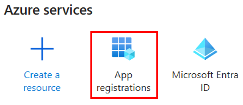
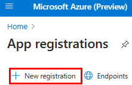
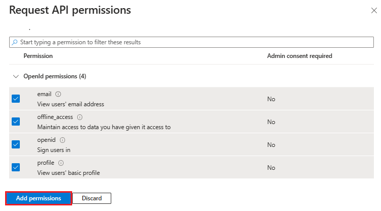
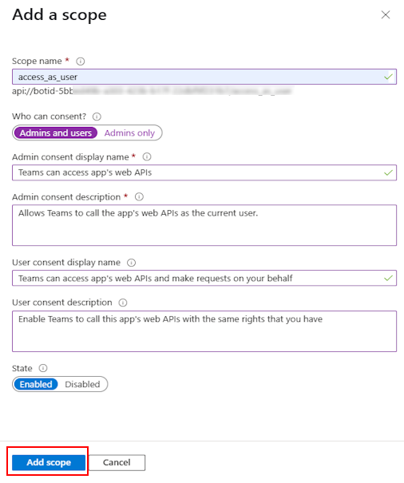
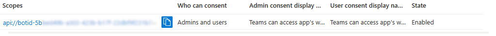
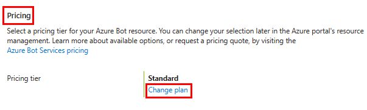
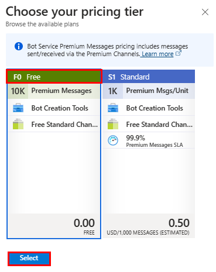
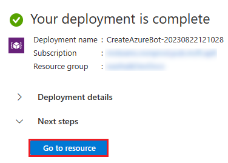
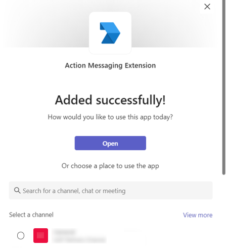

# Build action based message extension

Teams action based message extension allow users to interact with web services in the Microsoft Teams client. Message extensions help to initiate actions in an external system from the compose message area, the command box, or directly from a message.

**Key features of action based message extension**:

* Presents the user with a modal pop-up to collect or display information.
* Triggers the action commands from the compose message area, the command box, or from a message. 

This step-by-step guide helps you to build Teams action-based message extension to initiate actions from compose message and message area. By the end of this tutorial, you can achieve the following output:


## Prerequisites

Ensure that you install the following tools and set up your development environment:  

| &nbsp; | Install | For using... |
| --- | --- | --- |
| &nbsp; | [Microsoft Teams](https://www.microsoft.com/microsoft-teams/download-app) | Microsoft Teams to collaborate with everyone you work with through apps for chat, meetings, and call all in one place.|
| &nbsp; | [Visual Studio 2022](https://visualstudio.microsoft.com) |You can install the enterprise version in Visual Studio 2022, and install the ASP.NET and web development workloads. Use the latest version. |
| &nbsp; | [.NET Core SDK](https://dotnet.microsoft.com/en-us/download) | Customized bindings for local debugging and Azure Functions app deployments. If you haven't installed the latest version, install the portable version. |
| &nbsp; | Dev tunnel | Teams app features (conversational bots, message extensions, and incoming webhooks) need inbound connections. A tunnel connects your development system to Teams. Dev tunnel is a powerful tool to securely open your localhost to the internet and control who has access. Dev tunnel is available in Visual Studio 2022 version 17.7.0 or later. <br> or </br> You can also use [ngrok](https://ngrok.com/downloads) as a tunnel to connect your development system to Teams. It isn't required for apps that only include tabs. This package is installed within the project directory (using npm `devDependencies`). |

> [!NOTE]
> After downloading ngrok, sign up and install [authtoken](https://ngrok.com/downloads).

## Set up local environment

1. Open [Microsoft-Teams-Samples](https://github.com/OfficeDev/Microsoft-Teams-Samples).

2. Select **Code**.

3. From the dropdown menu, select **Open with GitHub Desktop**.


4. Select **Clone**.

> [!div class="button"]
> [I ran into an issue](https://github.com/MicrosoftDocs/msteams-docs/issues/new?template=Doc-Feedback.yaml&title=%5BI+ran+into+an+issue%5D+Set+up+local+environment&&author=%40surbhigupta&pageUrl=https%3A%2F%2Flearn.microsoft.com%2Fen-us%2Fmicrosoftteams%2Fplatform%2Fsbs-meetingextension-action%3Ftabs%3Ddev%252Clatestversionofvisualstudio%26tutorial-step%3D2&contentSourceUrl=https%3A%2F%2Fgithub.com%2FMicrosoftDocs%2Fmsteams-docs%2Fblob%2Fmain%2Fmsteams-platform%2Fsbs-meetingextension-action.yml&documentVersionIndependentId=53b6fe7f-5051-d9d3-57e4-1d339c25ad65&platformId=28e8e36c-27eb-6659-de89-1d9872d985a0&metadata=*%2BID%253A%2Be473e1f3-69f5-bcfa-bcab-54b098b59c80%2B%250A*%2BService%253A%2B%2A%2Amsteams%2A%2A)

## Register Microsoft Entra app

The following steps help you to create and register your bot in Azure portal:

* Create and register your Azure app.
* Create client secret to enable SSO authentication of the bot.
* Add Teams channel to deploy the bot.
* Create a tunnel to your web server's endpoints using dev tunnel (recommended) or ngrok.
* Add messaging endpoint to the dev tunnel that you created.

## Add App Registration

1. Go to [Azure Portal](https://ms.portal.azure.com/#home)

2. Select **App registrations**.


  
3. Select + **New registration**.



4. Enter the name of your app.

5. Select **Accounts in any organizational directory (Any Microsoft Entra ID tenant - Multitenant)**.

6. Select **Register**.


Your app is registered in Microsoft Entra ID. The app overview page appears.


> > [!NOTE]
>
> * Save the app ID from **Application (client) ID** and **Directory (tenant) ID** for further use.

> [I ran into an issue](https://github.com/MicrosoftDocs/msteams-docs/issues/new?template=Doc-Feedback.yaml&title=%5BI+ran+into+an+issue%5D+Add+App+registration&&author=%40surbhigupta&pageUrl=https%3A%2F%2Flearn.microsoft.com%2Fen-us%2Fmicrosoftteams%2Fplatform%2Fsbs-meetingextension-action%3Ftabs%3Ddev%252Clatestversionofvisualstudio%26tutorial-step%3D3&contentSourceUrl=https%3A%2F%2Fgithub.com%2FMicrosoftDocs%2Fmsteams-docs%2Fblob%2Fmain%2Fmsteams-platform%2Fsbs-meetingextension-action.yml&documentVersionIndependentId=53b6fe7f-5051-d9d3-57e4-1d339c25ad65&platformId=28e8e36c-27eb-6659-de89-1d9872d985a0&metadata=*%2BID%253A%2Be473e1f3-69f5-bcfa-bcab-54b098b59c80%2B%250A*%2BService%253A%2B%2A%2Amsteams%2A%2A)

## Create a tunnel

# [dev tunnel](#tab/dev)

> [!div class="nextstepaction"]
> [I ran into an issue](https://github.com/MicrosoftDocs/msteams-docs/issues/new?template=Doc-Feedback.yaml&title=%5BI+ran+into+an+issue%5D+Create+a+tunnel+using+dev+tunnel&&author=%40surbhigupta&pageUrl=https%3A%2F%2Flearn.microsoft.com%2Fen-us%2Fmicrosoftteams%2Fplatform%2Fsbs-meetingextension-action%3Ftabs%3Ddev%252Clatestversionofvisualstudio%26tutorial-step%3D3&contentSourceUrl=https%3A%2F%2Fgithub.com%2FMicrosoftDocs%2Fmsteams-docs%2Fblob%2Fmain%2Fmsteams-platform%2Fsbs-meetingextension-action.yml&documentVersionIndependentId=53b6fe7f-5051-d9d3-57e4-1d339c25ad65&platformId=28e8e36c-27eb-6659-de89-1d9872d985a0&metadata=*%2BID%253A%2Be473e1f3-69f5-bcfa-bcab-54b098b59c80%2B%250A*%2BService%253A%2B%2A%2Amsteams%2A%2A)

# [ngrok](#tab/ngrok)

> [!div class="nextstepaction"]
> [I ran into an issue](https://github.com/MicrosoftDocs/msteams-docs/issues/new?template=Doc-Feedback.yaml&title=%5BI+ran+into+an+issue%5D+Create+a+tunnel+using+ngrok&&author=%40surbhigupta&pageUrl=https%3A%2F%2Flearn.microsoft.com%2Fen-us%2Fmicrosoftteams%2Fplatform%2Fsbs-meetingextension-action%3Ftabs%3Ddev%252Clatestversionofvisualstudio%26tutorial-step%3D3&contentSourceUrl=https%3A%2F%2Fgithub.com%2FMicrosoftDocs%2Fmsteams-docs%2Fblob%2Fmain%2Fmsteams-platform%2Fsbs-meetingextension-action.yml&documentVersionIndependentId=53b6fe7f-5051-d9d3-57e4-1d339c25ad65&platformId=28e8e36c-27eb-6659-de89-1d9872d985a0&metadata=*%2BID%253A%2Be473e1f3-69f5-bcfa-bcab-54b098b59c80%2B%250A*%2BService%253A%2B%2A%2Amsteams%2A%2A)

## Add a web authentication

1. In the left pane, under **Manage**, select **Authentication**.

2. Select **Add a platform** > **Web**.


3. Enter the redirect URI for your app by appending `auth-end` to the fully qualified domain name. For example, `https://your-devtunnel-domain/auth-end` or `https://your-ngrok-domain/auth-end`.

4. Under **Implicit grant and hybrid flows**, select the **Access tokens** and **ID tokens** checkboxes.

5. Select **Configure**.


6. Under **Web**, select **Add URI**.

7. Enter `https://token.botframework.com/.auth/web/redirect`.

8. Select **Save**.


[I ran into an issue](https://github.com/MicrosoftDocs/msteams-docs/issues/new?template=Doc-Feedback.yaml&title=%5BI+ran+into+an+issue%5D+Add+a+web+authentication&&author=%40surbhigupta&pageUrl=https%3A%2F%2Flearn.microsoft.com%2Fen-us%2Fmicrosoftteams%2Fplatform%2Fsbs-meetingextension-action%3Ftabs%3Ddev%252Clatestversionofvisualstudio%26tutorial-step%3D3&contentSourceUrl=https%3A%2F%2Fgithub.com%2FMicrosoftDocs%2Fmsteams-docs%2Fblob%2Fmain%2Fmsteams-platform%2Fsbs-meetingextension-action.yml&documentVersionIndependentId=53b6fe7f-5051-d9d3-57e4-1d339c25ad65&platformId=28e8e36c-27eb-6659-de89-1d9872d985a0&metadata=*%2BID%253A%2Be473e1f3-69f5-bcfa-bcab-54b098b59c80%2B%250A*%2BService%253A%2B%2A%2Amsteams%2A%2A)

## Create a client secret

> [!NOTE]
> If you encounter the error **Client secrets are blocked by tenant-wide policy. Contact your tenant administrator for more information.**, you can create a certificate instead. For step-by-step instructions, refer to [create a certificate for app registration.](/graph/auth-register-app-v2#add-credentials)

1. In the left pane, under **Manage**, select **Certificates & secrets**.

2. Under **Client secrets**, select **+ New client secret**.


The **Add a client secret** window appears.

3. Enter **Description**.

4. Select **Add**.


5. Under **Value**, select **Copy to clipboard** to save the client secret value for further use.


[I ran into an issue](https://github.com/MicrosoftDocs/msteams-docs/issues/new?template=Doc-Feedback.yaml&title=%5BI+ran+into+an+issue%5D+Create+a+client+secret&&author=%40surbhigupta&pageUrl=https%3A%2F%2Flearn.microsoft.com%2Fen-us%2Fmicrosoftteams%2Fplatform%2Fsbs-meetingextension-action%3Ftabs%3Ddev%252Clatestversionofvisualstudio%26tutorial-step%3D23&contentSourceUrl=https%3A%2F%2Fgithub.com%2FMicrosoftDocs%2Fmsteams-docs%2Fblob%2Fmain%2Fmsteams-platform%2Fsbs-meetingextension-action.yml&documentVersionIndependentId=53b6fe7f-5051-d9d3-57e4-1d339c25ad65&platformId=28e8e36c-27eb-6659-de89-1d9872d985a0&metadata=*%2BID%253A%2Be473e1f3-69f5-bcfa-bcab-54b098b59c80%2B%250A*%2BService%253A%2B%2A%2Amsteams%2A%2A)

## Add API permission

1. In the left pane, under **Manage**, select **API permissions**.

2. Select **+ Add a permission**.


3. Select **Microsoft Graph**.

4. Select **Delegated permissions**.

5. Select the following permissions:
    * **OpenId permissions** > **email**, **offline_access**, **openid**, **profile**.
    * **User** > **User.Read**.

6. Select **Add permissions**.



> [!NOTE]
>
> * If an app isn't granted IT admin consent, users must provide consent the first time they use an app.
> * Users need to consent to the API permissions only if the Microsoft Entra app is registered in a different tenant.

[I ran into an issue](https://github.com/MicrosoftDocs/msteams-docs/issues/new?template=Doc-Feedback.yaml&title=%5BI+ran+into+an+issue%5D+Add+API+permissions&&author=%40surbhigupta&pageUrl=https%3A%2F%2Flearn.microsoft.com%2Fen-us%2Fmicrosoftteams%2Fplatform%2Fsbs-meetingextension-action%3Ftabs%3Ddev%252Clatestversionofvisualstudio%26tutorial-step%3D3&contentSourceUrl=https%3A%2F%2Fgithub.com%2FMicrosoftDocs%2Fmsteams-docs%2Fblob%2Fmain%2Fmsteams-platform%2Fsbs-meetingextension-action.yml&documentVersionIndependentId=53b6fe7f-5051-d9d3-57e4-1d339c25ad65&platformId=28e8e36c-27eb-6659-de89-1d9872d985a0&metadata=*%2BID%253A%2Be473e1f3-69f5-bcfa-bcab-54b098b59c80%2B%250A*%2BService%253A%2B%2A%2Amsteams%2A%2A)

## Add Application ID URI

1. In the left pane, under **Manage**, select **Expose an API**.

2. Next to **Application ID URI**, select **Add**.


3. Update the **Application ID URI** in the `api://your-devtunnel-domain/botid-{AppID}` or `api://your-ngrok-domain/botid-{AppID}` format and select **Save**.


The following image shows the domain name:


<!--
> [!NOTE]
> If you're using a tunneling service such as ngrok, ensure you update the value whenever your ngrok subdomain changes.
> For example: `api://f631****.ngrok.io/92c11075-c629-4a1e-ab58-02b4fd4204c2`, where `f631****.ngrok.io` is the new ngrok subdomain name.
 -->  

[I ran into an issue](https://github.com/MicrosoftDocs/msteams-docs/issues/new?template=Doc-Feedback.yaml&title=%5BI+ran+into+an+issue%5D+Add+Application+ID+URI&&author=%40surbhigupta&pageUrl=https%3A%2F%2Flearn.microsoft.com%2Fen-us%2Fmicrosoftteams%2Fplatform%2Fsbs-meetingextension-action%3Ftabs%3Ddev%252Clatestversionofvisualstudio%26tutorial-step%3D23&contentSourceUrl=https%3A%2F%2Fgithub.com%2FMicrosoftDocs%2Fmsteams-docs%2Fblob%2Fmain%2Fmsteams-platform%2Fsbs-meetingextension-action.yml&documentVersionIndependentId=53b6fe7f-5051-d9d3-57e4-1d339c25ad65&platformId=28e8e36c-27eb-6659-de89-1d9872d985a0&metadata=*%2BID%253A%2Be473e1f3-69f5-bcfa-bcab-54b098b59c80%2B%250A*%2BService%253A%2B%2A%2Amsteams%2A%2A)

## Add a scope

1. In the left pane, under **Manage**, select **Expose an API**.

2. Select **+ Add a scope**.


3. Enter **access_as_user** as the **Scope name**.

4. Under **Who can consent?**, select **Admins and users**.

5. Update the values for the rest of the fields as follows:

   * Enter **Teams can access the user’s profile** as **Admin consent display name**.

   * Enter **Allows Teams to call the app’s web APIs as the current user** as **Admin consent description**.

   * Enter **Teams can access the user profile and make requests on the user’s behalf** as **User consent display name**.

   * Enter **Enable Teams to call this app’s APIs with the same rights as the user** as **User consent description**.

6. Ensure that **State** is set to **Enabled**.

7. Select **Add scope**.

The following image shows the fields and the values:



> [!NOTE]
> The **Scope name** must match with the **Application ID** URI with `/access_as_user` appended at the end.



[I ran into an issue](https://github.com/MicrosoftDocs/msteams-docs/issues/new?template=Doc-Feedback.yaml&title=%5BI+ran+into+an+issue%5D+Add+a+scope&&author=%40surbhigupta&pageUrl=https%3A%2F%2Flearn.microsoft.com%2Fen-us%2Fmicrosoftteams%2Fplatform%2Fsbs-meetingextension-action%3Ftabs%3Ddev%252Clatestversionofvisualstudio%26tutorial-step%3D3&contentSourceUrl=https%3A%2F%2Fgithub.com%2FMicrosoftDocs%2Fmsteams-docs%2Fblob%2Fmain%2Fmsteams-platform%2Fsbs-meetingextension-action.yml&documentVersionIndependentId=53b6fe7f-5051-d9d3-57e4-1d339c25ad65&platformId=28e8e36c-27eb-6659-de89-1d9872d985a0&metadata=*%2BID%253A%2Be473e1f3-69f5-bcfa-bcab-54b098b59c80%2B%250A*%2BService%253A%2B%2A%2Amsteams%2A%2A)

## Add client application

1. In the left pane, under **Manage**, select **Expose an API**.

   Under **Authorized client applications**, identify the applications that you want to authorize for your app’s web application.

2. Select **+ Add a client application**.

   

3. Add Teams mobile or desktop and Teams web application.

    a. For Teams mobile or desktop: Enter the **Client ID** as `1fec8e78-bce4-4aaf-ab1b-5451cc387264`.

    

    b. For Teams web: Enter the **Client ID** as `5e3ce6c0-2b1f-4285-8d4b-75ee78787346`.

    

4. Select the **Authorized scopes** checkbox.

5. Select **Add application**.

  

   The following image displays the **Client Id**:

  

  

[I ran into an issue](https://github.com/MicrosoftDocs/msteams-docs/issues/new?template=Doc-Feedback.yaml&title=%5BI+ran+into+an+issue%5D+Add+client+application&&author=%40surbhigupta&pageUrl=https%3A%2F%2Flearn.microsoft.com%2Fen-us%2Fmicrosoftteams%2Fplatform%2Fsbs-meetingextension-action%3Ftabs%3Ddev%252Clatestversionofvisualstudio%26tutorial-step%3D3&contentSourceUrl=https%3A%2F%2Fgithub.com%2FMicrosoftDocs%2Fmsteams-docs%2Fblob%2Fmain%2Fmsteams-platform%2Fsbs-meetingextension-action.yml&documentVersionIndependentId=53b6fe7f-5051-d9d3-57e4-1d339c25ad65&platformId=28e8e36c-27eb-6659-de89-1d9872d985a0&metadata=*%2BID%253A%2Be473e1f3-69f5-bcfa-bcab-54b098b59c80%2B%250A*%2BService%253A%2B%2A%2Amsteams%2A%2A)

## Create your bot

### **Create an Azure bot resource**

> [!NOTE]
>
> * If you're already testing your bot in Teams, sign out of this app and Teams. To see this change, sign in again.

1. Go to **Home**.

2. Select + **Create a resource**.

3. In the search box, enter **Azure Bot**.

4. Select **Enter**.

5. Select **Azure Bot**.

6. Select **Create**.


7. Enter the bot name in **Bot handle**.

8. Select your **Subscription** from the dropdown list.

9. Select your **Resource group** from the dropdown list.


If you don't have an existing resource group, you can create a new resource group. To create a new resource group, follow these steps:</br>
  a. Select Create new.</br>
  b. Enter the resource name and select OK.</br>
  c. Select a location from New resource group location dropdown list.


10. Under **Pricing**, select **Change plan**.



11. Select **FO Free** > **Select**.



12. Under **Microsoft App ID**, select **Type of App** as **Multi Tenant**.

13. In the **Creation type**, select **Use existing app registration**.

14. Enter the **App ID**.

> [!NOTE]
> You can't create more than one bot with the same **Microsoft App ID**.

15. Select **Review** + **create**.


16. After the validation passes, select **Create**.

The bot takes a few minutes to provision.

17. Select **Go to resource**.



You've successfully created your Azure bot.


> [I ran into an issue](https://github.com/MicrosoftDocs/msteams-docs/issues/new?template=Doc-Feedback.yaml&title=%5BI+ran+into+an+issue%5D+Create+an+Azure+bot+resource&&author=%40surbhigupta&pageUrl=https%3A%2F%2Flearn.microsoft.com%2Fen-us%2Fmicrosoftteams%2Fplatform%2Fsbs-meetingextension-action%3Ftabs%3Ddev%252Clatestversionofvisualstudio%26tutorial-step%3D4&contentSourceUrl=https%3A%2F%2Fgithub.com%2FMicrosoftDocs%2Fmsteams-docs%2Fblob%2Fmain%2Fmsteams-platform%2Fsbs-meetingextension-action.yml&documentVersionIndependentId=53b6fe7f-5051-d9d3-57e4-1d339c25ad65&platformId=28e8e36c-27eb-6659-de89-1d9872d985a0&metadata=*%2BID%253A%2Be473e1f3-69f5-bcfa-bcab-54b098b59c80%2B%250A*%2BService%253A%2B%2A%2Amsteams%2A%2A)  

## **Add a Teams channel**

1. In the left pane, select **Channels**.

2. Under **Available Channels**, select **Microsoft Teams**.


3. Select the checkbox to accept the Terms of Service.

4. Select **Agree**.


5. Select **Apply**.


> [I ran into an issue](https://github.com/MicrosoftDocs/msteams-docs/issues/new?template=Doc-Feedback.yaml&title=%5BI+ran+into+an+issue%5D+Add+a+Teams+channel&&author=%40surbhigupta&pageUrl=https%3A%2F%2Flearn.microsoft.com%2Fen-us%2Fmicrosoftteams%2Fplatform%2Fsbs-meetingextension-action%3Ftabs%3Ddev%252Clatestversionofvisualstudio%26tutorial-step%3D4&contentSourceUrl=https%3A%2F%2Fgithub.com%2FMicrosoftDocs%2Fmsteams-docs%2Fblob%2Fmain%2Fmsteams-platform%2Fsbs-meetingextension-action.yml&documentVersionIndependentId=53b6fe7f-5051-d9d3-57e4-1d339c25ad65&platformId=28e8e36c-27eb-6659-de89-1d9872d985a0&metadata=*%2BID%253A%2Be473e1f3-69f5-bcfa-bcab-54b098b59c80%2B%250A*%2BService%253A%2B%2A%2Amsteams%2A%2A)

[Messaging endpoint](includes/get-started/messaging-endpoint.md)

> [!div class="nextstepaction"]
> [I ran into an issue](https://github.com/MicrosoftDocs/msteams-docs/issues/new?template=Doc-Feedback.yaml&title=%5BI+ran+into+an+issue%5D+Add+a+messaging+endpoint&&author=%40surbhigupta&pageUrl=https%3A%2F%2Flearn.microsoft.com%2Fen-us%2Fmicrosoftteams%2Fplatform%2Fsbs-meetingextension-action%3Ftabs%3Ddev%252Clatestversionofvisualstudio%26tutorial-step%3D4&contentSourceUrl=https%3A%2F%2Fgithub.com%2FMicrosoftDocs%2Fmsteams-docs%2Fblob%2Fmain%2Fmsteams-platform%2Fsbs-meetingextension-action.yml&documentVersionIndependentId=53b6fe7f-5051-d9d3-57e4-1d339c25ad65&platformId=28e8e36c-27eb-6659-de89-1d9872d985a0&metadata=*%2BID%253A%2Be473e1f3-69f5-bcfa-bcab-54b098b59c80%2B%250A*%2BService%253A%2B%2A%2Amsteams%2A%2A)

## Set up app settings and manifest files

**Estimated Duration**: 1 minute

1. Go to the **appsettings.json** file in cloned repository.

[Screenshot of cloned repository with the file path and appsettings JSON file highlighted in red.](../../assets/images/sbs-messagingextension-action/appsettingslocation.png)

2. Open the **appsettings.json** file and update the following information:  

    - Set `"MicrosoftAppType"` to **MultiTenant**.
    - Set `"MicrosoftAppId"` to your bot's **Microsoft App ID**.
    - Set `"MicrosoftAppPassword"` to your bot's **Value** of **Client Secret**.
    - Leave `"MicrosoftAppTenantId"` blank for MultiTenant bot.
    - Set `"BaseUrl"` to the fully qualified domain name.

    

3. Go to the **manifest.json** file in the cloned repository.

    

4. Open the **manifest.json** file and make the following changes:

    - Replace the `<<validDomains>>` with your fully qualified domain name.
    - Replace all occurrences of `<<Microsoft-App-ID>>` with your bot's **Microsoft App ID**.

 

## Build and run the service

To build and run the service, use Visual Studio or Command line.

# [Visual Studio](#tab/visual-studio)

1. Open Visual Studio.

2. Go to File > Open > Project/Solution.

 

3. From csharp folder, select the TeamsMessagingExtensionsAction.csproj file.


4. Press F5 to run the project.

5. Select Yes if the following dialog appears:


A webpage appears with a message Your bot is ready!.


> [!div class="nextstepaction"]
> [I ran into an issue](https://github.com/MicrosoftDocs/msteams-docs/issues/new?template=Doc-Feedback.yaml&title=%5BI+ran+into+an+issue%5D+Build+and+run+the+service+using+Visual+Studio&&author=%40surbhigupta&pageUrl=https%3A%2F%2Flearn.microsoft.com%2Fen-us%2Fmicrosoftteams%2Fplatform%2Fsbs-meetingextension-action%3Ftabs%3Ddev%252Clatestversionofvisualstudio%26tutorial-step%3D6&contentSourceUrl=https%3A%2F%2Fgithub.com%2FMicrosoftDocs%2Fmsteams-docs%2Fblob%2Fmain%2Fmsteams-platform%2Fsbs-meetingextension-action.yml&documentVersionIndependentId=53b6fe7f-5051-d9d3-57e4-1d339c25ad65&platformId=28e8e36c-27eb-6659-de89-1d9872d985a0&metadata=*%2BID%253A%2Be473e1f3-69f5-bcfa-bcab-54b098b59c80%2B%250A*%2BService%253A%2B%2A%2Amsteams%2A%2A)

## [Command line](#tab/command-line)

Go to **samples** > **msgext-action** > **csharp** in Command Prompt window and enter the following command:

```bash
    dotnet run
 ```


> [!div class="nextstepaction"]
> [I ran into an issue](https://github.com/MicrosoftDocs/msteams-docs/issues/new?template=Doc-Feedback.yaml&title=%5BI+ran+into+an+issue%5D+Build+and+run+the+service+using+Command+line&&author=%40surbhigupta&pageUrl=https%3A%2F%2Flearn.microsoft.com%2Fen-us%2Fmicrosoftteams%2Fplatform%2Fsbs-meetingextension-action%3Ftabs%3Dcli%252Clatestversionofvisualstudio%26tutorial-step%3D6&contentSourceUrl=https%3A%2F%2Fgithub.com%2FMicrosoftDocs%2Fmsteams-docs%2Fblob%2Fmain%2Fmsteams-platform%2Fsbs-meetingextension-action.yml&documentVersionIndependentId=53b6fe7f-5051-d9d3-57e4-1d339c25ad65&platformId=28e8e36c-27eb-6659-de89-1d9872d985a0&metadata=*%2BID%253A%2Be473e1f3-69f5-bcfa-bcab-54b098b59c80%2B%250A*%2BService%253A%2B%2A%2Amsteams%2A%2A)

## Add Action Message Extension app to Teams

1. In your cloned repository, go to **samples** > **msgext-action** > **csharp** > **TeamsAppManifest**.

2. Create a .zip with the following files that are present in the **Manifest** folder: 
       * manifest.json
       * icon-outline.png
       * icon-color.png

   

3. In the Teams client, select the **Apps** icon.

4. Select **Manage your apps**.

5. Select **Upload an app**.

6. Look for the option to **Upload a custom app**. If you see the option, custom app upload is enabled.


> [!NOTE]
> Contact your Teams administrator, if you don't find the option to upload a custom app.

7. Select **Open** to upload the messaging.zip file that you created in the TeamsAppManifest folder.


8. Select **Add**.


9. Select **Open** to open the app in personal scope.

Alternatively, you can either search and select the required scope or select a channel, chat, or meeting from the list, and move through the dialog to select **Go**.



> [!div class="nextstepaction"]
> [I ran into an issue](https://github.com/MicrosoftDocs/msteams-docs/issues/new?template=Doc-Feedback.yaml&title=%5BI+ran+into+an+issue%5D+Add+Action+Message+Extension+app+to+Teams&&author=%40surbhigupta&pageUrl=https%3A%2F%2Flearn.microsoft.com%2Fen-us%2Fmicrosoftteams%2Fplatform%2Fsbs-meetingextension-action%3Ftabs%3Ddev%252Clatestversionofvisualstudio%26tutorial-step%3D7&contentSourceUrl=https%3A%2F%2Fgithub.com%2FMicrosoftDocs%2Fmsteams-docs%2Fblob%2Fmain%2Fmsteams-platform%2Fsbs-meetingextension-action.yml&documentVersionIndependentId=53b6fe7f-5051-d9d3-57e4-1d339c25ad65&platformId=28e8e36c-27eb-6659-de89-1d9872d985a0&metadata=*%2BID%253A%2Be473e1f3-69f5-bcfa-bcab-54b098b59c80%2B%250A*%2BService%253A%2B%2A%2Amsteams%2A%2A)

## Interact with the app in Teams

1. Select **Create Card** command from the compose box command list.


2. Enter your information in the modal pop-up window.


3. Select **Submit**.

[Submit](../../assets/images/sbs-messagingextension-action/submit.png)

4. Select More options (...) from the overflow menu.

5. Select **More actions** > **Share Message**.


6. If you want to include an image, select the **Include image in Hero Card** checkbox and then select **Submit**.


> [I ran into an issue](https://github.com/MicrosoftDocs/msteams-docs/issues/new?template=Doc-Feedback.yaml&title=%5BI+ran+into+an+issue%5D+Interact+with+the+app+in+Teams&&author=%40surbhigupta&pageUrl=https%3A%2F%2Flearn.microsoft.com%2Fen-us%2Fmicrosoftteams%2Fplatform%2Fsbs-meetingextension-action%3Ftabs%3Ddev%252Clatestversionofvisualstudio%26tutorial-step%3D8&contentSourceUrl=https%3A%2F%2Fgithub.com%2FMicrosoftDocs%2Fmsteams-docs%2Fblob%2Fmain%2Fmsteams-platform%2Fsbs-meetingextension-action.yml&documentVersionIndependentId=53b6fe7f-5051-d9d3-57e4-1d339c25ad65&platformId=28e8e36c-27eb-6659-de89-1d9872d985a0&metadata=*%2BID%253A%2Be473e1f3-69f5-bcfa-bcab-54b098b59c80%2B%250A*%2BService%253A%2B%2A%2Amsteams%2A%2A)

## Complete Challenge

Did you come up with something like this?


You've completed the tutorial to get started with a **Action Message Extension** app!

## Congratulations

100% complete!

You've completed the tutorial to get started with a Action Message Extension app!
