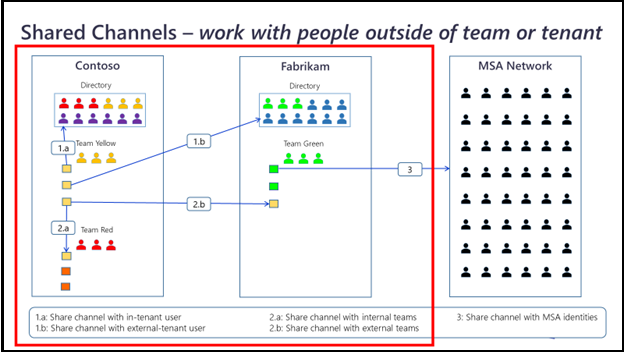

# Shared channels

The shared channels in Teams allow users of different organizations to collaborate effectively. The following image displays the concept of shared channels:

Teams enables collaboration scenarios and effective flow of information among team members. Channels allow team members to have an ongoing conversation.The users also wants to communicate across team or organizational boundaries. 
At present, the user can create a chat with these external members or add them to the Team. Adding members to the team provides access to the entire team content.  
Group chats with external users are not supported as chats provide limited compliance controls to the admin. Sharing a channel across the organization boundaries and inviting people to a specific channel helps in effective collaboration.    
Collaborating in channels allows you to work as efficiently with agencies, vendors, or clients as you do internally. With multiple companies working together, each have their unique set of tools to get the work done.

## Apps permissions in shared channels

Apps work between workspaces transparently. In shared channels, due to the nature of connecting to multiple workspaces, there must be restrictions in some scenarios depending on how the service behind the app is designed. For example, a commercial app, such as Salesforce that is tied to a specific workspace's users does not automatically give access to the users on another workspace. The `Conversations API` &  `users.info` method are used to determine the appropriate data access of your app. By default, your app must expose less information in shared channels to protect your users' data.  
Bot users are accessible to all users on the workspace where your app is installed, and any external members in a channel between organizations where your bot is also present. When an external member messages you, the team parameter informs your app which team the message originated from. You can compare this to the `team_id` parameter, which indicates the workspace where the app is installed. If your app shares sensitive information, you can change its behavior for external members.

## Challenges of Shared channels

* A shared channel presents similar challenges to the platform as private channels.
    * Private channels can become shared channels.Shared channels have similar isolation challenges as private channels for users that do not belong to the parent team. Use an **allow list** for a set of tabs that functions independent of user groups.
* Apps in federated scenarios.
    * Federated tenants present the issue of users from multiple organizations accessing the same app. Shared channels encounter this issue. For app roster, and app management  the `parentTeam/tenant` pattern is followed.

## JS SDK and Bot SDK

When the content UX is loaded in a shared channel, the data received from the `getContext` call must account for shared channel changes. If the tab makes use of any of the following values, the `channelType` field must be populated to determine if the tab is loaded in a shared channel, and respond appropriately.
To populate the `channelType` field with `sharedChannel`, you must populate the following  `getContext` properties:

**PROPERTIES:**

|Property name|Description|
|----------|--------------|
|`channelId`| This property is set to the SC channel thread ID.|
|`groupId`|This property is blank for Shared Channels.|
|`hostTeamTenantId`| This property describes the host team’s tenant ID. |
|`hostTeamGroupId`|This property describes the host team’s AAD group ID. This property is distinctly called out from groupID. |
|`tid`|  This property describes the current user’s tenant ID. This matches with the `homeTid` in the token.|
|`teamId`|This property is set to the thread ID of the current shared team. | 
|`teamName`|This property is set to current shared teamName. |
|`teamType`|This property is set to current shared team type.|
|`teamSiteUrl`|This property describes `channelSiteUrl`.| 
|`teamSitePath`| This property describes `channelSitePath`.| 
|`teamSiteDomain`| This property describes  `channelSiteDomain`.| 
|`tenantSKU`| This property describes the host team’s tenant SKU.|
|`userObjectId`|  This property describes current user’s ID, regardless of tenant.|
|`userPrincipalName`| This property describes the current user’s UPN, regardless of tenant.|
|`userTeamRole`| This property describes user’s role in host team: admin  user   guest   [New] sharedChannelMember  |

**APIs**

1.	Get direct members with the `GET channel members` API
1.	Iterate through each shared Team with the `GET sharedWithTeam` API
1.	Use the `GET channel members` API on each `sharedWithTeam` to retrieve full membership.

