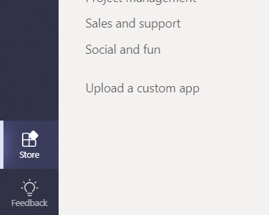

# Upload an app package to Microsoft Teams

To test your app experience within Microsoft Teams, you need to upload your app to Teams. Uploading adds the app to the team you select, and you and your team members can interact with it like end users.

> [!NOTE]
> Uploading an updated package for an existing app with a bot might not show tab changes when viewed through the Conversations window. It's better to access it via the Apps fly-out, or test on a clean test environment.

## Create your upload package

For development as well as AppSource (formerly Office Store) submission you must create an uploadable package that contains the information to describe your experience. The package, a .zip file, contains the application manifest and icons that uniquely define your experience.

To create an upload package, see [Create the package for your Microsoft Teams app](../build-and-test/apps-package.md).

With your package created, you can now upload it into a team. Once uploaded it will be available for all users in the selected team, and only the users of that team.

## Load your package into Teams

You can test your package by uploading it into Teams.

> [!NOTE]
> For uploading to work, your tenant admin must first [enable uploading of apps](/microsoftteams/admin-settings).

There are two ways to upload your app to Teams:

* Using the Store
* Using the Apps tab

## Upload your package into a team or conversation using the Store

1. In the lower left corner of Teams, choose the Store icon. On the Store page, choose **Upload a custom app**.

   

2. In the *Open* dialog, navigate to the package you want to upload and choose *Open*.

The uploaded package should now be available for use in the team or conversation specified in the consent dialog. If your app does not appear, the most common reason is an error in the manifest, particularly ids for the app, bot and messaging extensions. If the app is not scoped for conversations, that option will not appear.

>[!NOTE]
> Apps in conversations is currently in [Developer Preview](../../resources/dev-preview/developer-preview-intro.md), and the option will not appear if Teams is not running in that mode.

## Upload your package into a team using the Apps tab

1. In the target team, choose *More options* (**&#8943;**) and choose *Manage team*.

   > [!NOTE]
   > You must be the team owner, or the owner must allow users to add the appropriate app types for this functionality to appear.

2. Select the Apps tab, and then choose *Upload a custom app* on the lower right.

   

3. Browse to and select your .zip package from your computer.

4. After a brief pause you will see your uploaded app in the list.

   

If your app does not load, the most common reason is an error in the manifest, particularly ids for the app, bot and messaging extensions.

## Accessing your uploaded configurable tab

If the app contains tabs, users can pin them to any conversation or team channel using the standard tab gallery flow:

1. Go to a channel in the team. Choose *+* (*Add a tab*) to the right of the existing tabs.

2. Select your tab from the gallery that appears.

3. Accept the consent prompt.

4. Configure your tab via its [configuration page](../../tabs/how-to/create-tab-pages/configuration-page.md) and choose *Save*.

  

## Accessing your uploaded bot

When you add a bot to a team, it should be usable by anyone on that team, inside and outside the team channels, depending on bot scope definition. You and other team members will see a post in the General channel indicating that the bot has been added to the team.

For a teams-enabled bot, you can start by invoking your bot by @mentioning the name of the bot, which should autocomplete.

To test direct chats with your bot, you can either access it via the App home, @mention it in a channel, or search for it in the **New Chat** window.

When you add your bot to a conversation To test direct chats with your bot, you can @mention it in a conversation, or search for it in the **New Chat** window.

## Accessing your uploaded connector

With the app loaded in the team or conversation, users can set up a Connector using the standard connectors gallery flow:

1. Go to a channel in the team. Choose *More options* (*&#8943;*) and choose *Connectors*.

2. Select your Connector from the **Sideloaded** section at the bottom.

3. Configure your Connector via its [configuration page](../../webhooks-and-connectors/how-to/connectors-creating.md) and choose *Save*.

  

## Accessing your uploaded messaging extension

An uploaded app with a messaging extension automatically appears in the *More options* (*&#8943;*) menu in the compose box.

## Removing or updating your app

If you want to remove your app, select the trash-can icon next to the app name in the View Teams bots list.

If you change manifest information, you must first remove the app and then add the updated package (per [Load your package into a team](#load-your-package-into-teams)). Note that, in general, code changes on your service do not require you to re-upload your manifest, unless those changes require manifest updates (such as changes to the URL or the Microsoft app ID for its bot).

> [!NOTE]
> There is no way to completely remove a bot from personal context. If the bot is removed and re-added, additional communication with the bot will append to the previous conversation.

## Troubleshooting notes

* If the manifest doesn't load, please double-check that you followed all the instructions in [Create the package](../../concepts/build-and-test/apps-package.md) and validated your manifest against the [schema](../../resources/schema/manifest-schema.md).
