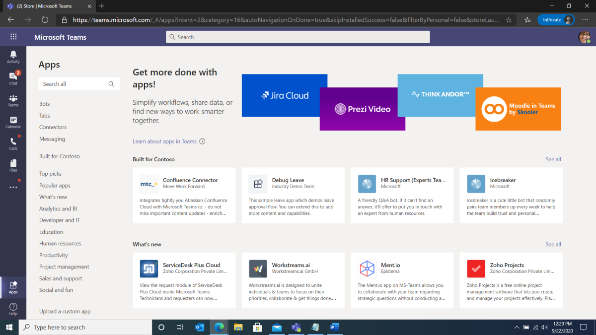
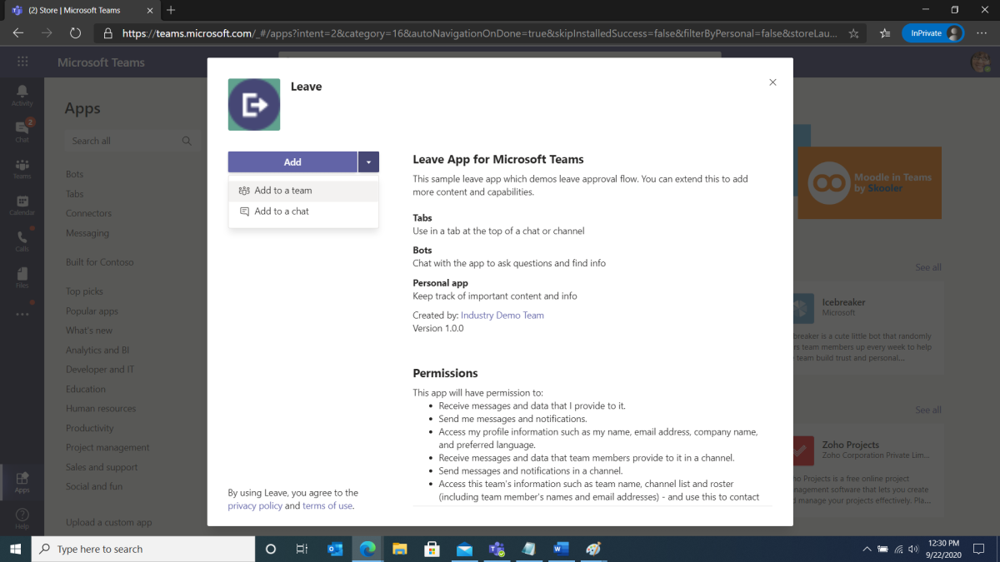
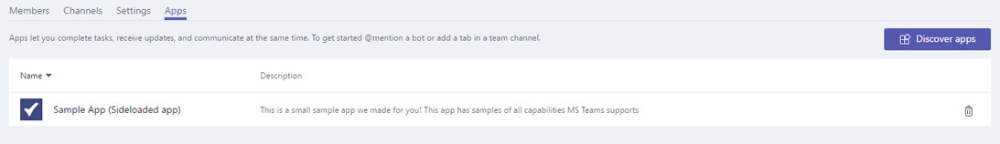
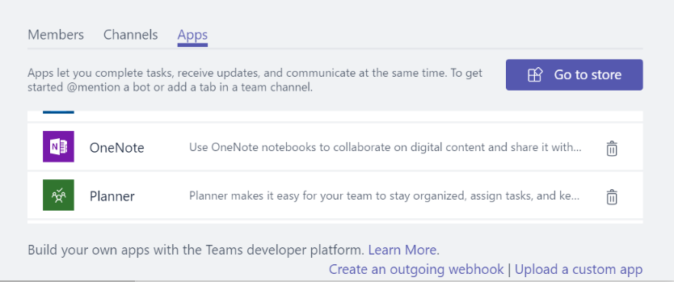
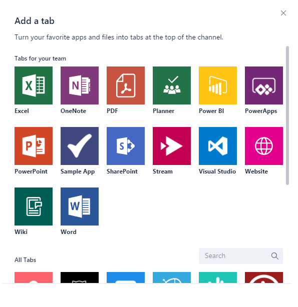
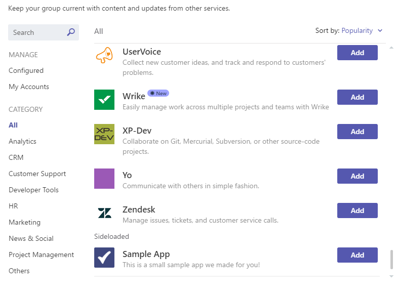
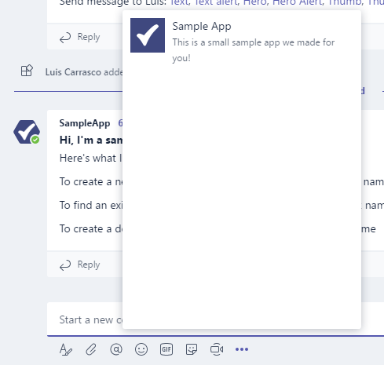

# Upload an app package to Microsoft Teams

To test your app experience within Microsoft Teams, you need to upload your app to Teams. Uploading adds the app to the selected team and all the team members can interact with it like end users.

> [!NOTE]
> Uploading an updated package for an existing app with a bot might not show tab changes when viewed through the conversations window. You can access the app through the apps fly-out or test in a clean environment.

## Create your upload package

For development and AppSource submission, you must create a package that you can upload. The package must contain the information to describe your experience. The package is a .zip file that contains the application manifest and icons that uniquely define your experience.

To create an upload package, see [Create the package for your Microsoft Teams app](../build-and-test/apps-package.md).

After you create the package, upload it into a team. The uploaded package is only available to the users of the selected team.

## Load your package into Teams

You can test your package by uploading it into Teams.

> [!NOTE]
> For uploading to work, your tenant admin must first [enable uploading of apps](/microsoftteams/admin-settings).

There are two ways to upload your app to Teams:

* Using the Store
* Using the Apps tab

## Upload your package into a team or conversation using the Store

1. In the lower left corner of Teams, choose the **Store** icon. On the Store page, choose **Upload a custom app**.

  

2. In the **Open** dialog, navigate to the package you want to upload and choose Open.

   

The uploaded package must be available for use in the team or conversation specified in the consent dialog. If your app does not appear, the most common reason is an error in the manifest, particularly IDs for the app, bot, and messaging extensions. If the app is not scoped for conversations that option does not appear.

>[!NOTE]
> Apps in conversations is currently in [Developer Preview](../../resources/dev-preview/developer-preview-intro.md), and the option does not appear if Teams is not running in that mode.

## Upload your package into a team using the Apps tab

1. In the target team, choose **More options** (**&#8943;**) and select **Manage team**.

   > [!NOTE]
   > You must be the team owner or the owner must give access to users to add the appropriate app types for this functionality to appear.

2. Select the **Apps** tab and choose **Upload a custom app** on the lower right.

   

3. Select your .zip package from the computer.

4. You can see your uploaded app in the list.

   

If your app does not load, the most common reason is an error in the manifest, particularly IDs for the app, bot, and messaging extensions.

## Access your uploaded configurable tab

If the app contains tabs, users can pin them to any conversation or team channel using the standard tab gallery flow:

1. Go to a channel in the team. Choose **+** to add a tab to the right of the existing tabs.

2. Select your tab from the gallery that appears.

3. Accept the consent prompt.

4. Configure your tab through its [configuration page](../../tabs/how-to/create-tab-pages/configuration-page.md) and select **Save**.

  

## Access your uploaded bot

After adding the bot to a team, it must be usable by anyone on that team, inside and outside the team channels, depending on bot scope definition. All team members can see a post in the **General** channel indicating that the bot has been added to the team.

For a Teams bot, you can start by invoking your bot by @mentioning the name of the bot.

To test direct chats with your bot, you can either access it through the App home, @mention it in a channel, or search for it in the **New Chat** window.

You can @mention the bot in a conversation or search for it in the **New Chat** window to test direct chats with your bot.

## Access your uploaded Connector

With the app loaded in the team or conversation, users can set up a Connector using the standard Connectors gallery flow:

1. Go to a channel in the team. Choose **More options** (*&#8943;*) and choose **Connectors**.

2. Select your Connector from the **Sideloaded** section at the bottom.

3. Configure your connector through its [configuration page](../../webhooks-and-connectors/how-to/connectors-creating.md) and select **Save**.

  

## Access your uploaded messaging extension

An uploaded app with a messaging extension automatically appears in the **More options** (*&#8943;*) menu in the compose box.

## Remove or update your app

To remove your app, select the delete icon next to the app name in the **View Teams** bots list. If you change manifest information, first remove the app and then add the updated package, see [Load your package into a team](#load-your-package-into-teams). Code changes on your service do not require you to upload your manifest again. However, if the code changes require manifest updates, such as changes to the URL or the Microsoft app ID for its bot, you must upload the manifest again.

> [!NOTE]
> You cannot remove a bot from a personal context entirely. If the bot is removed and added again, additional communication with the bot appends to the previous conversation.

## Troubleshooting notes

If the manifest fails to load, check if you have followed all the instructions in [Create the package](../../concepts/build-and-test/apps-package.md) and validated your manifest against the [schema](../../resources/schema/manifest-schema.md).
