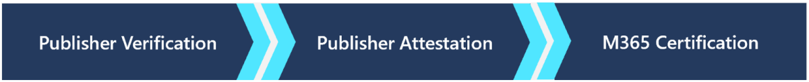

# Microsoft 365 App Compliance 

Building a secure and trustworthy app ecosystem is a top priority for Microsoft. Several investments aim to ensure that apps available in the Microsoft store are valid, safe and secure. 

   

-	[Publisher Verification](https://docs.microsoft.com/en-us/azure/active-directory/develop/publisher-verification-overview)  –  allows developers with a verified [Microsoft Partner Network](https://partner.microsoft.com/en-us/membership) (MPN) account to associate an organizational identity with their apps registered through the [Microsoft identity platform](https://docs.microsoft.com/en-us/azure/active-directory/develop/).
-	[Publisher Attestation](https://docs.microsoft.com/en-us/microsoft-365-app-certification/docs/enterprise-app-attestation-guide) – developers complete a self-assessment of their organization’s security, compliance, and data handling practices. This information is made available for IT Admins to review. 
-	[M365 Certification](https://docs.microsoft.com/en-us/microsoft-365-app-certification/docs/enterprise-app-certification-guide) – Microsoft employs a third-party assessor to review and validate the security and compliance standards for the organization. This is our highest level of certification and it gives assurance IT Admins that the application and organization that receives it operates in ways that promote safe usage and storage of data.

## Program benefits

Each tier in the Microsoft 365 App Compliance Program gives a different level of assurance to your customers. By completing the Publisher Verification you are assuring your customers that your company is the publisher of your app. The Publisher Attestation reduces the need to go back and forth with your customers about your app’s security practices. We publish your responses to common questions about security and compliance in one location in a consistent format for customers to review. The final tier is the M365 Certification. Upon completion your customers will know that you follow secure data handling and security practices. Other benefits of the compliance program include:
-	Free – Microsoft is currently covering this cost
-	Earn a badge in AppSource and on [Compliance Dev Docs](https://docs.microsoft.com/en-us/microsoft-365-app-certification/teams/teams-apps)
-	Differentiation from other apps in the store
-	Reduced time to app adoption for your customers
-	Reduce the amount of time you spend filling out RFPs
-	Added confidence in the security and compliance measures of your application

## Qualifying application types 
### Publisher Verification applies to apps which: 
- Using [OAuth 2.0 and OpenID Connect](https://docs.microsoft.com/en-us/azure/active-directory/develop/active-directory-v2-protocols) to sign users in and request access to data using service-side APIs such as [Microsoft Graph](https://developer.microsoft.com/graph/). 
- Registered in Azure AD as multi-tenant. 

### Publisher Attestation
-	Teams
-	Word
-	Excel
-	PowerPoint
-	Outlook

### M365 Certification
-	Teams
-	Coming soon: will offer same application type coverage as Publisher Attestation

## How to start the program

Completing the Microsoft 365 App Compliance Program is voluntary, but highly encouraged. You can join the program no matter where if you are a newly added application or if you’ve been in the store for years. 

The first step is to complete the [Publisher Verification](https://docs.microsoft.com/en-us/azure/active-directory/develop/publisher-verification-overview). The next step is to complete the [Publisher Attestation](https://docs.microsoft.com/en-us/microsoft-365-app-certification/docs/attestation). Once you complete the Publisher Attestation, we will reach out to you with the next steps to begin the M365 Certification.
