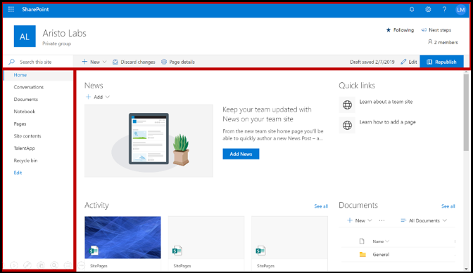
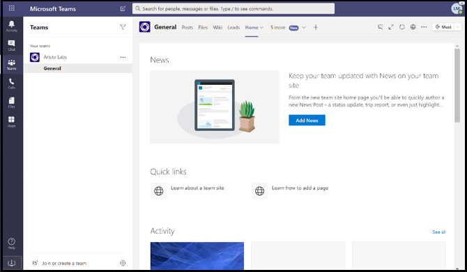
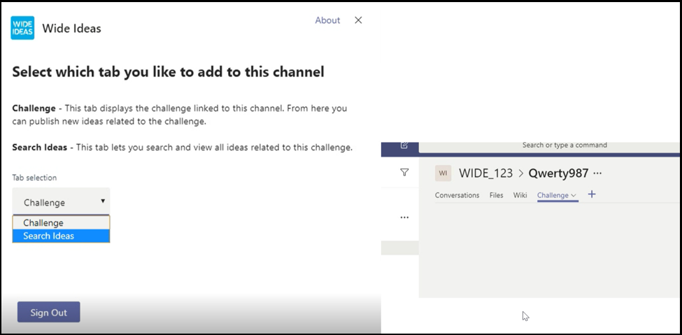
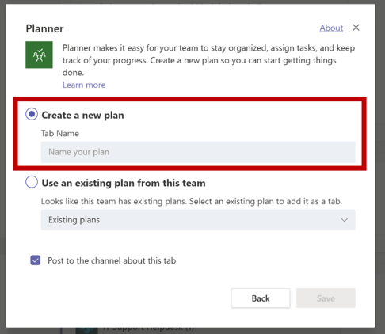
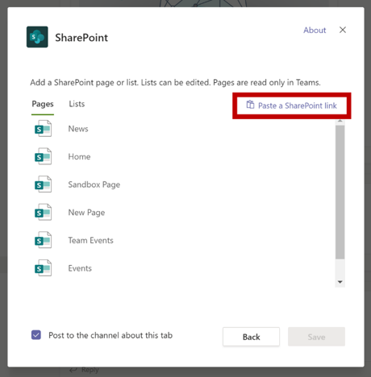
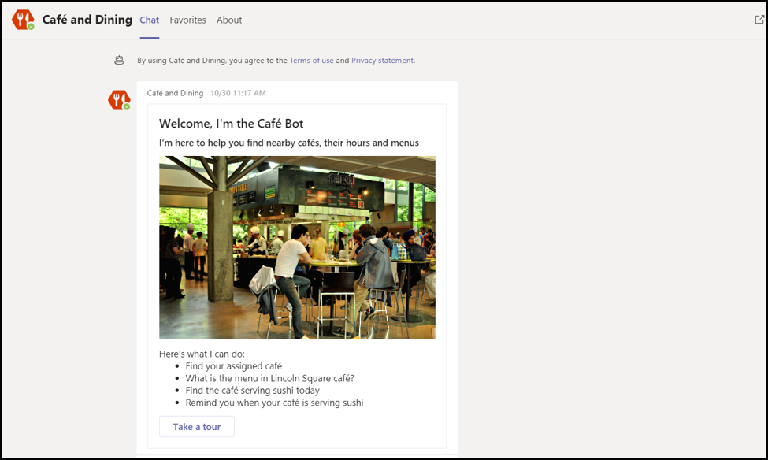
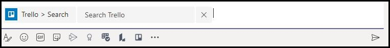

# Tips for a successful app submission

This article addresses common reasons submitted apps fail validation. While it's not intended to be an exhaustive list of all potential issues with your app, following this guide will increase the likelihood that your app submission will pass the first time. *See* [Commercial marketplace certification policies](/legal/marketplace/certification-policies) for an extensive list of validation policies.

>[!NOTE]
>**[Section 1140](/legal/marketplace/certification-policies#1140-teams)** is specific to Microsoft Teams and **[sub-section 1140.4](https://docs.microsoft.com/legal/marketplace/certification-policies#11404-functionality)** addresses functionality requirements for Teams apps.

## Validation guidelines & most failed test cases

### &#9989; General considerations

*See also* [Section 100 — General](/legal/marketplace/certification-policies#100-general)

* Ensure you are using version 1.4.1 or later of the [Microsoft Teams SDK](https://www.npmjs.com/package/@microsoft/teams-js).
* Don't make changes to your app while the validation process is in progress. Doing so will require a complete revalidation of your app.
* Your app  must not stop responding, end unexpectedly, or contain programming errors. If an issue is encountered, your app should fail gracefully and provide a valid-way-forward message to the user.
* Your app must not automatically download, install, or launch any executable code in the user environment. All downloads should seek explicit permission from the user.
* Any material that you associate with your experience, such as descriptions and support documentation, must be accurate. Use correct spelling, capitalization, punctuation, and grammar in your descriptions and materials.
* Provide help and support information. It's highly recommended that your app include a help/FAQ link for the first-run user experience. For all personal apps, we recommend providing your help page as a personal tab for a better user experience.
* Apps must not take the user out of Teams for core user scenarios. Using task modules/tabs is recommended to display information to users within Teams.
* Increment your app version number in the manifest if you make any manifest changes to your submission.
* App must not take users out of Teams for core user scenarios. Link targets in apps must not link to an external browser but should link to div elements contained within Teams e.g. inside Task Modules and tabs.
* Personal apps enable users to share content from a personal app experience with other team members.

### &#9989;  Provide a clear and simple sign in/sign out and sign-up experience

*See also* [Section 1100.5 — Customer control](/legal/marketplace/certification-policies#11005-customer-control)

* If your app or add-in depends on external accounts or services, the sign in/sign out and sign-up experience must be apparent and reachable across all capabilities in your app.
* If there is an explicit sign-in option provided to the user, there must be a corresponding sign-out option (even if the app is using [silent authentication](../../../../tabs/how-to/authentication/auth-silent-aad.md)).
* The sign-out option must only sign the user out of your app's capability and not out of the Teams client.
* At a minimum, the sign-out option must sign the user out of the same capabilities accessed with the sign-in option. For example, if the sign-in option includes both a messaging extension and tab, then the sign-out option must include both the messaging extension and tab.

* Make sure there is always a way to reverse the following (or similar) behaviors:
  * Sign-in => sign-out.
  * Link an account/service => unlink an account/service.
  * Connect an account/service => disconnect an account/service.
  * Authorize an account/service => deauthorize/deny an account/service.
  * Register an account/service => deregister/unsubscribe an account/service.
* If your app requires an account or service, you must provide a way for the user to sign up or to create a sign-up request. An exception may be granted if your app requires a license to use. But such scenarios, a clear way forward for a new user sign up must be provided.
* Make sure you provide clear-way-forward guidance to a new user on how to sign up to use your app services. If a ready sign-up link is not available, a clear way forward may be provided in the following areas

> [!div class="checklist"]
>
> * within your app's description sections;
> * in your app's welcome message;
> * in your app's help message;
> * in the window where you ask a user to sign in to your services;

* Apps that do not have an easy sign-up flow may also include a help tab or link to a web page where a new user can see detailed guidance on how to configure your app with Microsoft Teams.  This is to ensure a new user is not blocked when trying your app for the first time.
* Sign in/sign out functionality must work on mobile clients. Ensure you're using the [Microsoft Teams SDK](https://www.npmjs.com/package/@microsoft/teams-js) version 1.4.1 or later.

For additional information on authentication see:

* [Authentication documentation](../../../authentication/authentication.md)
* [Bot authentication sample in Node](https://github.com/OfficeDev/microsoft-teams-sample-auth-node)
* [Tab authentication sample in Node](https://github.com/OfficeDev/microsoft-teams-sample-complete-node)
* [Tab/bot authentication in C#/.NET](https://github.com/OfficeDev/microsoft-teams-sample-complete-csharp)

### &#9989; Response times must be reasonable

* **Tabs**. If a response to an action takes more than three seconds, you must provide a loading message or warning.
* **Bots**. A response to a user command must occur within two seconds. If longer processing is required, your app must display a typing indicator.
* **Compose extensions**. A response to a user command must occur within five seconds.

> [!TIP]
> Make sure your app displays a loading indicator or some form of warning when your app is taking longer than expected to respond.

### &#9989; Tab content must not have excessive chrome or layered navigation

* Tabs should provide focused content and avoid needless UI elements. In general, this usually refers to unnecessary nested/layered navigation, an extraneous or irrelevant UI next to the content, or any links that take the user to unrelated content. For example, below is a tab view that omits navigation menus and only showcases the main content:

  

* Tabs should be light in nature and not include complex navigation.
* Channel tabs that have complex editing capabilities within the app should open the editor view in a multi-window rather than a tab.
* Channel tabs must not provide an app bar with icons in the left rail that conflicts with the main Teams navigation.
* Tabs must not present an app bar with icons in the left rail that conflict with the main Teams navigation.
* Tabs that have complex editing capabilities within the app should open the editor view in a multi-window rather than in the tab.
* If there are multiple view options, consider having a tab config menu for the user to choose from. For example, instead of embedding a menu inside the tab, put the menu in the configuration page so the actual tab view is clean and focused.
* Please include a *Help* tab as a static tab to advise users how to configure, sign up, and use your app.
* Please include a *Settings* tab that is available from the app header.

### &#9989; Tab configuration must happen in the configuration screen

* The configuration screen should clearly explain the value of the experience and how to configure the tab.
* The configuration process should always provide a way for users to continue not dead-end the user experience. For example, do not show an empty board after the user has configured the tab
* The user sign-in process must be part of the configuration process and should complete in the Tab UI. After the user has completed configuration and loaded your tab, no further action should be required.
* Don't show your entire webpage within the sign-in configuration pop-up window.
* A user should always be able to finish the configuration experience, even if they can’t immediately find the content they’re looking for.
* The configuration experience should provide options for the user to find their content, pin a URL, or create new content if it doesn’t exist.
* The configuration experience must remain within the Teams context. The user shouldn’t have to leave the configuration experience to create content and then return to Teams to pin it.
* Use the available viewport area efficiently. Do not waste it on using huge logos inside the configuration pop up

### &#9989; Bots must always be responsive and fail gracefully

Your bot should be responsive to any command and not dead-end the user. Here are some tips to help your bot intelligently respond to users:

* **Use command lists**. Analyzing user input or predicting user intent is hard. Instead of letting users guess what your bot can do, provide a list of commands your bot understands.

* **Include a help command**. Users are likely to type "Help" when they are lost or when your bot doesn't respond as expected. Include a help command that describes how your app's value will be experienced along with all valid commands.

* **Include help content or guidance when your bot is lost**. When your bot can't understand the user input, it should suggest an alternative action. For example, *"I'm sorry, I don't understand. Type "help" for more information."* Don't respond with an error message or simply, *"I don't understand"*. Use this chance to teach your users.

* **Use adaptive cards and task modules to make your bot response clear and actionable**
[Adaptive cards with buttons invoking task modules](/task-modules-and-cards/task-modules/task-modules-bots) enhance the bot user experience. These cards and buttons are easier to use in a mobile device as opposed to your user typing the commands. Also bot responses should not be textual with long text. Bots must make use of Adaptive cards & task modules instead of conversational chat based user interface and lengthy text responses

* **Think through all scopes**. Be sure that your bot provides appropriate responses when mentioned (`@*botname*`) in a channel and in personal conversations. If your bot does not provide meaningful context within the personal or teams scope, disable that scope via the manifest. (See the `bots` block in the [Microsoft Teams manifest schema reference](../../../../resources/schema/manifest-schema.md#bots).)

* **Include team, group chat, or 1:1 conversation**. Bot notifications should include a Team, a group chat, or a one-to-one conversation with relevant content for your audience.

* **Do not push sensitive data**. Bots must not push sensitive data to a Team, a group chat or a 1:1 conversation where there is an audience who should not be able to view that data

* **Provide a welcome message**. Bot must provide an FRE welcome message that includes an interactive tutorial with carousel cards or "try it" buttons, to encourage engagement.

### &#9989; Personal bots must always send a welcome message on first launch

A welcome messages is the best way to set the tone for your personal/chat bot. This is the first interaction a user has with the bot. A good welcome message can encourage the user to keep exploring the app. If the welcome or introductory message is confusing or unclear, users won't see the value of the app immediately and lose interests.
Please see below section for Welcome message requirements.

> [!Note]
> A welcome message is optional for a channel bot.

### Welcome message requirements

* Include a value proposition with the welcome tour.
* Provide way-forward guidance for using the app.
* Include guidance on how to Sign up and configure your app
* Present easy-to-read text and straightforward dialogue — preferably a card with an actionable welcome tour button that loads a task module.
* Keep it simple and usable with buttons and cards — avoid long text, chatty dialogue.
* Include adaptive cards and buttons to make the welcome message more usable.
* Invoke the welcome message  with one ping, not two or more simultaneous pings.
* A welcome message must only be shown to the user who configured the app, preferably in a 1:1 personal chat.
* Personal apps must always provide a welcome message to a user.
* Never send a personal chat to every member in the team - this is considered spam.
* Never send the welcome message more than once. Repeating the same welcome message over regular intervals is not allowed and is considered spamming.

#### Avoid welcome message spamming

* **Channel message by bot**. Don't spam users by creating separate new chat posts. Create a single thread post with replies in the same thread.
* **Personal chat by bot**. Don't send multiple messages. Send one message with complete information. Repeating the same welcome message over regular intervals is not allowed and is considered spamming.

#### Notification-only bot welcome messages

Notification-only bots must send a welcome message that includes a message conveying, *"I am a notification-only bot and will not be able to reply to your chats"*.

#### Welcome messages in the personal scope

* **Make your message concise and informative**.  Most likely, user experience with and knowledge of your app will vary. A user may have used your app on another platform or know nothing about your app. You want to tailor your message to all audiences and in a couple sentences explain what your bot does and the ways to interact with it. You should also explain the value of the app and how the users will benefit from using it.

* **Make your message actionable**. Think about the first thing you want users to do after installing your app. Is there a cool command they should try? Is there another onboarding experience they should know about? Do they need to sign in? You can add actions on an adaptive card or provide specific examples such as *“Try asking….”*, *“This is what I can do…”*.

#### Welcome messages in the team/channel  scope

Things are a little bit different when the bot is first added to a channel. Normally, you shouldn't send a 1:1 message to everyone on the team, but the bot can send a welcome message in the channel.

### &#9989; Mobile responsiveness, no direct upsell or payment

* Your tabs, adaptive cards, bot messages and content in task modules must be responsive for a variety of mobile device screens sizes.
* Apps that support iOS must be fully functional on the latest iPad device using the latest version of iOS.
* Must not include any direct references to in-app purchases, trial offers, offers for paid versions, or links to any online stores where users can purchase or acquire other content, apps, or add-ins from your Teams app on mobile OS (Android, iOS).
* The iOS or Android version of the add-in must not show any UI or language or link to any other apps, add-ins, or website that ask the user to pay.
* The associated Privacy Policy and Terms of Use pages must also be free of any commerce UI or Store links.

### &#9989; Do not post sensitive data to an audience not intended to view the data

Your Teams app must not post sensitive data such as credit card / financial payment instrument, Personal Identifiable Information (PIN), health, or contact tracing information to an audience not intended to view that data.

### &#9989; Do not transmit financial payment details or complete financial transactions via your Teams app

* Your Teams app must not ask users to make a payment directly within Teams interface
* Apps may not transmit financial instrument details through the user on the app interface. Apps may only transmit links to secure payment services to users if this is disclosed in the app's Terms of Use, Privacy Policy, and any profile page or website for the app before a user agrees to use the app.

### &#9989; Clear warning before downloading any files or executable (`.exe`) into a user’s environment

Please warn users before your app downloads any files or executable (`.exe`  )into the user's machine or environment.

### &#9989; Messaging extensions should provide help text and be easy to read

* The search-based messaging extension should provide help text on how to effectively search (e.g., show example input).
* Task modules must include an icon and a short name that they are contained in or created from the app.
* The message extension `@mention` executables should be clear, easy to understand, and easy to read.

### M365 Publisher Attestation
#### Complete the Publisher Attestation in Partner Center
* Refer to the [Complete Publisher Attestation](/microsoft-365-app-certification/docs/attestation) program documentation for more details.
* Follow the steps in the [Publisher Attestation Workflow](/microsoft-365-app-certification/docs/userguide#3publisher-attestation-workflow) section to complete the publisher attestation process. For any clarification, write to appcert@microsoft.com.
* Refer to the [Troubleshooting guide](/azure/active-directory/develop/troubleshoot-publisher-verification) for additional information.
* Self Attestation can be completed via Partner Center. Fill out the Self-Assessment Questionnaire under **App Compliance**

> [!div class="nextstepaction"]
> [Learn more about Teams app approval policies](/legal/marketplace/certification-policies#1140-teams)
