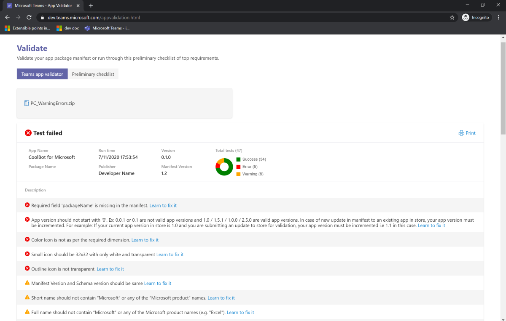
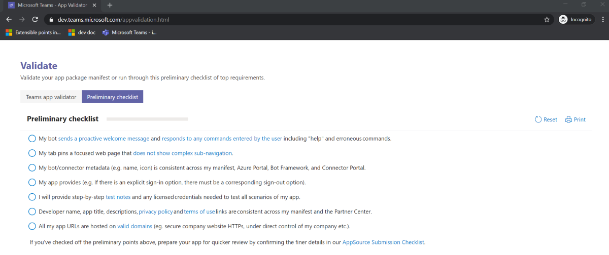

# Prepare your Microsot Teams store (AppSource) submission  

You've designed, built, and tested your Microsoft Teams app. Now you want people from all the over the world to use it.

Before you submit your app to [Partner Center](/office/dev/store/use-partner-center-to-submit-to-appsource), go through the following instructions.

## 1. Check your app manifest

xxxx

### Teams App Validation Tool

The app validation tool consists of an [app validator](#teams-app-validator) and a [preliminary checklist](#preliminary-checklist). The tool replicates the same test cases used by [AppSource](/office/dev/store/submit-to-appsource-via-partner-center) to evaluate your app submission. Therefore,  it's crucial to pass all the test cases prior to submitting your solution to AppSource for approval. The tool can be found in several areas within the Teams platform:

> [!div class="checklist"]
>
> * [**App Validator homepage**](https://dev.teams.microsoft.com/appvalidation.html)
> * [**Teams Visual Studio Code toolkit**](/toolkit/visual-studio-code-overview.md)
> * [**App Studio**](../../../build-and-test/app-studio-overview.md)

### Teams app validator

The **Validate** page allows you to check your app package before submission to AppSource. Simply upload your app package and the validation tool will check your app against all manifest-related test cases. For each failed test, the description provides a documentation link to help you fix the error.

### Preliminary checklist

For test scenarios that are difficult to automate, the preliminary checklist surfaces seven of the most commonly failed test cases.

## 2. Create your app package

Link back to app package doc.

## 3. Compile your test notes

Link back to test section.

Please include the following:

* You must provide at least two login credentials, one admin and one non-admin.

* For verification purposes, the accounts you provide should have sufficient pre-populated data.

* For enterprise apps, apps where a subscription is required, or apps where there is an Office 365 tenant/domain dependency, you must provide a third account in the same domain that is not pre-configured for your app so that we can validate the first-run user experience.

* If your app has premium/upgraded features, an account with the necessary access must be provided to test that experience.

* You may choose to upload your test notes to SharePoint. If so, please provide a public link to the file.

* **Test Accounts**. A test account is required if your app only allows licensed accounts or safelisting from the backend. Also, if there is a team/group chat scope allowed in your app,  two test accounts in the same tenant are required to validate the team collaboration scenario.

* **Integration steps**. If pre-configuration by a tenant admin is required to use the app, include the steps and/or provide configured admin and non-admin accounts for validation. Note: you can sign up for an [Office 365 Developer Program](https://developer.microsoft.com/microsoft-365/dev-program) subscription. It's *free* for 90 days and will continually renew as long as you're using it for development activity.

* **Notes regarding the app features in Teams**: Detail all of the capabilities the app offers within Teams and steps for testing each feature.

* **Video showing the app functionality (Optional)**: You can provide a video recording of the product for us to fully understand the functionality of the app.
