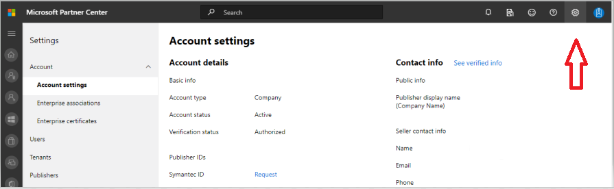
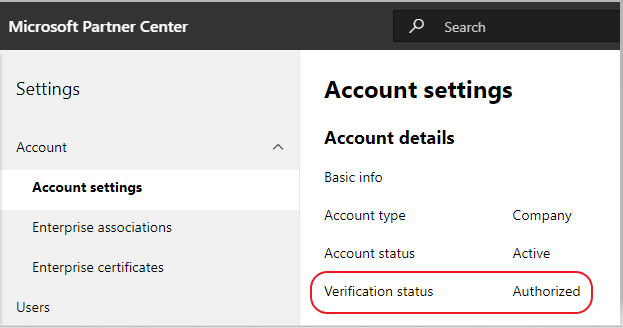

# Submit your app to AppSource

## Teams app submission

Publishing  your app to [AppSource](https://appsource.microsoft.com) makes it available in the Teams app catalog and on the web. At a high level, the process for submitting your app to AppSource is:

1. Develop your app following our [design guidelines](~/concepts/design/understand-use-cases.md). Tabs should follow our [tab design guidelines](~/tabs/design/tabs.md). Bots should follow the [bot design guidelines](~/bots/design/bots.md).
1. Ensure your app meets the app [validation policies](/legal/marketplace/certification-policies) for Microsoft Teams.
1. [Set up a developer account](/office/dev/store/open-a-developer-account) in [Partner Center](https://support.microsoft.com/help/4499930/partner-center-overview). *See also* [How do I create a Partner Center account](#how-do-i-create-a-partner-center-account) in the FAQ section, below.
1. Prepare your app for submission by following our [submission checklist](~/concepts/deploy-and-publish/appsource/prepare/submission-checklist.md).
1. Review our [tips for a successful app submission](~/concepts/deploy-and-publish/appsource/prepare/frequently-failed-cases.md).
1. Submit your package to [AppSource through Partner Center](/office/dev/store/use-partner-center-to-submit-to-appsource).
1. Track the approval process on your Partner Center dashboard. *See* [Partner Center Overview](https://support.microsoft.com/help/4499930/partner-center-overview).
1. Post submission — review our guidance for [Maintaining and supporting your published app](~/concepts/deploy-and-publish/appsource/post-publish/overview.md).

>[!NOTE]
>
>- If your Teams app contains a bot, you must comply with the Bot Developer Framework [Code of Conduct](https://aka.ms/bf-conduct).
>- If your app contains an Office 365 Connector, additional terms may apply. *See* [Connectors Developer Dashboard](https://aka.ms/connectorsdashboard) and [App Developer Agreement](https://sellerdashboard.microsoft.com/Assets/Content/Agreements/Office_Store_Seller_Agreement_20120927.htm).
>- To make your app available for GCC users and avoid duplicate app listings in the store, the auth process/flow should identify and route the user to the specified/expected content URL for GCC users.

## FAQs — Teams apps and Partner account verification process in Partner Center

## How do I create a Partner Center account?

There are two ways to create a Partner Center account:

- If you're new to Partner Center and don't have an account  within the Microsoft network, [create an account using the Partner Center enrollment page](/office/dev/store/open-a-developer-account#create-an-account-using-an-existing-partner-center-enrollment).
- If you're already enrolled in the Partner Network, [create an account directly in Partner Center using an existing enrollment](/office/dev/store/).

## What if I cannot find my Office Store account in Partner Center?

Please open a [Partner Center support ticket](https://partner.microsoft.com/support/v2/?stage=1) and select the following from the drop-down menus:

| Menu | Option |
| -------   | -------  |
|Category| Commercial Marketplace|
| Topic | General Marketplace Help and How-to questions |
| Subtopic| Office add-in |

## Where can I get support for my Partner Center account issues?

Please visit our [publishers support page](https://aka.ms/marketplacepublishersupport) to search for your issue topic and find guidance. If the provided guidance is not helpful, [open a Partner Center support ticket](/azure/marketplace/partner-center-portal/support#how-to-open-a-support-ticket).

## How do I manage my Office Store account in Partner Center?

Please visit our  [Manage your Office Store account in Partner Center](/office/dev/store/manage-account-settings-and-profile) for guidance on managing your Office Store account through Partner Center.

## How do I add my phone number to the partner profile contact section?

The phone number has three parts — country code, area code, and the telephone number. If your phone number doesn't include an area code, then leave the second box empty, and complete the third box.

## How do I manage my account settings and partner profile in Partner Center?

Please visit our [Manage account settings and profile info](/windows/uwp/publish/manage-account-settings-and-profile#additional-settings-and-info) page for guidance on managing your Partner Center account settings.

## Why do I receive the message, "This account is not publish eligible," when I try to submit my add-in through Partner Center?

You'll receive the above error message when your [account verification status](/partner-center/verification-responses) is pending. You can check your account verification status in the Partner Center [dashboard](https://partner.microsoft.com/dashboard) by selecting the **Settings** option (the gear icon) in the upper-right corner of the page header shell and choosing **Developer settings** => **Account**  => **Account settings** .

During the account verification process the status of each required step —  Email Ownership, Employment Verification, and Business Verification — will be displayed. Once the verification process has been successfully completed, the verification status of your enrollment on the profile page will change from "pending" to "authorized," and the process steps will no longer be displayed.

## My account Verification status has not advanced beyond Email Ownership in Partner Center. How should I proceed?

During the **Email Ownership** verification process, a verification email is sent to the primary contact email address. Please check your primary contact inbox for an email  from **maccount@microsoft.com** with the subject  line *Action needed: Verify your email account with Microsoft*, requesting that you complete the email verification process. The verification email will be sent to the email address listed  in your account settings page in Partner Center.

> [!NOTE]
 >The email verification link is only valid for 7 days. You can request that we resend the email to you by visiting your partner profile page and selecting the **Resend verification email** link. To ensure that the email is received, safelist email from microsoft.com as a secure domain, and check your junk email folders.

## How I do get further support for my account related issues?

Please visit our [Support for the Commercial Marketplace program in Partner Center](/azure/marketplace/partner-center-portal/support) page for guidance and steps to create a support ticket.

## I've checked my mail folders and haven't received the verification email. What  should I do next?

Please try the following:

1. Check your junk/spam folder.
1. Clear the browser cache, go to your Partner Center account dashboard, and select  the **Resend verification email** link to have the verification email resent to your email address.
1. Try accessing the  **Resend verification email** link  from a different browser.
1. Work with your IT department to ensure that the verification emails are not blocked by the email server.
1. Adjust your server's spam filter to allow/safelist all emails from **maccount@microsoft.com**.

## How long does the employment verification process usually take?

If all the submitted details are correct, employment verification completes in 1 to 2 hours.

## How long does the “Business Verification” process usually take?

Business Verification takes 1 to 2 business days to complete, provided that all required documents have been submitted.

## If I reach out to the support team, will my ticket be expedited?

Support tickets will be resolved within a week's time. Please look for the updates which will be sent to the email provided when the support ticket was raised.

## My issue is not listed here.  Are there other pages I can reference for Partner Center issues?

Please refer to our [commercial marketplace documentation](/azure/marketplace/) for more help.

## I've created a support ticket, it has been 7 business days, and I haven't received an update. Where can I get additional help?

Please send an email to **<teamsubm@microsoft.com>** with the following details:

1. **Subject Line**. *Partner Center Account Issue for <App_Name>* (specify the name of your app).
1. **Email body:**
    * Support ticket number:
    * Your seller ID:
    * A screen shot of the issue (if possible):

>
> [!div class="nextstepaction"]
> [Learn more about app validation policies for Microsoft Teams](/legal/marketplace/certification-policies)
