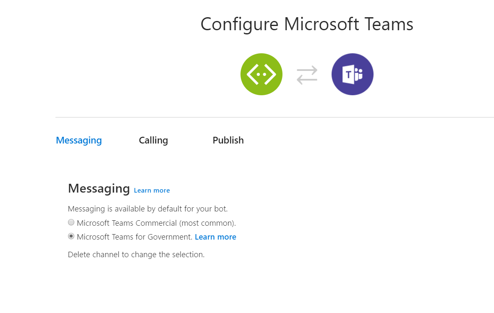

# Choose how to distribute your Microsoft Teams app
You can distribute your Microsoft Teams app to an individual, team, organization, or people everywhere.

For Enterprise organizations you can directly upload your app or publish it your organization's app catalog, or publish it through the AppSource. For Government organizations, they need to be members of Government Cloud Community (GCC). Depending on the fulfillment of the GCC compliance criteria, the GCC tenant administrator decides if an app must be uploaded and published.

## Upload your app for a team or user

This is the easiest way to use and test your app. If you are the team owner and [uploading custom apps is enabled](/microsoftteams/admin-settings), you can [directly upload or sideload](apps-upload.md) the app and start using it. However, if you want to share the app with others, you must send your app package and ask them to upload it independently.

## Publish to your organization

The steps to publish your apps can vary depending on the organization to which you are publishing them.

### Enterprise organization
Publishing to your organization's app catalog can only be managed by Teams users with Microsoft Office 365 tenant admin privileges.

**To publish to your organization's app catalog**

Your organization's app catalog contains apps that are unique to your organization and is completely under your organization's control. For more information on publishing the app to your organization's app catalog, see [manage your apps in the Microsoft Teams admin center](/microsoftteams/tenant-apps-catalog-teams). 

### Government Community Cloud (GCC) organization
If your organization is a member of the GCC then it is GCC tenant administrator who decides if you can upload or publish an app.

> [!NOTE]
> Microsoft does not own or control your custom applications, therefore, you must ensure that all endpoints are compliant with your organization's requirements. In addition, if the app solution includes a bot or message extension, you must complete the [Bot Framework registration](https://dev.botframework.com/).

**To configure a Government Community Cloud (GCC) distribution**

1. On the **Connect to channels** page, under **Add a featured channel**, select **Teams**.
2. Navigate to the **Configure MSTeams** page.
3. Under **Messaging**, select *Microsoft Teams for Government*.

   > [!IMPORTANT]
   > You cannot use the *Microsoft Teams Commercial* configuration to upload or sideload your custom app to a GCC environment.
4. In the lower left corner of the page, select **Save**.

> [!NOTE]
> * The uploading instructions for the GCC environment also apply to Teams custom apps.  
> * Only Microsoft compliant apps are permitted in the GCC environment and in Teams.
> * Third-party apps are disabled at the tenant level and are managed through your organization's [app permission policies](/microsoftteams/teams-app-permission-policies). You must review all third-party apps to ensure they align with your organization's policies and procedures.

## Publish to the Teams store

AppSource provides a convenient location from which you can distribute your apps and other Office 365 extensibility types, such as Office add-ins and SharePoint add-ins. For more information on how to publish your app to AppSource, see [submit your app to AppSource](../appsource/publish.md).

## See also

> [!div class="nextstepaction"]
> [Maintain and support your app](~/appsource/post-publish/overview.md)

> [!div class="nextstepaction"]
> [Microsoft Teams app certification](~/appsource/post-publish/application-certification.md)

## Next step

> [!div class="nextstepaction"]
> [Create your app package](../build-and-test/apps-package.md)
