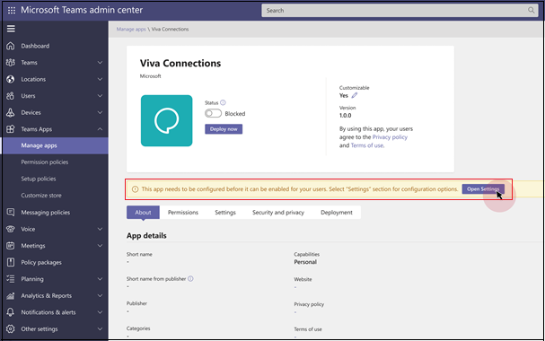
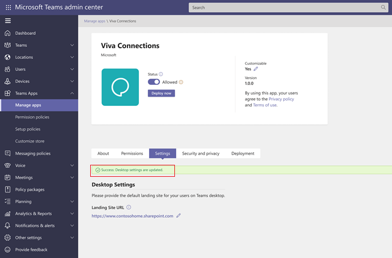

# Hide app until Admin allows it

You can customize Microsoft Teams app experience by hiding an app from users by default until Admin allows it. When an app is published to the global app store, Admins can configure the app before making it available to users. Admins can allow or not allow the app to ensure the app experience isn't affected until the app is fully set up. A fully configured app enables better adoption and reduces roadblocks in users’ cognitive understanding.

This feature allows you to specify whether your app can be hidden from users by default until configured.

## Scenario

Contoso Electronics is an independent software vendor (ISV) that has created a help desk app for Teams. To enable appropriate functioning of the app, Contoso Electronics’ wants its customers to first set up specific properties of the app. The ISV can specify if they want their app to be blocked by default. The app is available to users only after the Admin allows it.

## Solution

Allowing IT Admins to configure apps before making them available to users helps drive a better user experience, and drive greater usage of third-party apps.

To optionally specify whether the app is blocked by default in a new section in the app manifest, add the `defaultHideUntilAdminAction:true` manifest field.

### App configuration support not required

By default, all first-party and third-party apps are allowed. App is blocked by default only when the following options are chosen:

* You opt to hide or block the app by default until it is configured or customized by an Admin.
* You submit a new version of app to the store with the default block property specified.

### Option to not hide app by default

If you choose not to hide the app by default, you can remove it by updating the manifest. When the new version of the app is approved:

* The app is allowed by default as long as the Admin hasn't taken specific action to block it.  

* Tenants who have previously blocked the app continue to see it as blocked.

* For tenants who had never taken an action, that is app remained in `PendingConfig` state, the app is now allowed.

### App customization by Admins

Apps that are default hidden until Admin action continue to be treated as their original app type whether first-party or third-party. Customized apps appear in the third-party category of the store when viewed during permission policy configuration and don't show as custom apps in the management experience.

After an Admin allows an app, you can toggle it to allow or block as the current experience allows.

When an ISV sets `defaultHideUntilAdminAction:true`, a notification is sent to an Admin that the app has requested action by the Admin before being allowed to users. The app status shows as `Pending Configuration`.

The app with `Pending Configuration` status shows as pending configuration in **Manage apps** page and Admins can allow the app from that page.

Saving the app configuration doesn't affect the app status and the Admin must allow the app.

### User experience in Teams runtime

In Teams Store, if an app is submitted with the default status as blocked, the app is hidden from users by default. The app is hidden until an Admin takes an action to allow it.

On desktop or web and on mobile, when you set an app to be blocked by default, the app is hidden everywhere where that experience is served by Teams, until Admin allows it. This experience includes but is not limited to the personal app bar, the tab galleries, in chat as a bot, and through the meetings experience.

App upgrades result in no change of behavior except as related to removal of default block support. When you submit an update of a given app, the normal upgrade process is followed. If you specify `defaultHideUntilAdminAction:true`, the app is hidden by default until Admin takes action once again.

### User experience outside of Teams runtime

You can measure how many tenants allow your apps and how many users are using them.

Customers in Government Community Cloud (GCC), GCC-High, and Department Of Defense (DOD) are affected when you choose to have your app blocked by default until an Admin takes action. Admin action to allow must be handled in compliance with the GCC requirements.

The scenarios where app is allowed or not allowed are as follows:

| User type | If user can view the app or not |
| --------- | --------- |
| Guest | Guests view the app if it's set to allow in the tenant that they're currently active in. |
| Anonymous | Anonymous users can view the app if it's set to allow by the tenant that they're currently joined in. |
| Federated | Federated users aren't supported. |
| Users in shared channels | Users in shared channels are currently not supported and are out of scope. |

**To change the configuration settings for the app**

1. In Teams admin center, select **Settings** in the app's **Manage apps** page.
1. In **Landing Site URL**, enter the URL and select **Save**. The **Desktop settings are updated** message appears.

    

1. For **Status** for the app, select **Allowed**.
