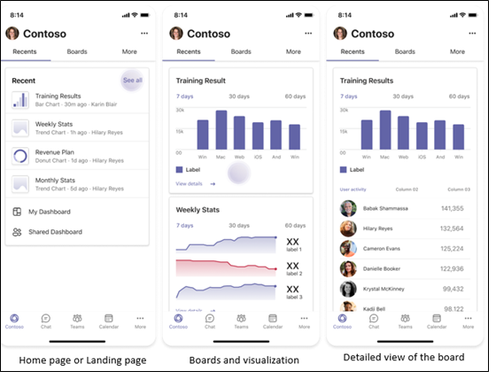
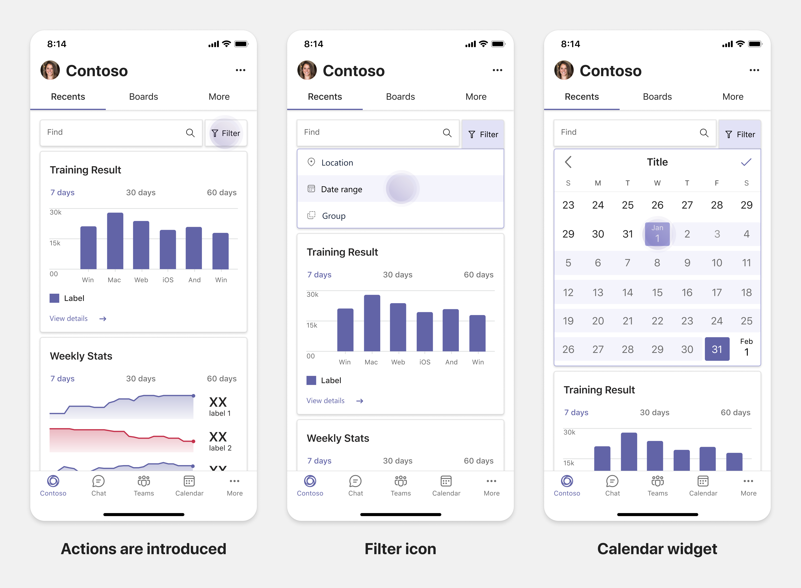
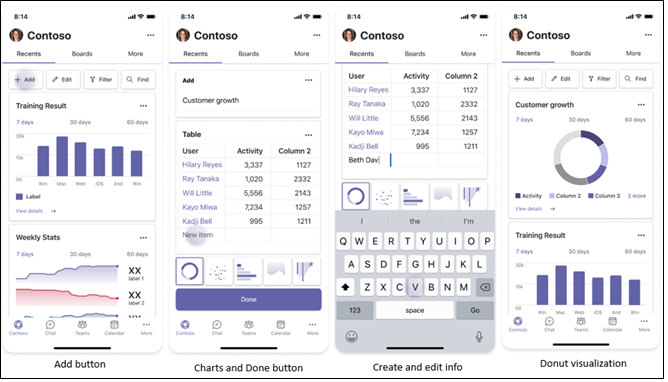
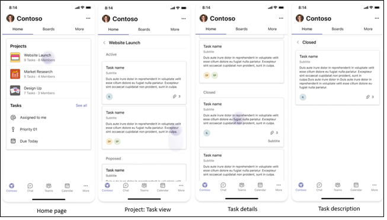
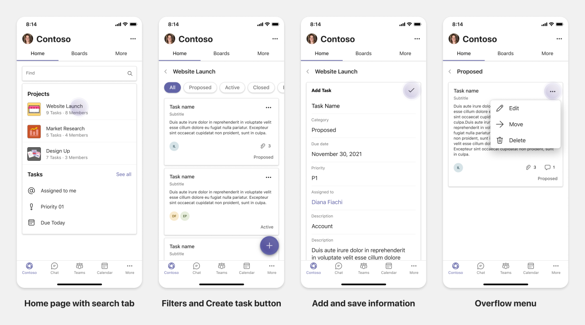
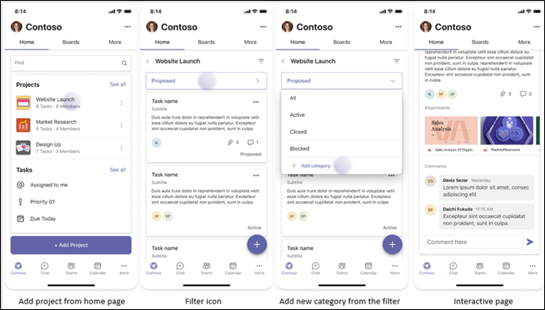
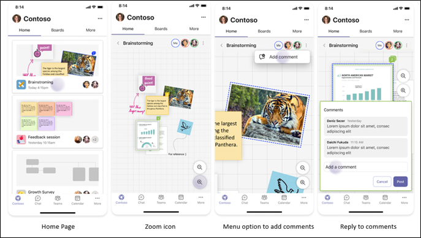
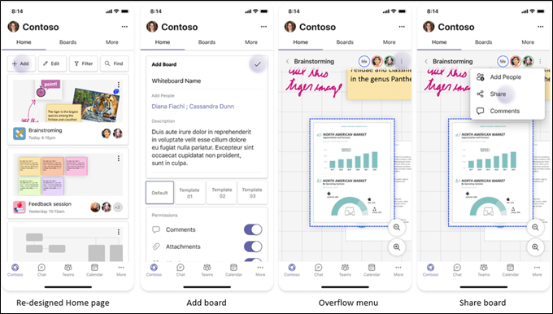
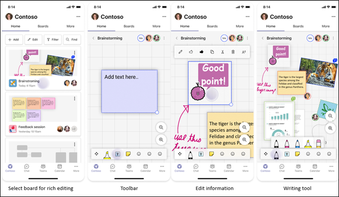

# Plan responsive tabs for Teams mobile

 Teams platform offers opportunity to build apps on mobile and desktop. Your app users can prefer either desktop or mobile, or both. The users can prepare data on desktop, but consume and share more data using mobile. The key to build any app is to understand and meet users' needs. There are capabilites like bot, messaging extension and connectors that work out-of-the-box on desktop and mobile, however, building tabs and task modules require planning when you are hosting your web experience inside these capabilites on Teams mobile. The document guides to plan your reponsive web pages on Teams mobile. 

## Identify apps scope

The following list provides the key information to plan building apps for Teams mobile:

* Consider cross-device functionality of Teams app. For example, if you have well performing app on desktop, you can explore to build similar app on mobile. Initially, it can be difficult to shift entire desktop experience on mobile. You can start with basic but common scenarios. Add functionalities and capabilities after you gather more insight and user feedback.

* Ensure to target appropriate user persona on mobile. For example, let's assume that you are building an app that provides service to end users, and also provides data access to developers and senior managers. The end users can use the app more in this case when you are just starting out to build the app on Teams mobile. You can cater to all the personas that you have on your desktop app. However, it's recommended to start with persona with a larger base and those who can be early adopters for smaller screen experience, in this case - the end users. You can gradually add the functionalities to support other user persionas on your Teams mobile app.

## Understand different stages to build apps

After you've identified the app scope, it's time to understand the following three stages to plan any app on Teams mobile and enhance user experience:

1. **Consumption**

   View apps on mobile. To build an app on mobile, you can start with the consumption experience. Since the mobile world has made scrolling for content a common practice, you can show relevant information. Use engagement mechanisms, such as notifications to inform about updates.

2. **Quick Actions**

   Use app on mobile. After your users start consuming the content on mobile, you can scale your app to the next level by migrating some actions from desktop app. You can optimize and build new actions for mobile.

3. **Enablement**

   Provide complete app experiences to engage on mobile. As your users engage with your app, provide full immersive experience on mobile, either at par or better than desktop experience. To provide rewarding experience for your users, make all use cases responsive on mobile.

> [!TIP]
> To get information on the design guidelines, see [design process for Teams apps](design-teams-app-process.md).

## Use cases

Let us go through the following examples to understand how to plan different types of apps for Teams mobile:

 

<b>Dashboarding and data visualization apps</b>

You can understand how to plan for dashboarding and data visualization apps on Teams mobile platform.

**Consumption**

In the first stage, you can implement the most basic consumption experience to view data. The primary purpose of any app in this domain is to show data in the form of visualizations. In your app, you can show recently viewed visualizations on desktop, or the list of all the charts authorized for the users. After creating dashboards on desktop, users can access the information using mobile. You can show a detailed view of any chart clicked by the user in the form of an expanded view inside your tabs or by leveraging task modules. 

You can show the following information: 

* Dashboards and summaries
* Data visuals, maps, and infographics
* Charts, graphs, and tables 

**Quick actions**

In the second stage, the users can work on the existing charts and visuals from desktop experience. You can introduce following actions:

* Search content
* Filter data
* Create bookmarks

**Enablement**

In the third stage, enable users to create content such as, charts and graphics from scratch. Ensure to introduce all the capabilities in your app for mobile. You can also use task modules to deep dive into specific data items that require more detailed view.

You can provide following access to users:
* Modify title and description
* Insert data items to create visualizations
* Share visualizations in channels and groups or share them via emails, activity feed etc.

 

 

<b>Task boarding apps</b>

You can understand how to plan task boarding apps on Teams mobile platform.

**Consumption**

In the first stage, your app can show the list of tasks to the user in a vertical stack. If there are multiple categories of tasks such as Planned, Active, Closed etc., show these in the form of headers to see the grouped tasks.  

**Quick actions**

In the second stage, you can provide the following app actions to users:
* Create tasks or items. You may want to display the task creation screen with just the mandatory fields to reduce the cognitive load for the users.
* Change the board type or view
* Review tasks in detail by expanding the view. Use task modules to see detailed view
* Move around the tasks into multiple categories 
* Share relevant tasks in chats and channels or via emails and acitvity feed

**Enablement**

In the third stage, you can enable users' experience with the following activities:
* Add new projects and boards
* Users should be able to add and modify categories (say Active, Closed, Blocked etc.) 
* The ability to have meaningful conversations around tasks in the form of comments can be provided to the users.
* Configuration abilities - Users should be able to configure the tasks for comments, attachments, sharing and other complex features.

 

 

<b>Coauthoring and whiteboarding apps</b>

You can understand how to plan coauthoring and whiteboarding apps on Teams mobile platform.

**Consumption**

In the first stage, you can consider desktop experience to show the content and assets in your app.  In this stage, you can show the following functions:

* Comments or feedback
* Zoom in or out
* Current stage or progress on a pending document

**Quick Actions**
In the second stage, you can introduce the following actions in this stage:

* Allow users to create new board for collaboration or new documents for signing.
* Sharing of boards (both internal and external users) 
* Configure admin permissions such as permitting others to comment, attach files etc.

> [!TIP]
> You expose actions, which can be shown easily on the small screens.

**Enablement**

In the third stage, provide complete experience to your users. You can enable users to create new content and assets with the following features:

* Adding text, shapes, and quick notes
* Moving around content
* Adding layers and filters
* Delete, Undo and Redo operations 
* Access camera and microphone using JS SDK APIs

 

## See also

These other design and validation guidelines to help depending on the scope of your app:

* [Designing your tab](../../tabs/design/tabs.md)
* [Designing you bot](../../bots/design/bots.md)
* [Validation guidelines](../deploy-and-publish/appsource/prepare/teams-store-validation-guidelines.md)
