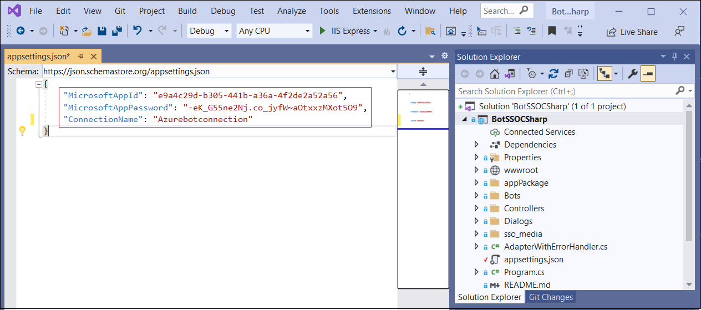

# Hide app until Admin allows it

Training test

When an ISV publishes an app to the global app store, they may need Admins to configure/customize the app experience before making it available to end users to ensure the experience is not hampered until the app is fully set up. This introduces a need for enabling app developers to opt-into default hiding the app until Admin Allows it. Doing so reduces roadblocks in users’ cognitive understanding and adoption of the app.

