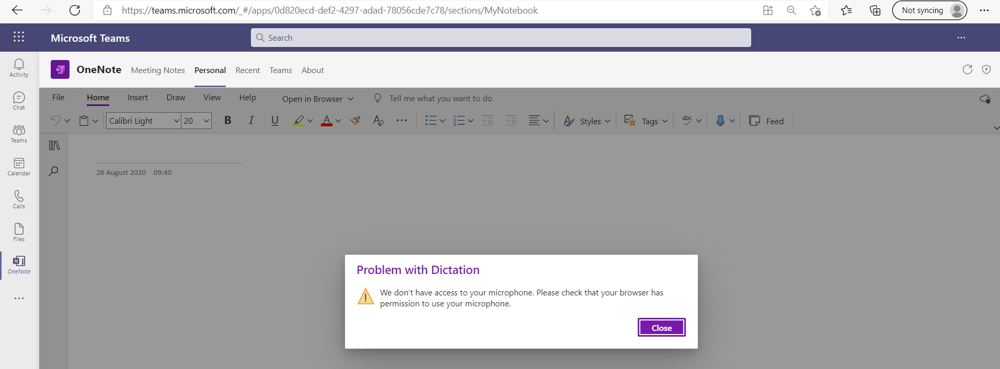
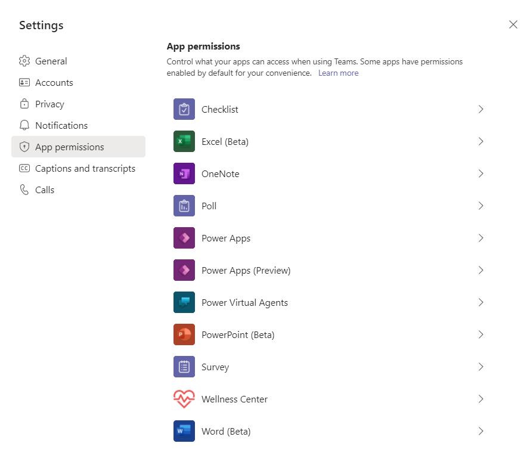

# Device permissions for the browser

An important requirement of device permissions is that users should be able to consent to device permissions for each app they want to use. Currently, there is a security issue when access is granted for one app, it is also granted for all subsequent apps.

An update made in Chromium browser deprecated HTML5 permissions, such as camera, microphone, or location access, from cross-origin iframes. This update has caused the security issue though Chromium provides a way to allow iframes to request these permissions.

The origin of the requesting iframe is not considered when permissions are requested. The request or consent dialog is for the ancestor, in this case, teams.microsoft.com. For example, if an app requests microphone access and access is granted, all subsequent apps in Teams also don't request access. If the user grants Teams access to these permissions, for example, camera or microphone access to join a meeting, then the user will never see the prompt from these apps. The user isn't prompted as the permission is already granted at the teams.microsoft.com level.

A solution to the issue is provided where user grants consent to each app for the first time. This allows you to control which apps are granted device permissions.

Unlike in the desktop client, device permission requests aren't intercepted from the embedded tab application. We have no idea when the tab is requesting device permission access. We can only allow or deny permissions at the time the iframe is loaded. This means we need to know which device permissions to enable before the tab has loaded (regardless of whether the tab will actually use those permissions at runtime). This unique constraint has implications on the user experience.

## User problem

Sarah, a lawyer at Contoso Partners, uses OneNote to take meeting notes in Teams. She opens Teams in the browser. OneNote requires microphone access to record dictations. Sarah is shown a dialog prompting her to grant access. Sarah only uses OneNote to take notes and decides to deny access. 

A few months later, Sarah needs to record an important meeting. She decides to use the dictation feature of OneNote. But she is shown a dialog that she doesn’t have microphone access as she had denied access earlier.

Sarah then visits her settings in Teams to grant OneNote access to her microphone.

## Solution

The solution for the security issue covers the following points:

* Introduce a device permissions consent experience in the browser: This security issue will be unblocked for Teams tabs in the browser. Each app’s permissions will be managed individually instead of relying on the browser to provide this support.
* Allow users to manage their device permissions for each app in the browser: Previously device permissions for embedded iframes were handled by the browser. With the recent change to Chromium, settings page is to be provided where users can manage their device permissions for each Teams tab that has requested access.

Users can have different apps in Teams and each one will have to be granted separate device permissions. For example, in OneNote the user will have to grant permissions for media such as camera, microphone, and speakers. There is a property on iframe that will allow the user to use different media for that app.

**To grant access to device permissions**

1. In your browser, open **teams.microsoft.com**.
1. Select the app that you want to use from the left bar. If you are using OneNote, you can select the **Dictate** button to record your notes. A dialog box is shown for the permissions being denied.
1. Select the icon for your user account from the upper right corner and select **Manage account**.
1. From the **Settings** dialog box, select **App permissions**.

    

1. Select the app to which you want to grant access, for example OneNote.
1. Turn on **Media (Camera, microphone, speakers)**.
1. Similarly, you can turn on other permissions, such as location or MIDI device as required to use the app.

The following image shows web app experience of location capabilities:

