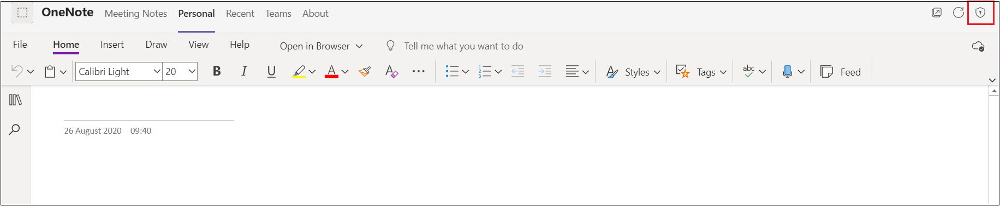
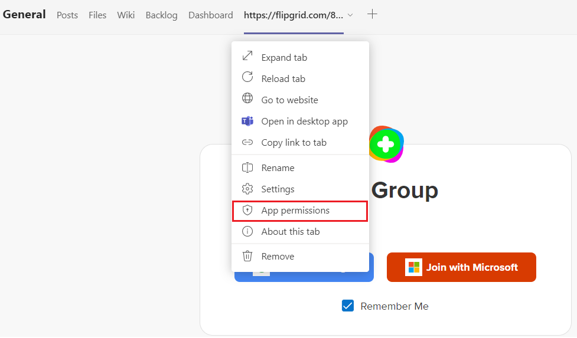
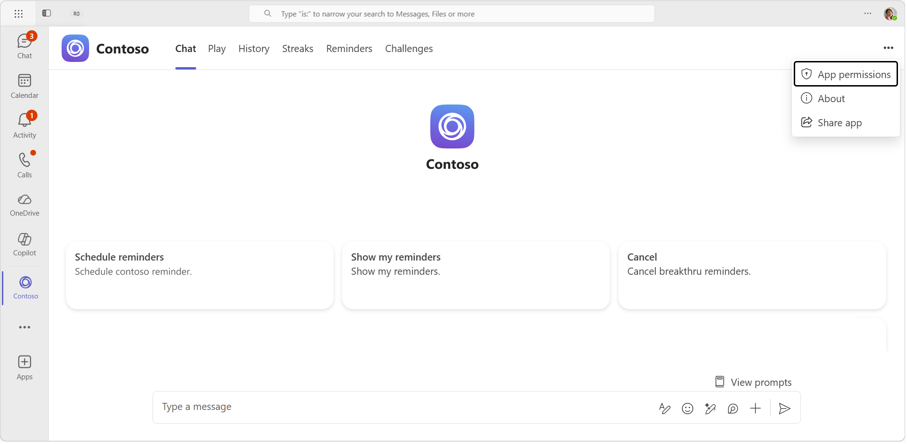

# Device permissions for the browser

Teams app that requires device permissions, such as camera or microphone access, now require users to manually grant permission at a per app level in the web browser. Previously, the browser handled how to grant access permissions, but now these permissions are handled in Microsoft Teams. This has implications on how you design your application and if they require these permissions in the browser.

## Enable app's device permissions

If your Teams app has declared in the [application manifest](native-device-permissions.md#specify-permissions) that it needs device permissions, then the **App permissions** option appears for the users to enable the app's device permissions. The **App permissions** option is available in the following capabilities:

* **Personal apps and dialogs** (task modules): The **App permissions** option is available in the upper-right corner of the page.

* **Chats, channel, or meeting tabs**: The **App permissions** option is available in the dropdown of the tab.

After the **App permissions** option is selected, a pop-up appears where the user can enable the permissions button.

A user will need to enable these permissions in the browser for these permissions to take effect. After user changes the app’s device permissions in the browser, they're prompted to reload the application in Teams.

> [!IMPORTANT]
> You must make users aware of where to go to enable these **App permissions** in Teams.

## Recommendation

Teams app that requires device permissions in the browser must show instructions to users on where to find and enable these permissions in the Teams UI. Depending on the context in which your application is running, you need to ensure that your instructions are pointing the user to correct location to access these permissions. The permissions differ for personal apps, dialogs, tabs in chats, and channels or meetings.

 

## Code sample

|Sample name | Description | Node.js | Manifest
|----------------|-----------------|--------------|--------------|
| Tab device permissions for browser | The sample shows how to show the device permissions using TeamsJS SDK and browser api's. | [View](https://github.com/OfficeDev/Microsoft-Teams-Samples/tree/main/samples/tab-device-permissions/nodejs) | [View](https://github.com/OfficeDev/Microsoft-Teams-Samples/tree/main/samples/tab-device-permissions/nodejs/demo-manifest/tab-device-permissions.zip)

## Step-by-step guide

Follow the [step-by-step guide](../../sbs-tab-device-permissions.yml) to grant tab device permission in Teams.

## See also

* [Device capabilities overview](device-capabilities-overview.md)
* [Request device permissions](native-device-permissions.md)
* [App manifest schema for Teams](../../resources/schema/manifest-schema.md)
