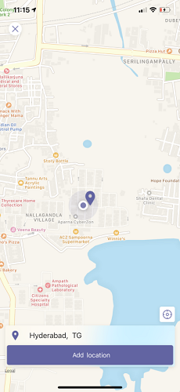

# Integrate location capabilities

You can integrate the location capabilities within your Teams app using [Microsoft Teams JavaScript client SDK](/javascript/api/overview/msteams-client?view=msteams-client-js-latest&preserve-view=true), which provides well-defined APIs and the necessary tools for your app to access the user’s [native device capabilities](native-device-permissions.md). The location capability is available for the Teams web client, desktop, and mobile.

You can use [Microsoft Teams JavaScript client library](/javascript/api/overview/msteams-client) (TeamsJS), which provides the tools necessary for your app to access the user’s [native device capabilities](native-device-permissions.md). Use the location APIs, such as [getLocation](/javascript/api/@microsoft/teams-js/location.locationprops) and [showLocation](/javascript/api/@microsoft/teams-js/location.locationprops?) to integrate the capabilities within your app.

## Advantages

 You can use the location APIs, such as [getLocation](/javascript/api/@microsoft/teams-js/location.locationprops) and [showLocation](/javascript/api/@microsoft/teams-js/location.locationprops?) to integrate the capabilities within your app.

[!INCLUDE [sdk-include](~/includes/sdk-include.md)]

The advantage of integrating location capabilities in your Teams apps is to apply location functionality in Teams web client, desktop, and mobile using [Microsoft Teams JavaScript client library](/javascript/api/overview/msteams-client). The following scenarios showcase the advantages of location capabilities:

The main advantage of integrating location capabilities in your Teams apps is that it allows web app developers on Teams platform to leverage location functionality with Microsoft Teams JavaScript client library.

* Share authentic health data of cellular towers with the management. The management can compare any mismatch between captured location information and the data submitted by maintenance staff.

* Locate technical support staff in a specified area.  The app asks support staff to share their current location, which management can use to allocate IT ticket to the nearest support person after checking their profile.

* Report the location after completing a job in the field. The job processing app asks for permission to find the location. After the user grants permission, the app detects the exact location. The user may also select a location by dragging a pin to the job completion location over the map.

* Capture attendance through selfies inside the retail store. The store manager can track the attendance of the workers by asking them to share a selfie through an attendance app. The location data gets captured and is sent along with the image. This scenario is applicable mainly to the frontline workers.

# [Mobile](#tab/mobile)

The following image depicts web app experience of getLocation API:

  <!--  -->
  
  :::image type="content" source="~/assets/images/tabs/location-picker-mobile.png" alt-text="Illustration shows the location picker." border="true":::

# [Desktop](#tab/desktop)

The following image depicts web app experience of getLocation API:

  :::image type="content" source="~/assets/images/tabs/location-picker-desktop.png" alt-text="Location picker in desktop." border="true":::

---

To integrate location capabilities, you must:

* [Update the app manifest file](#update-manifest) and call the APIs.
* Have working knowledge of [code snippets](#code-snippets) for calling the [location APIs](#location-apis).
* Handle errors in your Teams app with the help of [API response errors](#error-handling).

## Update manifest

Update your Teams app [manifest.json](../../resources/schema/manifest-schema.md#devicepermissions) file by adding the `devicePermissions` property and specifying `geolocation`. It allows your app to ask for required permissions from users before they start using the location capabilities. The update for app manifest is as follows:

``` json
"devicePermissions": [
    "geolocation",
],
```

> [!NOTE]
>
> * The **Request Permissions** prompt is automatically displayed when a relevant Teams API is initiated. For more information, see [request device permissions](native-device-permissions.md).
> * Device permissions are different in the browser. For more information, see [browser device permissions](browser-device-permissions.md).

## Location APIs

The following table lists the set of APIs to enable your device's location capabilities:

| API      | Description |Input configuration |
| --- | --- |--- |
|`getLocation`|Provides user’s current device location or opens native location picker and returns the location chosen by the user. | The `getLocation` API takes the following two input parameters as a part of the [LocationProps](/javascript/api/@microsoft/teams-js/microsoftteams.location?view=msteams-client-js-latest#getLocation_LocationProps___error__SdkError__location__Location_____void_&preserve-view=true) interface: `allowChooseLocation`, `showMap`:<br> The experience is derived from the combination of these two input parameters:<br>- (true, true): A map is launched and the user gets to pick any location on it.<br>- (true, false): A map is launched and the user gets to pick any location on it.<br>- (false, true): A map is launched. The user can only submit the current location.<br>- (false,false): Map isn't launched. User's current location is fetched.
|`showLocation`| Shows location on map. |It takes a single input parameter location, which contains the coordinates of the location to be shown on the map.|

> [!NOTE]
> For `getLocation` API:
>
> * If `allowChooseLocation` is set to true, then `showMap` is ignored.
> * `showMap`= false is not supported on Teams web or desktop.

For more information on `getLocation` and `showLocation`, see [LocationProps](/javascript/api/@microsoft/teams-js/microsoftteams.location?view=msteams-client-js-latest#getLocation_LocationProps___error__SdkError__location__Location_____void_&preserve-view=true).

> [!IMPORTANT]
> When your application or services access a Microsoft API that provides a location using the Bing Maps, you understand and agree that any content provided through Bing Maps, including geocodes, can only be used within the Microsoft API through which the content is provided. Your use of Bing Maps is governed by the Bing Maps End User Terms of Use available at [go.microsoft.com](https://go.microsoft.com/?linkid=9710837) and the [Microsoft Privacy Statement](https://go.microsoft.com/fwlink/?LinkID=248686).</br>
> Further, you must provide a hypertext link to Bing Maps TOU, which is located here, either at the bottom of each page in your Application where the services can be accessed or viewed or within the terms of use of your application. You are responsible for notifying end users of changes to the Bing Maps TOU, and you will comply with Microsoft's reasonable instructions in doing so. You will not encourage or require any end user to breach the terms of the Bing Maps TOU. In the event, an end user breaches the Bing Maps TOU, Microsoft may immediately terminate this agreement.

### Code snippets

# [TeamsJS v2](#tab/teamsjs-v2)

* **Call `getLocation` API to retrieve the location:**

```javascript
import {location} from "@microsoft/teams-js"

let locationProps = {"allowChooseLocation":true,"showMap":true};
if(location.isSupported()) {
    const locationPromise = location.getLocation(locationProps);
    locationPromise.
        then((result) => {output(JSON.stringify(result));}.
        catch((error) => {output(error);});
}
else {/*Handle case where capability isn't supported */}
```

* **Call `showLocation` API to display the location:**

```javascript
import {location} from "@microsoft/teams-js"

let location = {"latitude":17,"longitude":17};
if(location.isSupported()) {
    const locationPromise = location.showLocation(location);
    locationPromise.
         then((result) => {/*Successful map display*/}).
         catch((error) => {/*Failed map display*/});
}
else {/*Handle case where capability isn't supported */}
```

# [TeamsJS v1](#tab/teamsjs-v1)

* **Call `getLocation` API to retrieve the location:**

```javascript
let locationProps = {"allowChooseLocation":true,"showMap":true};
microsoftTeams.location.getLocation(locationProps, (err: microsoftTeams.SdkError, location: microsoftTeams.location.Location) => {
          if (err) {
            output(err);
            return;
          }
          output(JSON.stringify(location));
});
```

* **Call `showLocation` API to display the location:**

```javascript
let location = {"latitude":17,"longitude":17};
microsoftTeams.location.showLocation(location, (err: microsoftTeams.SdkError, result: boolean) => {
          if (err) {
            output(err);
            return;
          }
     output(result);
});
```

---

## Error handling

You must ensure to handle these errors appropriately in your Teams app. The following table lists the error codes and the conditions under which the errors are generated:

|Error code |  Error name     | Condition|
| --------- | --------------- | -------- |
| **100** | NOT_SUPPORTED_ON_PLATFORM | API isn't supported on the current platform.|
| **500** | INTERNAL_ERROR | Internal error is encountered while performing the required operation.|
| **1000** | PERMISSION_DENIED |User denied location permissions to the Teams App or the web-app.|
| **4000** | INVALID_ARGUMENTS | API is invoked with wrong or insufficient mandatory arguments.|
| **8000** | USER_ABORT |User canceled the operation.|
| **9000** | OLD_PLATFORM | User is on old platform build where implementation of the API isn't present. Upgrading the build should resolve the issue.|

### Code sample

|Sample name | Description | .NET | Node.js | Manifest
|----------------|-----------------|--------------|--------------|--------------|
| App check-in current location | This sample shows how users can check in the current location and view all the previous location check-ins using bot.| [View](https://github.com/OfficeDev/Microsoft-Teams-Samples/tree/main/samples/app-checkin-location/csharp) | [View](https://github.com/OfficeDev/Microsoft-Teams-Samples/tree/main/samples/app-checkin-location/nodejs) |[View](https://github.com/OfficeDev/Microsoft-Teams-Samples/tree/main/samples/app-checkin-location/csharp/demo-manifest/App-checkin-location.zips) |

## See also

* [Device capabilities](device-capabilities-overview.md)
* [Integrate media capabilities](media-capabilities.md)
* [Integrate location capabilities](location-capability.md)
* [Integrate People Picker](people-picker-capability.md)
* [Meeting apps APIs](../../apps-in-teams-meetings/meeting-apps-apis.md)
