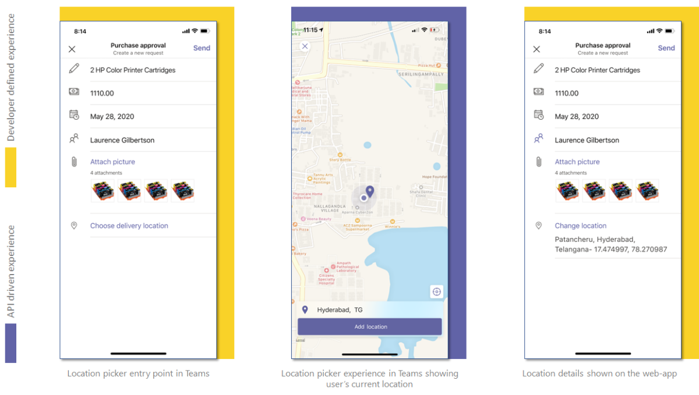

# Integrate location capability 

For a richer collaborative experience, you can integrate the location capability provided in the Teams platform with your Teams app. This document guides you on how to integrate the capability.  

You can use [Microsoft Teams JavaScript client SDK](/javascript/api/overview/msteams-client?view=msteams-client-js-latest&preserve-view=true), which provides the tools necessary for your app to access the user’s [native device capabilities](native-device-permissions.md). Use the location APIs to integrate the location capability within your app. 

## Advantage of integrating location capability

* The integration allows web app developers on Teams platform to leverage location functionality with Teams JavaScript client SDK.
* 

To integrate location capability, you must update the app manifest file and call the `getLocation` and `showLocation` APIs. For effective integration, you must have a good understanding of [code snippet](#code-snippet) for calling the location APIs, which allow you to use native location capability. 
It is important to familiarize yourself with the [API response errors](#error-handling) to handle the errors in your Teams app.

> [!NOTE] 
> Currently, Microsoft Teams support for location capability is only available for mobile clients.

## Update manifest

Update your Teams app [manifest.json](../../resources/schema/manifest-schema.md#devicepermissions) file by adding the `devicePermissions` property and specifying `media`. It allows your app to ask for requisite permissions from users before they start using  the location capability.

``` json
"devicePermissions": [
    "geolocation",
],
```

> [!NOTE]
> The **Request Permissions** prompt is automatically displayed when a relevant Teams API is initiated. For more information, see [Request device permissions](native-device-permissions.md).

## Location capability APIs


**Web app experience for location capability**


## Error handling

You must ensure to handle these errors appropriately in your Teams app. The following table lists the error codes and the conditions under which the errors are generated: 

|Error code |  Error name     | Condition|
| --------- | --------------- | -------- |
| **100** | NOT_SUPPORTED_ON_PLATFORM | API is not supported on the current platform.|
| **500** | INTERNAL_ERROR | Internal error is encountered while performing the required operation.|
| **1000** | PERMISSION_DENIED |User denied location permissions to the Teams App or the web-app .|
| **4000** | INVALID_ARGUMENTS | API is invoked with wrong or insufficient mandatory arguments.|
| **8000** | USER_ABORT |User cancelled the operation.|
| **9000** | OLD_PLATFORM | User is on old platform build where implementation of the API is not present. Upgrading the build should resolve the issue.|

## Code snippet

**Calling location API:

```javascript

```

## See also

> [!div class="nextstepaction"]
> [Integrate media capabilities in Teams](mobile-camera-image-permissions.md)

> [!div class="nextstepaction"]
> [Integrate QR or barcode scanner capability in Teams](qr-barcode-scanner-capability.md)