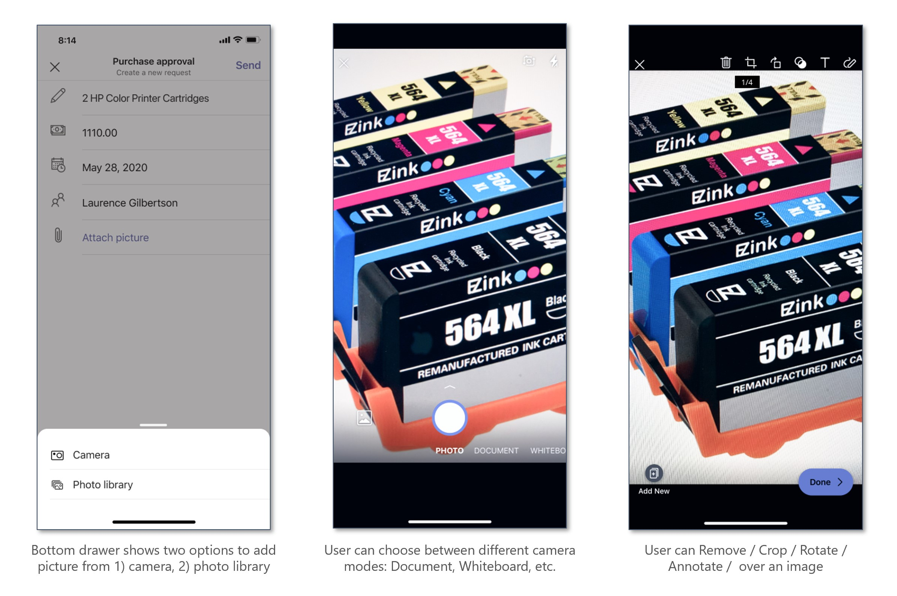

# Media capabilities in Teams

>[!IMPORTANT]
>
>* Currently, the Microsoft Teams support for media capabilities is only available for mobile clients.
>* The `selectMedia`, `getMedia`, and `viewImages` APIs can be invoked from multiple Teams surfaces such as task modules, tabs, and personal apps. For more details, _see_ [Entry points for Teams apps](../extensibility-points.md)

You must use the  [Microsoft Teams JavaScript client SDK](/javascript/api/overview/msteams-client?view=msteams-client-js-latest&preserve-view=true), to easily integrate media  capabilities within your Teams mobile app. The SDK provides the tools necessary for your app to access a user’s [device permissions](native-device-permissions.md?tabs=desktop#device-permissions) and build a richer experience.

The [selectMedia](/javascript/api/@microsoft/teams-js/media?view=msteams-client-js-latest#selectMedia_MediaInputs___error__SdkError__attachments__Media_______void_&preserve-view=true), [getMedia](/javascript/api/@microsoft/teams-js/_media?view=msteams-client-js-latest#getMedia__error__SdkError__blob__Blob_____void_&preserve-view=true), and [viewImages](/javascript/api/@microsoft/teams-js/media?view=msteams-client-js-latest#viewImages_ImageUri_____error___SdkError_____void_&preserve-view=true) APIs enable you to use native camera/image capabilities as follows:

* Use native **camera control** to allow users to **capture and attach images** on the go.
* Use native **gallery support** to allow users to **select device images** as attachments.
* Use native **image viewer control** to **preview multiple images** at one time.
* Support **large image transfer** (up to 50 MB) via the SDK bridge
* Support **advanced image capabilities** allowing users to preview and edit images:
  * Scan document, whiteboard, business cards, etc., through the camera.
  * Crop and rotate the images.
  * Add text, ink, or freehand annotation to the image.

## Get started

Update your Teams app [manifest.json](../../resources/schema/manifest-schema.md#devicepermissions) file by adding the `devicePermissions`  property and specifying `media`. This allows your app to ask for requisite permissions from end-users before they use the camera to capture the image or open the gallery to select an image to submit as an attachment.

``` json
"devicePermissions": [
    "media",
],
```

> [!NOTE]
> The _Request Permissions_ prompt is automatically displayed when a relevant Teams API is initiated. For more details, *see* [Request device permissions](native-device-permissions.md).

## Using camera and image capability APIs

You must use the following set of APIs to enable camera and image device capabilities:

| API      | Description   |
| --- | --- |
| [**selectMedia**](/javascript/api/@microsoft/teams-js/media?view=msteams-client-js-latest&branch=master#selectMedia_MediaInputs___error__SdkError__attachments__Media_______void_&preserve-view=true)| This API allows users to **capture or select media from a native device** and return to the web-app. Users may choose to edit, crop, rotate, annotate, or draw over images before submission. In response to **selectMedia**, the web-app receives media ids of selected images and a thumbnail of the selected media. |
| [**getMedia**](/javascript/api/@microsoft/teams-js/_media?view=msteams-client-js-latest&branch=master#getMedia__error__SdkError__blob__Blob_____void_&preserve-view=true)| This API retrieves the media in chunks irrespective of size. These chunks are assembled and sent back to the web app as a file/blob. With this API an image is broken into smaller chunks to facilitate large image transfer. |
| [**viewImages**](/javascript/api/@microsoft/teams-js/media?view=msteams-client-js-latest#viewImages_ImageUri_____error___SdkError_____void_&preserve-view=true)| This API enables the user to view images full-screen mode as a scrollable list.|

**Web app experience for selectMedia API**


## Sample code snippets

**Calling `selectMedia` API**

```javascript
let imageProp: microsoftTeams.media.ImageProps = {
    sources: [microsoftTeams.media.Source.Camera, microsoftTeams.media.Source.Gallery],
    startMode: microsoftTeams.media.CameraStartMode.Photo,
    ink: false,
    cameraSwitcher: false,
    textSticker: false,
    enableFilter: true,
};
let mediaInput: microsoftTeams.media.MediaInputs = {
    mediaType: microsoftTeams.media.MediaType.Image,
    maxMediaCount: 10,
    imageProps: imageProp
};
microsoftTeams.media.selectMedia(mediaInput, (error: microsoftTeams.SdkError, attachments: microsoftTeams.media.Media[]) => {
    if (error) {
        if (error.message) {
            alert(" ErrorCode: " + error.errorCode + error.message);
        } else {
            alert(" ErrorCode: " + error.errorCode);
        }
    }
    if (attachments) {
        let y = attachments[0];
        img.src = ("data:" + y.mimeType + ";base64," + y.preview);
    }
});
```

**Calling `getMedia` API**

```javascript
let media: microsoftTeams.media.Media = attachments[0]
media.getMedia((error: microsoftTeams.SdkError, blob: Blob) => {
    if (blob) {
        if (blob.type.includes("image")) {
            img.src = (URL.createObjectURL(blob));
        }
    }
    if (error) {
        if (error.message) {
            alert(" ErrorCode: " + error.errorCode + error.message);
        } else {
            alert(" ErrorCode: " + error.errorCode);
        }
    }
});
```

**Calling `viewImages`  API by ID**

```javascript
view images by id:
    assumption: attachmentArray = select Media API Outputlet uriList = [];
if (attachmentArray && attachmentArray.length > 0) {
    for (let i = 0; i < attachmentArray.length; i++) {
        let file = attachmentArray[i];
        if (file.mimeType.includes("image")) {
            let imageUri = {
                value: file.content,
                type: 1,
            }
            uriList.push(imageUri);
        } else {
            alert("File type is not image");
        }
    }
}
if (uriList.length > 0) {
    microsoftTeams.media.viewImages(uriList, (error: microsoftTeams.SdkError) => {
        if (error) {
            if (error.message) {
                output(" ErrorCode: " + error.errorCode + error.message);
            } else {
                output(" ErrorCode: " + error.errorCode);
            }
        }
    });
} else {
    output("Url list is empty");
}
```

**Calling viewImages API by URL**

```javascript
View Images by URL:
    // Assumption 2 urls, url1 and url2let uriList = [];
    if (URL1 != null && URL1.length > 0) {
        let imageUri = {
            value: URL1,
            type: 2,
        }
        uriList.push(imageUri);
    }
if (URL2 != null && URL2.length > 0) {
    let imageUri = {
        value: URL2,
        type: 2,
    }
    uriList.push(imageUri);
}
if (uriList.length > 0) {
    microsoftTeams.media.viewImages(uriList, (error: microsoftTeams.SdkError) => {
        if (error) {
            if (error.message) {
                output(" ErrorCode: " + error.errorCode + error.message);
            } else {
                output(" ErrorCode: " + error.errorCode);
            }
        }
    });
} else {
    output("Url list is empty");
}
}
```
