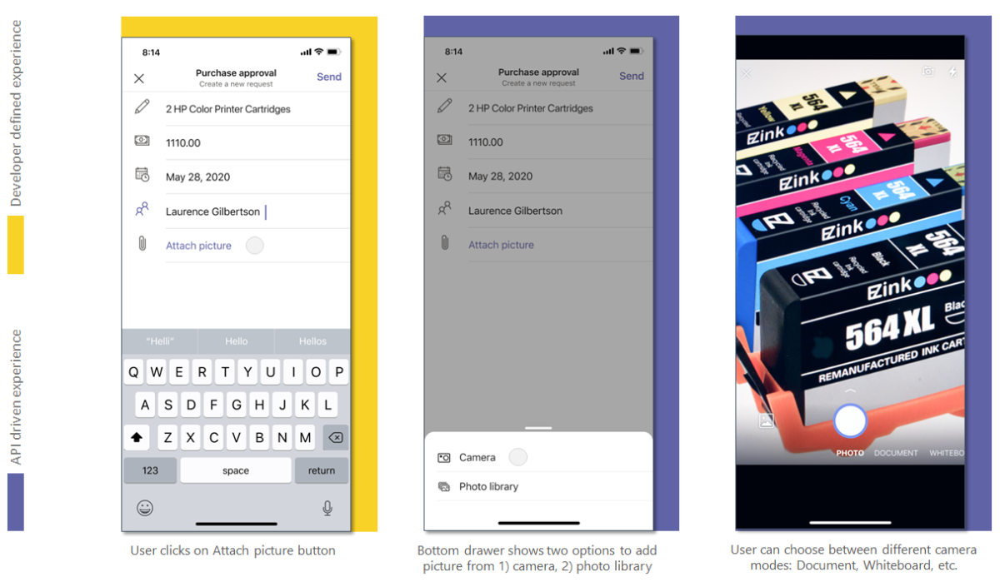
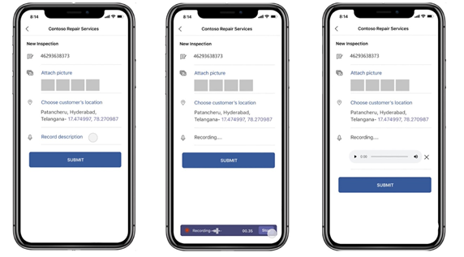

# Integrate media capabilities 

The [Microsoft Teams JavaScript client SDK](/javascript/api/overview/msteams-client?view=msteams-client-js-latest&preserve-view=true) provides the tools necessary for your Teams mobile app to access the user’s [device permissions](native-device-permissions.md) and build a richer experience. After accessing device permissions, integrate media capabilities by updating the app manifest file and using the media capability APIs. 

It is important to understand [sample code snippets](#sample-code-snippets) for calling the respective APIs which allow you to use native media capabilities.
> [!NOTE] 
> Currently, the Microsoft Teams support for media capabilities, is only available for mobile clients.

## Updating manifest

Update your Teams app [manifest.json](../../resources/schema/manifest-schema.md#devicepermissions) file by adding the `devicePermissions` property and specifying `media`. This allows your app to ask for requisite permissions from users before they use the camera to capture the image, open the gallery to select an image to submit as an attachment, or use the microphone to record the conversation.

``` json
"devicePermissions": [
    "media",
],
```

> [!NOTE]
> The _Request Permissions_ prompt is automatically displayed when a relevant Teams API is initiated. For more information, see [Request device permissions](native-device-permissions.md).

## Using media capability APIs

The [selectMedia](/javascript/api/@microsoft/teams-js/media?view=msteams-client-js-latest#selectMedia_MediaInputs___error__SdkError__attachments__Media_______void_&preserve-view=true), [getMedia](/javascript/api/@microsoft/teams-js/_media?view=msteams-client-js-latest#getMedia__error__SdkError__blob__Blob_____void_&preserve-view=true), and [viewImages](/javascript/api/@microsoft/teams-js/media?view=msteams-client-js-latest#viewImages_ImageUri_____error___SdkError_____void_&preserve-view=true) APIs enable you to use native media capabilities as follows:

* Use native **microphone** to allow users to **record audio** (record 10 minutes of conversation) from the device.
* Use native **camera control** to allow users to **capture and attach images** on the go.
* Use native **gallery support** to allow users to **select device images** as attachments.
* Use native **image viewer control** to **preview multiple images** at one time.
* Support **large image transfer** (from 1 MB to 50 MB) through the SDK bridge.
* Support **advanced image capabilities** allowing users to preview and edit images:
  * Scan document, whiteboard, and business cards  through the camera.
  * Crop and rotate the images.
  * Add text, ink, or freehand annotation to the image.

> [!IMPORTANT]
>*   The `selectMedia`, `getMedia`, and `viewImages` APIs must be invoked from multiple Teams surfaces such as task modules, tabs, and personal apps. For more details, see [Entry points for Teams apps](../extensibility-points.md).
>* `selectMedia` API has been extended to support mic and audio properties.

You must use the following set of APIs to enable your device's media capabilities:

| API      | Description   |
| --- | --- |
| [**selectMedia**](/javascript/api/@microsoft/teams-js/media?view=msteams-client-js-latest&branch=master#selectMedia_MediaInputs___error__SdkError__attachments__Media_______void_&preserve-view=true)| This API allows users to **capture or select media from a native device** and return to the web-app. The users edit, crop, rotate, annotate, or draw over images before submission. In response to **selectMedia**, the web-app receives the media IDs of selected images and a thumbnail of the selected media. <br/><br/>  This API also allows the users to record audio from a native device and return to the web-app. The users pause, re-record, and play recording preview before submission. In response to **selectMedia**, the web-app receives media IDs of the selected audio recording. Set the media type to four for audio. <br/> Use `maxDuration`, if you require to configure a duration in minutes for recording the conversation. The current duration for recording is 10 minutes, after which the recording terminates.  |
| [**getMedia**](/javascript/api/@microsoft/teams-js/_media?view=msteams-client-js-latest&branch=master#getMedia__error__SdkError__blob__Blob_____void_&preserve-view=true)| This API retrieves the media in chunks irrespective of  the size. These chunks are assembled and sent back to the web app as a file or blob. This API breaks an image into smaller chunks,ss to facilitate large image transfer. |
| [**viewImages**](/javascript/api/@microsoft/teams-js/media?view=msteams-client-js-latest#viewImages_ImageUri_____error___SdkError_____void_&preserve-view=true)| This API enables the user to view images in  full-screen mode as a scrollable list.|


**Web app experience for selectMedia API for image capability**


**Web app experience for selectMedia API for microphone capability**


## Sample code snippets

**Calling `selectMedia` API**

```javascript
let imageProp: microsoftTeams.media.ImageProps = {
    sources: [microsoftTeams.media.Source.Camera, microsoftTeams.media.Source.Gallery],
    startMode: microsoftTeams.media.CameraStartMode.Photo,
    ink: false,
    cameraSwitcher: false,
    textSticker: false,
    enableFilter: true,
};
let mediaInput: microsoftTeams.media.MediaInputs = {
    mediaType: microsoftTeams.media.MediaType.Image,
    maxMediaCount: 10,
    imageProps: imageProp
};
microsoftTeams.media.selectMedia(mediaInput, (error: microsoftTeams.SdkError, attachments: microsoftTeams.media.Media[]) => {
    if (error) {
        if (error.message) {
            alert(" ErrorCode: " + error.errorCode + error.message);
        } else {
            alert(" ErrorCode: " + error.errorCode);
        }
    }
    if (attachments) {
        let y = attachments[0];
        img.src = ("data:" + y.mimeType + ";base64," + y.preview);
    }
});
```

**Calling `getMedia` API**

```javascript
let media: microsoftTeams.media.Media = attachments[0]
media.getMedia((error: microsoftTeams.SdkError, blob: Blob) => {
    if (blob) {
        if (blob.type.includes("image")) {
            img.src = (URL.createObjectURL(blob));
        }
    }
    if (error) {
        if (error.message) {
            alert(" ErrorCode: " + error.errorCode + error.message);
        } else {
            alert(" ErrorCode: " + error.errorCode);
        }
    }
});
```

**Calling `viewImages`  API by ID**

```javascript
view images by id:
    assumption: attachmentArray = select Media API Outputlet uriList = [];
if (attachmentArray && attachmentArray.length > 0) {
    for (let i = 0; i < attachmentArray.length; i++) {
        let file = attachmentArray[i];
        if (file.mimeType.includes("image")) {
            let imageUri = {
                value: file.content,
                type: 1,
            }
            uriList.push(imageUri);
        } else {
            alert("File type is not image");
        }
    }
}
if (uriList.length > 0) {
    microsoftTeams.media.viewImages(uriList, (error: microsoftTeams.SdkError) => {
        if (error) {
            if (error.message) {
                output(" ErrorCode: " + error.errorCode + error.message);
            } else {
                output(" ErrorCode: " + error.errorCode);
            }
        }
    });
} else {
    output("Url list is empty");
}
```

**Calling viewImages API by URL**

```javascript
View Images by URL:
    // Assumption 2 urls, url1 and url2let uriList = [];
    if (URL1 != null && URL1.length > 0) {
        let imageUri = {
            value: URL1,
            type: 2,
        }
        uriList.push(imageUri);
    }
if (URL2 != null && URL2.length > 0) {
    let imageUri = {
        value: URL2,
        type: 2,
    }
    uriList.push(imageUri);
}
if (uriList.length > 0) {
    microsoftTeams.media.viewImages(uriList, (error: microsoftTeams.SdkError) => {
        if (error) {
            if (error.message) {
                output(" ErrorCode: " + error.errorCode + error.message);
            } else {
                output(" ErrorCode: " + error.errorCode);
            }
        }
    });
} else {
    output("Url list is empty");
}
}
```

**Calling selectMedia and getMedia API for recording audio through microphone**

```javascript
let mediaInput: microsoftTeams.media.MediaInputs = {
    mediaType: microsoftTeams.media.MediaType.Audio,
    maxMediaCount: 1,
};
microsoftTeams.media.selectMedia(mediaInput, (error: microsoftTeams.SdkError, attachments: microsoftTeams.media.Media[]) => {
    if (error) {
        if (error.message) {
            alert(" ErrorCode: " + error.errorCode + error.message);
        } else {
            alert(" ErrorCode: " + error.errorCode);
        }
    }
    // If you want to directly use the audio file (for smaller file sizes (~4MB))    if (attachments) {
        let audioResult = attachments[0];
        var videoElement = document.createElement("video");
        videoElement.setAttribute("src", ("data:" + y.mimeType + ";base64," + y.preview));
        //To use the audio file via get Media API for bigger audio file sizes greater than 4MB        audioResult.getMedia((error: microsoftTeams.SdkError, blob: Blob) => {
            if (blob) {
                if (blob.type.includes("video")) {
                    videoElement.setAttribute("src", URL.createObjectURL(blob));
                }
            }
            if (error) {
                if (error.message) {
                    alert(" ErrorCode: " + error.errorCode + error.message);
                } else {
                    alert(" ErrorCode: " + error.errorCode);
                }
            }
        });
    }
});
```