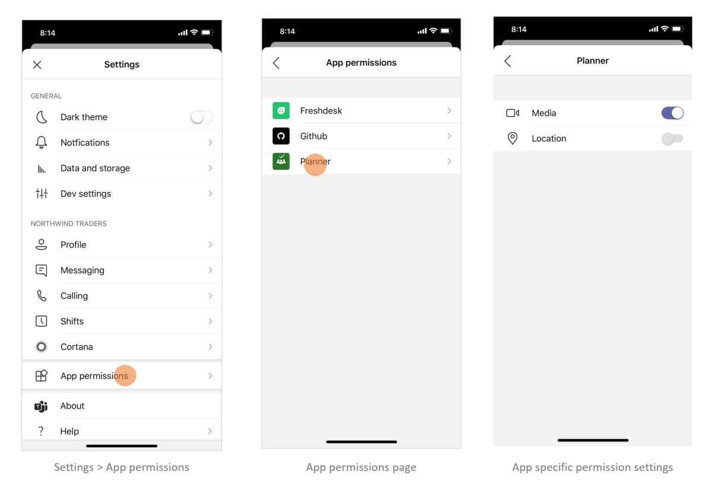
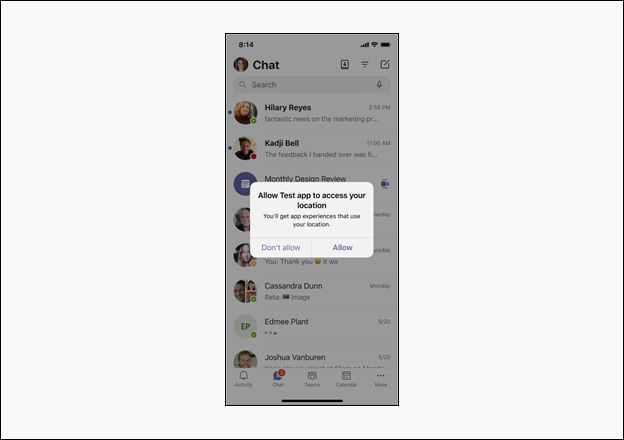

# Request device permissions for your Microsoft Teams app

This document guides you on what are the permissions required for accessing the media capabilities of a device and how to request and manage the permissions.

[!NOTE] 
* Currently, only the following media capabilities are supported:
    * Camera
    * Microphone
    * Gallery
    * Location
 
* The device permissions work in the same way for all app constructs, such as tabs or messaging extensions.

## Device permissions

Accessing a user’s device permissions allows you to build much richer experiences, for example:

* Record and share short videos
* Record short audio memos and save them for later
* Use user location information to display relevant information

While access to these features is standard in most modern web browsers, you must let Teams know which features you’d want to use by updating your app manifest. This allows you to ask for permissions, the same way you would in a browser, while your app is running on the Teams desktop client.

## Manage permissions

# [Desktop](#tab/desktop)

1. Open Teams.
1. In the upper right corner of the window, select your profile icon.
1. Select **Settings** -> **Permissions** from the drop-down menu.
1. Select your desired settings.


# [Mobile](#tab/mobile)

1. Open Teams.
1. Go to **Settings** -> **App Permissions**.
1. Select the app you need to choose settings for.
1. Select your desired settings.



---

## Properties

Update your app's `manifest.json` by adding `devicePermissions` and specifying which of the five properties you’d want to use in your application:

``` json
"devicePermissions": [
    "media",
    "geolocation",
    "notifications",
    "midi",
    "openExternal"
],
```
> [!Note]
>
> Media is also used for camera permissions on mobile.

Each property allows you to prompt the user to ask for their consent:

| Property      | Description   |
| --- | --- |
| media         | Permission to use the camera, microphone, speakers, and access media gallery. |
| geolocation   | Permission to return the user's location.      |
| notifications | Permission to send the user notifications.      |
| midi          | Permission to send and receive midi information from a digital musical instrument.   |
| openExternal  | Permission to open links in external applications.  |

## Check permissions from your app

After you’ve added `devicePermissions` to your app manifest, check permissions using the HTML5 “permissions” API without causing a prompt.

``` Javascript
// Different query options:
navigator.permissions.query({ name: 'camera' });
navigator.permissions.query({ name: 'microphone' });
navigator.permissions.query({ name: 'geolocation' });
navigator.permissions.query({ name: 'notifications' });
navigator.permissions.query({ name: 'midi', sysex: true });

// Example:
navigator.permissions.query({name:'geolocation'}).then(function(result) {
  if (result.state == 'granted') {
    // Access granted
  } else if (result.state == 'prompt') {
    // Access has not been granted
  }
});
```

## Prompt the user

To show a prompt to get consent to access device permissions you must leverage the appropriate HTML5 or Teams API. 

For example, to prompt the user to access their location you must call `getCurrentPosition`:

```Javascript
navigator.geolocation.getCurrentPosition(function (position) { /*... */ });
```

To use the camera on desktop or web, Teams displays a permission prompt when you call `getUserMedia`:

```Javascript
navigator.mediaDevices.getUserMedia({ audio: true, video: true });
```

To capture the image on mobile, Teams mobile asks for permission when you call `captureImage()`:

```Javascript
microsoftTeams.media.captureImage((error: microsoftTeams.SdkError, files: microsoftTeams.media.File[]) => {
  /* ... */
});
```

Notifications will prompt the user when you call `requestPermission`:

```Javascript
Notification.requestPermission(function(result) { /* ... */ });
```

> [!IMPORTANT]
>
> * Support for `camera`, `gallery`, and `microphone` is enabled through [**selectMedia API**](/javascript/api/@microsoft/teams-js/media?view=msteams-client-js-latest#selectMedia_MediaInputs___error__SdkError__attachments__Media_______void_&preserve-view=true). For single image capture you may use [**captureImage API**](/javascript/api/@microsoft/teams-js/microsoftteams?view=msteams-client-js-latest#captureimage--error--sdkerror--files--file-------void-&preserve-view=true).
> * Support for `location` is enabled through [**getLocation API**](/javascript/api/@microsoft/teams-js/location?view=msteams-client-js-latest#getLocation_LocationProps___error__SdkError__location__Location_____void_&preserve-view=true). It's recommended you use this API as [**geolocation API**](../../resources/schema/manifest-schema.md#devicepermissions) is currently not fully supported on all desktop clients.

To use camera or access photo gallery, Teams mobile will ask permission when you call `selectMedia()`:

```JavaScript
microsoftTeams.media.selectMedia({ maxMediaCount: 10, mediaType: microsoftTeams.media.MediaType.Image }, (error: microsoftTeams.SdkError, attachments: microsoftTeams.media.Media[]) => {
  /* ... */
});
```

To use mic, Teams mobile asks permission when you call `selectMedia()`:

```JavaScript 
microsoftTeams.media.selectMedia({ maxMediaCount: 1, mediaType: microsoftTeams.media.MediaType.Audio }, (error: microsoftTeams.SdkError, attachments: microsoftTeams.media.Media[]) => {
  /* ... */
});
```

To prompt user to share location on map interface, Teams mobile asks permission when you call `getLocation()`:

```JavaScript 
microsoftTeams.location.getLocation({ allowChooseLocation: true, showMap: true }, (error: microsoftTeams.SdkError, location: microsoftTeams.location.Location) => {
  /* ... *
/});
```

# [Desktop](#tab/desktop)


# [Mobile](#tab/mobile)




## Permission behavior across login sessions

Native device permissions are stored for every login session. It means that if you log into another instance of Teams, for example, on another computer, your device permissions from your previous sessions are not available. Instead, you must re-consent to device permissions for the new login session. It also means, if you log out of Teams or switch tenants in Teams, your device permissions are deleted for the previous login session. 

[!NOTE]
When developing native device permissions, the native capabilities you consent to are only for your _current_ login session.

## See also
 [Media capabilities in Teams.](mobile-camera-image-permissions.md)
to integrate your native device media capabilities within Teams mobile app.