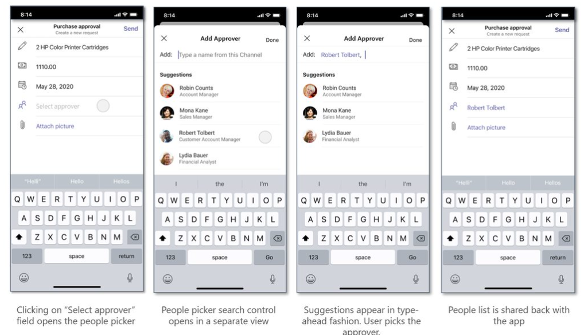

# Integrate People Picker

People Picker is a native capability and control in Teams, which allows user to search and select people. Teams now integrates native People Picker input control on both web and desktop apps. The control can be selected for single or multiple configurations, such as limiting search within a chat, channel, or across the entire organization.

Use [Microsoft Teams JavaScript client SDK](/javascript/api/overview/msteams-client?view=msteams-client-js-latest&preserve-view=true), to `selectPeople` API to integrate People Picker within your web and desktop app.

## Advantages of integrating People Picker

* People Picker control works on all Teams platforms, such as task module, a chat, channel, meeting tab, and personal app.
* The control allows the user to search and select user in a chat, channel, or the entire organization.
* People Picker helps with scenarios involving task assignment, tagging and notifying a user.
* The control can be used in both web and desktop, as it saves the effort and time significantly to build a similar control.

To integrate People Picker control in your Teams app select the API, `selectPeople`. To integrate and call the API, user must know about [code snippet](#code-snippet). User also needs familiarity with [API response errors](#error-handling) to handle any errors in web and desktop app.

## `selectPeople` API

The `selectPeople` API enables users to add Teams native `People Picker input control` to web and desktop apps. The following table provides a description of the API:

| API | Description  |
| --- | --- |
|`selectPeople`| • Launches People Picker and allows the user to search and select one or more people from the list.<br/>  • This API returns the ID, name and email address of selected users to the web or desktop app.<br/> • In case of a personal app, the control searches across the organization. If the app is added to a chat or channel, then the search context is configured depending on the scenario. The search is restricted within the members of that chat, channel, or made available across the organization.|

The `selectPeople` API comes with the following input configurations:

|Configuration parameter|Type|Description| Default value|
|-----|------|--------------|------|
|`title`|String| It is an optional parameter. It sets title for the People Picker control.|Select people|
|`setSelected`|String| It is an optional parameter. You must pass Microsoft Azure Active Directory (Azure AD) IDs of the people to be preselected. This parameter preselects people while launching the People Picker control. In case of single selection, only the first valid user is pre-populated ignoring the rest.|Null|
|`openOrgWideSearchInChatOrChannel`|Boolean| It is an optional parameter. When it is set to true, it launches the People Picker in organization wide scope even if the app is added to a chat or channel.|False|
|`singleSelect`|Boolean|It is an optional parameter. When it is set to true, it launches the People Picker restricting the selection to one user only.|False|

The following image depicts the experience of People Picker in a sample web and desktop app:

# [People Picker Mobile](#tab/AS)

> [!NOTE]
> The prerequisite to create an action command is that you have already created a messaging extension. For information on how to create a messaging extension, see [create a messaging extension](~/messaging-extensions/how-to/create-messaging-extension.md).



:::image type="content" source="../../assets/images/tabs/select-people-desktop-email.png" alt-text="people picker using email address":::

## Code snippet

The following code snippet displays use of `selectPeople` API to select people from a list:

```javascript
 microsoftTeams.people.selectPeople((error: microsoftTeams.SdkError, people: microsoftTeams.people.PeoplePickerResult[]) => 
 {
    if (error) 
    {
        if (error.message) 
           {
             alert(" ErrorCode: " + error.errorCode + error.message);
           }
            else 
            {
              alert(" ErrorCode: " + error.errorCode);
            }
      }
    if (people)
     {
            output(" People length: " + people.length + " " + JSON.stringify(people));
      }
  });
```

## Error handling

Ensure to handle the errors appropriately in your web and desktop app. The following table lists the error codes and the conditions under which the errors are generated:

|Error code |  Error name     | Condition|
| --------- | --------------- | -------- |
| **100** | NOT_SUPPORTED_ON_PLATFORM | API is not supported on the current platform.|
| **500** | INTERNAL_ERROR | Internal error encountered while launching People Picker.|
| **4000** | INVALID_ARGUMENTS | API is invoked with wrong or insufficient mandatory arguments.|
| **8000** | USER_ABORT |User cancelled the operation.|
| **9000** | OLD_PLATFORM | User is on an old platform build where implementation of the API is unavailable. Upgrading the build resolves the issue.|

## See also

* [Integrate media capabilities in Teams](mobile-camera-image-permissions.md)
* [Integrate QR code or barcode scanner capability in Teams](qr-barcode-scanner-capability.md)
* [Integrate location capabilities in Teams](location-capability.md)
