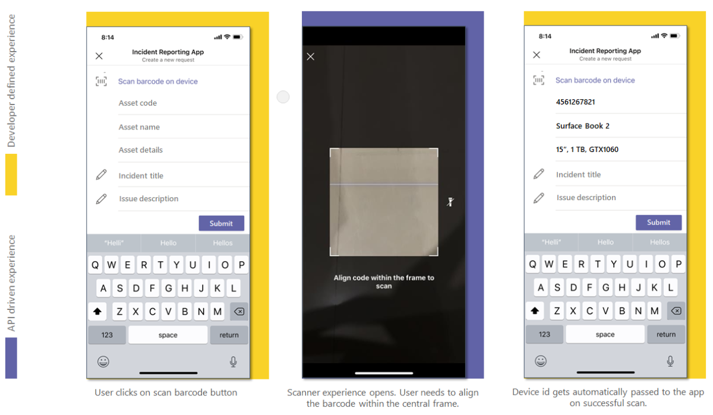

# Integrate QR or barcode scanner capability

Barcode is a method of representing data in a visual and machine-readable form. The barcode contains information about a product, such as a type, size, manufacturer, and Country of origin in the form of bars and spaces. The code is read using the optical scanner on your native device camera. For a richer collaborative experience, you can integrate the QR or barcode scanner capability provided in the Teams platform with your Teams app.

You can use [Microsoft Teams JavaScript client library](/javascript/api/overview/msteams-client?view=msteams-client-js-latest&preserve-view=true), which provides the tools necessary for your app to access the user’s [native device capabilities](native-device-permissions.md). Use the [scanBarCode](/javascript/api/@microsoft/teams-js/microsoftteams.media?view=msteams-client-js-latest&preserve-view=true#scanBarCode__error__SdkError__decodedText__string_____void__BarCodeConfig_) API to integrate the scanner capability within your app.

## Advantage of integrating QR or barcode scanner capability

Following are the advantages of integration of QR or barcode scanner capabilities:

* The integration allows web app developers on Teams platform to leverage QR or barcode scanning functionality with Teams JavaScript client library.
* With this feature, the user only needs to align a QR or barcode within a frame at the center of the scanner UI and the code gets scanned automatically. The stored data is shared back with the calling web app. This avoids the inconvenience and human errors of entering lengthy product codes or other relevant information manually.

To integrate QR or barcode scanner capability, you must update the app manifest file and call the [scanBarCode](/javascript/api/@microsoft/teams-js/microsoftteams.media?view=msteams-client-js-latest&preserve-view=true#scanBarCode__error__SdkError__decodedText__string_____void__BarCodeConfig_) API. For effective integration, you must have a good understanding of [code snippet](#code-snippet) for calling the [scanBarCode](/javascript/api/@microsoft/teams-js/microsoftteams.media?view=msteams-client-js-latest&preserve-view=true#scanBarCode__error__SdkError__decodedText__string_____void__BarCodeConfig_) API, which allows you to use native QR or barcode scanner capability. The API gives an error for an unsupported barcode standard.
It's important to familiarize yourself with the [API response errors](#error-handling) to handle the errors in your Teams app.

> [!NOTE]
> Currently, Microsoft Teams support for QR or barcode scanner capability is only available for mobile clients.

## Update manifest

Update your Teams app [manifest.json](../../resources/schema/manifest-schema.md#devicepermissions) file by adding the `devicePermissions` property and specifying `media`. It allows your app to ask for requisite permissions from users before they start using  the QR or barcode scanner capability. The update for app manifest is as follows:

``` json
"devicePermissions": [
    "media",
],
```

> [!NOTE]
> The **Request Permissions** prompt is automatically displayed when a relevant Teams API is initiated. For more information, see [Request device permissions](native-device-permissions.md).

## ScanBarCode API

The [scanBarCode](/javascript/api/@microsoft/teams-js/microsoftteams.media?view=msteams-client-js-latest&preserve-view=true#scanBarCode__error__SdkError__decodedText__string_____void__BarCodeConfig_) API invokes scanner control that enables the user to scan different types of barcode, and returns the result as a string.

To customize the barcode scanning experience, optional [barcode configuration](/javascript/api/@microsoft/teams-js/microsoftteams.media.barcodeconfig?view=msteams-client-js-latest&preserve-view=true) is passed as input to [scanBarCode](/javascript/api/@microsoft/teams-js/microsoftteams.media?view=msteams-client-js-latest&preserve-view=true#scanBarCode__error__SdkError__decodedText__string_____void__BarCodeConfig_) API. You can specify the scan time-out interval in seconds using `timeOutIntervalInSec`. Its default value is 30 seconds and the maximum value is 60 seconds.

The **scanBarCode()** API supports the following barcode types:

| Barcode Type | Supported on Android | Supported on iOS |
| ---------- | ---------- | ------------ |
| Codebar | Yes | No |
| Code 39 | Yes | Yes |
| Code 93 | Yes | Yes |
| Code 128 | Yes | Yes |
| EAN-13 | Yes | Yes |
| EAN-8 | Yes | Yes |
| ITF | No | Yes |
| QR Code | Yes | Yes |
| RSS Expanded | Yes | No |
| RSS-14 | Yes | No |
| UPC-A | Yes | Yes |
| UPC-E | Yes | Yes |

The following image depicts web app experience of QR or barcode scanner capability:



## Error handling

You must ensure to handle these errors appropriately in your Teams app. The following table lists the error codes and the conditions under which the errors are generated:

|Error code |  Error name     | Condition|
| --------- | --------------- | -------- |
| **100** | NOT_SUPPORTED_ON_PLATFORM | API isn't supported on the current platform.|
| **500** | INTERNAL_ERROR | Internal error is encountered while performing the required operation.|
| **1000** | PERMISSION_DENIED |Permission is denied by the user.|
| **3000** | NO_HW_SUPPORT | Underlying hardware doesn't support the capability.|
| **4000** | INVALID_ARGUMENTS | One or more arguments are invalid.|
| **8000** | USER_ABORT |User aborts the operation.|
| **8001** | OPERATION_TIMED_OUT | Couldn't detect the barcode in the given time interval.|
| **9000** | OLD_PLATFORM | Platform code is outdated and doesn't implement this API.|

## Code snippet

**Calling `ScanBarCode()` API** for scanning QR or barcode using camera:

```javascript
const config: microsoftTeams.media.BarCodeConfig = {
  timeOutIntervalInSec: 30};
microsoftTeams.media.scanBarCode((error: microsoftTeams.SdkError, decodedText: string) => {
  if (error) {
    if (error.message) {
      output(" ErrorCode: " + error.errorCode + error.message);
    } else {
      output(" ErrorCode: " + error.errorCode);
    }
  } else if (decodedText) {
    output(decodedText);
  }
}, config);
```

## Code sample

| Sample name           | Description | .NET |Node.js    | Manifest|
|:---------------------|:--------------|:---------|:---------|:---------|
|Bot join team by QR | This sample demos a feature where user can join a team using QR code containing the team's id. |[View](https://github.com/OfficeDev/Microsoft-Teams-Samples/tree/main/samples/bot-join-team-using-qr-code/csharp)|[View](https://github.com/OfficeDev/Microsoft-Teams-Samples/tree/main/samples/bot-join-team-using-qr-code/nodejs)|[View](https://github.com/OfficeDev/Microsoft-Teams-Samples/tree/main/samples/bot-join-team-using-qr-code/csharp/demo-manifest/Bot-Join-Team-By-QR.zip)|
|Tab product inspection | This sample app demonstrate a feature where user can scan a product, capture a image, and mark it as approved/rejected. |[View](https://github.com/OfficeDev/Microsoft-Teams-Samples/tree/main/samples/tab-product-inspection/csharp)|[View](https://github.com/OfficeDev/Microsoft-Teams-Samples/tree/main/samples/tab-product-inspection/nodejs)|[View](https://github.com/OfficeDev/Microsoft-Teams-Samples/tree/main/samples/tab-product-inspection/csharp/demo-manifest/Tab-Product-Inspection.zip)|

## See also

* [Device capabilities](device-capabilities-overview.md)
* [Integrate media capabilities](media-capabilities.md)
* [Integrate location capabilities](location-capability.md)
* [Integrate People Picker](people-picker-capability.md)
* [App manifest schema for Teams](../../resources/schema/manifest-schema.md)
