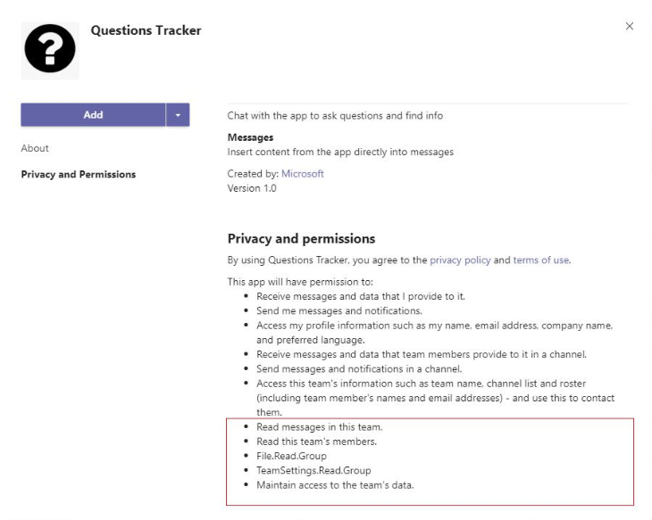

# Resource specific consent in Teams

Resource-specific consent (RSC) in Microsoft Teams allows team owners to grant consent to apps to access their team's data and replaces the need for a global admin to approve the app with [tenant-wide admin permissions](https://docs.microsoft.com/azure/active-directory/manage-apps/grant-admin-consent).
These accesses include the ability to create, rename and delete channels, read channel messages, create tabs, and add or remove members from a team. This article provides the step by step guide to configure RSC in your Teams app.



## Prerequisites (Admin)

As an admin, you can control whether team owners in your organization can grant team-specific consent (enabled by default) through [settings](https://review.docs.microsoft.com/en-us/MicrosoftTeams/resource-specific-consent?branch=v-lanac-rsc) that you configure in the Azure Active Directory (Azure AD) PowerShell module or the Azure portal and the Microsoft Teams admin center.


> **Important** : Changing any of these settings doesn't affect data access for apps that were already granted consent. 

## Configure Teams App to support RSC (Developer)

The basic steps required to configure a service and get a token from the Microsoft identity platform endpoint that your service can use to call Microsoft Graph are:

1. Register your application in Azure AD.
2. Validate permissions.
3. Update your Teams app manifest to link to your AAD app ID.
4. Get an access token.
5. Make a Graph call.


#### 1. Register a new application in Azure AD

[Register](https://docs.microsoft.com/graph/auth-register-app-v2) a new application in the [Azure Active Directory- App Registration portal](https://ms.portal.azure.com/#blade/Microsoft_AAD_RegisteredApps/ApplicationsListBlade) to get an AAD app ID. If your AAD app supports [single sign-on (SSO) for tabs](../tabs/how-to/authentication/auth-aad-sso.md), then use the same AAD app ID for configuring RSC.

#### 2. Validate permissions
* If you are configuring RSC with a newly registered app (with default permissions): Follow step 3. 
* If you are configuring RSC with an existing app (with additional permissions): Check the permissions in the `API Permissions` section of the app registration portal in Azure AD, and confirm if RSC related permissions are configured here. If so, they should be deleted from here and are supposed to be configured in the Teams app manifest as mentioned in step 3.

#### 3. Update your Teams app manifest to link to your AAD app ID
Add a [webApplicationInfo](../resources/schema/manifest-schema.md#webapplicationinfo) section to the manifest that includes two properties - `id` is the AAD app ID, and `applicationPermissions` are the RSC permissions (scopes) your app requires.

> **Note**: If your app needs non RSC permissions, you can continue to use them as always, but they do not go in the manifest. 

```
{ 
  "$schema": ".../MicrosoftTeams.schema.json", 
   "webApplicationInfo": { 
      "id": "cb38cf54-ac89-4a7a-9ea3-095d3d080037", 
      "applicationPermissions": [  
      "File.Read.Group",
      "TeamSettings.Read.Group",
      "ChannelMessage.Read.Group",
      "Member.Read.Group"
      ] 
  }
  ... 
} 
```
Refer to the list of available Graph permissions for RSC in [Teams permissions](https://docs.microsoft.com/graph/permissions-reference) section.

#### 4. Get an access token 

Before you make a REST call to the Graph, you need to [get an access token](https://docs.microsoft.com/graph/auth-register-app-v2) for the application permissions similar to getting an application permission token for non-RSC use.
  
```
string response = await HttpHelpers.POST( 
    $"https://login.microsoftonline.com/{tenant}/oauth2/v2.0/token", 
    $"grant_type=client_credentials&client_id={appId}&client_secret={appSecret}" 
    + "&scope=https%3A%2F%2Fgraph.microsoft.com%2F.default"); 
string token = response.Deserialize<TokenResponse>().access_token; 
```
  
#### 5. Make a Graph call 

You can now make a REST call similar to a non RSC call or use the SDK. See [Microsoft Graph](https://developer.microsoft.com/graph) and [Use the Microsoft Graph API to work with Microsoft Teams](https://docs.microsoft.com/graph/use-the-api) for more details. 

##  RSC Guidelines

#### Team owner needs to install the Teams app: 
To provide consent to your app, team owner has to firstly install the Teams app. Webpages running outside Teams can make RSC Graph calls only after the corresponding Teams app has been installed.

#### The team owner can grant consent only to Teams data:
Graph permissions are not always about teams data.
For example, Your AAD app may need Mail.Read permission, but this is not an RSC scenario because it is not about team data, and team owners can not give consent to other people's mailboxes. APIs for Files, SharePoint, OneNote, Planner, and Calendar within a team do not support RSC yet.

#### Multiple Teams apps should not be linked to the same AAD app ID :
It is not a good idea to have multiple Teams apps link to the same AAD app ID. Team AAD app ID must be unique – if anyone tries to install and link multiple Teams app to the same AAD app ID, the installation will fail.

#### Graph RSC calls are not attributed to a user :
When you make an RSC API call, Graph doesn't know on behalf of which user(if any) you are doing the work. Hence, you should be aware of the use cases such as creating a channel or removing a tab, as you are calling Application permissions rather than delegated permissions.
