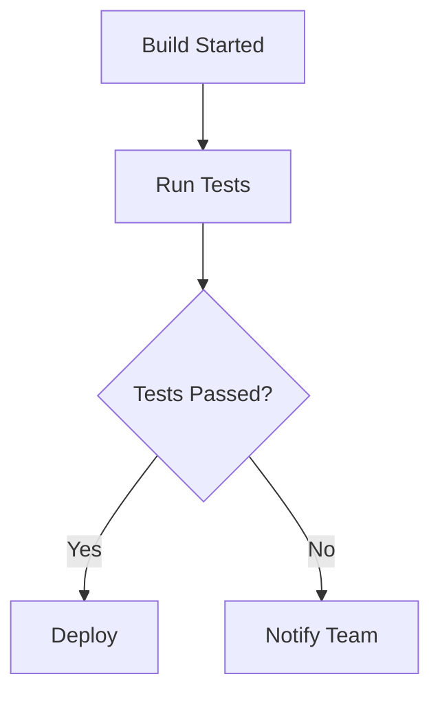

# Format bot messages with enriched Markdown

Enriched Markdown is a new message type that extends standard Markdown rendering for bot messages in Microsoft Teams. To use it, set `textFormat` to `markdown++` in the message activity.

With enriched Markdown, a bot can include tables, code blocks with syntax highlighting, math equations, Mermaid diagrams, callouts, and inline Adaptive Cards in a single `text` field. The Teams client renders this content on the client side and supports streaming, so users see content progressively as the bot generates it.

In this article:

- [Enable enriched Markdown](#enable-enriched-markdown)
- [Supported Markdown features](#supported-markdown-features)
- [Callouts and directives](#callouts-and-directives)
- [Mermaid diagrams](#mermaid-diagrams)
- [Inline Adaptive Cards](#inline-adaptive-cards)
- [Entity representations](#entity-representations)
- [At-mention support](#at-mention-support)
- [Image handling](#image-handling)
- [Streaming support](#streaming-support)
- [Security and sanitization](#security-and-sanitization)
- [Fallback behavior](#fallback-behavior)
- [Best practices](#best-practices)

## Enable enriched Markdown

To use enriched Markdown, set the `textFormat` property to `markdown++` in your bot's message activity. The `text` field contains your Markdown content, including any custom fenced blocks for inline UI elements.

# [JSON](#tab/json)

```json
{
  "type": "message",
  "textFormat": "markdown++",
  "text": "## Build Results\n\n| Test | Status |\n|------|--------|\n| Unit | ✅ Pass |\n| Integration | ✅ Pass |"
}
```

# [C#](#tab/csharp)

```csharp
var activity = new Activity
{
    Type = ActivityTypes.Message,
    Text = markdownContent,
    TextFormat = "markdown++"
};

await app.SendActivity(conversationId, activity);
```

# [TypeScript](#tab/typescript)

```typescript
const activity = {
  type: "message",
  text: markdownContent,
  textFormat: "markdown++"
};

await app.sendActivity(conversationId, activity);
```

# [Python](#tab/python)

```python
activity = Activity(
    type=ActivityTypes.message,
    text=markdown_content,
    text_format="markdown++"
)

await app.send_activity(conversation_id, activity)
```

---

> [!NOTE]
> The `markdown++` format is distinct from the legacy `markdown` text format. Existing bots using `textFormat: "markdown"` continue to work without changes.

## Supported Markdown features

The `markdown++` format supports a comprehensive set of Markdown features organized into core and enriched categories.

### Core features (GFM)

| Feature | Syntax | Description |
|---------|--------|-------------|
| Headings | `# H1` through `###### H6` | Six levels of headings |
| Paragraphs and line breaks | Blank line or trailing `\` | Paragraph separation and hard breaks |
| Emphasis | `*italic*` `**bold**` `~~strikethrough~~` | Inline text formatting |
| Inline code | `` `code` `` | Inline code spans |
| Code fences | ` ```language ` | Syntax-highlighted code blocks |
| Blockquotes | `> quoted text` | Quoted content |
| Lists | `- item` or `1. item` | Ordered and unordered lists, with nesting |
| Task lists | `- [ ]` / `- [x]` | Checkboxes for completed and pending items |
| Tables | Pipe-delimited syntax | GFM tables with column alignment |
| Links | `[text](url)` | Hyperlinks |
| Images | `` | Inline images |
| Autolinks | URLs in text | Automatic URL detection and linking |

### Enriched features

| Feature | Syntax | Description |
|---------|--------|-------------|
| Callouts/admonitions | `:::info`, `:::warning`, `:::tip`, `:::danger` | Visually distinct callout blocks |
| Mermaid diagrams | ` ```mermaid ` | Flowcharts, sequence diagrams, and visualizations |
| Math (LaTeX) | `$...$` (inline) / `$$...$$` (block) | Mathematical equations using KaTeX |
| Anchors | `[Jump](#section)` | In-document navigation links |
| Definition lists | `Term\n: Definition` | Term-definition pairs |
| Footnotes | `Text[^1]` / `[^1]: note` | Reference-style footnotes |
| Inline Adaptive Card | ` ```adaptivecard ` | Embed an Adaptive Card within the Markdown flow |

### Out of scope

The following aren't supported in `markdown++` messages:

- Raw HTML (`<div>`, `<iframe>`)
- Arbitrary iframes or third-party embeds
- Dangerous URL schemes (`javascript:`, `data:`, `file:`)
- Inline CSS or raw SVG
- Unknown custom directives (rendered as plain code blocks)

### Tables

Use GitHub Flavored Markdown (GFM) table syntax to present structured data. Tables support column alignment using colons in the separator row.

```markdown
| Feature | Status | Priority |
|:--------|:------:|----------:|
| Tables  | Done   | High      |
| Math    | Done   | High      |
```

In this example, the first column is left-aligned, the second is centered, and the third is right-aligned.

### Task lists

Use task list syntax to display completed and pending items in your bot messages.

```markdown
- [x] Checkout code
- [x] Install dependencies
- [x] Run unit tests
- [ ] Deploy to production
```

> [!NOTE]
> Task list checkboxes are read-only. Users can't interact with them to change their state.

### Code blocks with syntax highlighting

Use fenced code blocks with a language identifier to enable syntax highlighting.

````markdown
```python
def fibonacci(n):
    if n <= 1:
        return n
    return fibonacci(n - 1) + fibonacci(n - 2)
```
````

Supported languages include, but aren't limited to: `python`, `javascript`, `typescript`, `csharp`, `java`, `json`, `yaml`, `bash`, `sql`, `html`, and `css`.

### Math equations

Use LaTeX/KaTeX syntax to render mathematical equations. Inline math uses single dollar signs, and block math uses double dollar signs.

**Inline math:**

```markdown
The equation $E = mc^2$ describes mass-energy equivalence.
```

**Block math:**

```markdown
$$
r = \frac{\sum(x_i - \bar{x})(y_i - \bar{y})}{\sqrt{\sum(x_i - \bar{x})^2}\sqrt{\sum(y_i - \bar{y})^2}}
$$
```

> [!NOTE]
> Math rendering uses KaTeX. For the full list of supported LaTeX commands, see [KaTeX supported functions](https://katex.org/docs/supported).

### Footnotes

Use footnote references for supplementary information without interrupting the main content flow.

```markdown
This result is statistically significant[^1].

[^1]: Based on a 95% confidence interval with p < 0.05.
```

## Callouts and directives

Callouts create visually distinct blocks that help users identify important information by severity or type. Use directives to highlight warnings, tips, informational notes, or critical errors.

| Directive | Use case |
|-----------|----------|
| `:::info` | General information the user should know |
| `:::tip` | Helpful suggestions or best practices |
| `:::warning` | Important caution that could affect outcomes |
| `:::danger` | Critical alerts requiring immediate attention |

**Syntax:**

```markdown
:::warning
3 unit tests failed in the latest build. Review the test results before deploying.
:::
```

**Example: Compliance bot flagging a policy violation:**

```markdown
:::danger
Policy violation detected: Document "Q4-Financials.xlsx" was shared externally without required sensitivity labeling.
:::

**Action required:** Apply a sensitivity label or revoke external access within 24 hours.
```

<!-- ### Collapsible sections

Use the `:::spoiler` directive to create expandable/collapsible sections:

```markdown
:::spoiler View full error log
Error at line 42: NullReferenceException in BuildService.cs
Stack trace:
  at BuildService.Run() in BuildService.cs:line 42
  at Pipeline.Execute() in Pipeline.cs:line 18
:::
``` -->

## Mermaid diagrams

Use Mermaid fenced blocks to render flowcharts, sequence diagrams, and other visualizations inline within your message.

````markdown

````

> [!NOTE]
> Mermaid diagrams are rendered in an isolated context with no script access to the host page.

## Inline Adaptive Cards

You can embed an Adaptive Card directly within your Markdown content using a fenced code block with the `adaptivecard` language identifier. This lets you place interactive UI elements exactly where they make sense within your formatted text.

Each `adaptivecard` fenced block must contain exactly one valid Adaptive Card JSON payload.

### Example: Build report with inline actions

<!-- TODO: Replace with validated sample from engineering -->

### Guidelines for inline Adaptive Cards

- Each `adaptivecard` fenced block must contain exactly **one** valid Adaptive Card JSON object.
- Multiple `adaptivecard` blocks can appear in the same message at different positions within the Markdown flow.
- The Adaptive Card JSON must conform to the [Adaptive Cards schema](https://adaptivecards.io/explorer/) (version 1.6 or later).
- Actions within inline cards (such as `Action.Submit` and `Action.Execute`) work the same way as actions in standalone card attachments.
- Unknown fenced block types are rendered as plaintext code blocks (content preserved).

## Entity representations

Enriched Markdown messages support entity representations that enable rich, interactive cards for files, meetings, people, and other entities. Entity representations are carried in the message activity and rendered by the client as hero cards or reference cards.

### Entity representation structure

Each entity representation is a JSON object with the following fields:

| Field | Type | Required | Description |
|-------|------|----------|-------------|
| `id` | string | Yes | Unique identifier for the entity |
| `type` | string | Yes | Entity type (`File`, `Event`, `People`, `Email`, `Chat`, etc.) |
| `metadata` | object | Yes | Entity-specific metadata (flexible schema per type) |
| `metadataState` | string | Yes | `Full` or `Partial` indicating completeness of the metadata |
| `isHeroEntity` | boolean | No | If `true`, render as a hero card with full details |
| `isDeduped` | boolean | No | If `true`, entity appears as both a hero card and a citation reference |

### Example: File entity representation

<!-- TODO: Replace with validated sample from engineering -->

### Supported entity types

| Type | Description | Example use case |
|------|-------------|------------------|
| `File` | Documents, spreadsheets, presentations | Reference a SharePoint document |
| `Event` | Calendar events and meetings | Show an upcoming meeting card |
| `People` | User profiles and contacts | Display a person card |
| `Email` | Email messages | Reference an email thread |
| `Chat` | Chat conversations | Link to a related conversation |

## At-mention support

Enriched Markdown messages support at-mentions using the same pattern as standard bot messages. Mentions work in both the Markdown text and within inline Adaptive Cards.

### Mentions in Markdown text

Use `<at>` tags in your Markdown text and include the corresponding mention entities in the activity's `entities` array:

```json
{
  "type": "message",
  "textFormat": "markdown++",
  "text": "## Task assigned\n\n<at>Jane Smith</at> has been assigned to review PR #342.",
  "entities": [
    {
      "type": "mention",
      "text": "<at>Jane Smith</at>",
      "mentioned": {
        "id": "29:user-id",
        "name": "Jane Smith"
      }
    }
  ]
}
```

### Mentions in inline Adaptive Cards

For mentions within an inline Adaptive Card fenced block, use the `msteams.entities` property within the card JSON:

```json
{
  "type": "AdaptiveCard",
  "version": "1.6",
  "body": [
    {
      "type": "TextBlock",
      "text": "Assigned to <at>Jane Smith</at>"
    }
  ],
  "msteams": {
    "entities": [
      {
        "type": "mention",
        "text": "<at>Jane Smith</at>",
        "mentioned": {
          "id": "29:user-id",
          "name": "Jane Smith"
        }
      }
    ]
  }
}
```

### Supported mention types

| Type | Description |
|------|-------------|
| `person` / `user` | Individual user mention |
| `tag` | Team tag mention |
| `channel` | Channel mention |
| `team` | Team mention |
| `bot` | Bot mention |

## Image handling

Images in enriched Markdown messages use standard Markdown image syntax. The platform processes image URLs to ensure security and proper rendering.

```markdown

```

**Image processing behaviors:**

- External image URLs are validated against approved URL schemes (`https://`).
- Images are proxied through the Teams image service for security.
- Base64-encoded images (`data:image/*;base64,...`) are uploaded to storage and replaced with secure URLs.
- Images within code blocks aren't processed (treated as literal text).
- Both inline and reference-style Markdown images are supported, including within tables and lists.

## Streaming support

Enriched Markdown messages support streaming for progressive content rendering. As your bot sends incremental updates, the Teams client renders completed Markdown units while buffering incomplete content.

Key streaming behaviors:

- **Progressive rendering:** Content appears as it arrives, with no loading spinners blocking interaction.
- **No chat blocking:** Users can continue typing and interacting while streaming content renders.
- **Incremental updates:** The client handles rapid sequential updates efficiently.

### Streaming boundaries

The client renders content at safe boundaries to avoid displaying partial or broken formatting:

| Content type | Emit boundary |
|--------------|---------------|
| Paragraphs | Blank line (end of paragraph) |
| List items | End of line for each item |
| Headings | End of heading line |
| Code fences / `adaptivecard` blocks | Closing fence on its own line |
| Inline math (`$...$`) | Closing `$` delimiter |
| Block math (`$$...$$`) | Closing `$$` delimiter |
| Blockquotes | Line by line |
| Links and images | Closing parenthesis (after URL validation passes) |

### Adaptive Card streaming

For inline Adaptive Cards, the complete card JSON must be available before rendering. The fenced block is emitted to the renderer only when the closing fence appears. This ensures that partial JSON never causes rendering errors.

> [!NOTE]
> Currently, streaming delivers the full message content with each update (append-only). The client handles incremental rendering efficiently through internal optimization.

## Security and sanitization

Enriched Markdown messages enforce strict security controls at multiple layers to protect against injection attacks, phishing, and content abuse.

### Parsing and validation

| Control | Description |
|---------|-------------|
| HTML disabled | The Markdown parser runs with HTML disabled; all HTML constructs are escaped |
| Schema validation | Inline Adaptive Card JSON is validated against the Adaptive Cards schema |
| URL policy | Only `http://`, `https://`, and `mailto:` schemes are allowed; `javascript:`, `data:`, `file:`, and `vbscript:` are blocked |
| Unicode normalization | NFC normalization with control character filtering; bidirectional text markers (RLO/LRO) are detected and flagged |
| Text sanitization | Zero-width characters are collapsed; maximum whitespace runs enforced |
| Size and structure limits | Payload budgets for characters, blocks, and images; depth limits for nested lists; complexity caps for diagrams |
| Unknown directives | Rendered as plain code blocks (safe fallback) |

### Rendering security

| Control | Description |
|---------|-------------|
| No script execution | Mermaid and math renderers are origin-isolated with no script access to the host page |
| No HTML string injection | The client generates React elements directly instead of inserting HTML strings |
| Safe links | All links pass through phishing protection |
| Image proxying | Bot-provided image URLs are proxied through the Teams image service |
| Allowlist rendering | The client applies a lightweight allowlist as a secondary defense layer |
| Automatic escaping | Text content is auto-escaped by the rendering framework |

### Blocked attack vectors

- JavaScript URLs: `[Click](javascript:alert('XSS'))`
- Data URIs with executable content: `[Click](data:text/html,...)`
- Event handler injection: ``
- Inline scripts: `<script>...</script>`
- Markdown bombs (deeply nested structures): Depth limits enforced
- Mention spoofing: Mentions resolved through platform policy
- Homograph/IDN attacks: Unicode confusables detected

## Fallback behavior

| Scenario | Behavior |
|----------|----------|
| Older client that doesn't support `markdown++` | Server strips Markdown syntax and delivers plaintext |
| Unknown fenced block type | Renders as a plaintext code block (content preserved) |
| Invalid Adaptive Card JSON in fenced block | Rejected; fenced block renders as plaintext |
| Invalid YAML or parameters | Degrades to plaintext |
| Malformed Markdown | Best-effort rendering; no client crashes |
| Message exceeds size limit | Maintains current size limit behavior (100 KB) |

> [!NOTE]
> When a bot message uses `markdown++` and is viewed on an older client, the server-side fallback automatically handles the conversion. No additional developer action is required.

## Best practices

### Choose the right format for the content

Use `markdown++` when your bot needs rich formatting (tables, equations, code, diagrams) or hybrid text-plus-card experiences. For simple text responses, standard `textFormat: "markdown"` is sufficient.

### Combine text and cards purposefully

Use Markdown for explanatory content, context, and formatted data. Use inline Adaptive Cards when you need interactive elements like buttons, forms, or action submissions. Don't embed an Adaptive Card for content that Markdown handles well on its own.

### Use callouts for important information

Don't rely on bold text or emoji alone to convey urgency. Use `:::warning` or `:::danger` directives to ensure critical information is visually prominent.

### Design for streaming

Structure your messages so that meaningful content appears early. Place critical information in the initial Markdown sections so users see it immediately during streaming, with interactive cards appearing after the context is established.

### Use entity representations for linked content

When referencing files, meetings, or people, use entity representations to render rich hero cards instead of plain links. This helps users preview and interact with referenced content without leaving the conversation.

### Provide notification summaries

Use the optional `summary` field for meaningful push notification text, since Markdown and card content won't display well in notification previews:

```json
{
  "type": "message",
  "textFormat": "markdown++",
  "text": "## Build #4829 Failed\n\n...",
  "summary": "Build #4829 failed — 3 unit tests need attention"
}
```

### Keep performance in mind

- Small messages (< 1 KB) render in under 50 ms.
- Medium messages (1-10 KB) render in under 100 ms.
- Large messages (10-100 KB) render in under 200 ms.

For the best user experience, keep messages under 10 KB when possible.

### Test across all platforms

Verify rendering on desktop, web, and mobile clients. Complex layouts may display differently on smaller screens. Ensure that inline Adaptive Card actions work correctly on all platforms.

## See also

- [Format cards in Teams](task-modules-and-cards/cards/cards-format.md)
- [Adaptive Cards in Teams](task-modules-and-cards/cards/Universal-actions-for-adaptive-cards/Overview.md)
- [Channel and group chat conversations](bots/how-to/conversations/channel-and-group-conversations.md)
- [Send proactive messages](bots/how-to/conversations/send-proactive-messages.md)
