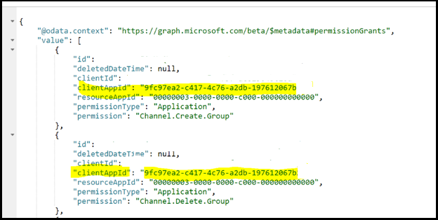
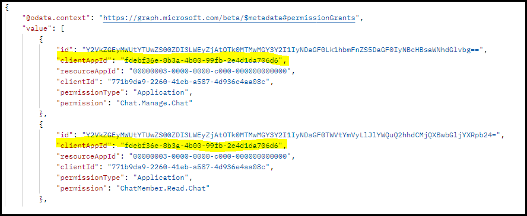

# Resource-specific consent

> [!NOTE]
> Resource-specific consent for chat scope is available in [public developer preview](../../resources/dev-preview/developer-preview-intro.md) only.

Resource-specific consent (RSC) is an authorization framework built by Microsoft Teams and Microsoft Identity that allows for granting scoped access to an application. Through RSC, an authorized user can give an application access to the data of only a specific instance of a resource type instead of giving broad access to each and every instance of a resource type in the entire tenant. For example, a person who owns both team A and team B can decide to give the Contoso app access to the data of only team A and not team B. The same concept of scoped data access applies to chats and meetings as well.

**Note:** If a chat has a meeting or a call associated with it, then the relevant RSC permissions apply to those resources as well.

## Types of RSC permissions

RSC permission determines which data access methods are allowed by the application. There are two types of RSC permissions:

* **Application**: The app can access data without the presence of a signed-in user.
* **Delegate**: The app can access data only in the context of a signed-in user’s session. No access is allowed in the absence of a signed-in user.

### API that supports RSC-based data access

All three, the Microsoft Graph SDK, Microsoft Bot Framework SDK, and Microsoft Teams Client SDK, support fine-grained data access via RSC. The supported modes and resource types differ across the API surfaces.

| RSC mode or type | Supported SDKs | App manifest version | Resource types | RSC-related controls for the entire tenant | Who can consent to RSC permissions? |
|---------|---------|---------|---------|---------|---------|
|Application| Microsoft Graph, Microsoft Bot Framework | >=1.6 | Teams, chats, and meetings | Microsoft Graph-based controls for chats and meetings; AAD portal-based controls for teams | In a team, anyone of the team’s owners. In a chat, anyone of the chat’s members. In a meeting, anyone of the meeting organizers or presenters |
| Delegated | Microsoft Teams Client | >=1.12 | Teams, chats, meetings, and users | Always ON | Any user authorized to install an app in that specific scope. |

## RSC permissions for resource types

The granular, Teams-specific, RSC permissions define what an application can do within a specific resource. RSC permissions are available on the following resource types:

* [Teams](#resource-specific-permissions-for-a-team) (includes the channels within those teams)
* [Chats](#resource-specific-permissions-for-a-chat) (includes the meetings associated with those chats)
* [Users](#resource-specific-permissions-for-a-user)

> [!NOTE]
> Some of the permissions listed here might not yet have GA for the features that are associated with them.

### Resource-specific permissions for a team

The following table provides resource-specific permissions for a team:

| Application permission | Action | Delegate permissions | Application permissions |
| ----- | ----- |----- |----- |
|Channel.Create.Group|Create channels in this team. | NA | Supported |
|Channel.Delete.Group|Delete channels in this team. | NA | Supported |
|ChannelMeeting.ReadBasic.Group|Get the basic properties of this team's channel meetings.| NA | Supported |
|ChannelMeetingParticipant.Read.Group|Get participant information for channel meetings associated with this team, such as name, role, ID, joined and left times.| NA | Supported |
|ChannelMeetingActiveSpeaker.Read.Group|Get the list of participants who are currently sending audio into the channel meetings associated with this team.| Supported | NA |
|ChannelMeetingAudioVideo.Stream.Group|Stream audio-video content from channel meetings associated with this team.| Supported | NA |
|ChannelMeetingIncomingAudio.Detect.Group|Detect incoming audio in channel meetings associated with this team.| Supported | NA |
|ChannelMeetingRecording.Read.Group|Get the recordings of all channel meetings associated with this team.| NA | Supported |
|ChannelMeetingTranscript.Read.Group|Get the transcripts of all channel meetings associated with this team.| NA | Supported |
|ChannelMeetingNotification.Send.Group|Send notifications for all the channel meetings associated with this team.| NA | Supported |
|ChannelMeetingStage.Write.Group|Get content on the meeting stage of channel meetings associated with this team.| Supported | NA |
|ChannelMessage.Read.Group|Get this team's channel messages. | NA | Supported |
|ChannelMessage.Send.Group|Send messages to this team's channels.| NA | Supported |
|ChannelSettings.Read.Group|Get this team's channel names, descriptions, and settings​.| NA | Supported |
|ChannelSettings.ReadWrite.Group|Update this team's channel names, descriptions, and settings.​| NA | Supported |
|InAppPurchase.Allow.Group|Show and complete in-app purchases for team members.| Supported | NA |
|LiveShareSession.ReadWrite.Group| Create and synchronize Live Share sessions for meetings associated with this team. | Supported | NA |
|MeetingParticipantReaction.Read.Group| Get reactions from participants in channel meetings associated with this team.| Supported | NA |
|Member.Read.Group|Get this group's members.| NA | Supported |
|Owner.Read.Group|Get this group's owners.| NA | Supported |
|TeamsActivity.Send.Group|Create new notifications in the activity feeds of the users in this team. | NA | Supported |
|TeamsAppInstallation.Read.Group|Get a list of this team's installed apps.| NA | Supported |
|TeamMember.Read.Group|Get this team's members. | NA | Supported |
|TeamSettings.Read.Group | Get this team's settings.| NA | Supported |
|TeamSettings.ReadWrite.Group|Update this team's settings.| NA | Supported |
|TeamsTab.Create.Group|Create tabs in this team. | NA | Supported |
|TeamsTab.Delete.Group|Delete this team's tabs. | NA | Supported |
|TeamsTab.Read.Group|Get a list of this team's tabs.| NA | Supported |
|TeamsTab.ReadWrite.Group|Manage this team's tabs. | NA | Supported |

For more information, see [team resource-specific consent permissions](/graph/permissions-reference#team-resource-specific-consent-permissions).

### Resource-specific permissions for a chat

The following table provides resource-specific permissions for a chat:

|Application permission| Action | Delegate permissions | Application permissions |
| ----- | ----- | ----- | ----- |
| Calls.AccessMedia.Chat | Access media streams in calls associated with this chat or meeting. | NA | Supported |
| Calls.JoinGroupCalls.Chat | Join calls associated with this chat or meeting. | NA | Supported |
| ChatSettings.Read.Chat| Get this chat's settings.| NA | Supported |
| ChatSettings.ReadWrite.Chat| Update this chat's settings. | NA | Supported |
| ChatMessage.Read.Chat | Get this chat's messages.| NA | Supported |
| ChatMessage.Send.Chat | Send messages to this chat. | NA | Supported |
| ChatMessageReadReceipt.Read.Chat | Get the ID of the last seen message in this chat. | NA | Supported |
| ChatMember.Read.Chat | Get this chat's members. | NA | Supported |
| Chat.Manage.Chat | Manage this chat. | NA | Supported |
| InAppPurchase.Allow.Chat | Show and complete in-app purchases for users in this chat and any associated meetings. | Supported | NA |
| LiveShareSession.ReadWrite.Chat | Create and synchronize Live Share sessions for meetings associated with this chat. | Supported | NA |
| MeetingStage.Write.Chat | Show content on the meeting stage of meetings associated with this chat. | Supported | NA |
| MeetingParticipantReaction.Read.Chat | Get the reactions of participants in meetings associated with this chat. | Supported | NA |
| TeamsTab.Read.Chat | Get this chat's tabs. | NA | Supported |
| TeamsTab.Create.Chat | Create tabs in this chat. | NA | Supported |
| TeamsTab.Delete.Chat | Delete this chat's tabs. | NA | Supported |
| TeamsTab.ReadWrite.Chat | Manage this chat's tabs. | NA | Supported |
| TeamsAppInstallation.Read.Chat | Get which apps are installed in this chat. | NA | Supported |
| TeamsActivity.Send.Chat | Create new notifications in the activity feeds of the users in this chat. | NA | Supported |
| OnlineMeetingIncomingAudio.Detect.Chat | Detect incoming audio in meetings associated with this chat. | Supported | NA |
| OnlineMeetingActiveSpeaker.Read.Chat | Get the participants who are currently sending audio into the meetings associated with this chat. | Supported | NA |
| OnlineMeetingAudioVideo.Stream.Chat | Stream audio-video content from meetings associated with this chat. | Supported | NA |
| OnlineMeetingTranscript.Read.Chat | Get the transcripts of the meeting associated with this chat. | NA | Supported |
| OnlineMeetingParticipant.Read.Chat | Get the participants of the meetings associated with this chat.| NA | Supported |
| OnlineMeetingParticipant.ToggleIncomingAudio.Chat | Toggle incoming audio for participants in meetings associated with this chat. | Supported | NA |
| OnlineMeeting.ReadBasic.Chat | Get basic properties, such as name, schedule, organizer, join link, and start/end notifications, of a meeting associated with this chat. | NA | Supported |
| OnlineMeetingRecording.Read.Chat | Get the recordings of the meetings associated with this chat. | NA | Supported |
| OnlineMeetingNotification.Send.Chat | Send notifications for the meetings associated with this chat. | NA | Supported |

For more information, see [chat resource-specific consent permissions](/graph/permissions-reference#chat-resource-specific-consent-permissions).

> [!NOTE]
> Resource-specific permissions are only available to Teams apps installed on the Teams client and are currently not part of the Azure Active Directory (AAD) portal.

### Resource-specific permissions for a user

The following table provides resource-specific permissions for a user:

|Application permission| Action | Delegate permissions | Application permissions |
| ----- | ----- | ----- | ----- |
| CameraStream.Read.User | Get the user's camera stream. | Supported | NA |
| InAppPurchase.Allow.User | Show and complete in-app purchases. | Supported | NA |
| MicrophoneStream.Read.User | Get the user's microphone stream. | Supported | NA |
| MeetingParticipantReaction.Read.User | Get the user's reactions while participating in a meeting. | Supported | NA |
| OutgoingVideoStream.Write.User | Modify the user's outgoing video. | Supported | NA |

## Enable RSC in your application

1. [Configure consent settings](#configure-consent-settings).
    1. [Configure group owner consent settings for RSC in a team using the Azure AD portal](#configure-group-owner-consent-settings-for-rsc-in-a-team-using-the-azure-ad-portal).
    1. [Configure chat owner consent settings for RSC in a chat using the Microsoft Graph APIs](#configure-chat-owner-consent-settings-for-rsc-in-a-chat-using-the-microsoft-graph-apis).
1. [Register your app with Microsoft identity platform using the Azure AD portal](#register-your-app-with-microsoft-identity-platform-using-the-azure-ad-portal).
1. [Review your application permissions in the Azure AD portal](#review-your-application-permissions-in-the-azure-ad-portal).
1. [Obtain an access token from the identity platform](#obtain-an-access-token-from-the-microsoft-identity-platform).
1. [Update your Teams app manifest](#update-your-teams-app-manifest).
1. [Install your app directly in Teams](#sideload-your-app-in-teams).
1. [Check your app for added RSC permissions](#check-your-app-for-added-rsc-permissions).
    1. [Check your app for added RSC permissions in a team](#check-your-app-for-added-rsc-permissions-in-a-team).
    1. [Check your app for added RSC permissions in a chat](#check-your-app-for-added-rsc-permissions-in-a-chat).

## Consent to RSC permissions requested by an app

In the case of delegated RSC permissions, as long as the given app has not been blocked by the tenant admin, authorized users can consent to permissions requested by the app.

In the case of application permissions, in addition to not blocking the app, the tenant admin must also not have turned off app-only RSC permissions for all apps for the entire tenant. The tenant-level controls of app-only RSC permissions differ based on resource type.

### Configure group owner consent settings for RSC in a team using the Azure AD portal

You can enable or disable [group owner consent](/azure/active-directory/manage-apps/configure-user-consent-groups?tabs=azure-portal) directly within the Microsoft Azure portal:

1. Sign in to the [Azure portal](https://portal.azure.com) as a [Global Administrator or Company Administrator](/azure/active-directory/roles/permissions-reference#global-administrator&preserve-view=true).
1. Select **Azure Active Directory** > **Enterprise applications** > **Consent and permissions** > [**User consent settings**](https://portal.azure.com/#blade/Microsoft_AAD_IAM/ConsentPoliciesMenuBlade/UserSettings).
1. Enable, disable, or limit user consent with the control labeled **Group owner consent for apps accessing data**. The default is **Allow group owner consent for all group owners**. For a team owner to install an app using RSC, group owner consent must be enabled for that user.

    

In addition, you can enable or disable group owner consent using PowerShell, follow the steps outlined in [configure group owner consent using PowerShell](/azure/active-directory/manage-apps/configure-user-consent-groups?tabs=azure-powershell).

### Configure chat owner consent settings for RSC in a chat using the Microsoft Graph APIs

You can enable or disable RSC for chats using Graph API. The property `isChatResourceSpecificConsentEnabled` in [**teamsAppSettings**](/graph/api/teamsappsettings-update#example-1-enable-installation-of-apps-that-require-resource-specific-consent-in-chats-meetings) governs whether chat RSC is enabled in the tenant.

   

> The default value of the property **isChatResourceSpecificConsentEnabled** is based on whether [user consent settings](/azure/active-directory/manage-apps/configure-user-consent?tabs=azure-portal) is turned on or off in the tenant when RSC for chats is first used. This can be the first time a) retrieving [**teamsAppSettings**](/graph/api/teamsappsettings-get) or b) installing a Teams app with resource-specific permissions in a chat/meeting.

In CY23H1, new controls will be introduced that allows tenant admins to allow or block RSC consent settings per app. Based on the sensitivity of the data being accessed instead of the current single master switch that enables or disables consent settings for app-only RSC permissions for all apps in the tenant.

## Register your app with Microsoft identity platform using the Azure AD portal

The Azure AD portal provides a central platform for you to register and configure your apps. Your app must be registered in the Azure AD portal to integrate with the identity platform and call Microsoft Graph APIs. For more information, see [register an application with the identity platform](/graph/auth-register-app-v2).

> [!WARNING]
> An Azure AD app ID must not be shared across multiple Teams apps. There must be a 1:1 mapping between a Teams app and an Azure AD app. Attempts to install multiple Teams apps which are associated with the same Azure AD app ID will cause installation or runtime failures.

## Review your application permissions in the Azure AD portal

1. Go to the **Home** > **App registrations** page and select your RSC app.
1. Choose **API permissions** from the left pane and go through the list of **Configured permissions** for your app. If your app only makes RSC Graph API calls, delete all the permissions on that page. If your app also makes non-RSC calls, keep those permissions as required.

> [!IMPORTANT]
> The Azure AD portal cannot be used to request RSC permissions. RSC permissions are currently exclusive to Teams applications installed in the Teams client and are declared in the Teams app manifest (JSON) file.

## Obtain an access token from the Microsoft identity platform

To make Graph API calls, you must obtain an access token for your app from the identity platform. Before your app can get a token from the identity platform, it must be registered in the Azure AD portal. The access token contains information about your app and the permissions it has for the resources and APIs available through Microsoft Graph.

You must have the following values from the Azure AD registration process to retrieve an access token from the identity platform:

* The **Application ID** assigned by the app registration portal. If your app supports single sign-on (SSO) you must use the same Application ID for your app and SSO.
* The **Client secret/password** or a public or private key pair that is **Certificate**. This isn't required for native apps.
* A **Redirect URI** or reply URL for your app to receive responses from Azure AD.

For more information, see [get access on behalf of a user](/graph/auth-v2-user?view=graph-rest-1.0#3-get-a-token&preserve-view=true) and [get access without a user](/graph/auth-v2-service).

## Update your Teams app manifest

The RSC permissions are declared in your app manifest JSON file.

> [!IMPORTANT]
> Non-RSC permissions are stored in the Azure portal. Do not add them to the app manifest.

### Request RSC permissions for Teams app

To request RSC permissions for an app, list the permissions that the app requires in the "authorization" section of the Teams app's manifest. The instructions can differ based on the manifest version of the app.

<br>

<details>

<summary><b>RSC permissions for app manifest version 1.12</b></summary>

Add a [webApplicationInfo](../../resources/schema/manifest-schema.md#webapplicationinfo) key to your app manifest with the following values:

|Name| Type | Description|
|---|---|---|
|`id` |String |Your Azure AD app ID. For more information, see [register your app in the Azure AD portal](resource-specific-consent.md#register-your-app-with-microsoft-identity-platform-using-the-azure-ad-portal).|
|`resource`|String| This field has no operation in RSC, but must be added and have a value to avoid an error response; any string will do.|

Specify permissions needed by the app.

|Name| Type | Description|
|---|---|---|
|`authorization`|Object|List of permissions that the app needs to function. For more information, see [placeholder for link- authorization in manifest]

Example for RSC in a team

```json
"webApplicationInfo": {
    "id": "XXxxXXXXX-XxXX-xXXX-XXxx-XXXXXXXxxxXX",
    "resource": "https://RscBasedStoreApp"
    },
"authorization": {
    "permissions": {
        "resourceSpecific": [
            {
                "name": "TeamSettings.Read.Group",
                "type": "Application"
            },
            {
                "name": "TeamSettings.ReadWrite.Group",
                "type": "Application"
            },
            {
                "name": "ChannelSettings.Read.Group",
                "type": "Application"
            },
            {
                "name": "ChannelSettings.ReadWrite.Group",
                "type": "Application"
            },
            {
                "name": "Channel.Create.Group",
                "type": "Application"
            },
            {
                "name": "Channel.Delete.Group",
                "type": "Application"
            },
            {
                "name": "ChannelMessage.Read.Group",
                "type": "Application"
            },
            {
                "name": "TeamsAppInstallation.Read.Group",
                "type": "Application"
            },
            {
                "name": "TeamsTab.Read.Group",
                "type": "Application"
            },
            {
                "name": "TeamsTab.Create.Group",
                "type": "Application"
            },
            {
                "name": "TeamsTab.ReadWrite.Group",
                "type": "Application"
            },
            {
                "name": "TeamsTab.Delete.Group",
                "type": "Application"
            },
            {
                "name": "TeamMember.Read.Group",
                "type": "Application"
            },
            {
                "name": "TeamsActivity.Send.Group",
                "type": "Application"
            }
        ]    
    }
}
```

Example for RSC in a chat

```json
"webApplicationInfo": {
    "id": "XXxxXXXXX-XxXX-xXXX-XXxx-XXXXXXXxxxXX",
    "resource": "https://RscBasedStoreApp"
    },
"authorization": {
    "permissions": {
        "resourceSpecific": [
            {
                "name": "ChatSettings.Read.Chat",
                "type": "Application"
            },
            {
                "name": "ChatSettings.ReadWrite.Chat",
                "type": "Application"
            },
            {
                "name": "ChatMessage.Read.Chat",
                "type": "Application"
            },
            {
                "name": "ChatMember.Read.Chat",
                "type": "Application"
            },
            {
                "name": "Chat.Manage.Chat",
                "type": "Application"
            },
            {
                "name": "TeamsTab.Read.Chat",
                "type": "Application"
            },
            {
                "name": "TeamsTab.Create.Chat",
                "type": "Application"
            },
            {
                "name": "TeamsTab.Delete.Chat",
                "type": "Application"
            },
            {
                "name": "TeamsTab.ReadWrite.Chat",
                "type": "Application"
            },
            {
                "name": "TeamsAppInstallation.Read.Chat",
                "type": "Application"
            },
            {
                "name": "OnlineMeeting.ReadBasic.Chat",
                "type": "Application"
            },
            {
                "name": "Calls.AccessMedia.Chat",
                "type": "Application"
            },
            {
                "name": "Calls.JoinGroupCalls.Chat",
                "type": "Application"
            },
            {
                "name": "TeamsActivity.Send.Chat",
                "type": "Application"
            }
        ]    
    }
}
```

> [!NOTE]
> If the app is meant to support installation in both team and chat scopes, then both team and chat permissions can be specified in the same manifest under `authorization`.

<br>

</details>

<br>

<details>

<summary><b>RSC permissions for app manifest version 1.11 or earlier</b></summary>

Add a [webApplicationInfo](../../resources/schema/manifest-schema.md#webapplicationinfo) key to your app manifest with the following values:

|Name| Type | Description|
|---|---|---|
|`id` |String |Your Azure AD app ID. For more information, see [register your app in the Azure AD portal](resource-specific-consent.md#register-your-app-with-microsoft-identity-platform-using-the-azure-ad-portal).|
|`resource`|String| This field has no operation in RSC, but must be added and have a value to avoid an error response; any string will do.|
|`applicationPermissions`|Array of strings|RSC permissions for  your app. For more information, see [resource-specific permissions](resource-specific-consent.md#resource-specific-permissions).|

Example for RSC in a team

```json
"webApplicationInfo": {
    "id": "XXxxXXXXX-XxXX-xXXX-XXxx-XXXXXXXxxxXX",
    "resource": "https://RscBasedStoreApp",
    "applicationPermissions": [
        "TeamSettings.Read.Group",
        "TeamSettings.ReadWrite.Group",
        "ChannelSettings.Read.Group",
        "ChannelSettings.ReadWrite.Group",
        "Channel.Create.Group",
        "Channel.Delete.Group",
        "ChannelMessage.Read.Group",
        "TeamsAppInstallation.Read.Group",
        "TeamsTab.Read.Group",
        "TeamsTab.Create.Group",
        "TeamsTab.ReadWrite.Group",
        "TeamsTab.Delete.Group",
        "TeamMember.Read.Group",
        "TeamsActivity.Send.Group"
    ]
  }
```

Example for RSC in a chat

```json
"webApplicationInfo": {
    "id": "XXxxXXXXX-XxXX-xXXX-XXxx-XXXXXXXxxxXX",
    "resource": "https://RscBasedStoreApp",
    "applicationPermissions": [
        "ChatSettings.Read.Chat",
        "ChatSettings.ReadWrite.Chat",
        "ChatMessage.Read.Chat",
        "ChatMember.Read.Chat",
        "Chat.Manage.Chat",
        "TeamsTab.Read.Chat",
        "TeamsTab.Create.Chat",
        "TeamsTab.Delete.Chat",
        "TeamsTab.ReadWrite.Chat",
        "TeamsAppInstallation.Read.Chat",
        "OnlineMeeting.ReadBasic.Chat",
        "Calls.AccessMedia.Chat",
        "Calls.JoinGroupCalls.Chat",
        "TeamsActivity.Send.Chat"
    ]
  }
```

> [!NOTE]
> If the app is meant to support installation in both team and chat scopes, then both team and chat permissions can be specified in the same manifest under `applicationPermissions`.

<br>

</details>

Thereafter, whenever an app is installed by an authorized user within Microsoft Teams, the RSC permissions requested in the app’s manifest are shown to the user and consequently granted as part of the app installation process.

## Grant RSC permissions to an app

Apart from the tenant admin, who has the ability to grant any type of permission to any app, the set of users who are capable of granting RSC permissions varies based on the resource type and access mode. The following are the types of RSC permissions to an app:

* [Delegated context RSC permissions](#delegated-context-rsc-permissions)
* [Application context RSC permissions](#application-context-rsc-permissions)

### Delegated context RSC permissions

Any user authorized to install an app in a specific scope has the right to grant any RSC permissions requested by the app in that specific scope. For example, if regular members are allowed to install an app inside a team, then they also have the authority to grant delegated RSC permission to the app in that specific team.

### Application context RSC permissions

In addition to the user being authorized to install apps in that scope, the following additional constraints apply for the user to be able to grant an app RSC permission to access data in app-only mode:

* In the case of a team, the user must be an owner of that team.
* In the case of a chat, the user must be a member of the chat.
* In the case of meetings, the user must be an organizer or presenter in the meeting.

## Sideload your app in Teams

If your Teams admin allows custom app uploads, you can [sideload your app](~/concepts/deploy-and-publish/apps-upload.md) directly to a specific team or chat.

## RSC permissions granted to a specific resource

> [!IMPORTANT]
> The RSC permissions are not attributed to a user. Calls are made with app permissions, not user delegated permissions. The app can be allowed to perform actions that the user cannot, such as deleting a tab. You must review the team owner's or chat owner's intent for your use before making RSC API calls. For more information, see [Microsoft Teams API overview](/graph/teams-concept-overview).

For delegated RSC permissions, list all the apps that are installed in that chat or team. Delegated permissions granted on that specific chat or team are listed in the app definitions for each of those app installations.

For application RSC permissions, list the permissions grants on that chat or team. These are all the application RSC permissions granted on this specific resource. Each entry in the list can be correlated to a `TeamsApp` by matching the `clientAppId` in the permission grants list with the `webApplicationInfo.Id` property in the TeamsApp’s manifest.

After the app has been installed to a resource, you can use [Graph Explorer](https://developer.microsoft.com/graph/graph-explorer) to view the permissions that have been granted to the app in the resource.

### Check your app for added RSC permissions in a team

1. Get the team's **groupId** from Teams.
1. In Teams, select **Teams** from the leftmost pane.
1. Select the team where the app is to be installed.
1. Select the ellipses &#x25CF;&#x25CF;&#x25CF; for that team.
1. Select **Get link to team** from the team dropdown menu.
1. Copy and save the **groupId** value from the **Get a link to the team** pop-up dialog box.
1. Sign in to **Graph Explorer**.
1. Make a **GET** call to this endpoint: `https://graph.microsoft.com/beta/teams/{teamGroupId}/permissionGrants`. The `clientAppId` field in the response will map to the `webApplicationInfo.id` specified in the Teams app manifest.

    

For more information on how to get details of the apps installed in a specific team, see [get the names and other details of apps installed in the specified team](/graph/api/team-list-installedapps#example-2-get-the-names-and-other-details-of-installed-apps).

### Check your app for added RSC permissions in a chat

1. Get the chat thread ID from the Teams *web* client.
1. In the Teams web client, select **Chat** from the leftmost pane.
1. Select the chat where the app is installed from the dropdown menu.
1. Copy the web URL and save the chat thread ID from the string.

    

1. Sign in to **Graph Explorer**.
1. Make a **GET** call to the following endpoint: `https://graph.microsoft.com/beta/chats/{chatId}/permissionGrants`. The `clientAppId` field in the response will map to the `webApplicationInfo.id` specified in the Teams app manifest.

    

For more information on how to get details of apps installed in a specific chat, see [get the names and other details of apps installed in the specified chat](/graph/api/chat-list-installedapps#example-2-get-the-names-and-other-details-of-apps-installed-in-the-specified-chat).

## Code sample

| **Sample name** | **Description** | **.NET** |**Node.js** |
|-----------------|-----------------|----------------|----------------|
| Resource-Specific Consent (RSC) | Use RSC to call Graph APIs. | [View](https://github.com/OfficeDev/Microsoft-Teams-Samples/tree/main/samples/graph-rsc/csharp)|[View](https://github.com/OfficeDev/Microsoft-Teams-Samples/tree/main/samples/graph-rsc/nodeJs)|

## See also

* [Test resource-specific consent permissions in Teams](test-resource-specific-consent.md)
* [Resource-specific consent in Microsoft Teams for admins](/MicrosoftTeams/resource-specific-consent)
