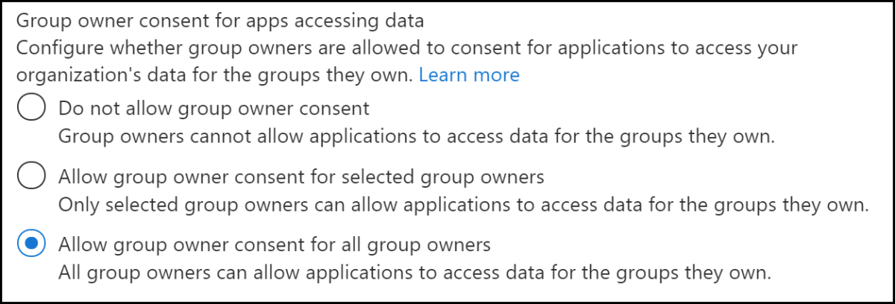

# Resource-specific consent (RSC)

This document provides information about resource-specific consent (RSC), its permissions, and how to enable it in your application. In addition, it covers information on configuring group owners consent, registering your app, and reviewing your application permissions through the Azure Active Directory (Azure AD) portal. It also provides guidance on the process to obtain an access token, to update your Teams app manifest, and to install your app directly in Teams.

Resource-specific consent (RSC) is a Microsoft Teams and Microsoft Graph API integration that enables your app to use API endpoints to manage specific teams within an organization. The RSC permissions model enables *team owners* to grant consent for an application to access and/or modify a team's data. The granular, Teams-specific, RSC permissions define what an application can do within a specific team.

## Resource-specific permissions
The following table lists the resource-specific permissions:
 
|Application permission| Action |
| ----- | ----- |
|TeamSettings.Read.Group | Get the settings for the team.|
|TeamSettings.ReadWrite.Group|Update the settings for the team.|
|ChannelSettings.Read.Group|Get the channel names, channel descriptions, and channel settings for the team​.|
|ChannelSettings.ReadWrite.Group|Update the channel names, channel descriptions, and channel settings for the team.​|
|Channel.Create.Group|Create channels in the team.​|
|Channel.Delete.Group|Delete channels in the team.​|
|ChannelMessage.Read.Group |Get the team's channel messages.​|
|TeamsAppInstallation.Read.Group|Get a list of the team's installed apps.|
|TeamsTab.Read.Group|Get a list of the team's tabs.|
|TeamsTab.Create.Group|Create tabs in the team.​|
|TeamsTab.ReadWrite.Group|Update the team's tabs.​|
|TeamsTab.Delete.Group|Delete the team's tabs.​|
|TeamMember.Read.Group|Get the team's members.​|

>[!NOTE]
>Resource-specific permissions are only available to Teams apps installed on the Teams client and are currently not part of the Azure Active Directory portal.

## Enable resource-specific consent in your application

The *team owners* must grant consent for an application to access and/or modify a team's data. 

**To enable RSC in your application**

1. [Configure group owner consent settings in the Azure AD portal](#configure-group-owner-consent-settings-in-the-azure-ad-portal).
1. [Register your app with Microsoft identity platform through the Azure AD portal](#register-your-app-with-microsoft-identity-platform-through-the-azure-ad-portal).
1. [Review your application permissions in the Azure AD portal](#review-your-application-permissions-in-the-azure-ad-portal).
1. [Obtain an access token from the Microsoft Identity platform](#obtain-an-access-token-from-the-microsoft-identity-platform).
1. [Update your Teams app manifest](#update-your-teams-app-manifest).
1. [Install your app directly in Teams](#install-your-app-directly-in-teams).
1. [Check your app for added RSC permissions](#check-your-app-for-added-rsc-permissions).

### Configure group owner consent settings in the Azure AD portal

You can enable or disable [group owner consent](/azure/active-directory/manage-apps/configure-user-consent-groups?tabs=azure-portal) directly within the Azure portal.

**To configure group owner consent settings**

1. Sign in to the [Azure portal](https://portal.azure.com) as a [Global Administrator or Company Administrator](/azure/active-directory/users-groups-roles/directory-assign-admin-roles.md#global-administrator--company-administrator).
1. [Select](https://portal.azure.com/#blade/Microsoft_AAD_IAM/ConsentPoliciesMenuBlade/UserSettings) **Azure Active Directory** => **Enterprise applications** => **Consent and permissions** => **User consent settings**.
1. Enable, disable, or limit user consent with the control labeled **Group owner consent for apps accessing data**. The default is **Allow group owner consent for all group owners**. For a team owner to install an app using RSC, group owner consent must be enabled for that user.

    

To enable or disable group owner consent using PowerShell, see [Configure group owner consent using PowerShell](/azure/active-directory/manage-apps/configure-user-consent-groups?tabs=azure-powershell).

### Register your app with Microsoft identity platform through the Azure AD portal

The Azure Active Directory portal provides a central platform for you to register and configure your apps. Your app must be registered in the Azure AD portal to integrate with the Microsoft identity platform and call Microsoft Graph APIs. For more information, see [register an application with the Microsoft identity platform](/graph/auth-register-app-v2).

>[!WARNING]
>Do not register multiple Teams apps to the same Azure AD app ID. The app ID must be unique for each app. Attempts to install multiple apps to the same app ID will fail.

### Review your application permissions in the Azure AD portal

You can review your application permissions in the Azure AD portal and make required modifications.

> [!IMPORTANT]
> The Azure AD portal cannot be used to request RSC permissions. RSC permissions are currently exclusive to Teams applications installed in the Teams client and are declared in the app manifest (JSON) file.

**To review your application permissions**

1. Navigate to the **Home** => **App registrations** page, and select your RSC app. 
1. Choose **API permissions** from the left navigation bar and check the list of configured permissions for your app.
1. If your app will only make RSC Graph API calls, delete all the permission on that page. If your app will also make non-RSC calls, keep those permissions as needed.

### Obtain an access token from the Microsoft identity platform

To make Graph API calls, you must obtain an access token for your app from the Microsoft identity platform. Before your app can get a token from the  platform, it must be registered in the Azure AD portal. The access token contains information about your app and the permissions it has for the resources and APIs available through Microsoft Graph.

You must have the following values from the Azure AD registration process to retrieve an access token from the identity platform:

- The **Application ID** assigned by the app registration portal. If your app supports single sign-on (SSO) you must use the same Application ID for your app and SSO.
- The  **Client secret/password** or a public or private key pair (**Certificate**). This is not required for native apps.
- A **Redirect URI** or reply URL for your app to receive responses from Azure AD.

 For more information on how to obtain an access token, see [get access on behalf of a user](/graph/auth-v2-user?view=graph-rest-1.0#3-get-a-token&preserve-view=true) and [get access without a user](/graph/auth-v2-service).

### Update your Teams app manifest

The RSC permissions are declared in your app manifest (JSON) file.  Add a [webApplicationInfo](../../resources/schema/manifest-schema.md#webapplicationinfo) key to your app manifest with the following values:

|**Field** | **Description** |
|-----------|----------------|
| **id** | It is your Azure AD app ID. For more information, see [register your app in the Azure AD portal](resource-specific-consent.md#register-your-app-with-microsoft-identity-platform-through-the-azure-ad-portal). | 
| **resource** | It is any string. This field has no operation in RSC, but must be added and have a value to avoid an error response; any string will do. |
| **application permissions** | It is the RSC permissions for  your app. For more information, see [resource-specific permissions](resource-specific-consent.md#resource-specific-permissions). |

> [!IMPORTANT]
> Non-RSC permissions are stored in the Azure portal. Do not add them to the app manifest.


```json
"webApplicationInfo": {
    "id": "XXxxXXXXX-XxXX-xXXX-XXxx-XXXXXXXxxxXX",
    "resource": "https://RscBasedStoreApp",
    "applicationPermissions": [
      "TeamSettings.Read.Group",
      "ChannelMessage.Read.Group",
      "TeamSettings.Edit.Group",
      "ChannelSettings.ReadWrite.Group",
      "Channel.Create.Group",
      "Channel.Delete.Group",
      "TeamsApp.Read.Group",
      "TeamsTab.Read.Group",
      "TeamsTab.Create.Group",
      "TeamsTab.ReadWrite.Group",
      "TeamsTab.Delete.Group",
      "Member.Read.Group",
      "Owner.Read.Group"
    ]
  }
```

### Install your app directly in Teams

After you have created your app you can [upload your app package](../../concepts/deploy-and-publish/apps-upload.md#upload-your-package-into-a-team-using-the-apps-tab) directly to a specific team. To do so, the **Upload custom apps** policy setting must be enabled as part of the custom app setup policies. For more information on uploading custom apps, see [custom app policy settings](/microsoftteams/teams-custom-app-policies-and-settings#custom-app-policy-and-settings).

### Check your app for added RSC permissions

> [!IMPORTANT]
> The RSC permissions are not attributed to a user. Calls are made with app permissions, not user delegated permissions. Therefore, the app may be allowed to perform actions that the user cannot, such as creating a channel or deleting a tab. You must review the team owner's intent for your use case prior to making RSC API calls. For more information, see [Microsoft Teams API overview](/graph/teams-concept-overview).

After the app is installed to a team, you can use [Graph Explorer](https://developer.microsoft.com/graph/graph-explorer) to view the permissions that have been granted to the app in a team.

**To view permissions granted to the app in a team**

1. Get the team's **groupId** from the Teams client.
1. In the Teams client, select **Teams** from the far left nav bar.
1. Select the team where the app is installed from the drop-down menu.
1. Select the **More options** icon (&#8943;).
1. Select **Get link to team**.
1. Copy and save the **groupId** value from the string.
1. Log into **Graph Explorer**.
1. Make a **GET** call to the following endpoint: `https://graph.microsoft.com/beta/groups/{teamGroupId}/permissionGrants`. The clientAppId field in the response will map to the appId specified in the Teams app manifest.

     

## Code sample
| **Sample name** | **Description** | **C#** |
|-----------------|-----------------|----------------|
| Resource-specific consent (RSC) | Use RSC to call Graph APIs. | [View](https://github.com/OfficeDev/Microsoft-Teams-Samples/tree/main/samples/graph-rsc/csharp)|

## See also

Related topic for Teams administrators.
> [!div class="nextstepaction"]
> [**Resource-specific consent in Microsoft Teams for admins**](/MicrosoftTeams/resource-specific-consent)
> 

## Next step

> [!div class="nextstepaction"]
> [**Test resource-specific consent permissions in Teams**](test-resource-specific-consent.md)
